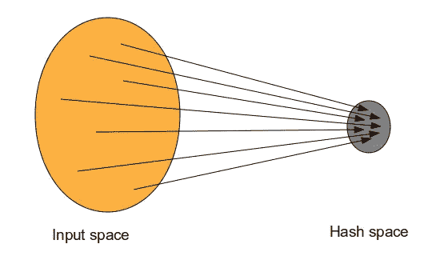
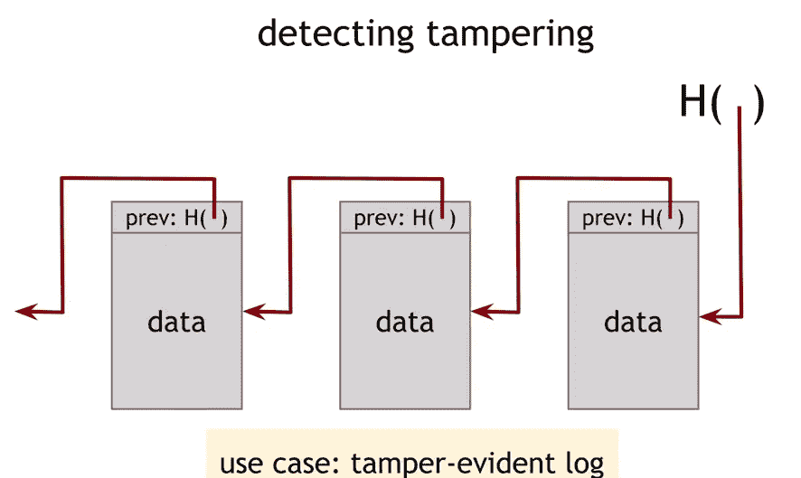
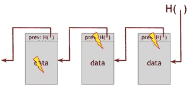
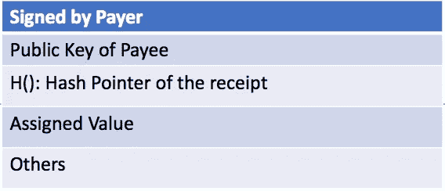
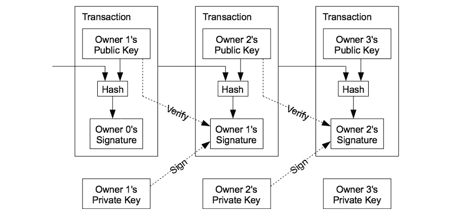
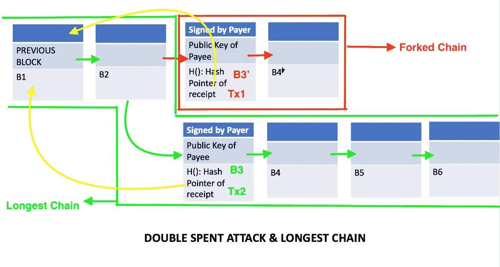

# 区块链 101——前提是你‘一无所知’！

> 原文：<https://medium.com/hackernoon/blockchain-101-only-if-you-know-nothing-b883902c59f7>

[比特币](https://hackernoon.com/tagged/bitcoin)，加密货币，以太坊——你一定听说过这些流行语。也许还有人们从中快速致富的故事，为什么不呢——看看所谓的“加密货币”的市值以及它在过去一年中的增长情况。**区块链是驱动它们的理念。**


Crypto Market Capitalization

看着图表，你可能会认为你在这场游戏中迟到了，但现在的[区块链](https://hackernoon.com/tagged/blockchain) -101 可能就像在 2000 年搞清楚互联网一样——还不算太晚。

本文试图提供区块链概念的简单而技术的细节。希望它能帮助你理解这个新生事物的核心基础！

# 一点历史不会有坏处；)

*“钱是什么？”*

货币是一种可以用来交换商品和服务的实体。然后还有另一个系统来跟踪其所有权和交易——谁拥有什么，谁拥有什么，以及谁欠谁多少。这就是钱的全部。

我们需要一个第三方可信实体来跟踪资金，保留这些交易，并处理冲突(如果适用)。但是，受信任的一方，即政府，在效率、潜在腐败、额外费用等方面是有成本的。

简而言之，让我们按照这些步骤，看看 2008 年在美国的一个特定场景中的资金流动，在这个场景中，信任模型并没有很好地发挥作用:

*   人们开始挣更多的钱，并把它们存在一个中央机构(即银行)。
*   中央政府/银行开始发放高风险贷款以吸引新客户，并面临此类贷款的严重违约。
*   由于人民无力还钱，许多银行倒闭并申请破产。
*   银行也在用人们的钱进行投资，失去了客户信任的所有资金。简而言之，银行损失了客户存在银行的钱，客户无法追回。
*   注意到这个普遍的问题，政府试图通过提供人民的钱(即税收)来挽救一些机构。
*   由于这种发行是一种额外的支出，每当政府的支出超过收入时，政府就会要求中央银行印更多的钱，从理论上讲，政府可以印多少钱没有固定的限制。在过去的日子里(在美国和许多其他国家)，黄金曾经是标准，你不能印刷超过你的黄金储备的钱，可以说，这是一个很好的方式来确保我们像借记卡一样使用我们的经济。但是，嘿，信用卡的存在是有原因的，这就是为什么罗斯福和 T2 与黄金断绝关系。实际上，政府想印多少钱就印多少，这带来了一堆问题。
*   首先，随着更多的货币印刷，货币的价值降低，经济受到影响。举个例子，如果你有 100 美元，而 country 总共有 1000 美元，那么你拥有这笔钱的 10%(你一定相当富有:)。如果政府多印了 1000 美元，你只拥有 5%的钱，这就降低了你的钱的价值。

这就是 2008 年危机中发生的事情。银行发放不良贷款是原因。印刷钞票是一种缓解措施，在这个特定的案例中起到了帮助作用。

危机后六周，2008 年 11 月 1 日，发生了一件事，这件事实际上将比危机本身更能重塑金融世界——这个家伙(或这些家伙？)命名为[中本聪](https://en.wikipedia.org/wiki/Satoshi_Nakamoto)发明了一种分散的(加密)货币，称为比特币，基于一个被称为区块链的新概念。这个想法是为了创造一个任何中央权力机构都不能控制所有资金的世界。

> “我一直在研究一种新的电子现金系统，它完全是点对点的，没有可信的第三方。”—中本聪

比特币有它的问题，它仍然需要经受像 2008 年那样的危机的考验，但这只是一个用例(区块链作为一种支付方式)它没有挫败区块链的目的，以及它如何在我们生活的不同方面减少中间人。随着历史方面的讨论，让我们进入区块链背后的技术。

# 那么，什么是区块链呢？

*区块链是一种去中心化的、分布式的、不易损坏的数字分类账，用于记录多台计算机上的交易。*

有点复杂？好了，区块链简单来说就是一个:

*   **分布式**计算机网络(节点)
*   其中每个节点包含一个块链
*   其中每个块包含一个**分类账**和一个**交易列表**
*   其中每笔交易都是**不可篡改的**(即**加密的**安全的 **)**
*   &链接到它所代表的资源的以前事务处理。

*什么是加密货币？它和区块链一样吗？*

区块链和加密货币并不相同，但可以互换使用，因为发明将它们联系起来，即比特币。

区块链是一个概念，加密货币是利用这个概念解决实际问题的应用。按市值排列的加密货币的完整列表可以在[这里](https://coinmarketcap.com/)找到。

我在某处读到过，它正确地总结了这种关系

> “加密货币之于区块链，就像电子邮件之于互联网”。

我们将讨论一般概念，但偶尔我们会从比特币中选取一些例子来更好地理解区块链。

所以，让我们打破区块链的方方面面，逐一了解:

## 廉洁(加密货币的“crypto”)

存储在区块链上的所有东西都被加密了。但是加密本身并不是一种完全的安全措施，也不会使它变得不可破坏。

那么，区块链如何确保自身安全呢？我们需要理解三个概念:

1.  **散列函数(H(x)):** 一个[函数](https://en.wikipedia.org/wiki/Hash_function)，用于将一组随机的输入转换为固定大小的输出。对于任何输入 x，H(x)是散列函数的值。



A typical hash function

哈希函数需要有一些属性:

*   应该是**单向**也就是给定 H(x)，你应该算不出 x
*   **无冲突**即对于没有两个不同的 x 和 y，H(x)应该等于 H(y)。

看上面的图片，哈希函数不可能是无冲突的，对吗？是的，确实如此。但是唯一的动机是确保现有的机器几乎不可能发现碰撞。

这个属性被用在区块链的核心层，我们稍后会讨论它们。

**2。数字签名:** [数字签名](https://en.wikipedia.org/wiki/Digital_signature)就像我们正常的数字形式的签名。他们需要具备这个基本属性:

*   只有你可以签名，但任何人都可以验证。

因此，给定一条用你的秘密密钥(技术上也叫密码或私人密钥)加密的消息，有一个公开可用的密钥(即公共密钥)，任何人都可以使用它来确认你写了这条消息。除非您的密码被泄露，否则任何攻击者都无法伪造您的签名。

在区块链中，这个属性用于确保只有合法的所有者才能从他的帐户中转移资产，而网络上的任何人都可以验证交易。比特币使用 [ECDSA](https://en.bitcoin.it/wiki/Elliptic_Curve_Digital_Signature_Algorithm) 进行数字签名。

**3。哈希指针:**

哈希指针是区块链技术中利用的另一种好的数据结构。

标准指针是存储数据的地址，而哈希指针也通过保存数据本身的加密哈希(我们前面讨论过的哈希函数)来验证数据是否已损坏。


Hash Pointers

如果有人更改了数据块中的数据，该数据块的哈希将与哈希指针中的数据不匹配，我们可以很容易地确认数据的损坏。

这就是它在区块链中与哈希函数一起使用以避免损坏的方式。



块 1(左起)包含数据和指向前一块的散列指针。块 2 包含指针和第一块的散列以及它的数据。

关键点在于，散列是数据的散列和先前块的散列的组合。

H(此块)= H(H(前一块)+此块中的数据)

现在，如果有人玩第一块积木会怎么样？



Tampered results after first block.

如果黑客修改了第一个块的内容，存储在第二个块中的哈希不匹配，我们可以很容易地检查出有什么东西发生了变化。因此，攻击者还必须修改存储在块 2 中的散列。但是在这种情况下，存储在第三个块中的 hash 会失败，它会继续下去，直到 hacker 修改了链中的所有块，直到最后一个指针。

> 实际上，改变区块链上的任何信息单元都意味着使用巨大的计算能力来覆盖整个网络。并且任何块都可以通过跟随链中所有前面的块来验证该事务是否有效。

有更好的数据结构来确保我们不必遍历每一个块来验证交易的真实性。比特币和以太坊使用的树被称为 [Merkle 树](https://en.wikipedia.org/wiki/Merkle_tree)。


Merkle Tree

这个想法是，代替线性块，我们将有一个树状结构，以确保我们可以通过从根到叶快速验证一个事务，而不是线性地遍历所有的块。基本概念虽然类似于我们在《线性结构》中所讨论的。

## **分散式&分布式台账**

有一个由随机的一组人组成的网络，这些人可以自愿加入，通过放置他们的机器来帮助他人——只是开玩笑——以获得激励。因此，每个人都有责任保存整个数据集并互相检查(使用我们在“加密”一节中讨论的内容)。这是一种基本的点对点技术。

因此，如果是分散和分布式的，您可能会问这些明显的问题:

*   谁是权威？
*   权威人士作弊怎么办？
*   货币是如何产生的？

这些都是正确的问题，我们将在下一节讨论它们，但让我们把重点放在系统的分布式部分。

鉴于每个人都有完整的记录，作为一名黑客，你没有一个集中的地方可以像在银行那样修改数据。这些记录也是公开的。所以，你知道我有多少钱——有点，因为我将被识别为一个 64 个字符的随机名称。你能改变它吗？你所能做的就是尝试失败，然后意识到这实际上是不可能的。

那么，随着分布式账本的这些好处而来的是那些节点中的 [**共识**](https://en.wikipedia.org/wiki/Consensus_(computer_science)) 的主要问题。

由于失败案例(网络故障/延迟、系统故障等),一致性是计算机科学中一个非常困难的问题。)有多项研究解决了像“达成一致的价值”这样简单的问题，但区块链用一种非常创新的方式解决了这个问题，即激励。

**奖励&工作证明**

*那么，在这个分布式系统中，我们如何决定谁来决定下一个交易，为什么有人会这样做？我们如何确保这不是一个挑选坏事务的坏(或恶意)节点？*

在区块链中，添加一个新的区块(或者说交易)和创造新的硬币是由计算机管理的，这些计算机执行被称为工作证明的计算活动。

正如我们之前所讨论的，每个区块包含多个交易，每个区块中的第一个交易是一个特殊的交易，它启动了该区块的创建者所拥有的一个新硬币——每当一个诚实的计算机添加了一个新的区块，计算机本身就会获得奖励。这增加了节点支持网络的动机，并提供了一种最初将硬币分发到流通中的方法，因为没有中央机构来发行它们。新硬币数量的稳定增加类似于金矿开采者花费资源将黄金添加到流通中。在这种情况下，消耗的是 CPU 时间和电力。

*“我们能不能都加积木，赚一堆钱？”不完全是。*

该系统(假设一个任何人都可以安装的软件)提供一个数学问题，解决该问题的机器首先将下一笔交易添加到链中，并因在链中添加该块而获得货币利益(即，就比特币网络的比特币而言)。其余的机器只是复制分类账并验证真实性。

“什么样的问题？”，你可能会问。

这是一种反复试验的问题，你必须猜测产生特定输出的散列函数的密钥。用一个非常简单的术语来说，您必须从一个确定的输出开始猜测一个产生散列(SHA-256)值的单词。

举一个[维基百科](https://en.bitcoin.it/wiki/Proof_of_work#Example)的例子，区块链系统希望计算机找到以“Hello，world！”开头的字符串的变体使得该字符串散列为以“0000”开始的字符串。

*你如何解决这个问题？*

我们通过在字符串末尾添加一个名为 [nonce](https://en.bitcoin.it/wiki/Nonce) 的整数值来改变字符串，并每次递增，尝试所有组合来验证散列值是否以‘0000’开始。为“你好，世界！”我们尝试了 4251 次(但恰好前四位是零):

```
**Attempt1** => "Hello, world!0" => 1312af178c253f84028d480a6adc1e25e81caa44c749ec81976192e2ec934c64**Attempt2** => "Hello, world!1" => e9afc424b79e4f6ab42d99c81156d3a17228d6e1eef4139be78e948a9332a7d8**Attempt3** => "Hello, world!2" => ae37343a357a8297591625e7134cbea22f5928be8ca2a32aa475cf05fd4266b7
...
...
...
...
...
**Attempt4249 =>** "Hello, world!4248" => 6e110d98b388e77e9c6f042ac6b497cec46660deef75a55ebc7cfdf65cc0b965**Attempt4250 =>** "Hello, world!4249" => c004190b822f1669cac8dc37e761cb73652e7832fb814565702245cf26ebb9e6**Attempt4251 =>** "Hello, world!4250" =>      ***0000c3af42fc31103f1fdc0151fa747ff87349a4714df7cc52ea464e12dcd4e9***
```

这是一个简单的例子，可以很容易地解决，但这可能会变得复杂，以确保机器需要时间来解决这些问题。

实际上解决了难题的后缀，即“nonce”，也被添加到事务中，以确保这可以被随后的节点验证。

这里还需要注意几件事情:

*   只有当程序块在**最长链**(我们将在下一节看到)中结束时，计算机才能获得报酬，以驱动节点间的诚实。
*   正如我们所见，每当计算机解决数学问题时，就会产生新的令牌并分配给该计算机的区块链地址。对于比特币来说，这种回报每四年减半，这就是它容量有限的原因。这就是比特币成为稀缺资源的原因。

> [x/2 + x/4 + x/8 + x/16 …..= > x.](https://en.wikipedia.org/wiki/1/2_%2B_1/4_%2B_1/8_%2B_1/16_%2B_%E2%8B%AF)

比特币的这个数字“x”大约是 2100 万。不同的区块链应用程序在这方面有不同的实现，例如，在撰写本文时，以太坊并不局限于一个固定的数字，不同的其他货币使用另一种称为[Proof-of-stage](https://www.investopedia.com/terms/p/proof-stake-pos.asp)的算法。

*   还有一笔额外的交易费(有些人称之为小费)。无论是谁创建了将交易放在区块链的区块，都会得到这笔费用。最终，当比特币耗尽，没有新的硬币产生时(矿工采矿的主要动机)，这将成为矿工继续工作并将其计算机放入网络的动机。

## **交易**

在区块链，每个硬币(或实体)都被定义为一串数字签名。每个所有者通过对前一个交易的散列和下一个所有者的公钥进行数字签名，并将这些添加到硬币的末尾，将实体转移到下一个所有者。显然，还有一堆其他东西，包括与交易相关的价值，但它们对于讨论并不重要。

一个简单的交易可以这样假设:



A simplistic transaction

在上面的事务中，任何人都可以通过使用前一个事务的哈希指针来验证这是否是一个有效的事务。我们还可以通过验证交易中提供的签名来验证付款人是否有效。

这个过程会一直持续下去，并且可以执行端到端验证来验证所有权链。



Transactions in the chain

正如你在上面的图像中看到的，每个接收者都能看到她得到的硬币是否有效。

当然，问题是收款人无法验证其中一个所有者没有**重复花费**硬币，即所有者没有在两个不同的实体花费相同的硬币，就像我可以支付相同的硬币从亚马逊和百思买购买商品和服务。

在没有信任(或不信任)的情况下完成这项工作？)党，交易必须公开宣布，我们需要一个系统，让参与者同意他们收到订单的单个历史。收款人需要证明在每笔交易时，大多数节点都同意这是第一笔收到的交易。

**双倍支出攻击**

让我们用这幅图来理解双重支出攻击，以及区块链是如何解决的。



**问题:**

*   块 B1 和 B2 已经是区块链的一部分，网络上的所有节点都可以使用它。
*   一个用户通过启动两个交易 Tx1 和 Tx2 重复消费了她拥有的相同的钱。
*   这两个事务都是加密有效的，并且**指向同一个先前的事务**(请看图中的黄色箭头)。
*   通过解决“**数学问题**”(工作证明)，所有节点之间开始了创建块 B3 的竞赛。
*   假设加密签名匹配并且哈希指针指向有效的块，则没有简单的方法来在 Tx1 和 Tx2 中找到恶意事务。
*   因此，两个不同的节点接受这些交易，并将其视为“有效”交易——客户可以双倍消费。
*   现在，网络上有两条链——B1-> B2-> B3’-> B4’& B1-> B2-> B3-> B4。

**解决这个问题的区块链方式:**

*   节点总是认为**最长链**是正确的，并将继续努力扩展它。
*   如果两个节点同时广播下一个块的不同版本，一些节点可能首先接收一个或另一个。在这种情况下，他们处理收到的第一个分支，但是保存另一个分支以防它变长。
*   这个平局被随后的工作证明求解器打破。它要么采用以 B4’或 B4 开始的链，最终，其中一个链会更长。
*   另一个较短的分叉链(红色链)被后续节点拒绝；在另一个分支上工作的节点将切换到更长的分支(绿色的链)。
*   链中的每个新块都以指数方式增加了当前事务有效的概率——记住，每个块都是通过解决难题而增加的。
*   从概率上来说，6 次确认(即 6 个新区块)足以确保我们的交易被放入最长的链中，并且不会被拒绝。当你从账户中转移任何比特币时，你可能会看到这是“X 确认”。

这一概念背后的想法是，大多数计算能力由诚实节点控制，只要这是真的，诚实链将增长最快，超过任何竞争链。所有的块都是密码安全的，为了修改过去的块，攻击者必须重做该块及其后所有块的工作证明(在块中添加了“散列指针”和“随机数”的概念，还记得吗？)然后赶上并超越了廉政节点的工作。

## **结论**

*因此，在数百万个节点的网络上，将所有这些放在一起看起来像这样:*

1.  新事务被广播到所有节点。
2.  每个节点将新事务收集到一个块中。
3.  每个节点都致力于为其数据块找到一个“困难的”工作证明。
4.  当一个节点找到工作证明时，它将块广播给所有节点(并根据货币值获得报酬)。
5.  只有当块中的所有事务都是有效的并且还没有用完时，节点才接受该块。
6.  节点通过创建链中的下一个块来表达它们对该块的接受，使用被接受的块的散列作为前一个散列。

> 总的来说，区块链技术是一个新概念，可以深刻地改变我们组织生活的方式。凭借密码安全、基于激励的分布式共识和[点对点](https://en.wikipedia.org/wiki/Peer-to-peer)网络的伟大概念，将其与 90 年代的网络繁荣相提并论并不为过，只有时间才能告诉我们“接下来会发生什么”。

BTC:

*参考文献:*

*   [维基百科](https://en.wikipedia.org/wiki/Blockchain)文章
*   *比特币*T4*白皮书*
*   *讲座* [*coursera*](https://www.coursera.org/learn/cryptocurrency/home/welcome)