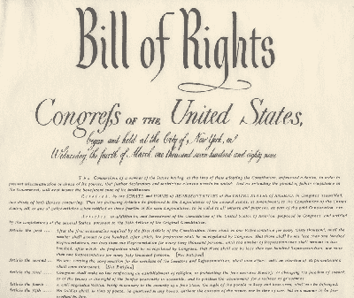
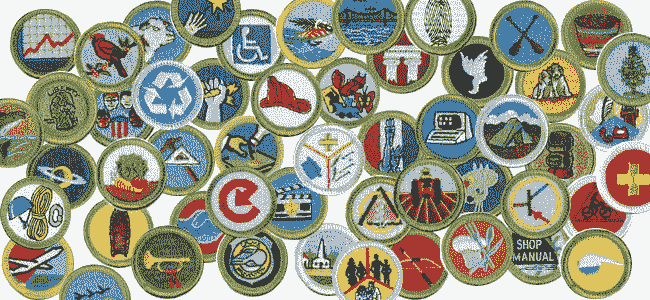

# 区块链:第一修正案保护

> 原文：<https://medium.com/hackernoon/blockchain-1st-amendment-protections-85c2190d2062>

**数字民主**

[区块链](https://hackernoon.com/tagged/blockchain)是一个共享理念下的和平集会场所。区块链环境中涉及的货币系统只不过是共同追求中的进展衡量标准。区块链是一个地方，每个人都同意把他们的枪留在外面，清空所有的口袋，并在一套商定的计算机指导的条件下操作。区块链是真正的民主和平等工具。

也许关注区块链的[加密货币](https://hackernoon.com/tagged/cryptocurrency)功能是很自然的，很多术语都是从金融领域改编而来的，比如；“初始硬币产品”(ICOs)，它迫使我们走上这条路。然而，这种关注可能被误导了——这整个系统的真正力量是区块链，而不是区块链产生的货币。这种完全透明的平台的一个症状是，经济可以围绕想法快速而容易地建立起来。区块链被证明是从想法到运营的快速通道，促进了创新和小企业。我们的开国领袖知道人类在有组织的团体中的力量有多大，他们根据美国宪法第一修正案保护我们集会的能力:

*国会不得制定关于建立宗教或禁止自由信奉宗教的法律；或剥夺言论自由、出版自由、或人民和平集会、向政府请愿申冤的权利。*

**我们是忠诚的侦察兵**

Boy Scout merit badges

美国童子军很好地诠释了这一理念。家庭付钱加入一个团体，团体有一套一致同意的规则，当童子军团体的成员执行期望的活动时；打结、露营、帮助老太太等等，他们会得到奖励。区块链上的相同-相同-群体在区块链上组织起来追求共同的想法，硬币只是鼓励和衡量共同追求的奖励。参加童子军并不能保证任何有利可图的结果，也不能保证你的孩子会“时刻准备着”或者被他的同龄人视为遵守规则的“童子军”因为结果是不确定的，这并不否认童子军在宪法的保护下自由集会和追求他们的想法。

这个概念可以应用于无数的公民集会——空手道道场使用腰带系统作为衡量和奖励团体内行为的货币。大型在线角色扮演游戏(MORPG)使用的货币系统很难说不具有“真实世界”的价值——在任何时候，人们都可以用美元出售大量的游戏货币、等级、地位或能力。此外，令人惊讶的是，我母亲的绗缝俱乐部有一个残酷的排名和奖励制度，这对该集团有真正的价值。

最近试图将加密货币和传统金融工具进行比较的标题可能存在根本性的缺陷；也许与奖章和黑带的比较更相似。

