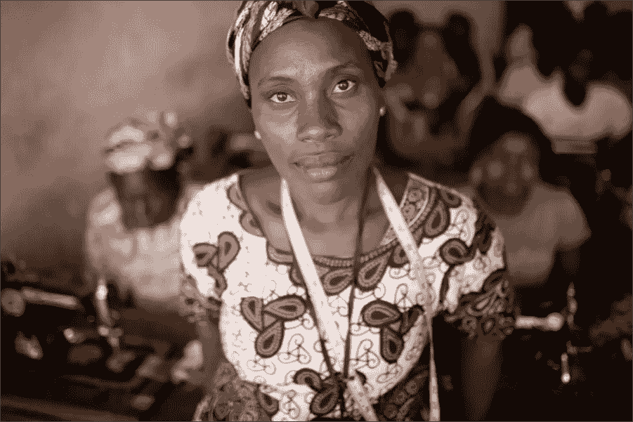

# 区块链:为人民服务系列

> 原文：<https://medium.com/hackernoon/blockchain-a-series-in-service-of-the-people-2151784eb785>

Photo: Monrovia, Liberia 2014, Holden Warren. Liberian woman entrepreneur — ***The Blockchain serves our most vulnerable most.***

简而言之，[区块链](https://hackernoon.com/tagged/blockchain)以前所未有的水平填补了商业领域的信任空白。技术通过提供一种环境来改善人类的条件，在这种环境中，我们人类的能力集中在生产性产出上，而不是消耗在保护我们自己免受威胁上。如此多的商业和人类努力都集中在缓解我们高度警惕的机构和个人神经系统上——区块链在全球层面安抚商业互动的能力将有助于人类通过合作而不是竞争来赚钱。*这一系列文章将探讨区块链对人类、地球以及每个人创造利润的能力的影响。*

区块链世界充满了负载的术语:零信任、不可变的全球账本、彻底的透明、智能合同、点对点、去中心化、互联网 3.0、第三次工业革命、精英管理。然而，对话被一个词所主导； [*加密货币*](https://hackernoon.com/tagged/cryptocurrency) *。*

加密货币被政府和现状金融领袖所迷恋并不奇怪——传统上，货币系统是国家的功能和精英的工具。这种过度集中的危险；这一最能服务于我们当中最弱势群体的强大工具，是否正以保护“投资者”的名义被劫持。

加密货币参与者的部分吸引力在于能够将想法符号化；允许区块链和加密货币不限于当前的货币化系统。区块链允许分数交互，鼓励使用智能合同的数字物物交换系统，同时增加安全性和透明度。

投资者在经济市场中发挥着作用，然而在区块链上，经济权力被转移回具有共同利益的人和社区。

加密货币是区块链带来的一个强大工具，它允许任何人给任何东西赋值。这种能力对于在当前系统中无法获得价值创造的人和团体来说非常重要。

区块链允许我们升级和本地化几百年前超级精英的价值决策。我们过去的领导人创造了用可用的工具和知识解决当今问题的系统。

如今，Blockchain 允许用每个人都能轻易获得的东西来设定价值。如果我们在应用上聪明，我们现在可以把新的经济激励放在期望的人类行为结果上。让 Blockchain 成为民主工具，根据地方和个人层面的决策来决定价值。现在，这种类型的自决在大多数人类中是令人愉快的！

平心而论；受技术影响最大的人应该在管理该技术的政策中拥有发言权。在点对点价值交易的世界里，非洲女性是比硅谷投资者更强大的力量。但是，在这个早期决策阶段，谁是无声者的管家？技术领导者必须清楚地传达块状链可以创造的巨大的自下而上的价值创造，并展示这将如何改变从底特律到开罗的发展中经济体。

如果这是真的，那么下一代全球科技企业集团将会明白，通往成功的高速公路将会穿越非洲、印度和马来西亚市场，而不仅仅是硅谷。

通过提供一个没有体系的体系，Blockchain 将确保没有银行账户的人对下一次经济革命有最大的影响；任何理解这一原则的公司、城市、工业或民族国家都将驾驭下一波巨大的增长浪潮。通过这种“T2”自下而上的“T3”视角观察市场，可以看出下一次大规模的首次公开募股(ICO)是以非洲或印度为重点。

**碉堡链:为人民服务的系列；**将展示 Blockchain 如何成为三重底线责任的倡导者；允许人、地球和繁荣的同步。

照片:利比里亚蒙罗维亚 2014，霍尔顿·沃伦。利比里亚女企业家— ***封锁链服务于我们最脆弱的人群。***