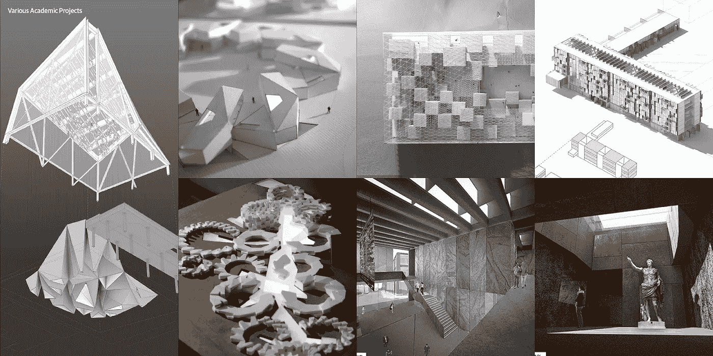
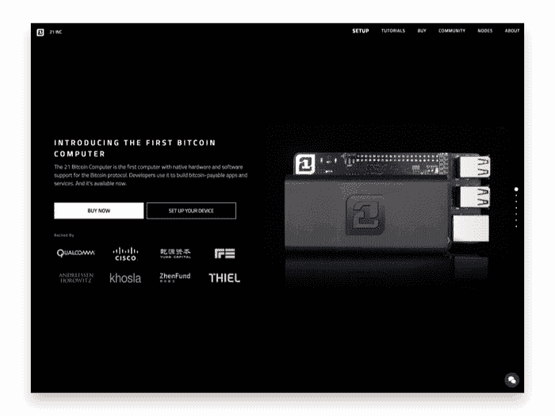
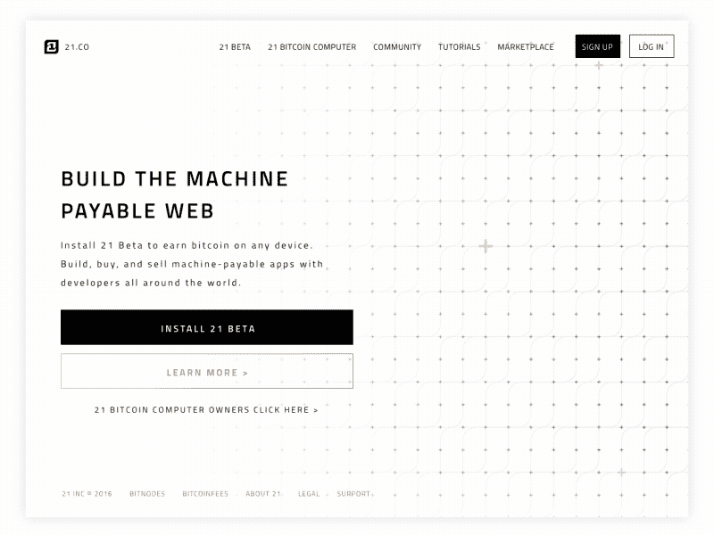
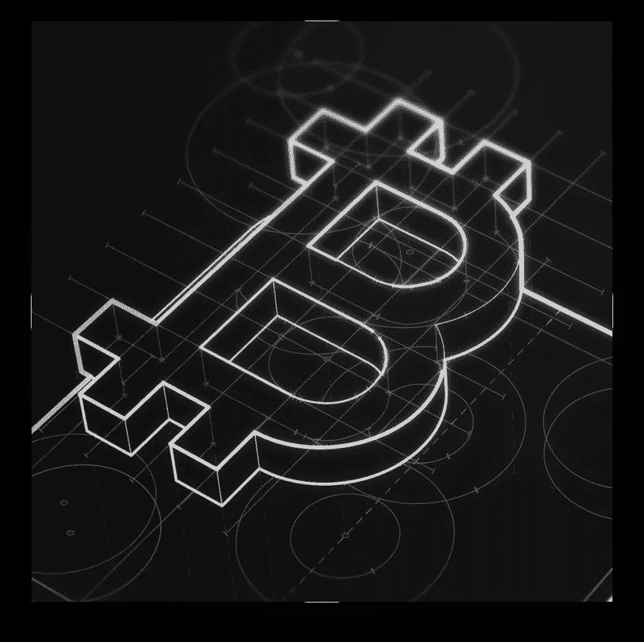

# 区块链与设计

> 原文：<https://medium.com/hackernoon/blockchain-and-design-4ae7ae1694bc>

## 比特币基地设计主管马特·斯托罗斯访谈

## 马特·斯托罗斯在 21.co(已被比特币基地收购)领导设计团队。Matt 讲述了他成为产品设计师的道路，以及为区块链设计是什么感觉。

## 马特，作为一名设计师，你的职业轨迹是怎样的？你是如何来到 21.co 的？

我的道路是从建筑的学习和实践开始的。设计建筑环境是我的第一爱好，并影响着我今天作为产品设计师的工作。

我本科在滑铁卢大学学习建筑，然后在哈佛设计研究生院读研究生。我也有机会在美国、英国和加拿大的一些建筑公司工作。

从 GSD 毕业大约一年后，我向科技领域迈出了一大步。我搬到了湾区，加入了三星，在那里我负责应用程序、可穿戴设备和物联网设备的 UX。在三星工作了三年后，我加入了比特币初创公司 21.co，担任首席设计师，也就是我今天所在的位置。

Matt’s architecture work from his Harvard GSD days

## 21.co 是做什么的？你的角色是什么？

在 21.co，我们的任务是推动比特币的大规模应用。我们认为**赚取比特币**(而不是购买)是数百万人加入比特币经济的最简单方式。

[21 应用](https://21.co/)允许你通过完成调查等微任务或回答付费问题来赚取比特币。你的 21 个人资料就像一个专业的 LinkedIn 个人资料，有一个关键的区别:你设定了一个联系价格。招聘人员或销售人员不会付钱给 LinkedIn 给你发信息，而是直接付给你时间和注意力。

21’s Inbox: email that pays you

作为首席设计师，我的职责是与我们的首席执行官和工程团队合作，将产品概念投入生产。在我 21 岁的时候，我已经帮助我们的网站、移动应用程序、网络应用程序、营销、演示材料，甚至工业设计和包装的多次迭代。作为一家快速成长的初创公司，我们在 21 岁时发展非常迅速，我工作的一个重要部分是确保我们在所有产品中保持一致的身份和体验。

## 什么是区块链技术？有什么用？

区块链技术开始进入主流，但对于非技术观众来说，可能很难理解。

一般来说，区块链只是一种数据库。区块链的独特之处在于，它们不是由一个单一的组织(如谷歌或亚马逊)来运营，而是由一个分布式的参与者网络来管理。数据库没有“主”版本。相反，网络中的每个成员都被激励去维护和更新他们自己的副本。这种冗余消除了单点故障的风险。

现在在公共区块链的情况下(像比特币或以太坊)，它们也是完全开放的。任何人都可以在这些数据库中读取或写入有效数据，而不需要许可或特殊的访问权限。此外，一旦数据被写入数据库，实际上就不可能再回去编辑或删除它。

众所周知，第一个应用是数字货币，如比特币和以太坊。这些分散的对等货币之所以成为可能，是因为区块链能够解决“双重支出”问题，情况大致是这样的:

鉴于复制数字数据很简单，如何防止有人购买一枚“数字硬币”并为自己复制一百万份呢？传统上，这依赖于一个可信的权威点(如银行),它保存每个人的余额的内部记录，并且只允许有效的交易。然而，在加密货币的情况下，不需要中央机构。银行的私有中央数据库被公共分布式数据库取代，他们的欺诈检测被称为挖掘的交易验证过程取代。

区块链初创企业的第一波浪潮聚焦于它作为价值储存手段的效用。矿工、交易所、钱包、商家服务和开发者工具出现了。现在，第二波浪潮开始构建超越重新创造金钱的用例。

## 有哪些应用实例？

应用程序包括当前需要可信中心机构来维护系统的任何系统。这些应用包括社交网络、所有权证明、法律合同、数据存储、投票、筹款模型，甚至计算本身。我们正处于虚拟寒武纪大爆发的中期，每天都有新的协议和应用程序发布。这是一个非常激动人心的时刻。

## 设计师在区块链/加密货币领域扮演什么角色？

总的来说，区块链的世界非常注重技术，设计不足。这对设计师来说是一个塑造一个仍然年轻的行业的巨大机会。

一般来说，业内人士模糊地认为设计很重要，但由于缺乏经验，他们通常会将其与应用程序或网站的视觉“风格”相混淆。这个问题的部分原因是这个领域缺乏设计师，但谢天谢地，这种情况正在迅速改变。

我会为在这个领域工作的任何设计师提供以下考虑因素:

**倡导设计**。作为这个领域的设计师，你的部分工作是帮助你的团队理解设计过程。我发现把设计框架作为一个迭代的决策过程是有帮助的，这个过程意味着决定一个系统或产品的人性化体验。尝试理解你正在解决的问题以及我们为什么要解决它。快速做出假设，制作原型，测试，然后重复。区块链技术很复杂，因此在投入昂贵的开发资源来构建它之前，与用户一起快速探索和验证想法更为关键。

**运用抽象和类比**。基于区块链技术的产品和服务可能非常复杂。然而，这并不意味着您应该将这种复杂性传递给用户。抽象掉复杂性，尽可能多地使用熟悉的概念和交互模式。创建不需要背景知识或大量解释的直观用户体验。

> 如果一个非技术用户需要阅读如何使用你的应用程序的 FAQ，这已经太复杂了。

**从你的圈子之外获得反馈。从一开始就定义你的受众是很重要的。建立人物角色是好的，但是没有什么可以代替与真人交谈。你想解决什么真正的问题？如果一个完美的设计和工程产品对用户没有用处，它就没有任何价值。寻求反馈和批评。通常这意味着和你身边的朋友和同事之外的人交谈。设计过程中最谦卑和最有见地的部分是把你的第一个原型放在某人面前，看着他们试图在没有你的帮助或指导下使用它。**

## 你有什么资源(博客、书籍、播客)推荐给对了解区块链/加密货币行业感兴趣的人吗？

Twitter 是从创建它的人那里了解这个行业的一个极好的来源。如果你是初学者，我建议关注几个关键人物，然后根据他们关注和转发的人来扩展。提醒一句:比特币创造者在社交媒体上的尖刻是出了名的，而且有许多“派系”经常互相争斗。在跳出只读模式之前，先了解一下情况。至于建议，我推荐:

*   naval ravi Kant([@ naval](https://twitter.com/naval)):Angellist 的首席执行官，也是区块链推特的常客
*   维塔利科·布特林( [**@** 维塔利科·布特林](https://twitter.com/VitalikButerin)):以太坊的创造者
*   Andreas Antonopoulos([**@**aantonop](https://twitter.com/aantonop)):精通比特币的作者
*   巴拉吉·斯里尼瓦桑( [**@** 巴拉吉](https://twitter.com/balajis)**):21 的首席执行官，他期待已久的回归 Twitter**
*   **coin desk([**@**coin desk](https://twitter.com/coindesk)):新闻**

***感谢阅读！如果你想继续对话，请在 Twitter 上给我*[*@ blakehudelson*](https://twitter.com/BlakeHudelson)*或 Matt*[*@ mattstorus*](https://twitter.com/mattstorus)*留言。***