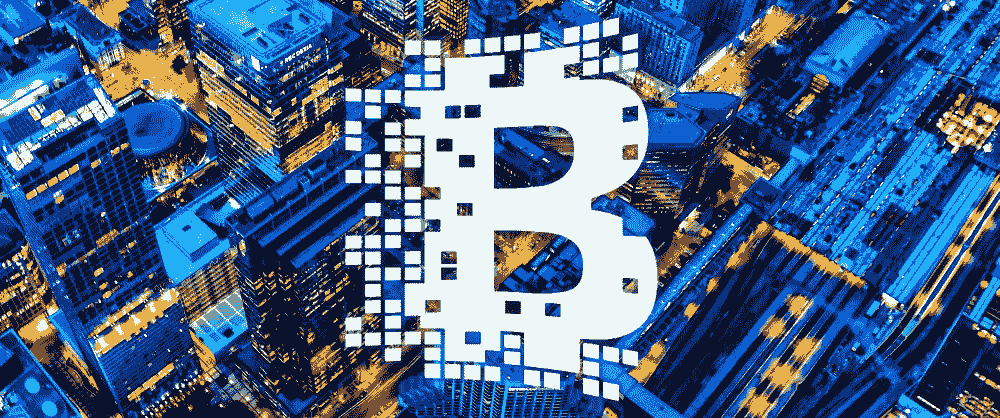
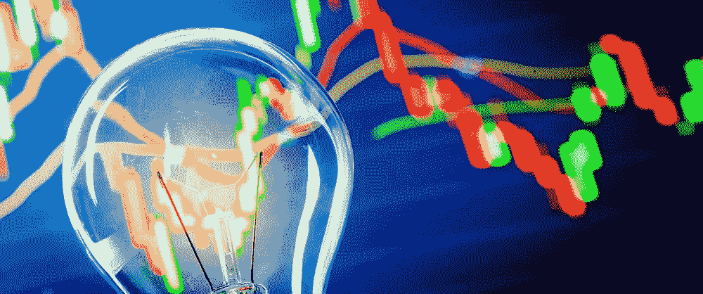
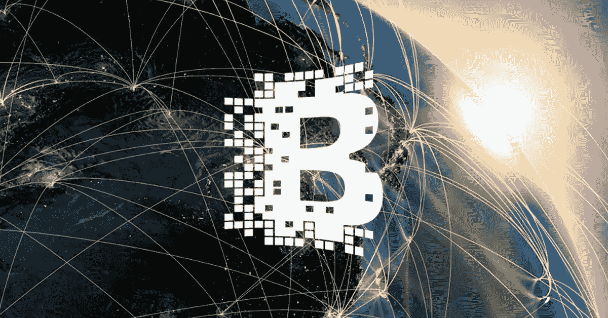

# 区块链和能源行业:前方是什么？

> 原文：<https://medium.com/hackernoon/blockchain-and-energy-industry-what-is-ahead-315d1612bcef>

高效地使用资金和提供透明的交易对任何企业来说都是必不可少的，然而电力行业是最适合区块链项目的行业。原因如下。

如果说石油是现代经济的血液，电网就是它的神经系统。电能无处不在——从晚上给我们的房子照明，一直到运行工厂的机器、办公室的电脑和数据中心的服务器。这使得建设一个高效的电网和创建一个透明的电力市场成为当今的首要任务之一。这就是为什么许多公司致力于将区块链加入其中。

下面是几个例子，展示了区块链走向能源行业的前景。

# 区块链可以帮助收取车辆充电费用

德国领先的电力公司之一 RWE 正在对区块链的一款用于收取电动汽车充电费用的应用程序进行全面测试。作为即将到来的机器对机器(m2m)交互经济的一个整洁的工具，这样的应用程序将帮助汽车司机支付充电站网络上的车辆充电费用，这笔钱将支付给电力生产商，省略任何中间银行机构。

RWE 与德国初创公司 Slock.it 密切合作，通过使用区块链总账发布的智能合同，为司机提供支付车辆充电费用的能力。随着欧盟汽车市场更倾向于混合动力和电动汽车，这款应用程序可能很快就会有很高的需求。

# 电力公司可以使用区块链进行交易，维也纳能源公司处于领先地位

维也纳能源公司，一家奥地利电力公司，最近正在进行一个[区块链工具的试点，以实现与另外两家电力公司](https://www.wienenergie.at/eportal3/ep/contentView.do/pageTypeId/67831/programId/74495/contentTypeId/1001/channelId/-53365/contentId/1801137)的天然气交易。基于加拿大初创公司 BTL 的 Interbit 交易平台，该系统被证明可用于三家大型能源发电公司之间的天然气交易。由于维也纳能源公司是奥地利最大的能源供应商，他们不断寻求提高其领先地位，并通过向客户提供更复杂的服务来保护其利润，同时降低运营费用。智能合约的使用使他们拥有一个防欺诈和透明的交易分类账。

# 更智能的电网控制对于持续的能源交易验证至关重要

[Grid Singularity](http://gridsingularity.com/) ，一家位于维也纳的初创公司，正在区块链的帮助下，积极测试其监控电网状态以及在发电设施和消费者之间进行电力交易的项目。通过开发分散式能源数据交换工具，该公司旨在为所有市场参与者提供可互操作、有效且受保护的数据，实时描述电力市场状况。这将巩固未来投资者决策的效率和可靠性，并允许轻松获取电力生产和消费的数据。

# Vattenfall 利用区块链联合了 22 家欧洲能源交易商

[瑞典领先的电力生产商 Vattenfall](http://news.vattenfall.com/en/article/forefront-field-trial-blockchain-technology) 正在测试一个分散电力市场的概念验证，直到 2017 年底，之后将在全国范围内推出。Vattenfall 在整个欧盟拥有 22 个合作伙伴，旨在为小型能源生产商提供一个简单、可靠和平等的能源交易渠道，并让他们能够为客户签订智能合同，而无需像银行或大型公用事业供应商这样的垂直结构机构。这将降低运营的复杂性，减少交易成本，这必然会提高业务效率，有助于刺激经济增长。

# 结论

尽管如此，区块链和能源行业的未来仍不明朗。然而，几乎所有正在进行的项目的目标都是一样的——创造一个高效、透明、分散和互动的能源市场，为每个参与者开辟新的可能性。也许你也有一个关于区块链的好主意？给我们写封短信，它会帮助你实现梦想！

本文原载[此处](https://itsvit.com/blog/news/blockchain-energy-industry-ahead/)。

请随意浏览来自 [IT Svit](https://itsvit.com/) 的关于 DevOps、BigData、机器学习和区块链的最新见解和提示！