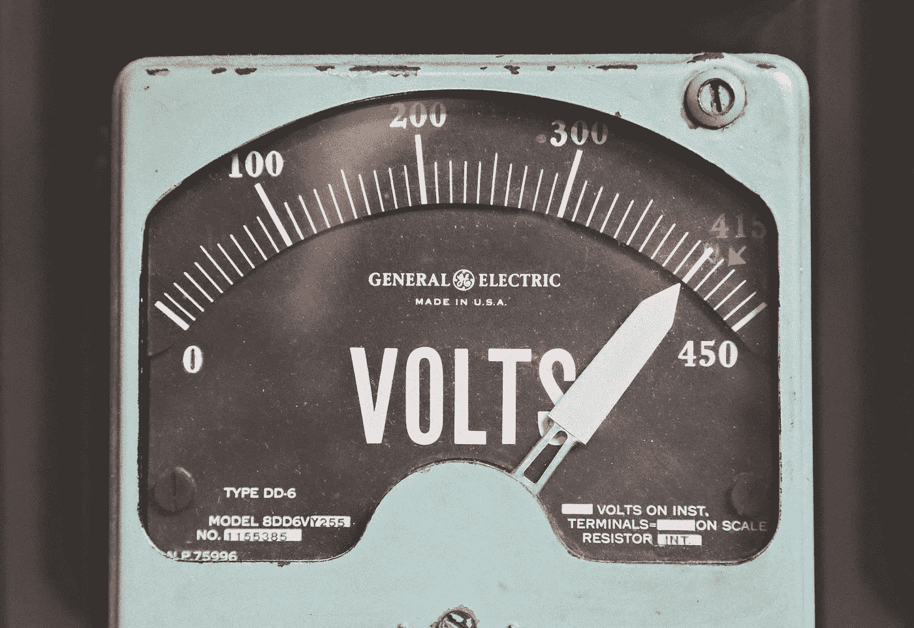
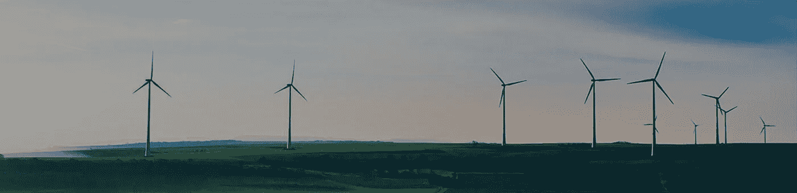

# 区块链——可再生能源市场的解决方案。

> 原文：<https://medium.com/hackernoon/blockchain-and-energy-market-2aa6add6e86e>

长期以来，能源市场一直受到高度集中和管制。当局试图保护消费者的权利，导致高度集中，控制，通常是一个国家的单一电力供应商。

因此，当涉及到能源供应商时，消费者只有很少或根本没有选择。我们通常使用中央电网，支付由中央公司设定的限定价格，这些公司没有能力选择我们想要消耗的电力类型。

**世界正在转向可再生能源，如太阳能、水能或风能。绿色能源是人们想要并愿意消费和支持的能源。只要人们有可能消费绿色能源并支持此类倡议，即使多付一美元也不是问题。**

然而，日常使用绿色能源既昂贵又复杂。除非你能负担得起在你的屋顶上安装太阳能电池板或者在你的房子旁边安装风力发电站。

## 区块链和电力交易所

在 ICOs 的所有这些噪音中，很难找到真正的用例，让[区块链](https://hackernoon.com/tagged/blockchain)和智能合约有意义。区块链的想法是在没有中介的情况下实现去中心化和点对点的价值交换。这就是能源市场所需要的:分散供需关系的能力，促成直接贸易和绿色电力设施的融资。

目前市场上很少有项目在这样的平台上工作。然而，我想把重点放在 [WePower](https://wepower.network) 项目上，因为我帮助团队建立了智能合同结构、令牌模型和集成以太坊区块链。

## 象征性电力

加入该平台的每个新的绿色电厂(太阳能、风能、水能)都必须通过整合过程，该平台将根据电厂参数和人工智能算法预测未来的发电量。这种电力将被“令牌化”。那是什么意思？每千瓦时都会在以太坊区块链上有一个表征作为令牌。一旦电力在一定时间内(例如一年)被令牌化，它就可以用于交易。

## 点对点交易

一旦您实际连接到 WePower 物理电网，您将能够直接从电厂所有者那里购买令牌化电力。你会看到各种电力供应商的名单和未来电力代币的价格。这将使你能够选择最好的选项，购买它，消费它，所有这些直接交易都将通过智能合约和区块链实现。

如果你有元蒙版，你可以点击[这里](http://platform.wepower.network)自己尝试一下演示应用。或者观看一个简短的演示 [youtube 视频](https://www.youtube.com/watch?v=g6coWsXjAuY)。

## 令牌模型

代币模型的构建方式是，代币持有者将因成为社区的一部分和对分散式电力网络的支持而获得奖励。加入该平台的每个新电厂将向 WePower 分散社区——WPR 代币持有者捐赠一定比例的代币。不管你住在世界的哪个地方，如果你在 WePower 基础设施中，你可以消耗绿色电力，如果不是，你可以在市场上为其他 WePower 社区成员出售！

从智能合约的角度来看，流程如下:

1.  发电厂将把一定比例的令牌化电力令牌转移到社区池智能合同。
2.  令牌化电力将在智能合同中累计。
3.  在一定的频率，WPR 社区将能够要求这些令牌。
4.  在一定时期内，代币持有人必须将其 WPR 转移到社区池智能合同，在该时期结束后，将根据转移的总 WPR 代币的百分比，为每个参与者计算社区奖励。
5.  在那之后，人们将再次调用社区池智能合同，并将取回他们的 WPR 以及电力令牌。

为了获得更好的客户体验，将提供用户界面，您只需在 WePower dashboard 中点击几下，即可完成该操作。

## 什么时候？

在区块链上创建这样一个分散的电力交易市场肯定还有很长的路要走，因为存在各种整合、法律和其他挑战。然而，有了这样一个在能源行业有能力和经验的团队，我们应该能在不久的将来看到平台的工作！

**喜欢这篇文章吗？请点击“鼓掌”或“关注”让我知道。谢谢大家！**