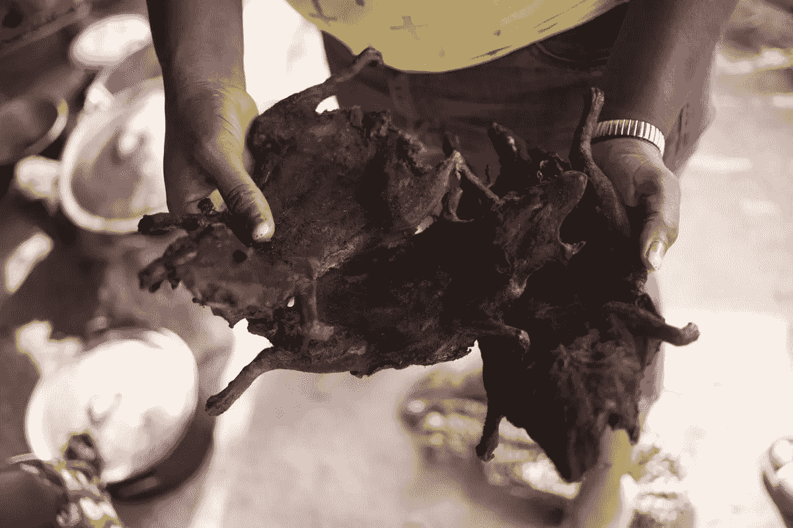

# 区块链:创造非洲纳税人

> 原文：<https://medium.com/hackernoon/blockchain-creating-african-tax-payers-dfbead97fdb8>

photo: 2015, Holden Warren, Liberian Bush Meat (in this case bats). Limited access to protein makes bush meat a high-value frontier commodity.

在[区块链](https://hackernoon.com/tagged/blockchain)上，价值可以赋给任何级别的任何东西；这将引领一个新的全球价值创造时代。这种新的价值创造和记录系统将提供一种机制，使非洲人能够纳税；为非洲领导人引入了新的问责标准。无力纳税让普通非洲人在政治上保持沉默，并依赖罢工、示威、骚乱和革命作为获得政治话语权的主要手段。

由于没有有机的创收手段，非洲各国政府向国际援助组织寻求资金。国际援助的一个主要缺点；它创造了一个致力于并依赖于获得越来越多的国际援助资金的治理体系——考虑到迫切的需求，不这样做是愚蠢的。自然，这些政治体系创造了根深蒂固的文化和程序来资助 T2 政府的职能。从哥伦比亚，通过伊拉克和阿富汗到非洲，每当需要基础设施或任何培训项目时，我首先想到的是我能找到哪些国际资金来源来支持这一努力？我首先寻求国际资金来源，部分原因是我知道这将是每一个参与其中的当地领导人的第一想法。其次，国际货币附加了更多的控制和问责机制——为国际货币提供了一些防盗保护。不幸的是，社会正义取决于社会贡献，在这种模式下，外国税收为外国利益集团在许多非洲政府中享有不成比例的影响力创造了条件。

任何将区块链纳入税收策略的政府都将开辟一个巨大的资金来源，更重要的是，将把他们的政治制度重新聚焦于为人民服务。纳税是政治参与的一种形式——参与一个近乎全民的税收体系将使税负保持在较低水平，同时为必要的公民职能提供必要的收入。

**这会是什么样子？**

考虑到区块链可以为任何东西分配价值——价值可以分配给可再生能源的生产或废水的适当管理。新经济将在这些领域崛起，将当地社区变成创收者，他们只需适当清洁周围环境并从可持续来源生产电力。使用分散应用(DApps)和智能合同，当地社区成员可以在追求绿色能源未来的过程中赚取和交易价值；一个获得可持续能源和饮用水不再是梦想的未来。

如果我不得不做一个预测——区块链将加强地方政府的治理。随着发展中经济体自下而上的增长，这个城市国家可能会出现新的崛起——支持更高水平的社区弹性和更本地化的决策。

通过区块链去中心化将为经济和治理系统带来新的效率。系统本地化并不能让我们远离腐败和官僚主义的弊端，但是它确实减少了这些弊端的规模和影响。

区块链提供的价值创造和交易的透明记录将迅速为发展中经济体建立纳税文化开辟一条道路。就目前的情况来看，大规模普及税基的想法在世界上许多地方甚至都不是一个可行的梦想。

社区可以开始创造、交易和保留可持续能源生产和废水管理的可量化价值。货币——一种基于将废物转化为电力和清洁饮用水的过程的价值衡量标准，创造了一条对所有人都有环保意识和社会效益的道路来创造价值。

photo: 2015, Holden Warren, Liberian Bush Meat (in this case bats). Limited access to protein makes bush meat a high-value frontier commodity.