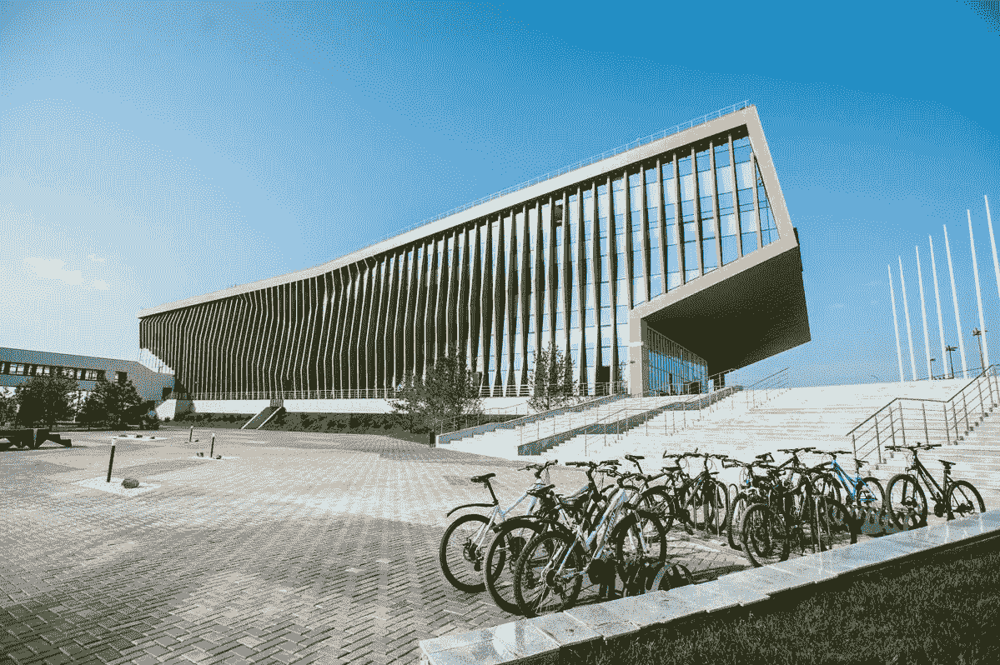

# 区块链经济学将在俄罗斯一所领先的 IT 大学教授

> 原文：<https://medium.com/hackernoon/blockchain-economics-will-be-taught-in-one-of-russias-leading-it-university-6a1c1cd6cffb>

***九月十三日。KICKICO 与俄罗斯顶级 IT 大学 Innopolis 一起讨论了加密货币在俄罗斯的未来发展，并同意在加密和区块链领域推出教育项目。***

俄罗斯有机会成为建立区块链基础教育和加密经济的先锋。鞑靼斯坦当局和 KICKICO 高层管理人员在喀山和 Innopolis 举行的一系列会议上讨论了这一问题。至于最近的未来，该平台计划在年底前举办一系列教育活动和黑客马拉松，并组织一次关于加密货币的国际会议。

Innopolis 是一座专为 IT 专家而建的城市，Innopolis 大学为 Yandex、Tinkoff、Sbertex 等大型 IT 公司培养人才。在最近 Vitalik Buterin 的访问期间，以太坊基金会和 Innopolis 签署了一项协议，为 Vitalik Buterin 的公司培养人才。现在，让 Innopolis 成为世界区块链中心有了新的进展。鞑靼斯坦当局和我们的平台致力于将这座城市变成该地区最大的秘密社区。

为了实施位于 Innopolis 大学的区块链项目，一种被称为法律智能沙箱的 ICO 孵化器正在计划中。另一方面，KICKICO 对 Innopolis 大学的能力越来越感兴趣:来自全球前 100 名 IT 学院的 83 名教授可以对每个 ICO 项目进行审计。该市市长 Ruslan Shagaleev 也表示希望与该平台合作。主题是创建一系列区块链当地项目，并为当地经济实现一个标志:一种加密货币，如果成功，可能会推广到全国。

邻近的喀山市也有兴趣与 KICKICO 平台合作。例如，鞑靼斯坦共和国信息化和电信部第一副部长 Dmitriy Vandyukov 和 KICKICO 的联合创始人 Alexander Petrov 决定成立总部位于 Innopolis 的 KickICO Russia。该公司将致力于开发和维护 KICKICO 和 Innopolis 的教育区块链项目。

毫无疑问，这样的会议不仅对我们，而且对整个俄罗斯密码界来说都是一大步。与 Innopolis 的合作将为俄罗斯密码产业提供实质性的推动，并导致许多具有全球意义的独特项目的产生。