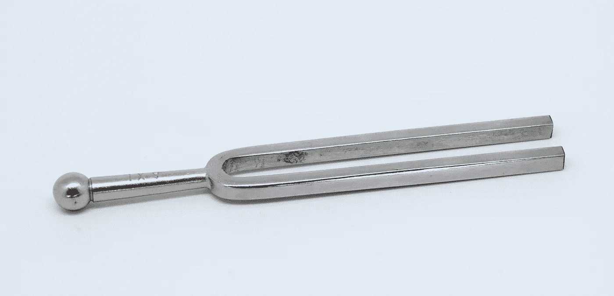
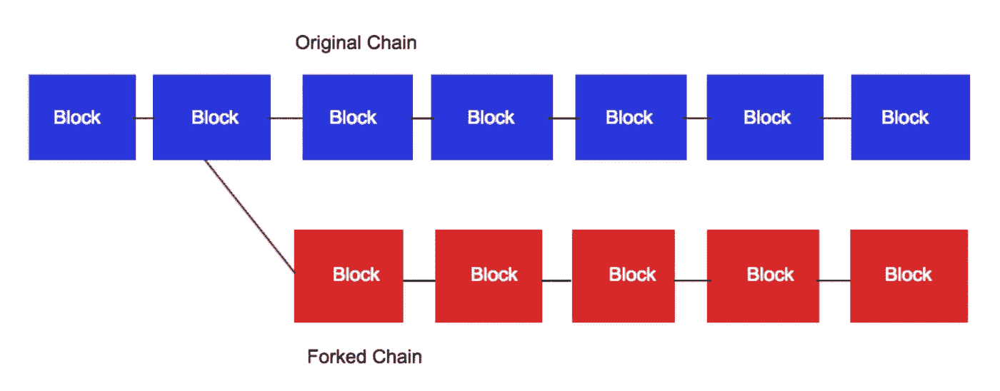

# 区块链分叉

> 原文：<https://medium.com/hackernoon/blockchain-forks-b0dca84db0b0>

A tuning fork.

区块链是一个分散的节点网络，它们合作验证交易并存储信息，正如我在上一篇文章中讨论的 [**。**](https://hackernoon.com/blockchain-technology-the-future-of-transactions-6fb557a98fe2)区块链技术有一些众所周知的局限性:传播延迟，指的是一个节点发送数据和另一个节点接收数据之间的延迟时间，一个节点发送数据和另一个节点接收数据，交易在到达接收者的途中丢失，甚至节点变坏并传输错误信息。

分叉是对协议的更改，或者是与以前版本的区块链的分歧。当一个新的、可替换的块由一个流氓矿工生成时，系统一致认为这个块是无效的，并且这个“孤立块”很快被其他矿工放弃。

**硬叉子**

硬分叉是经过深思熟虑的，当建立和维持特定区块链的社区内部存在重大意见分歧，并且其中一个(或两个)阵营决定走自己的路时，就会出现硬分叉。不同意原始协议的组织“分叉”出自己的区块链版本，而相信这种分叉的成员升级他们的系统以在这个新的区块链上工作，离开以前的版本。新区块链不接受运行早期区块链的节点。喜欢旧版本的用户可以让他们的系统和节点继续使用旧版本。这种分歧实际上创造了两个相互竞争的区块链。

**软叉**

软分叉涉及可选升级。像硬叉子一样，它们包含两个版本区块链。然而，与硬分叉不同，用户可以在软分叉后继续运行旧版本，并且仍然与升级到新版本的用户属于同一个网络。

Original blockchain in blue, and the forked version in red. Both can exist simultaneously.

**比特币分叉**

作为区块链加密货币的先驱，比特币已经有了几个分支。认识到这一点，最初的比特币区块链(由可能使用假名的作者中本聪开发)有时被称为比特币核心。开发者可以修改比特币核心的区块链协议。以下是比特币核心的分叉:

1.比特币 2015 年 8 月

2.比特币经典:2016 年 2 月

3.比特币无限:2017 年 5 月

4.比特币现金:2017 年 8 月

5.比特币黄金:2017 年 10 月

6.SegWit2x:已被[暂停](https://cointelegraph.com/news/segwit2xs-failure-confirms-bitcoins-status-as-digital-gold)的建议分叉

**代码库分叉**

Codebase fork 是一个软件开发术语。当一个开发人员在一个应用程序的源代码上工作(它可能是基于区块链的，或者另一个软件产品)来开发(或者创建)一个软件的独特的和独立的版本时，这个新版本被称为代码库分叉。

是否升级最终取决于网络用户的决定。开发者不能强迫网络做出改变。他们只能建议改变。用户决定是否采用它们。在区块链，codebase forks 的命运也掌握在用户手中。

[沙恩雷](http://www.shaanray.com/)

关注 [Lansaar Research](https://medium.com/lansaar) on Medium，了解最新的新兴技术和新的商业模式。

 [## 沙恩·雷

### 来自 Shaan Ray 的最新推文(@ShaanRay)。创造新价值和探索新兴技术| ENTJ | #科学…

twitter.com](https://twitter.com/shaanray)