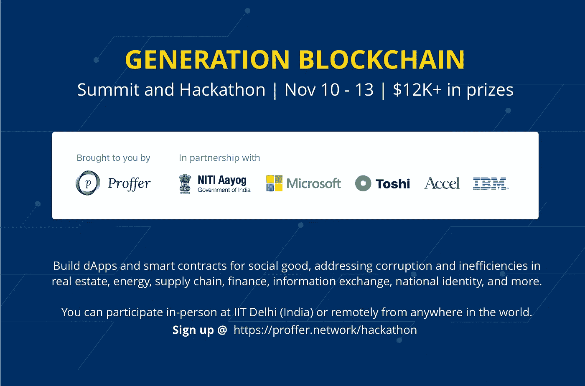
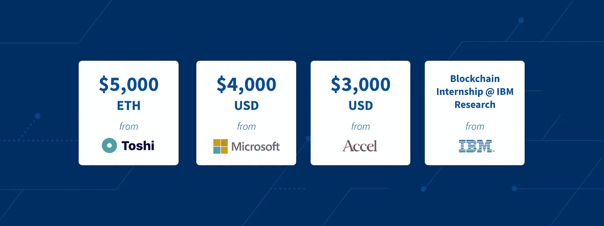

# Proffer 宣布与印度政府、比特币基地、微软、IBM 举行区块链黑客马拉松

> 原文：<https://medium.com/hackernoon/blockchain-hackathon-from-proffer-ibm-microsoft-coinbase-b17131ec20f4>

## 11 月 10 日至 13 日，在任何地方参与，赢取 12k+的奖金

# TL；速度三角形定位法(dead reckoning)

**与 **IBM** 、**微软**、 **Accel Partners** 、**比特币基地、**和**印度政府**联手，于 11 月 10 日至 13 日为您带来一场史无前例的[区块链](https://hackernoon.com/tagged/blockchain)峰会和黑客马拉松**，致力于为社会公益——超越【超越】设想和构建使用案例****

****奖励 12K+美元，奖励您在房地产、供应链、金融、信息交换、国家身份或您选择的其他领域解决腐败和低效问题的 Dapps 和智能合同。****

******向来自世界任何地方的参与者开放，**在位于德里(IITD)的印度理工学院[举办可选的现场研讨会和黑客会议。](https://hackernoon.com/tagged/technology)****

******报名开放，在这里报名:** [https://proffer . network/hackathon](https://proffer.network/hackathon)****

# ****允许的平台:我可以在什么平台上编写 dApps 和智能合约？****

## ****1.Toshi(比特币基地),基于以太坊的移动应用****

****[Toshi](http://www.toshi.org/) ，原名 Token，是由[比特币基地](https://www.coinbase.com/)打造和维护的基于聊天的以太坊浏览器。可以把它想象成一个类似 Facebook Messenger 或 Whatsapp 的消息应用程序，但它与以太坊区块链进行了深度集成，为每个 Toshi 用户提供了一个以太坊帐户，并允许用户轻松地将 ETH 转移到应用程序和其他用户。****

****Toshi 使开发人员可以使用 JavaScript 在以太坊上轻松构建带有对话界面的第三方应用。例如，这里有一个众包求职应用程序，它使用 Proffer 创建并在 Toshi 应用程序商店上发布的“群体智慧”向有职位空缺的公司推荐合格的候选人:****

******Docs**:【https://developers.toshi.org/docs
样本代码:[https://github.com/toshiapp/toshi-app-js](https://github.com/toshiapp/toshi-app-js)
**视频教程**:[https://www.youtube.com/watch?v=YUtehI7dKns](https://www.youtube.com/watch?v=YUtehI7dKns)****

## ****2.Proffer，用于需要使用专家网络进行搜索的用例****

****Proffer 是用于专家网络搜索的区块链协议。dApps 和智能合同可以调用 provide smart contracts 来找到需要人类专业知识的问题的答案，例如，招聘、货币化点对点辅导、Yelp/Zomato、众包匹配等用例。****

******白皮书/详细技术概述:**此处阅读。****

******概念概述:******

**** [## 区块链上的社交搜索——我们为什么需要它

### 通过集体智慧寻找日期、医生和困难的答案

blog.proffer.network](https://blog.proffer.network/social-search-on-the-blockchain-why-we-need-it-7a99b45352a2)  [## 基于自优化专家网络的区块链同行评议

### 使用全球专业知识库和专业加权审核来确定主观群体意见的“对”和“错”

blog.proffer.network](https://blog.proffer.network/crowdsourcing-peer-review-on-the-blockchain-42a6b8149612) 

**示例用例/dapp**

 [## 提供 Edu:区块链的去中心化教育

### Proffer 五天系列五款应用中的第二款应用

blog.proffer.network](https://blog.proffer.network/proffer-edu-decentralized-education-4361ff7110f0)  [## 提供工作:区块链上的去中心化招聘

### Proffer 5 天系列 5 款应用中的第 3 款

blog.proffer.network](https://blog.proffer.network/proffer-jobs-decentralized-recruiting-on-the-blockchain-52bef37a5fa1) 

## 3.块菌，用于以太坊上的智能合约

Truffle 是一个开发框架，它使得以太坊智能合约的编码、编译和发布到私有测试网或公共网变得更加容易。从下面的链接开始。

**文档**:[http://truffleframework.com/docs/](http://truffleframework.com/docs/)
**样本代码**:[https://github.com/joshpierro/ethereum-voting-dapp](https://github.com/joshpierro/ethereum-voting-dapp)
**教程**:[http://truffleframework.com/tutorials/](http://truffleframework.com/tutorials/)

注意:要在您的以太坊智能合约之上构建一个全栈 dApp(去中心化应用),您需要一个前端层，能够从移动应用或 web 应用上的用户界面调用您的智能合约上的功能。这就是 [**web3.js**](https://github.com/ethereum/wiki/wiki/JavaScript-API) 的用武之地。以下 3 个教程介绍了使用 Truffle 开发合同层和 web3 开发前端接口的端到端 dApp 开发:

 [## 宠物店收养跟踪系统-教程

### 这一系列教程将带你构建你的第一个 dapp——一个宠物店的收养跟踪系统…

truffleframework.com](http://truffleframework.com/tutorials/pet-shop)  [## 全栈 Hello World 投票以太坊 Dapp 教程—第 1 部分

### 在我之前的文章中，我解释了以太坊平台的高级架构，将其与 web 应用程序进行了比较。作为…

medium.com](/@mvmurthy/full-stack-hello-world-voting-ethereum-dapp-tutorial-part-1-40d2d0d807c2)  [## 全栈 Hello World 投票以太坊 Dapp 教程—第 2 部分

### 在本教程的第 1 部分中，我们使用 testrpc 在开发环境中构建了一个简单的投票应用程序。现在，让我们…

medium.com](/@mvmurthy/full-stack-hello-world-voting-ethereum-dapp-tutorial-part-2-30b3d335aa1f) 

## 4.Fabric SDK，用于基于 Hyperledger Fabric 构建的智能合同和 dApps

Hyperledger Fabric 是一个框架，用于许可网络上的分布式分类帐解决方案(不同于比特币和以太坊的公共/非许可区块链，非常适合所有参与实体都是已知和可信的企业用例)，由 Linux 基金会托管，由 IBM 和许多其他公司提供。

**快速入门指南:**[https://www . IBM . com/developer works/cloud/library/cl-IBM-区块链-101-快速入门-开发者指南-bluemix-trs/index.html](https://www.ibm.com/developerworks/cloud/library/cl-ibm-blockchain-101-quick-start-guide-for-developers-bluemix-trs/index.html)

**编写智能合约/链码:**

*   docs:[http://hyperledger-fabric . readthedocs . io/en/latest/chain code 4a de . html](http://hyperledger-fabric.readthedocs.io/en/latest/chaincode4ade.html)
*   样本代码:[https://github . com/hyperledger/fabric-samples/tree/master/chain Code](https://github.com/hyperledger/fabric-samples/tree/master/chaincode)

**编写调用链码的客户端应用:**

*   docs:[http://hyperledger-fabric . readthedocs . io/en/latest/write _ first _ app . html](http://hyperledger-fabric.readthedocs.io/en/latest/write_first_app.html)
*   样本代码 1:[https://github.com/IBM-Blockchain/marbles](https://github.com/IBM-Blockchain/marbles)
*   样本代码 2:[https://github . com/hyperledger/fabric-samples/tree/release/fab car](https://github.com/hyperledger/fabric-samples/tree/release/fabcar)

# 奖赏

**注:**Toshi/比特币基地奖仅限于将 **Toshi** 用于 dApp 前端的团队或个人。IBM 奖仅限于使用 **Hyperledger** 的团队或个人。微软和 Accel 奖对所有参与者开放。

# 挑战问题:我能建造什么？

下面，Proffer 及其黑客马拉松合作伙伴定义了三个问题领域，我们认为这三个领域非常重要，有利于区块链技术的使用:金融、信息交换和企业/政府基础设施。在每个领域中，我们都列出了您可以构建的示例想法。

这不是一个完整的列表，你可以随意处理这里没有提到的想法或问题。

## 问题领域 1:金融

*   汇款
*   点对点贷款
*   大众贷款/小额信贷
*   资信评分
*   众筹公共产品

## 问题领域 2:众包信息和建议

*对于其中的每一个，构建一个匿名应用程序或一个模拟身份的应用程序(例如，使用世界上最大的生物识别身份数据库*[*Aadhar*](http://indiastack.org/aadhaar/)*，将每个印度居民映射到一个 aad har 号码)。我们将很快发布一个模拟 Aadhar 身份的模板。*

*   货币化问答
*   投票
*   预测市场
*   火柴制造
*   求职
*   法律意见
*   健康建议
*   Zomato 还是 Yelp
*   为政府选举投票
*   其他人！

## 问题领域 3:企业和国家基础设施

想象一下，整个国家的基础设施都在区块链得到验证。每个用户都有一个唯一的 ID(在印度是 Aadhar)。

*   房地产:智能财产合同。在这里看论文[。](http://dci.mit.edu/assets/papers/spielman_thesis.pdf)
*   能源:管理智能电网接入的合同。在这里阅读论文。
*   区块链的雇主和大学证书。在这里阅读更多。
*   健康记录:阅读论文[此处](http://dci.mit.edu/assets/papers/eckblaw.pdf)。
*   供应链，跟踪货物的移动:点击阅读更多[。](https://www.ibm.com/blockchain/supply-chain/)
*   区块链上的 IndiaStack (Aadhar，eKYC，DigiLocker，eSign)，又名“IndiaChain”。点击阅读关于 IndiaStack [的信息。](http://indiastack.org/)

# 何时何地？

黑客攻击期从**11 月 10 日 IST 时间晚上 9 点(太平洋时间上午 8:30)**开始，到**11 月 13 日晚上 11:59 IST 时间(太平洋时间上午 11:29)**结束。

你可以在世界任何地方远程参与。只需在上述指定时间(荣誉代码)开始编码，并使用在线提交表格在截止日期前提交。

**您也可以亲自参加:**我们将于 11 月 10 日 IST 时间下午 5:30 在印度德里学院(IIT 德里)学院校园的**演讲厅大楼内和周围举办许多以太坊/超算开发研讨会、专家讲座和小组讨论，并提供免费食物和饮料。此处见[地图位置。](https://goo.gl/maps/2ULPmiWp4do)**

# 加入 Slack 和 Gitter:获得实时更新、黑客马拉松问答和专家建议

在黑客马拉松之前和期间，我们将密切关注以下两个渠道，因此请随意发表您的问题或回答其他社区成员的问题。

在黑客马拉松期间，我们还将邀请来自比特币基地和 IBM 的专家回答您可能分别对 Toshi 和 Hyperledger 提出的问题。

**Slack:**

这是一个社区邀请链接，您可以点击并加入，无需我们单独邀请您。

**吉特:**https://gitter.im/proffernetwork/hackathon

使用您的 github 帐户登录，开始发送消息。请将所有与黑客马拉松相关的问题提交到“黑客马拉松”房间。

# 我们组织这次黑客马拉松的原因以及我们关注“社会公益”的原因:

## 1.区块链≠比特币，区块链≠加密货币

除了一小群精通加密技术的投资者和开发者，区块链通常是加密货币的同义词，但这是错误的。我们举办这次黑客马拉松的目的是给开发者(不管有没有区块链经验)一个机会，让他们想象推动比特币的分布式账本技术如何能够提高企业和政府流程的透明度、效率和诚信，特别是在世界上腐败严重的地区。

正是出于这个原因，profer 正在与一个国家政府(印度政府)合作，并与大型技术公司(IBM、微软)、加密先锋公司(比特币基地)和风险投资公司(Accel)等领域的领军人物合作，探索 profer 的使用案例和概念，如 **IndiaChain —** 一个数字印度的区块链基础设施，建立在 Aadhar 等现有计划的基础上，aad har 是世界上最大的生物识别身份项目，为 12 亿印度居民提供唯一的 12 位 id。

## 2.推动开发者和消费者采用区块链协议和应用

在过去的六个月里，Proffer 团队一直在研究一个以太坊协议，该协议使用专家网络进行搜索，当用户对到来的查询做出回应时，该网络会抓取并索引用户的离线信息和专业知识(参见[白皮书草案](https://s3.amazonaws.com/proffernetwork/ProfferWhitepaperDraft_October.pdf))。我们认为 provide 对于拥有大型非正规部门/非结构化离线知识库的新兴市场特别有用，在这些市场中，共享知识和专业技能而不暴露身份的能力可能允许更准确地衡量民意，而不会危及少数群体的安全。我们相信，区块链协议在开发人员中的大规模采用和 dApp 在最终用户中的大规模采用将极大地影响 Proffer 等项目的成功，因此，本次黑客马拉松的第二个目标是通过免费的在线/离线编码研讨会、关于区块链是什么和不是什么的专家讲座、策划的挑战问题以及奖励创造力和努力的财务激励，让大众更容易了解智能合约/ dApp 开发的挑战性主题。

# 想参与进来吗？

如果你想赞助，为你的科技博客/报纸报道黑客马拉松，做评委，等等。，请随时在 Slack 或 Gitter(上面的链接)上给我们发消息，对这篇文章发表评论，或者发电子邮件到 [team@proffer.network](mailto: team@proffer.network) 给我们。

# 注册:

 [## 来自微软、IBM 和比特币基地的 17K 美元奖金

### 编辑描述

provider . network](https://proffer.network/hackathon)****