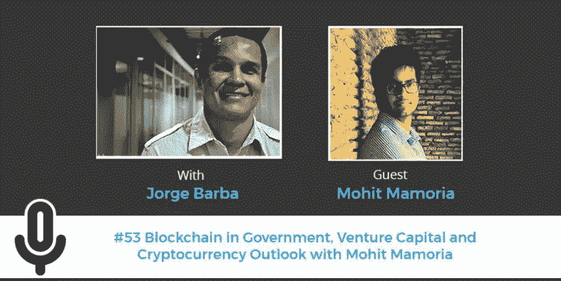

# Mohit Mamoria 的政府、风险投资和加密货币展望中的区块链

> 原文：<https://medium.com/hackernoon/blockchain-in-government-venture-capital-and-cryptocurrency-outlook-with-mohit-mamoria-fe02010c0182>

[区块链](https://hackernoon.com/tagged/blockchain)是[推动下一个经济](http://www.game-changer.net/2016/08/29/10-emerging-technologies-that-will-drive-the-next-economy/)的十大关键技术之一，在银行、政府、保险、交通以及其他领域的应用每天都有新的进展。区块链将改变商业和社会的面貌，因此这是一个值得讨论和了解的重要话题。

也就是说，两个月前，区块链爱好者 [Mohit Mamoria](http://mohitmamoria.com/) 在播客上谈论了[区块链、加密货币和下一个经济](http://www.game-changer.net/2017/07/07/blockchain-cryptocurrencies-and-the-next-economy-with-mohit-mamoria/)，今天他回来参加第二部分:政府中的区块链、风险投资、加密货币的传播和加密货币的前景。

Mohit 是一个 25 岁的企业家，他从 11 岁开始写软件。他在 18 岁时建立了自己的第一家公司，是 3 倍的企业家，目前正在开发软件和硬件，让任何人都可以轻松地成为加密货币的一部分，并从中获利。他也是未制作的[的编辑；每周时事通讯，将一个来自未来的想法发送到您的收件箱。](https://unmade.email/)

作为他对改变未来的想法的研究的一部分，莫希特写了一本 3500 字的指南来了解区块链。如果你不熟悉这个话题，可以读一读。

以下是我们聊天时我问 Mohit 的一些问题:

*   区块链在公共部门有许多应用，可以提高政府服务质量，保护产权，防止欺诈，减少繁文缛节和浪费，同时提高透明度。[区块链对治理的承诺是什么](/@isaachasson/blockchains-promise-for-improved-governance-df52a816923)它在公共部门有什么应用？
*   我对自助式政府的想法感到非常兴奋，你认为障碍是什么，我们如何克服它们？
*   区块链在金融领域最激动人心的发展和应用之一是 ICO。似乎每隔一天就有一个 ICO，一种为任何事情筹集资金的新方法。crypo-funding 将如何扰乱风险投资？
*   跟我说说 [Godtoken](https://godtoken.org/) ，是什么？
*   我看到加密货币的领域现在非常分散，加密货币的现状如何？在趋势、采用和使用方面，你看到了什么？
*   对任何新的[技术](https://hackernoon.com/tagged/technology)的一大挑战是采用；人们出于各种原因拒绝新技术。此时[比特币现金已经是世界第三大加密货币](https://thenextweb.com/insider/2017/08/02/bitcoin-cash-is-already-the-worlds-third-largest-cryptocurrency/)，这是否是加密货币开始被普通人接受的标志？我们如何扩展并接触大众？
*   让我们玩一分钟的假装游戏，假设区块链融入了整个社会。15 年后，区块链的生活会是什么样子？

[在 Twitter 上关注 Mohit](https://twitter.com/mohitmamoria)和[注册他的时事通讯](https://unmade.email/)以接收来自未来的想法；并查看他的[媒体简介](/@mohitmamoria)以获取更多与区块链相关的文章。

观看我们下面的聊天:

喜欢我们的每周播客吗？[订阅我的 YouTube 频道](https://www.youtube.com/playlist?list=PLLIxUJUhbr_8vZ7s1BwB-XdjKPRp8gId6)或[博客简讯](http://eepurl.com/mll5v)。

《生活大爆炸》是每周一期的播客。每周二收听更多关于可能性的讨论。

介绍音频由 Arturo Arriaga 制作，结束音频由 Guy J 制作。

*最初发表于* [*创新、新思想和世界是如何变化的*](http://www.game-changer.net/2017/09/08/blockchain-in-government-venture-capital-and-cryptocurrency-outlook-with-mohit-mamoria/) *。*