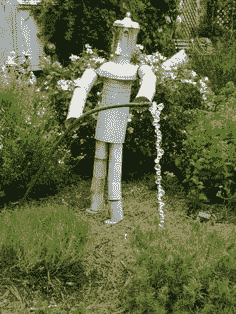

# 区块链:机器将平衡环境

> 原文：<https://medium.com/hackernoon/blockchain-machines-will-balance-the-environment-c15ab57a7859>

**新的数据类型**

[区块链](https://hackernoon.com/tagged/blockchain)上的加密货币将以千计。随着货币围绕商业活动的各个方面发展，这些经济体系将成为人类行为的量化测量工具。这些大量的新数据点出现在人类开始使用机器来观察、学习和设置有利的现实世界条件的时候。

区块链赋予任何事物价值的能力将导致强大的市场激励，以非常详细的方式衡量生物圈。当国家*因生产清洁的水、空气和适当的废物管理而获得*时；测量和寻找化石燃料的努力将转移到测量更大的环境。遵循惠普 ***的老生常谈:“可以测量的，就可以修复。”***

数字货币经济将围绕能源、水、碳捕获以及许多其他商业活动而建立。所有这些新经济体系的总和将受到计算机辅助监测和学习系统的控制。随着时间的推移，这些数据和计算机分析将开始理解和预测经济和环境结果。

**加密货币越多，数据越好**

为不同商业活动量身定制的加密货币将提供连续详细的实时数据。在我们知道之前，我们的数字钱包将被归类为燃料币、能量币、披萨币、航空币。不久的将来，钱包将能够进行个人财务分析，推荐消费习惯和财务策略。

有了数以千计的微型货币作为数据点，人类的状况将变得前所未有的可量化和可测量。随着时间的推移，群体行为将被测量和学习到几乎令人毛骨悚然的准确性。

**生物圈经济**

基于清洁水、可再生能源、清洁空气和废物的价值，硬币将很快出现。这些硬币系统将创建关于人类和生物圈如何相互作用的巨大且易于消费的数据集。

在[机器学习](https://hackernoon.com/tagged/machine-learning) (ML)分析的主管手中，围绕人类行为和环境的更详细的经济数据将导致预测性的机器分析。此外，这种计算机分析可以推荐最佳平衡期望的经济和环境结果的经济工具和程序。

分析的核心目的是提供警告，避免意外。我们创建、收集和分析的数据点越多，结果就越不令人惊讶。这种新的未来确定性将允许更好的环境规划和公共政策。

在个人层面，我们的新钱包将能够推荐消费和收入习惯，最大限度地提高我们对环境的影响。从更具战略性的角度来看，国家和国际政策将受益于这些详细且可消费的数据。从微观到宏观，ML 将帮助个人和社区做出有益于环境的决策。机器自动化的不平等性使整个生态系统受益，而不是少数大型企业集团的利益。

