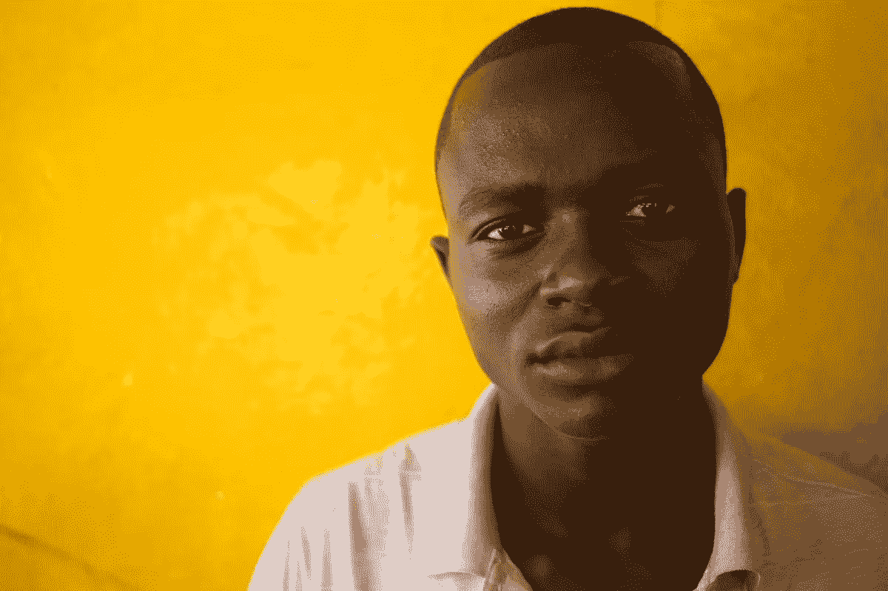

# 区块链:区块链上的穆罕默德

> 原文：<https://medium.com/hackernoon/blockchain-mohammed-on-the-blockchain-1426cbd3c67d>

Photo: Holden Warren; Liberia, 2017

祝你平安。我叫穆罕默德·艾尔全球公民。我是地球上一大群人口的直率代表。我很可能生活在沿海城市或城郊环境中。我无法获得卫生管道、干净的水、电力、有效的治理、法律公正、字母表的使用或预防性医疗保健。值得注意的是，计算机算法在我的生活中没有直接的作用。我通过体力劳动每天挣相当于 1 美元的钱。我赚的钱可以满足基本的家庭需求，也许还有一些娱乐的钱，但是，我没有银行账户，获得可扩展的金融工具和机会甚至不是一个可行的愿望。认识到我生活环境的挑战，我的奋斗比我生活中的任何女人都要好得多。

然而，我可以使用移动通信，甚至可以使用社区数字平板电脑。由于化石燃料能源的高成本，我高达 20%的年收入用于为我的个人设备充电。

**自下而上的基础设施开发**

在了解到我周围的其他社区通过利用他们的个人和农业废物发电来赚取数字货币后，我的生活已经跃上了一个新的高度。我的社区领导人安装了一台污水发电机器，并在我们的整个社区修建了一系列社区厕所。周围地区的每个人都在个人设备上下载了一个分散的应用程序(DApp ),用于管理我们社区的社区电力生产和交易。

每次我使用社区厕所时，我的排泄物都会被测量，以确定其发电价值。当我离开社区的抽水马桶时，我的个人设备被存入了一小部分加密硬币。我的家人在一个易于使用的基于图片的 DApp 上管理我们的新加密价值，帮助我交易、投资和保存这个新价值。随着时间的推移，我和我的家人赚取、交易、投资并储蓄了足够的加密货币[来为我们的家购买太阳能电池板。随着这些太阳能电池板产生能量，我的电子钱包不断地将产生的能量记录为货币。](https://hackernoon.com/tagged/cryptocurrency)

不久后，我和我的邻居赚了钱，交易了钱，投资了钱，存了钱，我们把剩余的钱买了一个气化装置，可以安全地把垃圾转化成电能。垃圾产生的能量也被注册为加密货币。

我的个人废物、太阳能电池板和垃圾都为我赚取了价值，并提供了电力，我能够建立一个雨水收集系统，并让这些水通过一个过滤器，该过滤器可以测量我创造的饮用水的数量——这些饮用水由同一个[区块链](https://hackernoon.com/tagged/blockchain)上的一种单独的加密货币表示。现在，我的废物、太阳能电池板、垃圾和清洁水正在一个可扩展的全球经济投资市场中创造价值。

可持续能源、废物管理和清洁用水的短期转变增加了我所在社区的人力资源。化石燃料燃烧发电机的消失改善了空气和噪音质量，提高了睡眠质量，减少了呼吸系统疾病。管理废物和废水减少了致命的水传播疾病，如疟疾、伤寒和霍乱。

我家的预算发生了戏剧性的转变。通过生产能源赚钱与支付 0.34 至 0.54 美元一千瓦时的日子完全相反，相比之下，美国人支付 0.04 至 0.08 美元一千瓦时。没有与慢性疾病抗争，我已经能够更少缺勤、更高效地工作。我的家庭医疗费用呈螺旋式下降。我的女儿们终于可以买得起合适的女性卫生用品了，减少了疾病，并增加了一年 6 周的上学时间。

在我的生活中，创造价值、可持续能源和清洁水的直接好处是显而易见的。但是，二阶、三阶、四阶的效果更有冲击力。

Photo: Holden Warren; Liberia, 2017