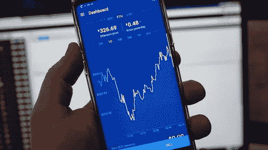
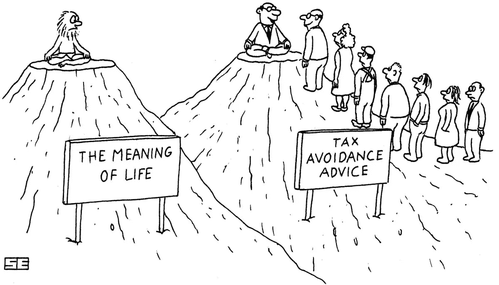

# 区块链永远不会忘记…收税员也不会忘记…

> 原文：<https://medium.com/hackernoon/blockchain-never-forgets-also-not-your-taxes-52a76865b926>

## 比特币基地加密交易所拥有 1000 多万用户，交易总额超过 500 亿美元。美国国税局声称，2015 年美国只有 802 人申报了与比特币相关的资本损益。

我相信，2017 年，所有其他国家的这些数字也不会高很多。

最近，一家联邦法院裁定比特币基地必须向国税局提供用户的身份信息。

[迈克·马洛尼](https://www.youtube.com/watch?v=j-9Js7aaeJo)看到在不久的将来，美国国税局和其他国家的税收机构将开始回顾过去，并要求大多数“匿名”交易商支付利息。

**猜猜看？他们将不得不从哪个口袋里支付这些税款？**

一旦发生这种情况，比特币可能会开始流入交易所，并被兑换成美元。

大多数新来者可能认为他们使用[比特币](https://hackernoon.com/tagged/bitcoin)是完全匿名的，然而，你的加密交易所知道你的一切，一旦当局询问你的数据，他们就会分享它。

Source: [https://charlesngo.com/paying-less-tax-online-business/](https://charlesngo.com/paying-less-tax-online-business/)

有一些公司在这个领域工作

[chain analysis](https://www.chainalysis.com)—帮助追踪[区块链](https://hackernoon.com/tagged/blockchain)内的所有支付，并显示所有连接的钱包，甚至找到所用交易所的链接。

[Cryptotax.io](http://Cryptotax.io) —帮助您管理您在各种交易所的所有交易和转账，并轻松计算您的税款。

**我想引用 Cryptotax 网页上的话来结束这篇文章。**

> “区块链永远不会忘记…也不会忘记你的税收”

**最安全的**加密货币硬件**钱包**是[账本纳米](https://www.ledger.com/collections/all-products?r=397c335e147c)。它只为€59 的每个用户提供硬件安全。在这里了解更多****。****

****喜欢这篇文章吗？**请点击下面的**拍拍**推荐给别人让我知道。**

**如果您想了解关于区块链和智能合约的更多信息，请点击关注！**