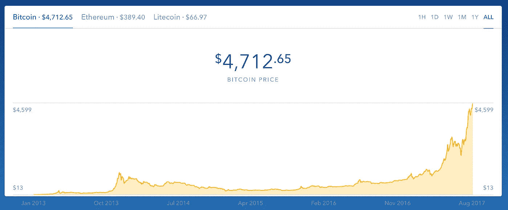

# 区块链:疯狂的右边

> 原文：<https://medium.com/hackernoon/blockchain-the-right-side-of-crazy-ef32f625d49e>

一开始你疯了才会加入他们，然后你疯了才会不加入。

在过去的 6 年里，我一直坐在区块链采用的前排。看着参差不齐的增长曲线，发生了很多事情，但区块链技术的力量仍处于早期阶段。

在 Lattice Ventures，我们相信区块链有巨大的潜力来赋予边缘力量，改变我们在网络上所做的一切。我们很幸运能够接触到这个领域的专家，并希望继续建立这个社区。我们正在就我们认为还没有得到足够宣传的主题展开讨论:监管、安全、法律、治理、社区建设和基础设施。**如果你有兴趣参与讨论，** [**请在这里报名加入我们**](https://goo.gl/forms/1Zd4YE4Yh8ubn73k2) **。**

现在，在 [Lattice Ventures](http://www.lattice.vc) 投资区块链公司之前，我先回顾一下。(为了好玩，附上了那些关键时间点的比特币价格)。让我们看看我们今天所处的曲折道路:

# **通过丝绸之路公开亮相**

我第一次了解比特币和区块链是在 2011 年。当时，比特币与丝绸之路有着密切的联系。在阿德里安·陈的 Gawker 文章之后，人们开始变得兴奋起来。当时，我正在创建一个依靠社区来众包旅游建议和活动的社交旅行网站。当时考虑的是是否考虑购买比特币，而不是如何将底层的区块链技术构建到像我们这样的技术基础设施中。

出于旅游的心态，我认为全球货币的想法是一件好事，尤其是当人们为了工作或旅行而自由地跨境流动时。

比特币价格——2011 年 6 月:9.21 美元

# **与在职人员竞争？金融工具第一名**

我们在 USV 花了很多时间谈论那些会让现任者下台的事情。2013 年，谷歌、脸书和苹果是明显的赢家，它们利用网络效应变得如此可防御，以至于很难看到新的创新能在哪里竞争。区块链技术提供了一个赋予边缘权力和创建去中心化组织的机会，去中心化组织可以做现任者永远无法做的事情，这将创造竞争并刺激更多创新。

我们花了很多时间假设区块链上的第一个用例，但最终意识到需要更多的基础设施来支持更多的创新。直到一次旧金山之旅，我们花了两天时间拜访了所有能找到的与区块链相关的公司，我们才最终在这个领域做了第一笔投资:[比特币基地](http://www.coinbase.com)。它是由两个前华尔街人士创办的，坦率地说，似乎是当时唯一可以支持的团队。我们看到了其他加密钱包公司，但许多公司没有认真对待安全和基础设施风险。这个空间风险很大，团队需要从合规性入手才能生存。除此之外，我开玩笑说，在当时的比特币中，进取型和无政府主义企业家之间的界限很难区分。

比特币价格——2013 年 5 月:114.33 美元

# **区块链上的协议和应用**

未来将会是分散的，我们在 USV 看到的现在的公司很难找到这样的未来。直到 2014 年，我们才开始看到更多的协议和应用建立在去中心化技术之上。首先，我们投资了 Blockstack，在接下来的两年里，我们投资了 OB1(开放集市)、Media Chain 和 IPFS 协议实验室。(如今，USV 已将 Polychain 和 Numerai 加入了他们在区块链的投资)。

大多数投资者当时没有投资区块链公司，所以我们没有进行标准的首轮投资，而是投资了一批种子投资，因为没有其他人关注这个领域。我们与该领域的所有企业家进行了深入的交流，并且正在进行立法和监管讨论。除了与企业家交谈，我们的团队还与监管机构、金融公司、律师、密码学专家和未来学家讨论了这个领域。这些基础是区块链基础设施的关键组成部分，今天更是如此。

比特币价格——2014 年 6 月:598 美元——2016 年 6 月:640 美元

# **鼓励更多人采用区块链**

在 2015 年的 USV CEO 峰会上，我们让区块链公司的 CEO 们提供了一个技术速成班。区块链技术最终将影响投资组合中的每一家公司。房间里有 50 位首席执行官，反应不一。一些人投身其中，另一些人将其视为一项技术，但不是近期的优先事项。有两家公司确实很重视它:Dwolla 和 Kik。

在接下来的几年里，Dwolla 是一个支付平台，他们将比特币加入到他们接受的支付中，Kik 在今年早些时候凭借其[亲属令牌 ICO](http://fortune.com/2017/08/29/kik-cryptocurrency-sale/) 成为头条新闻。在我们的投资组合中建立早期社区有助于每个人更快地前进。甚至有免费服务的公司也努力帮助区块链公司摆脱风险，比如使用 CloudFlare 进行 DDOS 攻击，使用 SiftScience 减少欺诈——这些问题今天仍然普遍存在。

比特币价格——2015 年 5 月:234.31 美元

# **早期投资基础设施**

2016 年，我离开 USV，创办了[格莱迪创投](http://www.lattice.vc)。我们的重点是在最早期阶段为公司提供资金。在我的职业生涯中，我看到了网络效应创造防御性的力量，因此我继续寻找并支持这些公司。我的商业伙伴瓦内萨和我都相信用技术来增强优势。如果你发现了一个你想解决的有意义的问题，现有投资者网络的缺乏不应该限制你。

分散系统是授权边缘的最佳代表。我们很高兴看到问题解决方案如何进入市场的更多创新，从 ico 到无需集中审批的网络贡献能力。

我们已经开始在这一领域进行投资，并希望做得更多。今年夏天，区块链掀起了一股热潮，但这种关注正在激发伟大的想法(以及无聊的想法)。我们看好这项技术，并将继续与考虑到风险和机遇的企业家合作。

比特币价格——2017 年 8 月:4723 美元

# **创建社区推动事情向前发展**

随着时间的推移，基础设施将有助于支持更加分散的组织，这让我感到非常兴奋。最有机会成功的公司将对安全、法律、金融工具、监管、社区建设和技术有基本的了解。

我们很高兴能够支持这一生态系统，并在新工具出现时继续为边缘提供支持。

# 加入讨论

如果您有兴趣讨论区块链的监管、金融、法律和技术基础— [请在此注册区块链对话，了解事件更新](https://tinyletter.com/Br_ttany)。

*想和区块链谈谈，或者获得对你想法的反馈？在* [*格子创投*](http://likesandlaunch.com/post/9601993828/more-than-114-million-americans-will-research) *找到我们或者打个招呼@br_ttany。*

*你第一次了解比特币的时候价格是多少？这里有一个很棒的工具:*[*https://99bitcoins.com/price-chart-history/*](https://99bitcoins.com/price-chart-history/)

*图片:Coinbase.com/charts*