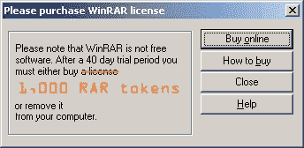
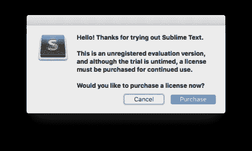
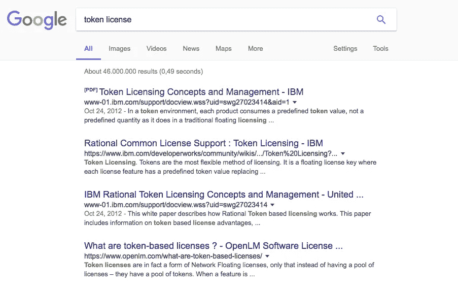
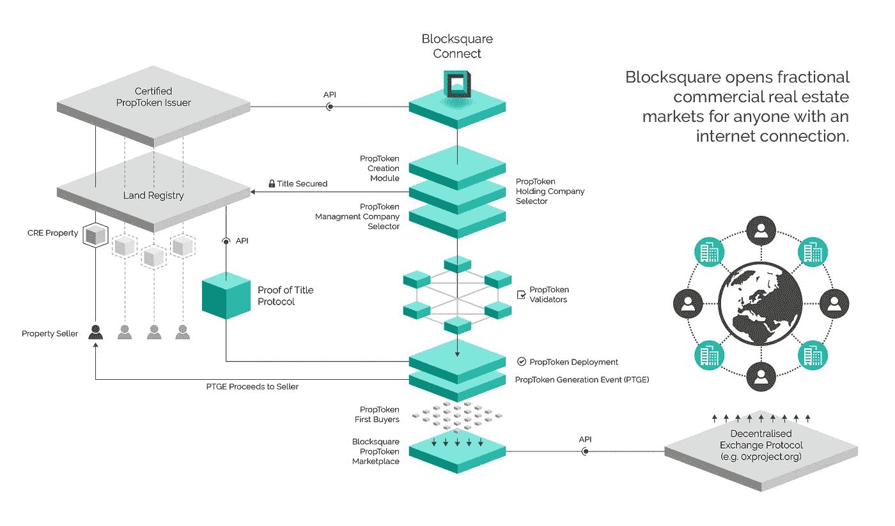

# 区块链:令牌即许可证(TaaL)

> 原文：<https://medium.com/hackernoon/blockchain-token-as-a-license-taal-ba5d173e4ad6>

→ proceed to ico.winrar.com for whitelisting ←

软件[许可](https://hackernoon.com/tagged/licensing)是一个复杂的话题，但是了解一点它的背景可以帮助你更好地理解 ico，因为正在发行的令牌很大程度上代表了一种跨用户和产品浮动的许可形式。

*这没什么错，在我看来恰恰相反，因为你消除了购买初创公司股权的一些法律纠纷，但这仍然是重要的事实。希望这篇文章能帮助你更好地了解下次在大众交易所或代币众筹上购买代币时，你可能会买什么，例如*[*block square*](http://blocksquare.io)*——有意背书:)*

# **什么是软件许可？**

**软件许可证**是管理**软件**的使用或再分发的法律文书(通常通过合同法的方式，有或没有印刷材料)。软件许可证通常会回答以下问题:

*   您可以在哪里、如何以及多久安装一次该程序？
*   你能复制、修改或重新发布它吗？
*   你能看看底层源代码吗？

Ever seen one of these?

要激活软件产品，通常需要输入许可证密钥才能启用软件包中的全套功能。

例如，如果您下载一个软件的免费试用版，您可能需要购买并输入许可证密钥才能开始使用完全付费版。激活可以脱机完成，更常见的是联机完成。如果您想在一台计算机上停止使用该软件，并开始在另一台计算机上使用它，您可能需要在旧计算机上停用许可证，然后才能将它转移到新计算机上。

# 批量许可

批量许可协议通常由商业、政府和教育部门的大多数主要供应商提供，使组织有机会简化其软件采购、协商折扣、简化软件部署、实现管理经济并轻松维护软件资产管理计划以确保软件合规性。

# 许可类型

目前软件供应商提供了许多不同的软件许可模型，包括许多新兴模型。

1.  **装置**——也称为“基于机器的”。许可证被锁定到一台单独的机器。
2.  **用户** —许可证被分配给一个指定的用户，该用户必须被识别，以确保许可协议有效且遵守许可条款。
3.  **联网(WAN & LAN)** —涵盖同一网络基础设施上的机器的许可证。这是广域网或局域网格式。也称为“并发许可证”。
4.  **订阅(用户或设备)** —许可证仅在订阅期间可用。在协议日期之前或之后无权使用它(除非协议续签)。
5.  **“基于云的信用”订阅** —云信用是执行特定任务或运行供应商提供的特定应用所需的计量单位。托管在云中，通常是订阅模式。
6.  **通用公共许可证(GPL)** —免费提供的许可证和软件。允许用户使用、共享、复制和修改软件。将法律指标与“免费软件”分开。
7.  **客户端访问许可证(CAL，包括设备和用户指标)** —允许用户连接到服务器软件以使用软件的特性/功能。
8.  **基于容量的许可证** —许可证基于 CPU/硬盘或其他硬件配置元素的容量。
9.  **字体许可** —字体专用许可。与在线或组织内部使用的字体相关。
10.  **免费软件** —无需购买许可证，但版权仍由开发者持有。

# **令牌许可来源**

当你在开发一个像 [Blocksquare](http://blocksquare.io) 这样的新系统时，你的思维倾向于寻找相似之处，以便更好地理解你正在创造的东西。因此，当令牌相当于软件许可证的概念浮现在脑海中时，我立即谷歌了“[令牌许可证](https://www.google.si/search?client=safari&rls=en&q=token+license&ie=UTF-8&oe=UTF-8&gws_rd=cr&dcr=0&ei=accUWoHAJYPca_zQu4AG)”，令我惊讶的是，最初的几个结果是 2012 年的一个 [IBM](https://www.ibm.com/developerworks/community/wikis/home?lang=en#!/wiki/Wa5f0e71b4f3c_4bc8_adb1_be13c9277040/page/Token%20Licensing) 社区网站的链接。

事实证明， [IBM developerWorks](https://medium.com/u/262975298e3a?source=post_page-----ba5d173e4ad6--------------------------------) 提供了一种令牌许可选项，为客户提供了更大的灵活性。但事实上，最大的公司之一 IBM 在 2012 年提供了一种新颖的许可模式，这并不是我研究中最令人惊讶的部分。

对这个话题的进一步探索引导我阅读本文。这篇文章发表于 2008 年，写的是一家为重工业制造提供软件的公司 [Aspen Technology](http://aspentech.com) ，以及他们允许客户通过代币购买其应用的独特方式，类似于购买预付费手机卡。

从 Aspen Technology 购买代币后，您可以使用它们许可该公司的任何产品。因此，如果工程套件需要每个用户 50 个令牌，工厂制造套件需要每个用户 20 个令牌，而供应链应用程序需要 10 个令牌，那么您可以按照您选择的任何组合来划分这些令牌。很酷吧，哈？

# 令牌作为许可证

与传统许可相反，基于令牌的许可使您能够在需要时针对不同的产品“重用”相同的许可证。随着代币在交易所出售或购买，许可证可以很容易地转手，因此更多的用户可以在有限的时间内使用该软件。在令牌环境中，产品可以

*   需要预定数量的令牌，
*   消费预定数量的代币。

令牌作为许可证的概念已经出现。例如，以太坊使用以太令牌在提供的软件上执行不同的操作。因为被消费的代币被转移给矿工，而且因为它们带有价值，我们认为以太是一种货币，而不是一种许可证。

令牌许可可以被认为是最灵活的许可方法。交换中可用的令牌可以被视为跨用户许可证的维护“令牌池”,使用户能够在正确的时间访问正确的产品。只要市场上有足够的未使用令牌，用户就能够获得许可证。当某人停止使用产品时，他可以选择重新出售代币，并让其他人可以使用或持有代币以供以后使用。

对于拥有大量应用程序的软件供应商来说，该模型可能会变得非常有效，因为很难预测单个应用程序的使用模式。这种情况经常发生在技术市场中，在技术市场中，软件组合被用在设计流程中，或者被用来进行软件实验。用户可能无法在购买周期开始时预测要购买多少软件，因为应用的使用可能取决于特定设计中的挑战。

从软件供应商的角度来看，这也是抵御单点工具竞争对手巩固市场地位的有效方法。token 软件许可证模式使客户在财务上更容易利用整个软件组合，而不是试图为工作流程的每个部分购买最佳产品。

## **并发令牌许可**

当部署为令牌许可证时，软件供应商不是创建与产品相关联的许可证密钥，而是检查用户钱包上的令牌数量，然后根据产品的价格表对其进行权衡。在令牌许可模式下，客户需要购买一定数量的令牌才能使用软件或特定应用程序。

## **消费代币发牌**

一个纯粹的消费代币，就像一个口香糖贩卖机，是一个“用完”的模型。在这种模式下，当产品运行时，它会检查出一定数量的令牌，这些令牌随后被消费掉，并且不再对用户可用。令牌可以被烧毁(销毁)或者简单地转手，或者回到软件提供商(令牌发行者)或者到为软件提供商提供密钥服务或动作的第三方。这种类型的软件许可模式最适用于面向交易的软件许可，并且软件供应商希望根据交易总数收费。

# 区块链软件解决方案的令牌许可

让我们来看看一个由[区块链](https://hackernoon.com/tagged/blockchain)驱动的解决方案的实例— [Blocksquare.io](http://blocksquare.io)

Blocksquare 是一个部分商业房地产产权代币(即 PropTokens)的网络，具有一个购买和销售这些代币的分散市场，以及一个方便地跟踪产权表现并与产权管理部门沟通的平台。它也是一个应用程序，使认证合作伙伴能够标记 CRE 属性，而无需技术技能要求。

how [blocksquare](http://blocksquare.io) works

Blocksquare 的参与者是一个非常多样化的用户组，他们需要访问系统中不同的功能和应用程序。各种用户群是:(1)认证合作伙伴，(2)物业管理公司，(3)物业控股公司，(4) PropToken 验证者和(5)最终用户。

认证合作伙伴使用 Blocksquare 创建和发布新的 PropToken 合同。他们向希望出售商业地产的当地房地产专业人士提供这些服务。要部署 PropToken 合约，认证合作伙伴必须使用三个应用程序:PropToken 创建模块(T0)和控股公司选择器(T3)以及管理公司选择器(T5)。每个应用程序都要求在指定用户的钱包帐户上持有一定数量的 BST 令牌。为了举例说明，我们可以定义以下令牌许可结构:

*   创建模块→ 20 万 BST，
*   控股公司选择器→ 50，000 BST
*   管理公司选择器→ 100，000 BST。

这意味着，认证合作伙伴需要持有总共 350，000 个 BST 令牌，才能使用所需的产品套件来标记属性。令牌许可证也可以拆分为认证合作伙伴组织内的独立账户。例如，当合作伙伴的令牌化工作流将任务划分到不同的部门时，这可能会很方便。

另一方面，物业控股公司只需获得使用*控股公司选择器应用程序的许可。该应用程序使他们能够接收、评估和确认产权持有服务的新报价。在上面的示例中，令牌许可证要求公司帐户持有 50，000 BST 的余额。*

同样，一家物业管理公司需要 100，000 个 BST 令牌才能获得使用*管理公司选择器应用程序的许可，该应用程序是一个面向管理公司的市场，为 PropToken 物业网络提供服务。*

系统的最终用户可以被给予基于等级的许可证，其中入门级使用将不需要令牌，但是更高级别的使用将需要用户持有一定量的 BST 令牌。

与 b2b 用户的并发令牌许可相反，最终用户许可可能是消耗性的，需要用户为访问 PropToken 生成事件付费。

# 规章制度

由于监管环境仍未在几乎所有司法管辖区提供一个清晰的框架，我们不能肯定地说，如何以及是否可以将令牌视为灵活许可基于区块链的软件解决方案的手段。在我个人看来，更广泛的区块链群体应该考虑朝这个方向发展，因为这可能证明明确定义对监管者来说什么是令牌是一个很好的观点，因为软件许可已经在大多数司法管辖区的法律中得到了很好的定义。

由于监管角度不是我的强项，我请斯洛文尼亚最著名的律师事务所之一[**Jadek&Pensa**](http://www.jadek-pensa.si/en/)**律师事务所的助理 [**Aljaz Jadek**](https://medium.com/u/beff5b8ed474?source=post_page-----ba5d173e4ad6--------------------------------) **分享他对此事的个人看法。****

# ****律师对 TaaL 的简要看法****

**由 [Aljaz Jadek](https://medium.com/u/beff5b8ed474?source=post_page-----ba5d173e4ad6--------------------------------) 律师事务所律师 [Jadek & Pensa](http://www.jadek-pensa.si/en/)**

> **所发行的令牌连同智能合同以及条款和条件可以构成许可协议的所有元素。根据斯洛文尼亚法律，许可协议被定义为一项协议，通过该协议，许可提供方承诺将利用专利发明、技术诀窍或经验或商标、图案或模型的权利全部或部分让与给许可获取方，许可获取方承诺为此支付特定款项。**
> 
> **根据斯洛文尼亚法律，许可协议必须以书面形式订立。此外,《电子商务和电子签名法》规定，如果电子形式的信息可被获取并适于以后使用，则电子形式应被视为等同于书面形式。我相信区块链的技术可以达到这个标准，所以许可协议可以以电子形式签订。**
> 
> **令牌的性质对于 TaaL 模型至关重要。这是一个问题，令牌是否会形成为一个安全或身份证件或其他东西？主要区别在于，债权并不包含在身份证明文件(令牌)中，因此，许可证获取人也可以在没有这种令牌的情况下行使其权利。这种令牌实际使用是有问题的。另一方面，带有许可证购买人权利的令牌可能会受证券法管辖。**
> 
> **许可提供商有义务交付许可主题，并对许可主题的技术可行性和技术可用性负责。令牌可能不会被视为许可证的主题。这意味着，在 TaaL 模式中，令牌发行者将对令牌持有者承担更多义务，正如我们目前在 ICO 领域所看到的那样。**
> 
> **以下法律方面与二级交易市场相关。根据斯洛文尼亚法律，双边合同的任何一方都可以将合同转让给第三人，如果另一方同意，第三人将因此成为前者由合同产生的所有权利和义务的持有者。在 TaaL 模式中，整个许可协议随着令牌的转移而转移，为了有效地将该许可协议的所有权利和义务转移给新的令牌持有者，需要令牌发行者的同意。一旦发生转移，可以预先给予同意，同时通知许可提供者关于转移。另一种解决办法可能是，令牌签发人接受令牌被视为一种行为，从这种行为中可以可靠地得出结论，即令牌签发人同意转让许可协议。这意味着代币持有者将冒代币发行者在某个时间点不同意的风险，从而阻止在二级交易市场上交换代币。此外，象征性卖方(转让人)将因转让合同的有效性而对象征性买方(受让人)承担责任，这可能超出其控制范围。**
> 
> **根据斯洛文尼亚法律，在 TaaL 模式中有一个不同之处，在该模式中，只有许可证购买者的权利要求随着令牌的转移而转移。在这种情况下，不需要令牌发放者的同意，但需要通知令牌发放者(债务人)许可权取得人债权的转让。这意味着，每次在二级市场上交换代币时，都需要通知代币发行者。象征性卖方(转让人)将因债权的存在而对象征性买方(受让人)承担责任，这可能超出其控制范围。这种 TaaL 模型的一个明显优点是，令牌发行者不能阻止在二级交换市场上交换令牌，因为转让许可证购买者的权利要求不需要他的同意。**
> 
> **另一方面，许可协议中的权利和义务可以根据证券法的规则进行转移，这取决于令牌的性质和 TaaL 模型的整体结构。**
> 
> **上述各点代表了对 TaaL 模型的基本法律审查，只是指出了在构建 TaaL 模型时需要进一步分析和解决的法律方面和限制。**
> 
> **[**阿尔贾兹杰德克**](https://medium.com/u/beff5b8ed474?source=post_page-----ba5d173e4ad6--------------------------------) **，律师事务所助理** [**杰德克&彭萨**](http://www.jadek-pensa.si/en/) **，斯洛文尼亚****

# **结论**

**令牌许可已经有了一定的历史，随着区块链技术和基于区块链的令牌的采用，它可能会成为最广泛接受的去中心化应用的许可方法之一。**

***如果你从这篇文章* ***中获得了至少 0.00000001 BTC 的价值，请“鼓掌”(不止一次)。通过鼓掌，你可以帮助其他人找到这篇文章。*****

***我是*[***block square***](http://www.blocksquare.io)*的联合创始人，在这里，我们正在拓展边界，将部分商业地产带给任何有互联网连接的人。***

***就像以太坊提供基础设施来推动 ICOs(初始硬币发行)的概念一样，*[***block square***](http://blocksquare.io)*正在为 CRE 专业人员构建工具，通过 PropToken 生成事件来销售商业房地产。***

*****block square****是一个令牌化的 CRE(商业房地产)房产网络，以产权证明为后盾，该协议将令牌化的房产与传统土地登记处的产权数据联系起来。基于以太坊的区块链层由应用程序套件支持，因此任何认证合作伙伴都可以根据 PropToken 标准轻松标记属性，而无需高级技术技能。另一方面，一个跨设备平台为用户提供了对其投资组合的控制，而一个市场通过一个去中心化的协议实现了财产令牌交换。***

*****我邀请您跟随 Blocksquare 和我们团队的旅程，创造一个商业房地产投资向任何人、任何地方开放的未来。*****

**[*加入我们的电报群*](https://t.me/blocksquare)*[*在 twitter 上关注我们*](https://twitter.com/blocksquare_io)*[*喜欢我们的 facebook 页面*](https://www.facebook.com/blocksquare.io)****

*****…或者干脆发邮件给我们*[*future @ block square . io*](mailto:future@blocksquare.io)*；)*****