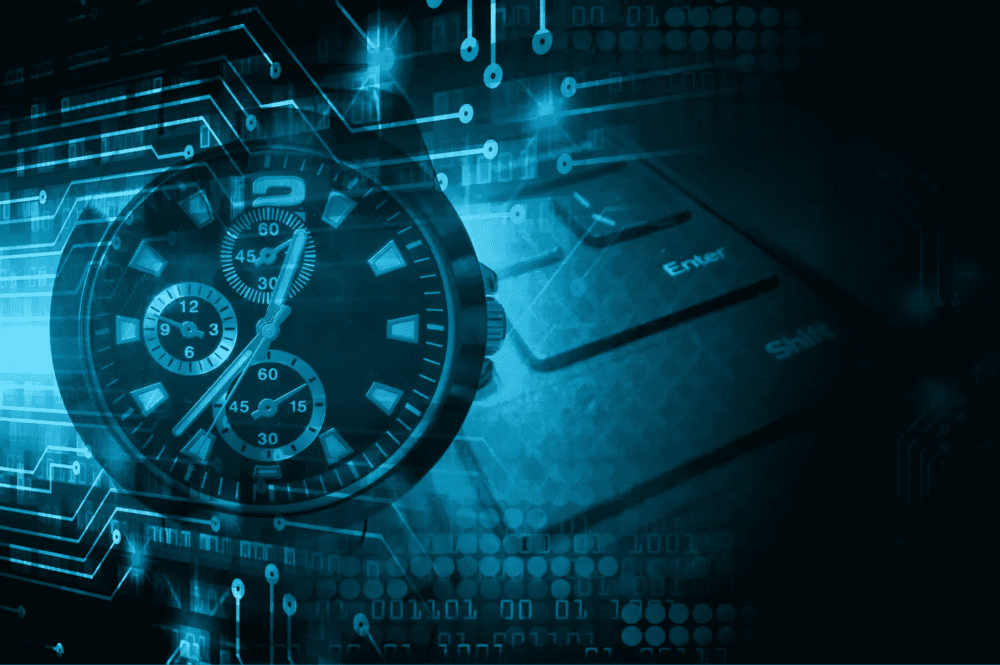

# 区块链和机械时间的演变

> 原文：<https://medium.com/hackernoon/blockchains-and-the-evolution-of-mechanical-time-60295326d9c2>

托尼·利特尔

机械时间开启了全新的经济组织形式，这在当时不仅是不可能的，而且是不可想象的——[区块链经济:机构密码经济学入门指南](/@cryptoeconomics/the-blockchain-economy-a-beginners-guide-to-institutional-cryptoeconomics-64bf2f2beec4)

当有商业背景的人问:“区块链是什么？”试着指指你的手表。人们经常使用互联网的发明作为类比来帮助理解——我认为描述区块链的最佳方式是暗示**区块链是机械时间**进化的下一步。

时钟对于计时就像区块链对于数据一样重要。为了解开这个想法，让我们看看机械时间为经济做了什么，然后区块链如何把它带到下一个层次。

时钟从根本上来说是一种媒介，它让我们所有人都同意增量**时间**。我们信任它。想象一下，在我们能够可靠地测量时间之前，生活是什么样的。在其发明之前，大自然给了我们最可靠的标记——公鸡、太阳的最高点和日落——每一个都因人的位置和有利位置而异。

机械时间开辟了管理远距离贸易和交换、生产和运输过程的新途径，并从根本上改变了我们做生意的方式。

**共享时钟的参与者同意*时间*** 的共同真理来源——例如何时开始和结束商业合同，或者货物何时将被运送和到达，最终共享的时钟使得全球经济能够协调。在它成立之初，世界无法想象它会创造出什么样的新市场。

区块链是一个中介，它允许不可信的参与者就**数据**达成一致。在其发明之前，数据孤岛、昂贵且不可靠的接口以及错位的数据组织模型产生了最可靠的数据库。真相因每个拥有者的真相来源的内容和结构而异。

区块链有可能开辟新的商业运作方式，并从根本上改变市场。**共享区块链的参与者就防篡改、*数据的公共真实来源*** 达成一致，这大大降低了验证谁持有资产或者是否满足某些合同条件的成本。它提供了过去的数字视图，所有参与者可以低成本地快速查看，而无需向网络中的其他人询问“他们的版本”。到目前为止，世界很难想象它将催生什么样的新市场。

机械时间不储存过去的数据，它只告知现在。区块链不会通知即时的现在，它会聚合过去的数据。为了确保数据状态在区块链中得到一致认可，有一个延迟数据写入的一致过程(类似于审计员的董事会审查一组分类账以创建主数据)，但一旦数据被写入，花式数学(密码术)允许任何参与者有机会确认过去的数据未被篡改。机械时间，就像一个实现良好的区块链，在当前的实践中是非常分散的(即，有许多精确时间的提供者，此外，人们运行他们自己的计时设备)。

另一个让新来者感到困惑的地方是公共和私人区块链网络的区别。不同之处主要在于谁被允许参与网络，这也和机械时间有相似之处。

开放(无许可/公共)网络对所有人开放，并使用加密货币作为对帮助保护网络安全的参与者的奖励。具有讽刺意味的是，参与者之间的信任越少，数据就越安全——因为每个人都更加努力地工作，以确保没有人“作弊”用机械时间更容易建立信任，因为真理的最终仲裁者是约定好的主时钟的设计者。当你在一个重要会议上迟到时，你可以感受到机械时间的组织能力。

今天，封闭的(许可的)网络可能有些笨拙，并且更难使用。想象一下，如果你创建了自己的“时间”结构，并试图让每个人在一个小网络中使用它。因为参与者之间经常使用传统的商业合同来“人为地建立信任”，所以如果这些合同没有在网络上正确地编码以便所有参与者都可以理解关系，现有的竞争力量可能会产生摩擦。那些试图创建这些更集中的区块链模式的人，通常是出于隐私考虑(如在医疗保健领域)，发现区块链是没有用的，除非他们找到一种方法来建立正确的参与激励。同样，就像机械时间一样……如果你们不能在不花太多成本的情况下就时间达成一致，那么雇佣一个中间人四处奔走，告诉每个人会议什么时候开始，可能会更便宜(想象一下快递员带着舞会邀请从一个王国骑到另一个王国)。

就像手表佩戴者偶尔会与主时钟同步一样，我相信未来的常见做法将是参考大型、可信的公共区块链网络来提高信任级别，即使这只是以太坊等公共网络的部分私有链的周期性指纹(哈希)。

所以当你考虑如何描述区块链的时候，试试这个。戴手表。让我知道你的想法，让我知道事情的进展。

特别感谢[威尔](https://www.linkedin.com/in/wclittle/)和[康拉德](https://twitter.com/lisperati?lang=en)对本文的贡献。