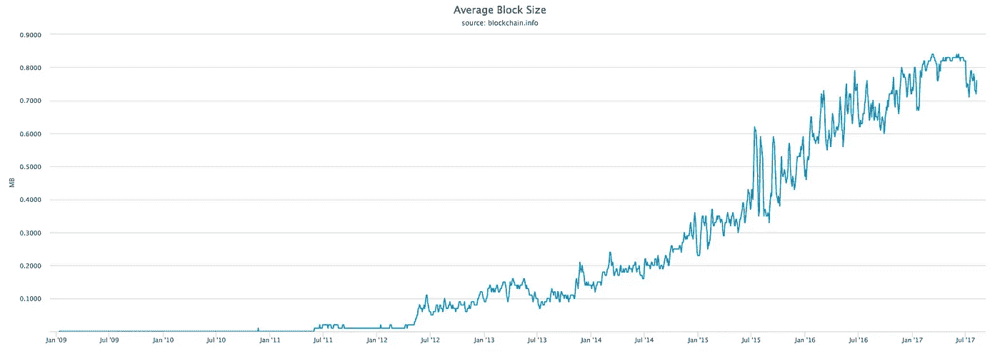
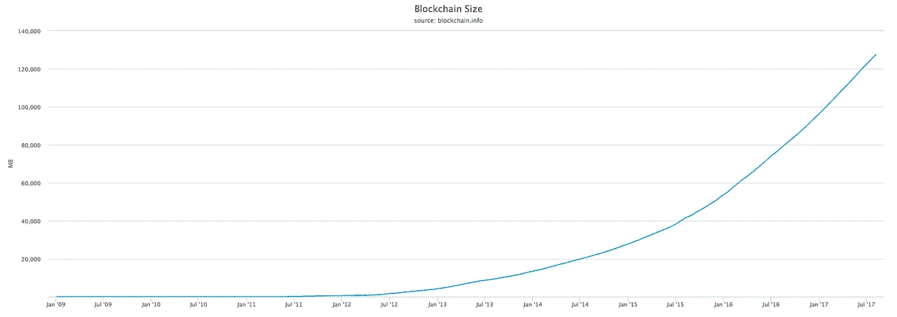
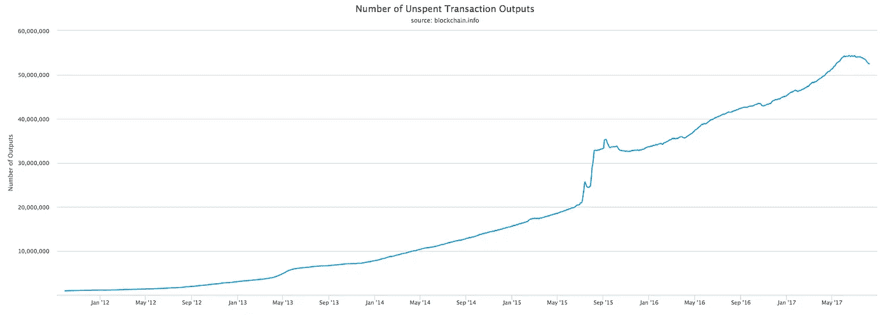
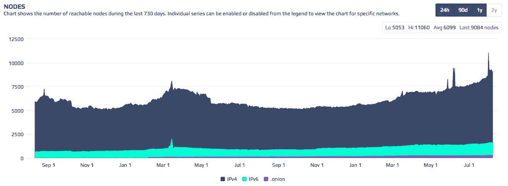

# 区块链很难扩展

> 原文：<https://medium.com/hackernoon/blockchains-are-hard-to-scale-ca7dc80e9d8>

[比特币](https://hackernoon.com/tagged/bitcoin)区块已经[满了一段时间](https://blockchain.info/charts/avg-block-size?timespan=all):

1 MB is the cap that Bitcoin consensus rules required

这在比特币社区引起了[一场大辩论](https://www.wsj.com/articles/the-virtual-currency-war-that-threatens-to-tear-bitcoin-apart-1497956400)。你可能听说过[BIP 148](https://github.com/bitcoin/bips/blob/master/bip-0148.mediawiki)(UASF)[segwit2x](/@jimmysong/segwit2x-what-you-need-to-know-about-the-2mb-hard-fork-27749e1544ce)“妥协】、 [BIP 91](https://github.com/bitcoin/bips/blob/master/bip-0091.mediawiki) 以及最近创造的一种新的[加密货币](https://hackernoon.com/tagged/cryptocurrency)叫做 [bcash](https://www.bitcoincash.org/) (有着共同的历史)。

比特币网络目前的上限约为每秒 3 笔交易，如果与 Visa/Mastercard 相比，这听起来不算多。您可能想知道为什么我们不能像传统服务那样轻松地扩展区块链。要回答这个问题，我们必须从基础开始。

区块链的主要目的是在没有可信第三方的情况下订购交易(以防止重复花费)。为了真正做到不可信，每个人都必须能够轻松地连续验证区块链上的所有交易。如果你学过计算机科学，你会很快发现问题所在:让每个人都存储和验证来自其他人的每笔交易(并且以相同的顺序)是不可伸缩的。

以下是比特币区块链规模[目前的样子](https://blockchain.info/charts/blocks-size?timespan=all):

130+ GB is not nothing

比特币将余额存储为[未花费的交易输出](https://bitcoin.org/en/glossary/unspent-transaction-output) (UTXOs)，这是一个先前交易的记录，现在可以花费。好消息是，一旦一个 UTXO 被使用，它就不再需要被存储以进行无信任验证。坏消息是，花费 UTXOs 可能会产生比它破坏的更多的 UTXOs。这里是[UTXOs 的数量看起来像什么](https://blockchain.info/charts/utxo-count?timespan=all):

UTXO growth appears to be tapering

请注意，您还必须验证 ECDSA 签名，但是因为这可以并行完成，所以这不是主要的瓶颈。我将在以后关于硬件和软件改进的文章中解释它。

有趣的事实:[点击这里](http://bc.daniel.net.nz/)看看比特币和以太坊的硬件使用是如何随着时间的推移而变化的。

不幸的是，权力下放不是一个二元措施。验证区块链的计算开销越大，用户就越少。我们的一个基准是在网络上公开宣布自己的完整节点的数量。不可能测量有多少完整的节点不接受连接，这是一个固有的不完美的测量(1 个节点！= wallet)，但它可以是[一个有用的近似值](https://bitnodes.21.co/dashboard/?days=730#nodes):

While bitcoin usage has exploded, the number of bitcoin full nodes has had only modest growth.

如果你打算将你的信托委托给一个中央机构，你还不如选择银行。他们可以轻松地将所有客户数据保存在一个简单的 SQL 数据库中，并且可以将事务吞吐量提高许多个数量级。当然，你必须相信他们有偿付能力，不会偷你的钱，冻结你的资金，等等。

在其他条件相同的情况下，权力越分散越好。如果这种分散是有代价的(事务吞吐量)，那么合适的数量是多少？我们如何在保持分散化的同时进行扩展？

在这个系列中，我将解释各种扩展方案的利弊:更好的硬件、更好的软件、单向支付渠道、闪电网络、扩展块、侧链、驱动链、链外交易和不相关的区块链。在我发布时关注我的更新！

感谢[吉米·宋](https://medium.com/u/4acb12744ff8?source=post_page-----ca7dc80e9d8--------------------------------)、[奈米尔·达拉](https://www.nemil.com/musings/index.html)、[亚伦·卡斯维尔](https://github.com/porkchop)等人审阅了这篇文章的早期版本。一如既往，审核并不意味着对内容的认可。