# 区块链不缩放。至少今天没有。但是还有希望。

> 原文：<https://medium.com/hackernoon/blockchains-dont-scale-not-today-at-least-but-there-s-hope-2cb43946551a>

第一篇比特币[论文](https://bitcoin.org/bitcoin.pdf)于 2008 年首次发布。从那以后，我对区块链技术的潜力越来越感兴趣。

去中心化的数字货币，曾经只是一个遥不可及的目标，如今终于进入主流。虽然这本身就令人兴奋，但我个人最兴奋的是分散应用程序的潜力。金融交易所、预测市场和资产管理平台都蕴含着巨大的潜力。

支持它们的*不可信系统*同样耐人寻味；身份验证系统、智能财产、*抵制审查的*社交平台，以及*自主结构和* *治理模式*，如 [DAOs](https://en.wikipedia.org/wiki/Decentralized_autonomous_organization) 。最具破坏性的用例可能还没有被想象出来。

但是这个梦想在可预见的未来仍然是一个梦想——虽然一些早期的爱好者和企业家正在尝试构建这样的应用程序，但仍然有一个很大的缺失阻止我们看到这些应用程序实现 *:* ***可扩展性*** *。就目前而言，区块链的规模化能力有限。

这并不是说永远都会这样，但今天绝对是这样。事实上，我认为这是我们今天面对区块链技术的最大技术障碍之一。它很快成为社区和加密货币研究人员非常活跃的研究领域。*

# 为什么区块链不可扩展？

**目前，所有区块链共识协议(如比特币、以太坊、Ripple、Tendermint)都有一个具有挑战性的限制:网络中每个完全参与的节点都必须处理每笔交易**。回想一下，区块链有一个固有的关键特征——“去中心化”，这意味着网络上的每个节点都处理每个事务，并维护整个状态的副本。

虽然去中心化共识机制提供了一些关键的好处，比如容错、强有力的安全性保证、政治中立性和真实性，但它是以可伸缩性为代价的。区块链可以处理的事务数量永远不会超过参与网络的单个节点的数量。事实上，随着更多的节点添加到其网络中，区块链实际上会变得更弱，因为节点间的延迟会随着每增加一个节点而呈对数增长。

在传统的数据库系统中，可扩展性的解决方案是增加更多的服务器(即计算能力)来处理增加的事务。在去中心化的区块链世界中，每个节点都需要处理和验证每个事务，这就要求我们为每个节点增加更多的计算，以提高网络速度。无法控制网络中的每个公共节点会让我们陷入困境。

**因此，所有以这种分散方式运行的公共区块链共识协议都在低事务吞吐量和高度集中之间做出权衡。**换句话说，随着区块链规模的增长，完全参与网络所需的存储、带宽和计算能力的需求也在增加。在某种程度上，它变得非常笨拙，只有几个节点才能处理一个数据块，这导致了集中化的风险。

**为了扩大规模，区块链协议必须找到一种机制来限制验证每个事务所需的参与节点数量，同时又不丧失网络对每个事务都有效的信任。这听起来很简单，但在技术上非常困难。为什么？**

1.  因为不允许每个节点验证每个事务，所以我们需要节点有一个统计和经济的方法来确保其他块(它们没有亲自验证)是安全的。
2.  必须有某种方法来保证数据的可用性。换句话说，即使一个块从不直接验证该块的节点的角度看起来是有效的，使该块的数据不可用也会导致网络中没有其他验证器可以验证事务或产生新的块的情况，我们最终会陷入当前状态。(节点可能脱机的原因有多种，包括恶意攻击和断电。)
3.  为了实现可伸缩性，事务需要由不同的节点并行处理。然而，在区块链上转换状态也有几个不可并行(串行)的部分，所以我们面临一些限制，如何才能在平衡并行性和实用性的同时在区块链上转换状态。

# 给我号码

那么，可伸缩性数字实际上是什么样的呢？让我们来看看。

一个以太坊节点的最大理论事务处理能力超过每秒 1000 个事务[1]。不幸的是，由于以太坊的“气体限制”，这不是实际的吞吐量，目前每个区块平均约为 670 万气体[2]。

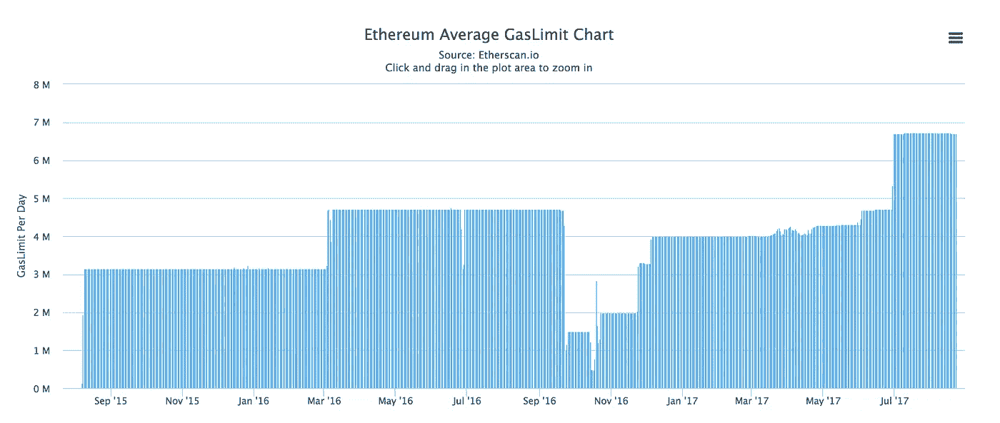

Source: etherscan.io

快速“gas”入门，以防测量对您来说是新的:在以太坊中，gas 是计算工作量的度量，每个操作都分配有固定量的 gas(例如，获取帐户余额需要 400 gas，创建一个合同需要 32，000 gas，发送一个交易需要 21，000 gas，等等。).交易有一个气体限制字段，用于指定发送者愿意购买的最大气体量。**因此，每个区块的“gas limit”根据区块中每个交易指定的 gas limit 来确定一个区块中适合多少交易。**

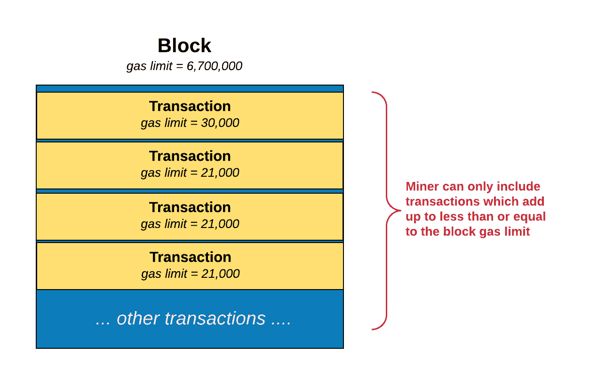

以太坊的 gas 限制有点类似于比特币对每个块大小的 1 MB 限制，区别在于以太坊的 gas 限制是由矿工动态设置的，而比特币的块大小限制是硬编码到协议中的。

以太坊的这种气体限制对每个块的网络计算能力施加了软限制:**利用当前的 670 万气体限制和当前每个标准事务使用的大约 21K 的平均气体，我们得到每个块大约 300 个标准事务。当前的平均阻塞时间是 20 秒，相当于每秒钟大约 15 个事务(300 / 20 = 15)。对于更复杂的事务，这一数字会低得多(例如，智能合约调用使用的 gas 中值为 50K [3]，这意味着大约每秒 7 个事务)。**

结合以太坊网络上的交易数量正在以显著的速度增长这一事实，您可以看到这将如何成为一个问题。**从 2016 年 Q2 青奥会到 2017 年 Q2 青奥会，日交易量从约 4 万笔增加到 24 万笔[4]，同比增长 500%**。此外，就在上个月，它达到了每天超过 44 万笔交易的峰值！如果我们做一些粗略的计算，那就是平均每秒 5 笔交易。

啊哦。

类似地，尽管比特币的理论上限为每秒 4000 次交易，但目前小额交易的硬上限约为每秒 7 次交易，更复杂的交易为每秒 3 次交易。

请注意，这些限制对于区块链是不存在的。事实上，私人区块链可以在以太坊或比特币上实现每秒超过 1000 笔交易。为什么？因为如果你运行的是私人区块链，你就有能力确保网络上的每一个节点都是一台高质量的计算机，拥有高带宽的互联网连接。目前，扩展区块链需要我们向每个节点添加更多计算，以提高网络速度。由于私有管理的网络可以控制网络中的每个节点，因此它们可以做到这一点。此外，由于您在专用网络上，您可以处理一些原本会在区块链区块链上发生的操作，例如确保每个参与的节点都在运行一个真实的节点。

我一直在以太坊上设计和实现一个新的协议，并直接面临着面向未来的可伸缩性问题。就我个人而言，我对大量的研究、讨论以及最重要的解决这个问题的实验很感兴趣。在这篇文章的剩余部分，我将描述一些在社区中讨论的解决可伸缩性的建议方案。每一种都有独特的优势和权衡。

事实是，不幸的是，没有一个解决方案提供可伸缩性的灵丹妙药。实际上，这些解决方案中的每一个都将有助于逐步提高可伸缩性。综上所述，区块链可伸缩性的前景非常光明。

请注意，这篇文章的目的不是探究所有的技术细节，也不是讨论每个提议的解决方案的优点。相反，我的目标是从 10，000 英尺的高度概述我所知道的一些提议的解决方案。如果读者感兴趣，我可以在以后的文章中更深入地探讨一些具体的解决方案。这篇文章还假设你对区块链的工作原理有一个基本的了解。(如果没有，可以看看我上一篇文章“ [***”比特币、以太坊、区块链、代币、ICOs:为什么有人要在意？***](https://hackernoon.com/bitcoin-ethereum-blockchain-tokens-icos-why-should-anyone-care-890b868cec06) “为进修。)

让我们开始吃吧。

# 解决方法

攀登区块链是一项众所周知的挑战，多年来一直是一个活跃的研究领域。具体来说，如果你一直关注比特币社区多年的崩溃，你可能听说过两种比特币专用的扩展解决方案，称为 SegWit 和 2 兆字节(MB)块大小增加。

这两种解决方案都旨在解决比特币特有的问题，其中**比特币区块链有每个区块 1 兆字节(MB)的内置硬限制**，这限制了可以添加到一个区块的交易数量。因此，比特币在处理和确认交易方面面临延迟(有时几个小时甚至几天)已经有一段时间了。类似地，正如我们在上一节中看到的，以太坊也面临其伸缩能力的限制。

在我们找到如何扩展区块链之前，我们受限于用例实际增长的速度和广度。所以让我们来看看桌上的一些解决方案。

# 建议的解决方案#1: SegWit(仅支持比特币)

每笔比特币交易都包含:

**输入**

*   发送者以前的交易详细信息
*   发送方的唯一私钥(即“scriptSig ”),用于验证发送方是否拥有进行交易的正确金额(基于他们之前的交易)

**输出**

*   发送金额
*   收件人的公共地址(即“ScriptPubKey ”)

在这些元素中，数字签名(` scriptSig `)的大小最大，约占交易的 60–70%。尽管如此，只有在验证时才需要签名。

隔离见证(也称为 Segwit)是将交易签名(即“见证”)与其余交易数据分离(即“隔离”)的解决方案。签名从输入中剥离出来，并在事务结束时移动到一个结构中。

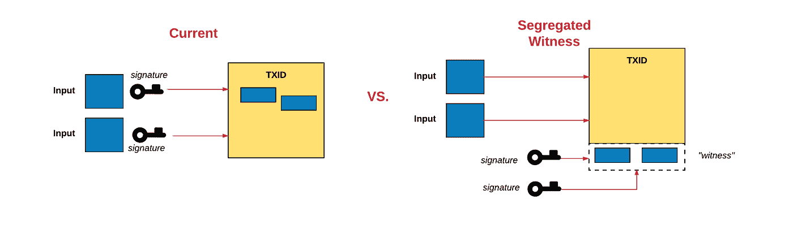

此外，使用 SegWit，见证被移动到事务数据中一个新的“见证”字段，这允许我们改变块大小的计算方式。块大小限制不再以字节来衡量。取而代之的是，块和事务被赋予一个称为“权重”的新指标，该指标与它们对节点资源的需求相对应。具体来说，隔离见证的每个字节的权重为 1，块中的每个其他字节的权重为 4，块的最大允许权重为 400 万，这允许包含 SegWit 事务的块容纳比当前最大块大小所允许的更多的数据。**这将有效地将上限从 1 MB 提高到略低于 4 MB，使我们的交易量增加约 70%。**

除了可伸缩性之外，SegWit 还解决了其他问题，比如事务可伸缩性和增强的安全性(由于与可伸缩性无关，我在这里就不赘述了。)

# 建议的解决方案#2: 2 MB 块大小(仅支持比特币)

虽然比特币社区的一方(用户)强烈支持 SegWit，但社区的另一方(矿工)更喜欢将 1 MB 块大小限制更改为 2 MB 的硬分叉(请记住，没有硬分叉，1 MB 限制无法修改)。基本想法很简单:通过增加块的大小，每个块可以容纳更多的事务，从而使网络每秒可以处理更多的事务。

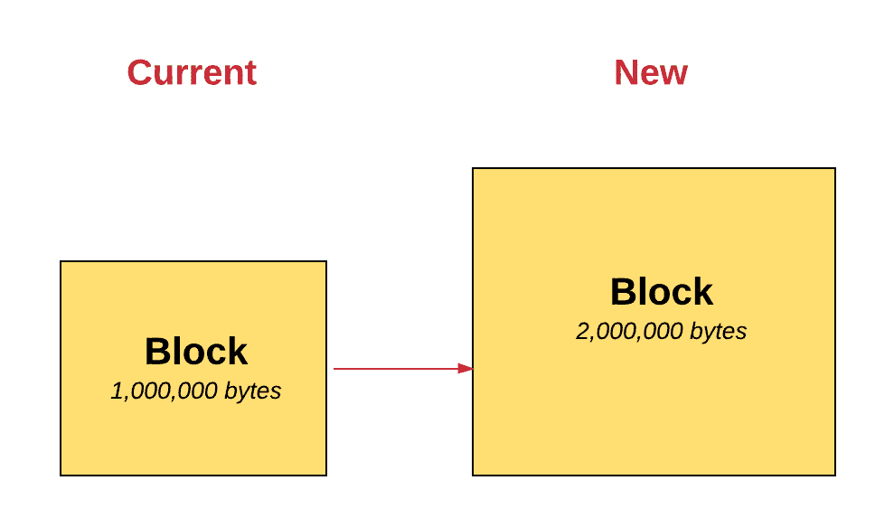

这种块大小增加的计划长期以来一直是比特币社区[激烈辩论](https://en.bitcoin.it/wiki/Block_size_limit_controversy)的[主题](https://www.mail-archive.com/bitcoin-development@lists.sourceforge.net/msg08276.html)，并且自 2015 年初以来获得了越来越多的关注，当时块的大小开始接近当前 1 MB 的硬限制。

# 建议的解决方案#3:链外状态通道

国家渠道本质上是一种机制，通过这种机制，通常可能发生在区块链的区块链互动在区块链之外进行。这是以密码安全的方式完成的，不会增加任何参与者的风险，同时在成本和速度方面提供了显著的改进。我个人认为，国家频道将是扩展区块链技术以支持更高水平使用的关键部分。

一个状态通道的工作原理如下:

1.  区块链状态的一部分通过多重签名或某种智能契约被锁定，更新它的唯一方式是特定的参与者完全同意。
2.  参与者通过构造和加密签名交易来在他们之间进行更新，而无需将交易提交给区块链。每个新的更新都会覆盖以前的更新。
3.  稍后，参与者将状态提交回区块链，后者关闭状态通道并再次解锁状态。

步骤 1 和 3 涉及区块链操作，这些操作被发布到网络，支付费用并等待确认。然而，步骤 2 根本不涉及区块链。它可以包含无限数量的更新，并可以无限期地保持开放。从这个意义上说，区块链纯粹用作结算层，处理最终结算的一系列交互中的最终交易，这有助于减轻底层区块链的负担。

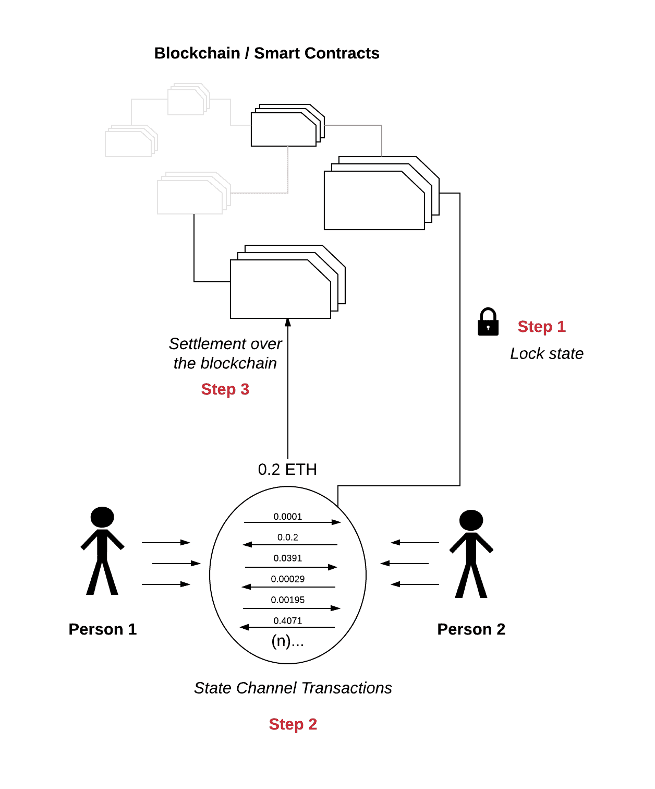

At any point during the process, any participant can send a transaction into the contract to close the channel and start a settlement procedure. This starts a time limit within which participants can submit transactions, and the transaction with the highest sequence number is processed. If one of the participants leaves or tries to cheat, another one can at any time publish the latest transaction to the blockchain to finalize the state, assuming all the participants completely agree on the state.

国有渠道不仅提高了交易能力，还提供了另外两个非常重要的好处:提高速度和降低费用。由于大部分交易发生在链外，支付可以即时处理，因为发生在区块链之外的双方之间的更新不需要额外的时间由网络进行处理和验证。其次，支付还会产生较低的费用，因为只需要少量的链上交易来确保结算状态通道的安全，而大多数交易都是在链外进行的，不收取费用。

这有几种不同的实现方式。例如， [Lightning Network](https://lightning.network/) 是一个分散式网络，它通过智能合约使用国家渠道，在参与者网络中实现即时和可扩展的支付。最初，闪电网络是为比特币创建的，但现在看来，它们也允许在区块链各地进行交易。

[雷电网络](http://raiden.network/)是闪电网络的以太坊类比。Raiden Network 还利用离线状态网络来扩展以太坊，实现可扩展的即时交易。

# 建议的解决方案#4:分片

区块链世界中的分片类似于传统软件系统中的数据库分片。对于传统数据库，碎片是数据库中数据的水平分区，其中每个碎片都存储在单独的数据库服务器实例上。这有助于将负载分散到不同的服务器上。

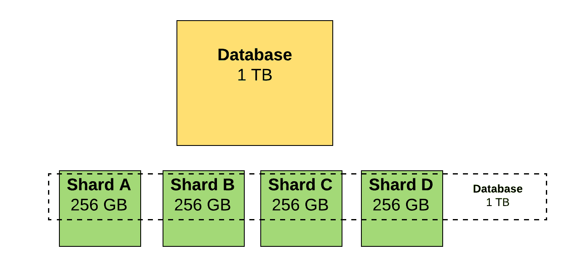

类似地，使用区块链分片，区块链的整体状态被分成不同的分片，状态的每个部分将由网络中的不同节点存储。

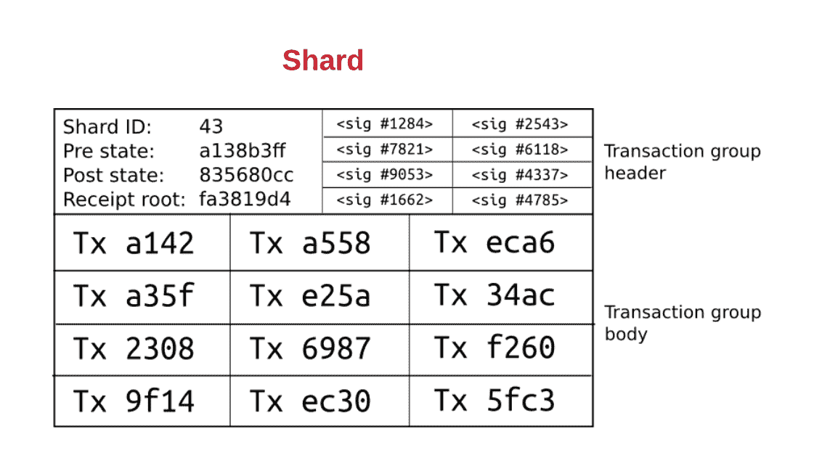

A single shard

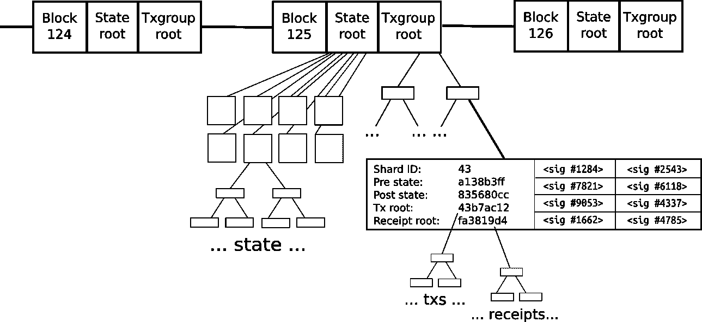

Top level diagram of blockchain sharding [6]

发生在网络上的事务根据它们影响的碎片被定向到不同的节点。每个碎片只处理状态的一小部分，并且是并行处理的。为了在碎片之间进行通信，需要一些消息传递机制。

实现消息传递有多种方法。在 Ethereum 的案例中，他们采用的方法是“收据”范式:当一个碎片中的事务执行时，它可以改变自己本地碎片的状态，同时还会生成“收据”，这些收据存储在某种分布式共享内存中，以后可以被其他碎片查看(但不能修改)。

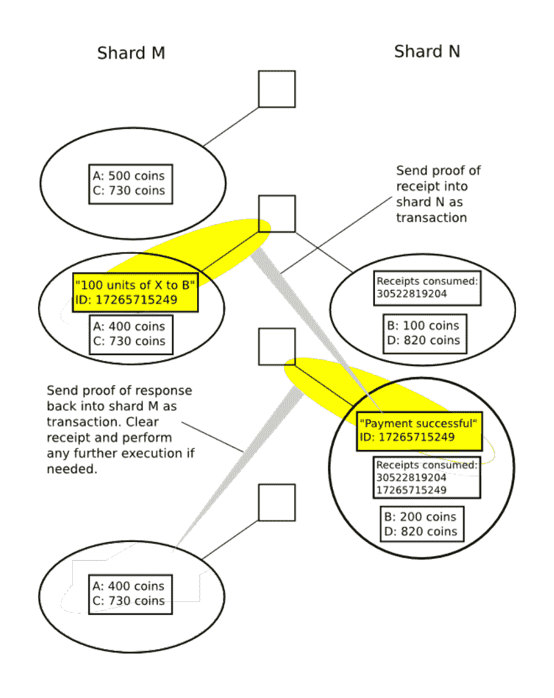

Ethereum’s receipt paradigm [1]

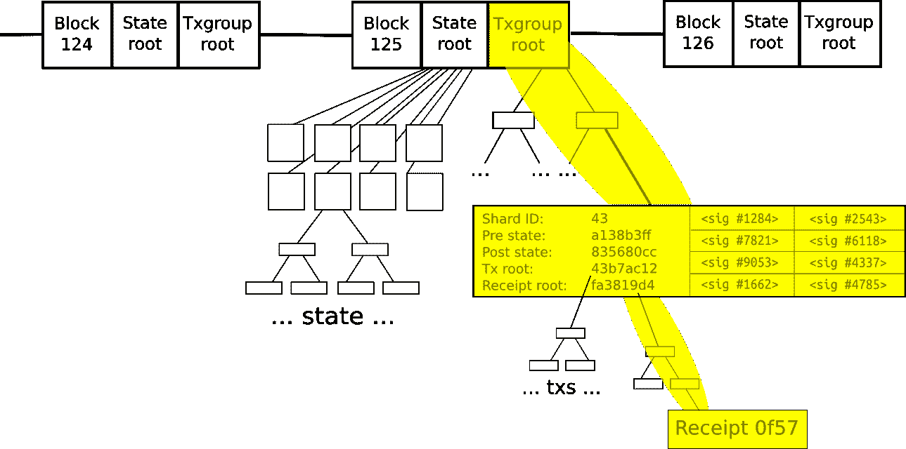

Ethereum’s receipt paradigm [6]

总的来说，分割区块链要求我们创建一个网络，其中每个节点只处理所有交易的一小部分，同时仍然保持高安全性…至少可以说这是一个困难的挑战。

为什么？

首先，区块链协议假设网络中的所有节点都不相互信任。尽管是在不同的计算机上处理，但是这些事务仍然需要在一个共同的状态上达成一致。由于每个节点彼此不信任，所以在碎片 A 上处理事务的节点仅仅对在碎片 B 上处理事务的节点说发生了事务是不够的；相反，它需要以某种方式向他们证明。

此外，由于分片的目标是不让每个节点验证每个事务，所以我们需要找出一种机制来确定哪些节点以安全的方式验证哪个分片，而不会给系统中可能有很大权力来破坏网络的攻击者创造机会。

难以实现分片的另一个原因是，在区块链上执行的事务可能依赖于区块链中先前状态的任何部分，这使得并行处理很有挑战性。此外，对于并行化，您现在需要一种简单的方法来缓解竞争条件等问题。

关于如何在以太坊中实现分片，还有很多技术上的好东西——特别是，如何使用“加密经济激励”来驱动系统中的参与者不作弊(在这种情况下，确保节点向其他节点传递有效信息)——我希望在未来的帖子中探索这些。

# 提议的解决方案#5:等离子体

[等离子](http://plasma.io/)是最近才推出的，是区块链上最有希望的可扩展计算解决方案之一。

等离子体本质上是一系列运行在根区块链(即主以太坊区块链)之上的契约。根区块链使用所谓的“欺诈证据”来加强等离子体链中状态的有效性。(注意:欺诈证明是一种机制，通过这种机制，节点可以使用数学证明来确定块是否无效)。

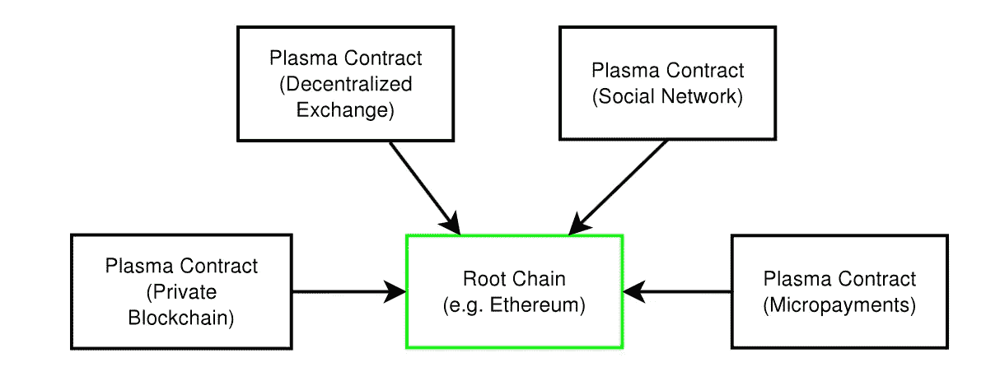

Source: Plasma Whitepaper

区块链组成了一个树状层次结构，每个分支都被视为一个区块链，它有自己的区块链历史和计算，可在地图上还原。我们称子链为“等离子区块链”，每个子链都是区块链中的一个链。

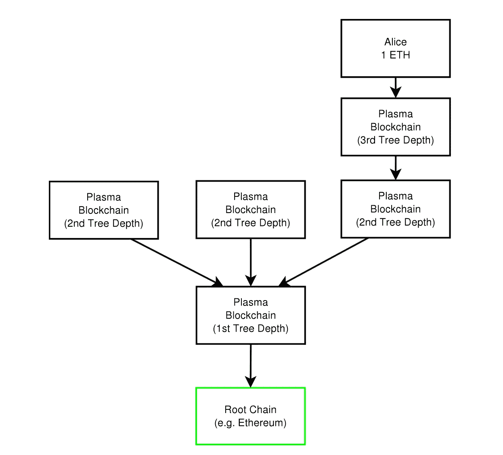

Source: Plasma Whitepaper

血浆区块链没有公开根链上区块链的内容(例如以太坊)。相反，在根链上只提交块头散列，这足以确定块的有效性。如果在根链上提交了欺诈证据，那么块将被回滚，块创建者将受到处罚。换句话说，我们只在拜占庭条件下向根链提交数据。

**因此，根区块链仅处理来自子区块链的少量承诺，这反过来减少了传递到根区块链的数据量，并允许更大量的计算。**

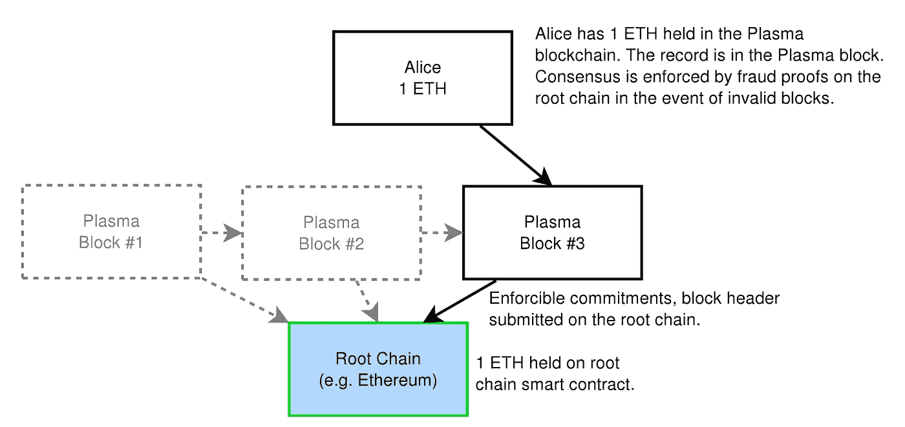

Source: Plasma Whitepaper

此外，数据只传播给那些希望验证特定状态的人。通过消除每个节点监视每个链的需要，这使得契约执行更具可伸缩性。相反，他们只关注那些在经济上受到影响的公司，以便实施正确的行为并惩罚欺诈行为。欺诈证明允许任何一方实施无效块，并确保所有状态转换都得到验证。

此外，如果某个特定链受到攻击，参与者可以快速、廉价地从损坏的子链中大量退出。

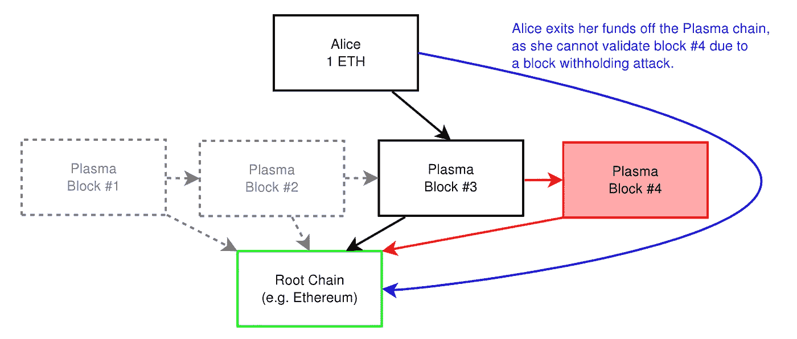

Source: Plasma Whitepaper

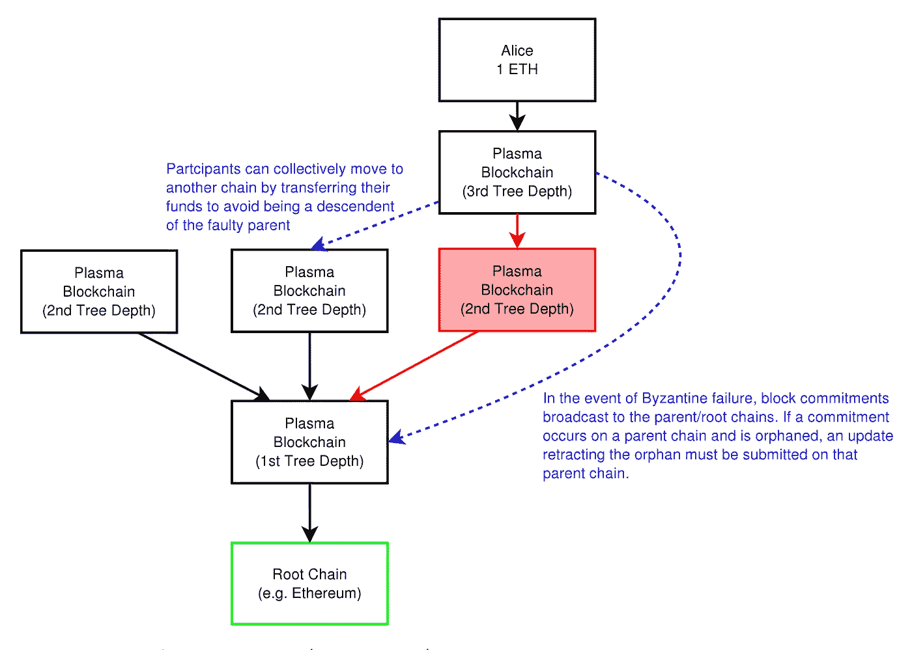

Source: Plasma Whitepaper

Plasma 可能看起来类似于处理离线事务的状态通道实现(例如 Lightning Network)。状态通道和等离子体的主要区别在于，使用等离子体，不是所有的参与者都需要在线更新状态。此外，参与者不需要为了参与和确认交易而向根区块链提交数据。

关于 Plasma 的巧妙之处在于，像 Lightning Network 这样的状态通道类型解决方案可以是基于 Plasma 的快速金融支付/合同的主要接口层，而 Plasma 通过最少的根链状态承诺来维护状态更新。

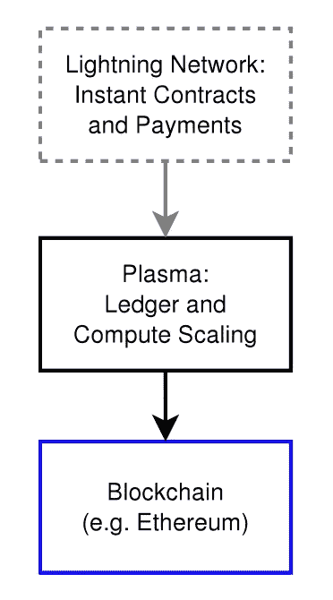

Source: Plasma Whitepaper

这个解决方案有很多复杂的细节，我希望在以后的文章中深入探讨。

# 建议的解决方案#6:链外计算(例如 TrueBit)

TrueBit 是一个使用链外计算实现以太坊智能合约间可扩展交易的解决方案的例子。本质上，就像国家频道一样，TrueBit 使用区块链之外的一层来完成繁重的工作。换句话说，这是一个可验证地离线执行计算的系统，否则在链上执行会非常昂贵。它是这样工作的:

不是每个节点都参与，而是网络中的特定参与者，称为“解算者”，执行智能合同进行的计算，并提交问题的解决方案以及押金。如果求解者是正确的，那么求解者被奖励并且押金被返还。否则，如果求解者作弊，保证金将被没收，任何争议将通过“验证游戏”在区块链上解决。

验证游戏是这样的:网络中有一组被称为“验证者”的参与者，他们在区块链检查解算者的工作。如果没有验证者发出错误信号，则系统接受该解决方案。如果验证者对解算者的解的正确性有争议，游戏将进行一系列的回合来解决区块链上的争议，在这里，计算能力有限的网络中的“法官”裁决所有争议。建立这一制度是为了确保区块链上的法官所做的工作与在区块链外执行实际任务所需的工作相比是很少的。

在这个游戏结束时，如果解算者事实上作弊，它将被发现并受到惩罚。如果没有，那么挑战者将为虚警消耗的资源买单。

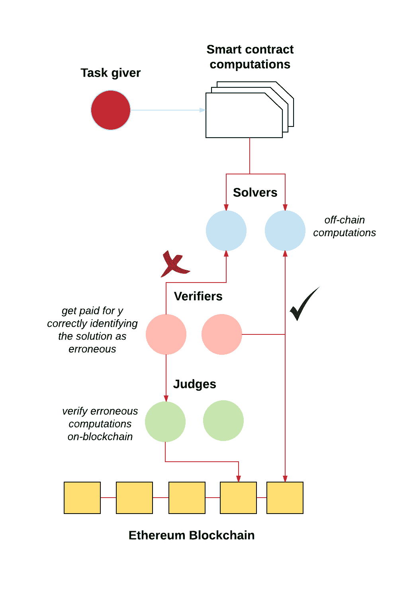

A very rough diagram of off-chain computations as proposed by TrueBit

最后，为了让验证者相信错误确实存在，并且值得他们努力去寻找这些错误，TrueBit 做了一些有趣的事情，它偶尔会迫使求解者提交不正确的解决方案，这与正常的系统激励相反:求解者因提交不正确的解决方案而获得报酬，因提交正确的解决方案而受到惩罚。这确保了系统中总是有对验证交易的验证者的奖励。

总之，该协议允许任何人发布一个计算任务，并且任何其他人都可以因为完成它而获得奖励，同时系统的激励结构保证了返回的解决方案的正确性。通过将计算和验证过程从以太坊区块链转移到一个单独的协议中，它可以扩展到大量的计算，而不受以太坊气体限制的约束。

# 区块链可伸缩性的其他建议解决方案。

我发现在加密社区中还有一些其他有趣的提议。虽然这些解决方案并不直接致力于解决可伸缩性问题，但它们有助于更容易地间接解决一些可伸缩性问题。

## 利害关系证明

与[的工作证明](https://en.bitcoin.it/wiki/Proof_of_work)类似，利益证明是一种共识机制，通过防止[的重复支出](https://en.bitcoin.it/wiki/Double-spending)来巩固区块链的安全。

在传统的基于[工作证明](https://en.bitcoin.it/wiki/Proof_of_work)的区块链中，矿工通过比赛解决计算密集型、工作证明数学难题来保持区块链数据的完整性，以换取奖励。在这方面，它们用 CPU 能力帮助验证事务，CPU 能力越强，影响网络的能力就越大。**在利益相关证明中，利益相关者用他们的“钱”(在以太坊的例子中是以太)而不是计算能力投票。**

这到底是怎么回事？

区块链跟踪被称为“验证者”的某些验证节点，为了参与验证块，这些节点必须存放安全押金(被称为“绑定”)。如果一个验证者以一种加密可证明的方式产生了任何协议认为“无效”的东西，他们的存款和参与共识过程的特权就被放弃了。如果他们下注正确，他们就可以赚回他们的存款和交易费。

实际上，验证者通过押注最终的共识来赚钱，通过押注相反的共识来赔钱。类似于工作证明，每个矿工用他们的散列能力打赌哪个块将被接受。如果他们为了欺骗系统而下注错误，那么他们产生的任何块都将成为孤儿，导致他们赔钱。

有几种不同类型的利害关系共识算法，以及不同的向验证者分配奖励的机制，我不会在这篇文章中深入讨论。

**证据对可扩展性有什么帮助？**

一个例子是分片。带工作证明的分片很难做到安全。回想一下，使用分片，我们将验证责任划分给许多节点，这样每个节点就不必处理所有的事情。然而，工作证明的实现是完全匿名的，这带来了一个问题，因为即使一个单独的碎片仅由一小部分挖掘者的 hashpower 保护，攻击者也可以将他们所有的 hashpower 用于攻击这个碎片并破坏网络。例如，假设我们有两个碎片，A 和 B。A 拥有 90%的 hashpower，B 拥有 10%。a 可以只用总 hashpower 的 5.1%攻击 B(凭借[多数 51%攻击](https://en.bitcoin.it/wiki/Majority_attack))。

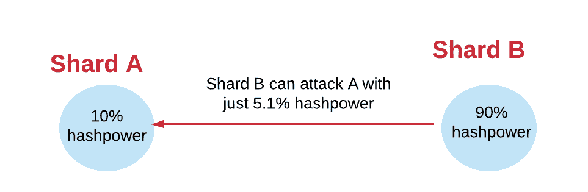

这随着以太坊当前的利害关系证明提议而改变，因为它被设计成验证者具有已知的身份(即以太坊地址)。知道了它们的身份，我们就可以通过从整个验证器集中随机选择一组节点来处理一个碎片上的任何给定的事务集，从而解决这种类型的有针对性的攻击，这使得攻击者无法专门针对任何特定的碎片。

利害关系证明有助于可伸缩性的另一个原因是，与为验证块的矿工发放新令牌的工作证明不同，在利害关系证明中，验证者可能只赚取交易费。因此，如果他们的验证服务器能够处理负载，他们就有增加块“气体限制”的动机(因为这为他们赚取了更多的费用，同时也在每个块中容纳了更多的事务)。需要注意的是，验证器只会将 gas 限制提高到其他验证器可以容忍的程度，因为否则它们会因为导致其他更慢的验证器不同步而减少回报。

## 区块链租金

另一个以太坊特有的解决方案是“区块链租金”[5]。区块链租赁是一种解决方案，旨在减少存储在网络上的数据量，以帮助加快交易时间。使用以太坊，用户为计算步骤、内存、事务日志和永久存储付费。虽然这些资源中的大部分是以适当的激励方式支付的，但这里的说法是存储不是。

在目前的系统中，用户只为字节的存储付费。然而，在现实中，我们可以认为存储不同于其他资源，因为它是永久存储在块中的。相反，区块链出租公司建议将存储成本设置为*`字节 x 时间`*。这样，协议中就有了一个激励机制来保持网络的轻量级并减少交易时间。

## 分散存储

保持网络轻量级的另一个解决方案是使用分散存储服务，如 [Swarm](http://swarm-guide.readthedocs.io/en/latest/introduction.html) 。Swarm 是以太坊的一个点对点文件共享协议，允许你将应用程序代码和数据从主区块链存储到 swarm 节点，这些节点连接到以太坊区块链，然后在区块链上交换这些数据。**这里的基本前提是，节点不是在区块链上存储一切，而是只存储本地更频繁请求的数据，并通过 Swarm 将其他数据留在“云”上。**

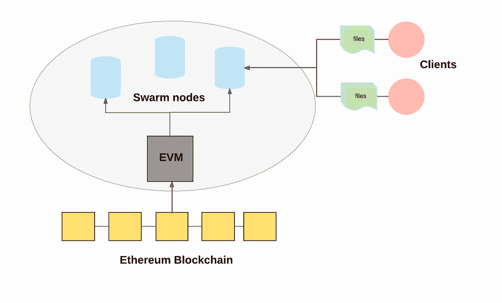

A very rough diagram of decentralized storage using Swarm

还有更多，但为了简洁起见(这篇帖子越来越长了！)，我暂时不考虑这些:)

# 结论

这个话题非常复杂，但是我希望这篇文章能让你对可伸缩性在区块链的重要性有一个大致的了解，以及如何解决这个问题。

这绝不是一个全面的列表，随着研究的进展，我将继续关注这个主题。我个人怀疑是否会有一个解决可伸缩性的灵丹妙药…但我相信一些方法的组合将最终解决这个问题，并允许区块链应用程序向前飞跃。

一如既往，不要犹豫，纠正我犯的任何错误，或者在评论中开始一场(健康的)讨论。

**区块链快乐！；)**

参考资料:

【1】[http://www.r3cev.com/blog/2016/6/2/ethereum-platform-review](http://www.r3cev.com/blog/2016/6/2/ethereum-platform-review)

【2】[https://etherscan.io/chart/gaslimit](https://etherscan.io/chart/gaslimit)

【3】[http://ethgasstation.info/](http://ethgasstation.info/)

【4】[https://etherscan.io/chart/tx](https://etherscan.io/chart/tx)

【5】[https://github.com/ethereum/EIPs/issues/35](https://github.com/ethereum/EIPs/issues/35)

[6][https://docs . Google . com/presentation/d/1 CJD 0 w4 l 4-cwhkuff5 vlps 76 fklec 6 piwu 1 a _ kC _ YRQ/edit # slide = id . GD 284 b 9333 _ 0 _ 6](https://docs.google.com/presentation/d/1CjD0W4l4-CwHKUvfF5Vlps76fKLEC6pIwu1a_kC_YRQ/edit#slide=id.gd284b9333_0_6)