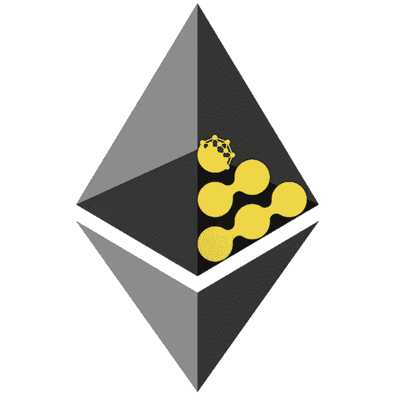
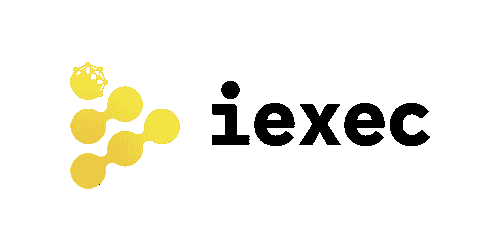
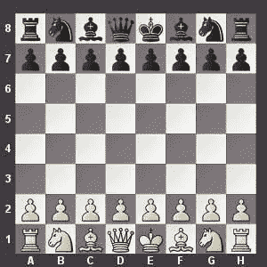
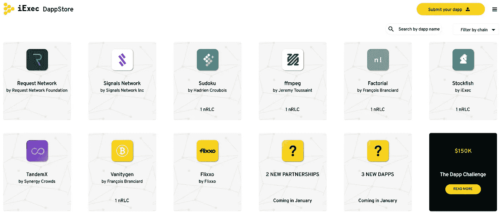
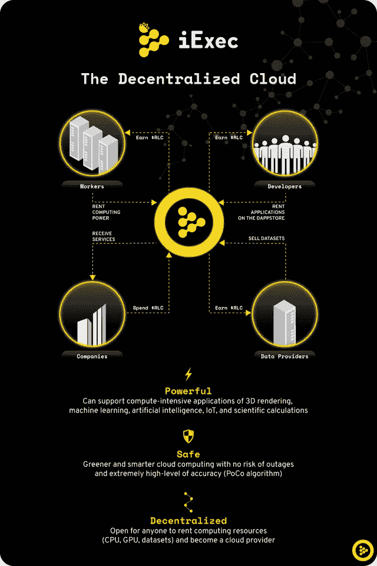

# 区块链需要 iExec:市场还没有意识到这一点

> 原文：<https://medium.com/hackernoon/blockchains-need-iexec-the-market-just-hasnt-realized-it-yet-5597c743cd0a>

## 以太坊需要一个链外计算解决方案:iExec 非常适合提供这种解决方案

由 [Alex Price](https://www.linkedin.com/in/alex-price-b2896aa7/) 、 [Qu Capital](http://qu.capital/) 创始合伙人共同撰写

**去中心化云计算。我不确定还有比这更不性感的流行语组合。但是这三个字应该会让你兴奋——非常兴奋。如果分散云计算让你兴奋，那么 iExec 应该让你欣喜若狂。**

## **集中式云计算**

要理解 iExec 的重要性，我们需要了解该行业的现状。云为公司提供了处理能力、存储和应用，而不需要昂贵的设备，更重要的是，没有修复和优化硬件的困难。

集中式云计算是一个价值数十亿美元的产业，截至 2016 年价值 2060 亿美元，据估计，到 2020 年将突破 4000 亿美元。这显然是一个高需求的产品。而且也不难理解为什么。云服务取代了公司的海量位置数据和处理中心。它们允许公司放弃昂贵的硬件投资，专注于业务运营。为了避免为大型 IT 部门、管理硬件维护和物理空间付费，公司将处理、存储和带宽需求外包给云公司。简单易行。有了云计算，公司也只需要为他们使用的东西付费，这意味着没有多余的支出。今天的网飞完全由亚马逊提供的云计算驱动。

世界上一些最大的公司提供云计算服务。亚马逊网络服务(AWS)、微软 Azure、谷歌云平台、IBM Cloud 和阿里云等公司每年的收入高达数千亿美元。这些公司在世界各地都有巨大的数据中心，每个数据中心都有 50，000 到 80，000 台服务器。

对这些服务的需求每年都呈指数级增长。

**TLDR:公司可以从云公司租赁计算服务和存储空间，而不是购买和维护大型内部服务器。**

## **那么去中心化的云计算呢？**

去中心化云计算最简单的形式就是做 AWS 和 Google 正在做的事情，但是是以去中心化的方式。计算来自网络上的个人计算机，而不是大规模的中央数据和硬件中心。当你的电脑关闭，你得到一些急需的睡眠，你帮助[请求网络](https://hackernoon.com/request-network-is-more-than-just-paypal-2-0-it-could-revolutionize-the-finance-world-87b54bb455)智能审计你的岳父。

一些公司如 [Sia](https://sia.tech/) 和 [Filecoin](https://filecoin.io/) 正在提供分散存储解决方案。有了这些，你可以把你的储物空间出租给其他人。但是 iExec 正在开发的是*云计算*解决方案。这意味着公司可以从分散的网络中租用闲置的计算能力(而不是存储空间)。现在，你，精明的投资者和批判性思想家，可能会问:iExec 如何与谷歌、亚马逊和微软竞争？一家区块链的初创公司如何与实际拥有我们数字身份的数十亿美元的公司竞争？他们如何能提供比这些全球超级大国更廉价、更有效的解决方案？答案是:目前，iExec 还不能。但它不需要竞争。iExec 可以成为区块链的自动气象站。

**TLDR:区块链实现去中心化云计算。这使得拥有额外计算能力的用户(我们大多数人)可以将计算能力出租给需要的人。**

# iExec

iExec 是一个运行在以太网上的分散式应用程序(dApp)。它不仅为个人，也为区块链的 dApps 们提供了去中心化的计算能力。除了我的研究，我还采访了 iExec 团队的区块链业务开发人员 [Wassim Bendella](https://medium.com/u/40a563321224?source=post_page-----5597c743cd0a--------------------------------) 。具体来说，我在寻找一些技术上的澄清，并确认我的理解实际上是正确的。

## 问题是

以太坊通过以智能合约的形式提供可编程的信任，正在彻底改变互联网。这些智能合同充当不可信的中间人，确保各方保持诚实，没有律师和合同的额外成本和延迟。以太坊拥有 800 多个分散式应用程序，为新的价值互联网提供了一个安全、分散、不可信的开发平台。这些新的 dApps 利用以太坊来满足他们的智能合同和区块链需求，在区块链上存储合同的条款和状态。以太坊的虚拟机负责智能合约的执行。本质上，通俗地说，虚拟机就是执行智能合约的机器，运行在矿工或其他验证者的电脑内部。**虚拟机是智能合约在**中运行的环境。以太坊的虚拟机非常适合简单的交易和业务逻辑——比如管理关于信息创建和存储的规则。尽管以太坊是图灵完全的，并且理论上能够在给定*无限*时间的情况下完成任何计算壮举，但虚拟机在高效且合理的成本下执行严格的计算时会很吃力。

Good luck with that car chase…

以太坊不是为此而生的。在以太坊上运行密集计算就像试图在苹果 1987 年的 Macintosh II 上运行侠盗猎车手 5 一样。

今天，这不是一个真正的问题，因为大多数 dApps 没有一个工作产品。dApps 只利用以太坊进行 ICO 销售和简单的代币交易——以太坊非常适合这种情况。**但是一旦所有这些 dApps 开始发布实际的产品，有实际的计算需求，以太坊不仅而不是能够跟上，而且它会变得*贵得惊人*。**由于以太坊向以太(气体)收费来运行网络，密集的计算将会耗费一大笔财富*。想象一下，当以太坊的计算需求增加 10 倍，或者 100 倍:网络将*无法使用。**

*LDR:以太坊对于像交易这样的简单计算过程来说是很棒的。但是以太坊上的 dApps 们需要做得更多。他们需要比以太坊虚拟机所能提供的更多的能量。*

## *解决方案*

*这个问题的解决方案是*非链计算*。dApps 需要能够离线(意味着不在以太坊区块链上)进行繁重的计算，然后将信息和结果带回以太坊区块链进行验证。iExec 正好可以做到这一点。dApps 可以使用 iExec 的分散式云计算服务，安全、简单、廉价地执行他们的计算*远离低效和无能的以太坊虚拟机*。*

**

*Maybe the AI could finally beat my dad for me…*

*证明这种关系的一个有趣的用例是由 [Stockfish](https://stockfishchess.org/download/) 开发的 AI chessbot。实际的棋步是简单的信息记录——从骑士到 C6——以太坊虚拟机很容易完成。但是人工智能决定向哪里移动是异常复杂的。机器人需要处理的信息量是巨大的——策略、移动组合、对手移动的预测等。—这对于虚拟机来说是不可能的。于是 iExec 为 AI 离链提供计算能力，然后将移动结果传回它们停留的以太坊区块链，不可改变且安全；这一切发生得*很快:*正好在一个以太坊街区的时间内。*

*用例是无穷无尽的。 [Flixxo](https://www.flixxo.com/) 是一个 dApp，它把自己想象成去中心化的 YouTube。由于区块链上所有视频的编码和解码，它需要巨大的计算机能力。“iExec 将允许平台通过提供云资源来做到这一点，”Bendella 说。*

*[请求](https://hackernoon.com/request-network-is-more-than-just-paypal-2-0-it-could-revolutionize-the-finance-world-87b54bb455)是另一个合作伙伴。请求提供财务记录自动审计的计划。这也是一个极其密集的计算过程。iExec 再次为这种计算提供了离线解决方案——审计结果可以很容易地传输到以太坊区块链。*

*区块链经济将需要像 iExec 这样的服务。2018 年，随着 dApps 开始发布他们的平台，以太坊对于所有这些计算将变得越来越明显。**随着人工智能、智能城市、虚拟现实和物联网都利用先进的智能合同，将需要一种链外计算解决方案。iExec 是解决方案。***

*我也不想误导。用户和企业也可以将 iExec 服务用于他们自己的项目和用途。你的梦幻足球算法需要更多的动力吗？iExec 可以做到。想玩 4k 设置的 Fifa？iExec 是你的工具。*

*TLDR: iExec 在远离区块链的地方处理计算，然后将结果传回区块链。dApps 可以使用它来执行复杂的计算，如渲染、上传以及人工智能、物联网和虚拟现实的所有要求，而不会降低以太坊网络的速度。*

# *iExec 实际上将如何工作？*

*iExec 没有创造其基础技术，它只是发明了一种将该技术与区块链相结合的方法。iExec 使用 **XtremWeb-HEP，**一种为云计算开发的高级软件。该软件是一项经过同行评审的开源技术，是在 iExec 团队从事云计算研究期间在他们的帮助下开发的。该技术本质上有助于解决与此类服务相关的许多问题，包括:容错、支持多应用程序、多用户和混合公共/私有基础架构，以及确保安全性和责任性。**这只是一个很长的说法:它为这样一个项目的所有考虑提供了解决方案。***

*iExec 已经有了一个工作平台。他们的*软件开发包* (SDK)是他们在 11 月初发布的 V1 的一部分。SDK 允许 dApps 利用 iExec 的计算能力。这意味着今天，dApps 已经可以使用 iExec 执行链外计算。*

# *三和弦*

*通过构建 XtremWeb-HEP 技术，iExec 已经构建了云计算的三驾马车，这是它的三驾马车。*

*iExec 分为三个不同的平台，它们相互作用，将分散计算带给个人和 dApps。*

## *[dApp 商店](https://dapps.iex.ec/)*

***12 月 20 日发布的 dApp store。****dApp store 相当于苹果的 App Store，里面展示了所有使用 iExec 服务的 dApp。然后，用户可以与所有这些应用程序进行交互，并使用 iExec 的本地令牌 RLC 进行支付。正如 Bendella 所说，“[dApp 商店]让我们能够连接由我们驱动的整个 dApp 生态系统。用户可以浏览 dApps，使用它们，并为它们付费。应用提供商可以列出他们的 dApps，如果他们决定货币化，就可以赚钱。”***

***目前，dApp 商店只是一个用户可以查看基于 iExec 构建的 dApp 的界面。然而，他们计划很快将其扩展到简单的化妆品之外。这将允许用户实际上与商店的 dApps 互动。***

******

***The iExec dApp store***

*****TLDR:dApp 商店提供了一个有组织的可视化平台，用户可以使用 iExec 服务查看 dApp 并与之互动。*****

## *****市场*****

***marketplace 是 iExec 平台的支柱，将于 2018 年在 Q1 的下一次更新中发布。市场本质上支持计算资源的买卖。用户——你和我——可以在市场上出售我们多余的计算能力。dApps 可以购买和使用这些资源。现在，即使推出了 SDK，dApps 也只是利用由 iExec 维护的服务器提供的计算资源。这种集中化是 iExec 的短期限制，因为计算能力目前是有限的。然而，一旦市场开始运作，它将真正去中心化，因为许多用户将共同为应用程序提供必要的资源。***

***这种去中心化将使成本更低，规模更大。市场是基于自由市场经济。出售闲置计算机能力的用户越多，竞争就越激烈，因此费用就越便宜。iExec 只受限于出售这些资源的用户数量。只要市场上出售资源的人越来越多，就 iExec 的可扩展性而言，天空就是极限。***

> ***“现在，”本德拉说，“iExec 免费提供计算能力。2018 年 5 月，计算提供商将能够在我们的市场上对他们自己的资源进行货币化。”***

***该市场还将推出一个评价用户可靠性的信誉系统。有了这个，智能合同将能够为他们的计算需求指定价格、速度和信誉要求。iExec 有一个复杂的匹配系统来实现这项服务。例如，我可能愿意牺牲声誉和速度来换取更便宜的计算价格。其他用户可能愿意支付更多费用来换取更快、更可靠的计算。所有这一切都有可能与 iExec 市场。***

***用户在 RLC 付费，但 iExec 网络不收任何费用。这使得市场能够为个人、公司和应用程序等提供更安全、更便宜、更可靠的云计算解决方案，尤其是在技术不断发展的情况下。***

***iExec 还可以为大型矿池和数据中心提供在市场上租赁其计算能力的方法。在这些池中有大量可用的计算能力。***

*****TLDR: iExec 将会有一个市场，用户可以把他们多余的计算资源卖给那些需要更多资源的人。*****

## ***数据市场***

***在我们的大数据世界中，公司拥有海量数据，却不知道如何利用这些数据。这些数据可以是任何东西，从股票市场或医疗数据到大量的消费者数据。有大量的应用程序和服务可以利用这些数据，并愿意为此付费。这个数据市场实现了这种匹配。拥有多余数据的公司可以将这些数据出售给任何想要购买的应用程序。所有交易都在 RLC 支付。一个公司合法积累的任何数据都可以出售。***

> ***“如今，在大数据世界中，我们有大量数据集等待转化为价值。脸书和谷歌做得很好，但我认为任何人都可以做到这一点。因此，我们正在建立一个市场，将那些拥有数据的人与那些没有数据但希望利用数据的人联系起来。在 iExec 上运行的应用程序将能够利用海量数据。”—瓦西姆·本德拉***

***重要的是要认识到，这项服务是一种方式。dApp 商店即将推出，2018 年初，市场将投入运营。然而，数据市场不会在近期[发布](https://hackernoon.com/tagged/future)。***

*****TLDR: iExec 将有一个市场，拥有大量合法获取的数据的公司可以将这些数据出售给可以利用这些数据的企业和应用程序。*****

## ***把这一切联系在一起***

******

***想象一下，我有一个梦幻足球应用程序——*OneMoreInch*——它为梦幻足球用户提供高级预测，并为单挑比赛记分。该应用程序的预测算法使用 iExec marketplace 来查找出售其计算能力的用户。复杂的算法是密集的，并且需要巨大的计算能力输入。有了 iExec 提供的额外动力， *OneMoreInch* 就可以流畅地运行算法。此外，随着未来数据市场的创建， *OneMoreInch* 可以聚合玩家和幻想数据来有效地计算预测。所有的分数和结果都被传送到以太坊区块链。***

***如果用户想使用 *OneMoreInch，*他们所要做的就是去 RLC 的 dApp 商店付款，与服务互动。***

******

***An overview of the iExec triad***

## *****出资证明*****

***分散云计算的主要挑战之一是如何证明谁提供了什么计算能力，并相应地补偿他们。iExec 设计了一个名为 Proof of Contribution 的系统，该系统对资源进行认证，并将它们贷记给外部提供者。这一记录保持在区块链上。虽然还没有提供确切的细节，但这将有望提供一个值得信赖的系统，能够就谁在 iExec 交易中提供了什么达成准确的共识。***

## *****区块链不可知*****

***虽然 iExec 目前构建在以太坊之上，并且我描述的所有用例都围绕以太坊，但是 iExec 超越了这个特定的区块链。iExec 可以适应任何其他区块链——NEO、EOS、Cardano——并提供相同的离线计算服务。“我们现在专注于以太坊，但我们可以将我们的技术转移到几乎任何其他区块链，以满足一些特定的需求，”本德拉说。***

# *****细节*****

*****iExec 令牌:RLC*****

***所有网络费用都在 RLC 支付。因为令牌有最大供应量，所以随着对网络需求的增加，令牌的价格也会增加。随着越来越多的 dApps 开始使用 iExec 并与 RLC 进行交易，价格将会上涨。***

*****总供应量:**8700 万代币***

***7900 万美元***

*****令牌分发:*****

***69%在 ICO 中发布***

***团队和顾问持有 17.2%***

***6.9%作为紧急应急基金***

***iExec 持有 6.9%股份，用于网络激励和发展***

## ***管理***

***目前，只有授权的智能合同才能在 iExec 区块链上部署。这意味着必须有一个同行审查过程，以确保所有智能合同是合法和值得信赖的。关于这一过程的细节还没有公布。***

## *****路线图**和即将到来的发展***

***V1 如期发布 iExec，将他们的分散计算解决方案带到 dApps。令人印象深刻的是，iExec 能够按时交付他们的 V1。这让我对他们的团队和项目更有信心。由于使用新技术开发的所有困难和不可预见的障碍，这一领域的许多项目都无法遵守它们的时间表。***

***他们的 dApp 商店明天发布。他们的 V2——去中心化市场——将于 2018 年 5 月发布。这将使用户能够向他人出售他们的计算资源。***

# ***团队***

***该团队是 iExec 最令人兴奋的方面之一。我喜欢投资团队。最终，对于项目来说，无论他们的营销多么华丽，或者他们的白皮书多么令人印象深刻，都是团队在开发项目。在这个行业中生产一个工作产品的挑战是巨大的；至关重要的是，该项目有一个能够有效应对这些挑战的强大组织。***

***iExec 的团队就是我要找的那种。iExec 项目的两位创始人吉勒·费达克和吴海·何都是云计算行业的实权人物。**费达克在致力于数字科学技术的公共研究机构**[**【INRIA】**](https://www.inria.fr/en/)**拥有 14 年的云计算研究经验。**他拥有哲学博士学位和计算机科学硕士学位，在许多技术开发中发挥了重要作用，并与人合著了约 80 篇同行评审的科学论文，并获得了两项最佳论文奖。***

***吴海:他有着同样令人印象深刻的工作经历。他是中国科学院 CNIC(计算机网络信息中心)的教授和中国教育部的学者。他还在法国 INRIA 担任研究员，发表了大约 30 篇科学论文。他拥有计算机博士学位。***

***他们一起帮助创立了桌面网格基金会，这是一个集合了云计算领域专家的组织。***

***了解他们的关键是他们是这个领域的博士专家。他们了解这个项目所需的行业、需求和大量考虑因素。它们被出版，被认可，并且很受尊重。他们是 20 多年来致力于分布式网格计算研究的领导者。我希望这些人来管理这家公司。***

***然而，他们不是营销人员，这是显而易见的。他们的目标不是为他们的产品做广告，他们缺乏营销已经损害了 RLC 的估值。他们的白皮书很枯燥，而且他们没有强大的社交网络。然而，他们的产品展示了他们将云计算引入区块链的能力。***

***此外，我预计他们的媒体曝光率和营销能力将大幅提高。他们的营销团队两个月前才组建起来，现在已经显示出了希望；他们发布了一个远优于之前的网站重新设计。iExec 团队还将在 1 月上半月发布经过修订和更新的白皮书。***

*****TLDR: iExec 的团队拥有多年的行业和研究经验，已经发表了 110 多篇学术文章，并帮助建立了一个云计算研究组织。*****

# *****比赛*****

******

## ***[假人](https://www.google.co.il/search?rlz=1C5CHFA_enUS766US766&ei=PTE5Wv2lJcSVkwWH55LwBQ&q=golem+crypto&oq=Golem+c&gs_l=psy-ab.1.1.0i67k1l3j0l7.1542.2526.0.3541.4.3.1.0.0.0.385.659.0j2j0j1.3.0....0...1c.1.64.psy-ab..0.4.660...0i20i263k1.0.d5khqn6gcJ8)***

***假人类似于 iExec。然而，他们目前将营销重点放在一个特定的用例上:数字渲染。数字渲染图像和动画是一个非常 GPU 密集型的过程。假人的目标是使用分散计算来实现极快的数字渲染。最终，假人最初试图吸引 3D 艺术家、动画师和设计师，而 iExec 正在为用户和 dApps 创建一个云市场。他们甚至有可能合作。虽然他们有一天可能会竞争，但我认为对假人来说，他们在营销方面的选择意义重大。iExec 的主要价值在于为区块链提供离线计算，这是一个不同于假人的目标。假人在这个用例中具有先发优势，而 iExec 在为 dApps 提供分散计算解决方案方面具有优势。我不认为他们这次会有竞争。***

******

## ***[SONM](https://www.google.co.il/search?q=SONM&rlz=1C5CHFA_enUS766US766&oq=SONM&aqs=chrome..69i57j0j69i61j0l3.632j0j4&sourceid=chrome&ie=UTF-8)***

***SONM 也在致力于实现一种分散的超级计算机。然而，我对 SONM 的交付能力没有多少信心。他们试图提供分散的雾和边缘计算(它们的定义超出了本文的范围)。雾和边缘都非常复杂，对于初始阶段的开发是不现实的。iExec 和假人都计划扩展到这一领域，但他们认识到这种复杂性需要一个坚实的基础和已经可以工作的平台。任何强大的工程方法都应该关注缓慢的重复开发:首先仔细构建每个基础模块，以实现最终目标。SONM 从一开始就接近迷雾和边缘计算的事实对他们来说不是好兆头。***

## ***[Siacoin](https://sia.tech/) 、 [Filecoin](https://filecoin.io/) 等分散式云存储公司***

***虽然 iExec 可能会在未来尝试提供分散的云存储解决方案(实质上是从网络上的用户那里出租计算机存储空间)，但他们目前并没有这样做。iExec 只处理分散计算。因此，他们不会与这些应用程序竞争。***

## ***[TrueBit](https://truebit.io/)***

***TrueBit 被故意排除在外。虽然他们可能有一天会与 iExec 竞争，但这可能需要一年多的时间。随着这个行业的迅速发展，一年就像一个千年；到那时，将会有一系列全新的要求和考虑。我只关注他们现在和不久的将来的竞争。***

***TLDR:iExec 没有真正的竞争。假人正从一个不同的方向着手去中心化的云计算，我对 SONM 持严重的保留意见。***

# ***iExec 有一天会和亚马逊竞争吗？***

***我提到过，我不认为 iExec 需要与亚马逊、谷歌或任何云计算巨头直接竞争。一开始，由于他们目前的集中化和他们市场的可能缓慢采用，iExec 不会比 AWS 或 Google 更便宜或更强大。然而，iExec 的分散模式提供了可能超过任何主要参与者的潜力。如果 iExec 可以促进云服务的自由市场，从长远来看，它的低成本和高可扩展性甚至是亚马逊无法比拟的。像 iExec 这样的分散市场所能达到的规模确实是有限的。***

# ***摘要***

***如果我希望这篇文章强调 iExec 的一个方面，那就是:**以太坊不能支持它的许多 dApps 将需要的那种计算需求**。随着越来越多的 dApps 发布他们的工作平台和产品，这个问题将会成倍增加。区块链需要一个解决方案，让他们能够离线计算，只带来链上的结果。iExec 是解决方案。没有人在做 iExec 正在做的事情。不是假人，不是 SONM。对非链计算的极端需求将很快出现:iExec 将很好地为其服务。***

***坐在接近 8000 万美元的市值告诉我，与他们的同行相比，他们被严重低估:SONM 和假人。以下是我认为 iExec 的估值应该更高的理由。他们有:***

1.  ***一个令人印象深刻的团队，拥有多年的行业经验和研究。***
2.  ***一个工作产品(他们的*软件开发包)*如期交付，一个即将发布的 dApp 商店。***
3.  ***强烈的需求和缺乏竞争——没有其他人能为区块链提供离线计算解决方案。***
4.  ***已经使用他们服务的 dApps。***

***在我看来，它被严重低估的原因是人们真的不了解 iExec 的功能和潜力。老实说，我花了很长时间才明白为什么分散式云计算对区块链至关重要。不直观，当然也不华而不实。此外，他们缺乏强有力的营销，这也是 iExec 市值 8000 万美元的重要原因。我认为 iExec 的即时估值接近假人的估值(4.8 亿美元市值)，相当于 600%的涨幅。老实说，我认为这是保守的。***

*****理解 iExec 不需要*T2 来与亚马逊和谷歌***竞争也很重要；虽然 iExec 的分散模式将提供更好的安全性和能效，但它可能无法与这些全球超级大国的成本效率相竞争。但是 iExec 的目的不是竞争。这些大规模、集中化的云公司无法服务于新的互联网。分散的应用程序不能有集中的计算解决方案— *这违背了分散的全部目的*。iExec 提供了亚马逊和谷歌无法提供的东西。***

***当人们认识到 iExec 是区块链非链计算的未来时，我相信 iExec 最终会得到应有的认可。***

***非常感谢 Wassim Bendella 的评论。感谢 Nir Kabessa 的编辑。***

***在 Twitter 上关注我:@ noamlevenson***

***免责声明:Alex 和我都在 RLC 投资。这不是投资建议，仅仅是我们对项目的意见。自己做研究。我们没有收到 iExec 团队的付款，这绝不是赞助内容。***

***你可以从 Bittrex.com 买到 RLC***

***非常感谢捐赠和支持***

***NEO:agpjyu 9 fy 58 tgd hhbxgtxaosxh 5 uumvp***

***ETH:0x4c 35100 a0a 25 b 3933 ba 1c 0469 b 5 df 8 b 24035775 b***

***BTC:1 dmri 6j 1 EPQ 7mg 1 thcwvpqaflajesxe 1 hx***

****如果你喜欢该内容，请按住鼓掌按钮！它帮助我获得曝光率。****

******鼓掌 50 次！******

***我喜欢收到问题或建议，所以请留言吧！***