# 区块链的规模达到了数十亿

> 原文：<https://medium.com/hackernoon/blockchainsthatscaleintothebillions-9ec24689507b>

从比特币退一步说。别担心，不会太久的。

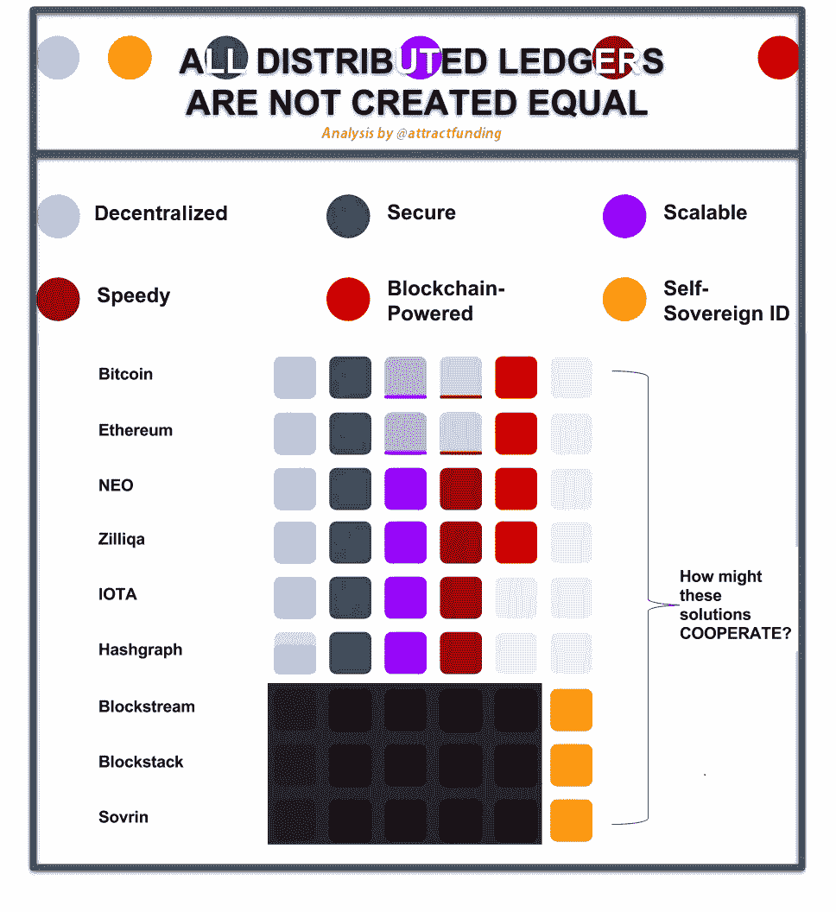 [## 扩大办公室恋情

### “运动中的物体会抵制方向的改变。所以世界反对一个新的想法。”—尼古拉·特斯拉

hackernoon.com](https://hackernoon.com/scaling-the-office-romance-6c739cd562b1) 

# 投资者:暂时远离比特币

# 事实上，退一步讲，区块链也是如此。我也是，达格。同上同上，圆周率演算和 Petri 网。

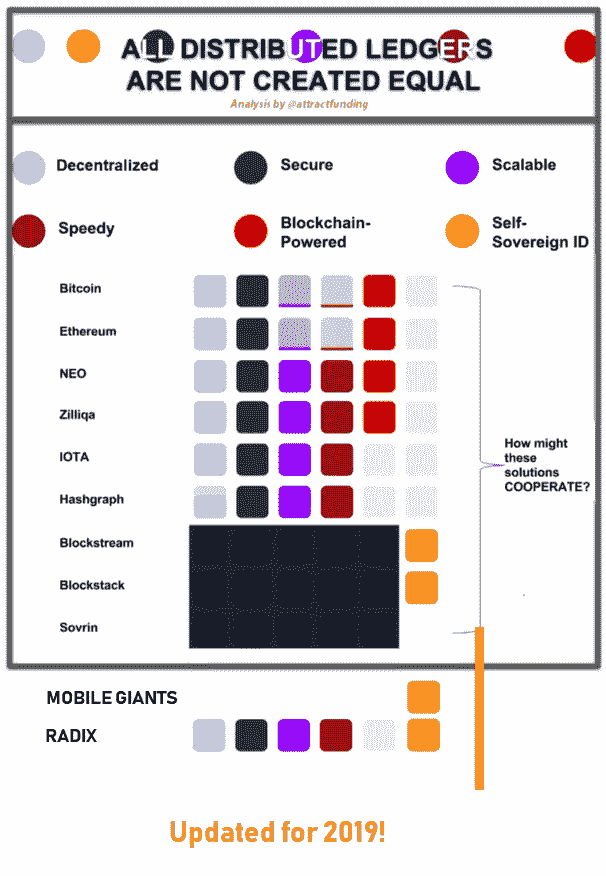

[https://test.radixdlt.com/](https://test.radixdlt.com/)

Updated! June 2019

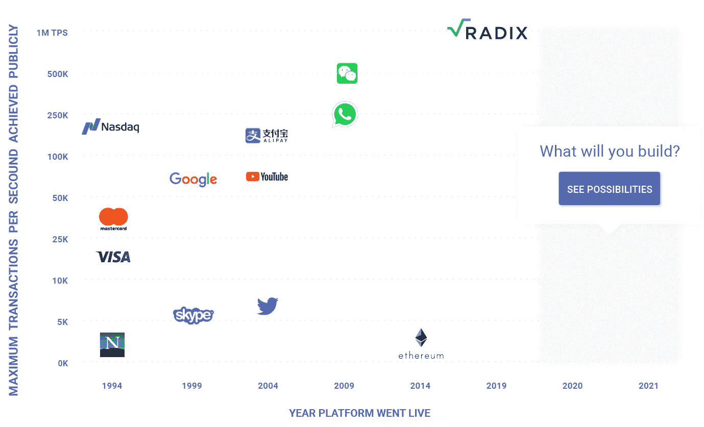

# 目录

发展中国家的困境

**B.** 自给自足的乡村经济的关键障碍

**C.** 构建自给自足的乡村经济

**D.** 并非所有分布式分类帐都是平等创建的

亿万富翁的困境

**F.** 一个区块链/DLT 架构来统治他们所有人

值得开采/投资的区块链/DLTs

**H.** Hashgraph 成为公共 DLT？

**一、**成为价值互联网专家(视频)

# A.发展中国家的困境

如果野牛篡夺了你的土地所有权，你怎么能自信地创造财富呢？当拜辛推动的恶性通货膨胀导致 100 万亿美元纸币的产生时，你的钱值多少钱？？

## 自给自足的乡村经济

Credit: Pierre Thiam,

## 自给自足的乡村经济不需要政客来养活村民。

取而代之的是，**价值互联网**又名**物联网经济**又名**自给自足的乡村经济**将授权村民直接彼此交换金钱、太阳能电池、食物，甚至知识产权**而无需**支付昂贵的中间人来处理交易。

 [## 马林推出新型第 0 层扩展解决方案

### Marlin 是一家以区块链为导向的协议背后的初创公司，该协议用于在保护用户的同时扩展分布式分类帐…

www.unlock-bc.com](https://www.unlock-bc.com/news/2018-11-07/marlin-unveils-novel-layer-0-scaling-solution) 

最重要的是，如果爱丽丝和鲍勃能够自己解决食物、衣服和住所问题，他们就不需要依靠政府来获得普遍的基本收入…至少不需要那么多。

也就是说，有一个关键的障碍阻止我们实现这个乌托邦。

# B.自给自足的乡村经济的关键障碍

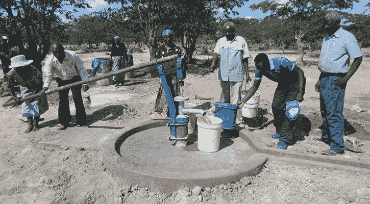

Credit: Maranatha.org

全面运作的自给自足的乡村经济的关键障碍是公共的、无需许可的、快速的、高效的、安全的和自主的身份解决分布式账本，又名 DLT。为什么？

## 一个公开的 DLT 可以完成中间人目前向我们收费的所有记录保存和事实核查工作。

今天，即使我们可以利用所有的技术，全球仍有多达 20 亿人没有银行账户。

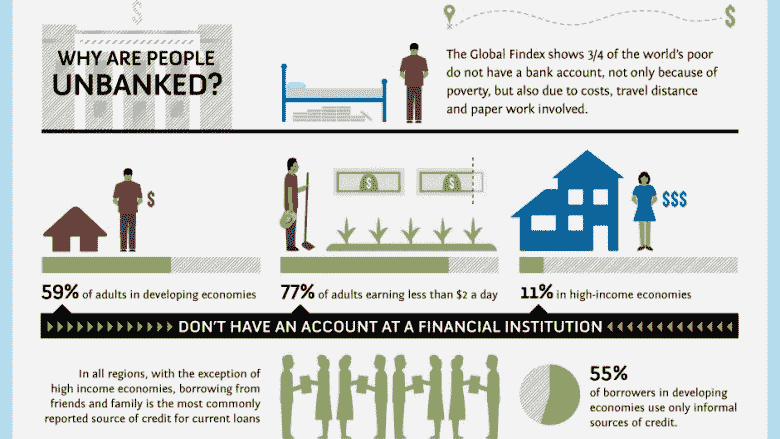

Credit: Asli Demirguc-Kunt and Leora Klapper, Measuring Financial Inclusion

一个公共的 DLT 将使每一个村民/城市居民都能负担得起拥有一个银行账户和获得其他基本金融服务的费用。如果你不能给你的女儿寄 5 美元，你怎么能帮助她呢？如果你连自己土地的所有权都没有，你怎么能帮助你的孙辈呢？这些只是 DLTs 要解决的一些基本问题。

Photo Credit: Asli Demirguc-Kunt and Leora Klapper, Measuring Financial Inclusion

对许多中间人来说，被公开的 DLT 取代的前景代表着一场生存危机。以前从未有一项技术威胁到如此多强大的全球机构的生计。另一方面，那些接受 DLT 的中间人通过重振他们的摇钱树让每个人都感到惊讶。

# 西部联盟表明，防御是最好的进攻(见更新)

一个恰当的例子是，西联汇款过去常常收取 10-20%的跨境汇款费用。当他们看到区块链/DLT 将威胁到他们的核心业务时，他们**测试了一个集成**(更新)与 **DLT 驱动的 Ripple** 。这一积极的举措让他们降低了费用，并以他们做梦也想不到的方式扩大了市场份额。

## **西联汇款悄然为加密时代做准备(更新:2017 年 12 月 13 日)**

> “不幸的是，机会似乎比能力多得多。我们应该记住，当机遇与准备相遇时，好运就会降临。”―托马斯·A·爱迪生

几年前，Western Union 试验了 Ripple 集成，但由于“缺乏采用”而决定终止该项目。

既然领养不成问题，西联汇款就一张接一张地出牌。

(1)他们最近整合了 [**比特币基地**](https://www.coindesk.com/western-union-reveals-pilot-coinbase-integration/) ，**世界上最受欢迎的将美元兑换成加密货币的地方之一。**

[**西联与微信**](https://www.businesswire.com/news/home/20151117005449/en/Western-Union-Offers%C2%A0New-Global-Money-Transfer-Service) 整合。微信是中国的 WhatsApp，拥有高达 9.02 亿的日活跃用户。仅供参考，微信由腾讯所有，腾讯是一家中国企业集团，2017 年创造了 1510 亿美元的收入。

这意味着每个微信用户都可以通过西联汇款互相发送比特币和以太坊等加密货币，无论他们在世界的哪个角落……当然是在时机成熟的时候。

涟漪呢？[涟漪有自己的计划](https://ripple.com/insights/ripple-takes-on-western-union-with-deal-to-grow-payments/)。

# C.构建自给自足的乡村经济

## 一个**强大、功能丰富的 DLT** 的重要性领导 Mance Harmon，[漩涡/散列图](http://www.swirlds.com/)的首席执行官，建议以下**架构**，这将使[价值互联网](https://www.youtube.com/watch?v=YdLwmN-jBTc)又名[物联网经济](https://www.youtube.com/watch?v=UCISttFSoIY)又名自给自足的乡村经济成为可能:

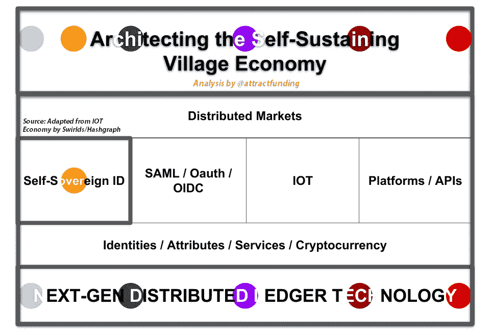

[Michael Jagdeo](https://www.linkedin.com/in/jagdeoholdings/) / [attractfunding](https://twitter.com/attractfunding) on Twitter | Adapted from Harmon’s [IoT Economy](https://www.youtube.com/watch?v=UCISttFSoIY)

区块链像**比特币、NEO 和以太坊**都**启用公共、分布式账本**。

## 现在，**区块链是实现分布式账本的一种方式，** *但是还有其他新兴的方法/技术也可以实现分布式账本* ***:***

> 区块链的真正影响永远是它的灵感。但是第一代算法对于其他应用来说效率不高或者不实用。社区需要的是开始解决这些挑战的真正的研究和开发——而不是将区块链算法武断地塞进每一个宠物问题的解决方案。— Steve Wilson，星座研究副总裁兼首席分析师

## 事实上，当你深入挖掘，你会发现所有的区块链/DLT 并不是生来平等的。

# D.并非所有分布式分类帐都是平等的

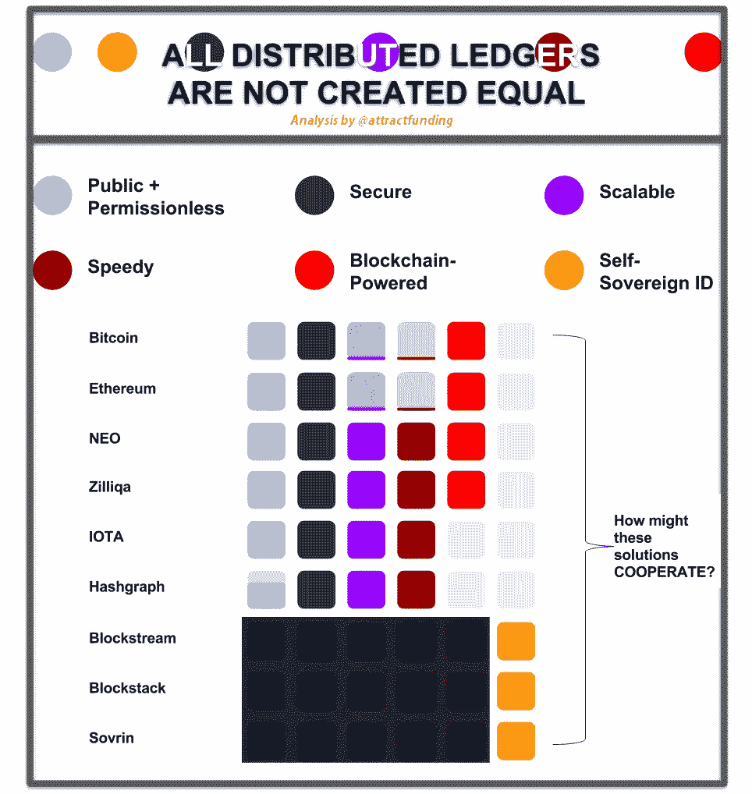

[Michael Jagdeo](https://www.linkedin.com/in/jagdeoholdings/) / [attractfunding](https://twitter.com/attractfunding) on Twitter

## D1。安全有多安全？

到底有多安全才算安全？安全，因为您的 DLT 不受 DDOS 攻击的影响？安全是指你有量子安全的数学证明？

## D2。比特币是一种油老虎

举个例子，到 2020 年，比特币区块链将消耗相当于丹麦的[能量](https://motherboard.vice.com/en_us/article/aek3za/bitcoin-could-consume-as-much-electricity-as-denmark-by-2020)。你能想象数字货币导致全球变暖吗？

 [## 扩大办公室恋情

### “运动中的物体会抵制方向的改变。所以世界反对一个新的想法。”—尼古拉·特斯拉

hackernoon.com](https://hackernoon.com/scaling-the-office-romance-6c739cd562b1) 

## D3。不成熟的区块链可能很慢

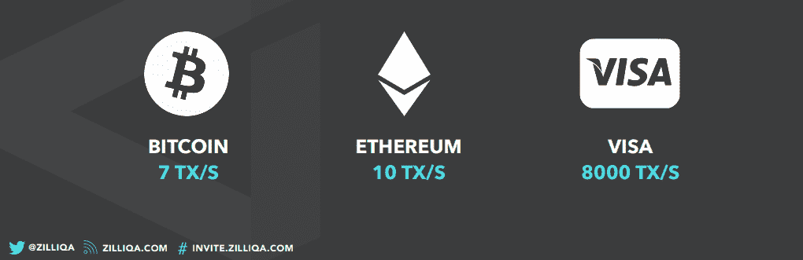

Credit: Zilliqa Keynote

高能效的可扩展性并不是阻碍区块链的唯一问题。他们也可能非常慢。

而**的比特币区块链**每秒只能处理**的七笔**交易。以太坊区块链每秒只能处理**十**笔交易。 **VISA** 每秒处理**八千**笔交易，并声称他们每秒可以处理 [**超过 5 万笔交易**](https://www.visa.com/blogarchives/us/2013/10/10/stress-test-prepares-visanet-for-the-most-wonderful-time-of-the-year/index.html) 。

有没有能打败 VISA 的区块链/DLT？

# E.亿万富翁的困境

业余投资者早上醒来问自己，

> " ***我应该购买并持有更多比特币吗？***

中级投资者早上醒来问自己，

> " ***今天哪种加密货币会涨得最快？***

## 更有利可图的问题

> **哪一套可互操作的区块链/DLTs —** *通过解决所有关键的全球安全性、可伸缩性和速度限制，比中间人目前做的更好* **—** [**将形成解决方案的****，实现**价值互联网**又名 **IOT 经济**又名**自给自足的乡村经济****](https://www.youtube.com/watch?v=UCISttFSoIY) **？**

# **F.统治一切的区块链/DLT 架构**

****

**如果自给自足的村庄经济可以由一个单一的、公共的、无许可的、快速的、安全的和可扩展的区块链/DLT 来驱动，这将是简单的，这也解决了**自我主权身份问题**。**

## **但是没有，也没有任何迹象表明会有一个区块链/DLT 来统治他们。**

> **我认为将需要一个可互操作的区块链/DLT 的生态系统。—直弘·杰夫，CTC(日本)副总经理**

****解决方案很明确**:如果没有一个公共的、无需许可的、快速的、安全的、可扩展的 DLT 来解决自我主权身份问题，**一个互联的、可互操作的区块链/DLTs 结构将填补解决方案的空白。****

## **F1。自我主权认同领袖**

****

**Matthew De Silva, [EthNews](https://www.ethnews.com/erc725-a-self-sovereign-identity-standard-for-ethereum)**

## **如果它走路、说话、行动都像鸭子，那它是鸭子吗？这是对互联网上身份的挑战。**当你看不见人的时候，很难区分他们。****

**[每个人都同意，自我主权身份](https://www.youtube.com/watch?v=UCISttFSoIY)是开启整个物联网经济(即价值互联网，即自我维持的乡村经济)的关键。**

> **互操作性是我最关心的问题之一，因为我们希望使用区块链作为身份验证的平台，这意味着我们希望从第三方应用程序中使用。杰夫先生**

**这是一个如此艰难的挑战，以至于有些区块链人专门致力于解决自我主权认同问题。他们的成功将取决于与其他区块链/DLT 的合作(也称为互操作),以创建实现价值互联网的解决方案结构。**

**[Blockstack](http://blockstack.com/) 、 [Blockstream](https://blockstream.com/) 、 [Sovrin](https://sovrin.org/) 似乎都解决了自主权标识问题。**

## **F2。[哈希表](https://hashgraph.com/)**

**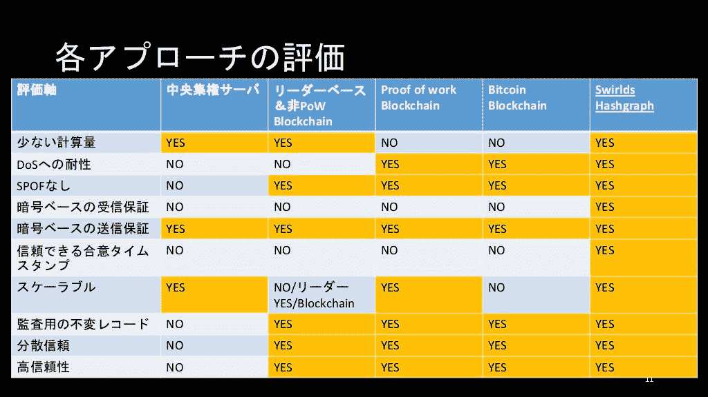**

**Photo Credit:[Naohiro Fujie](https://www.slideshare.net/naohiro.fujie/cis-blockchainhashgraphidentity), Deputy General CTC, Japan, June 2016**

## **在天才 Leemon 博士的带领下，Swirlds 声称他们的 DLT hash graph 在速度、安全性和可伸缩性方面可以超越所有其他的区块链和 DLT。**

> **作为一个身份识别的家伙[身份识别解决方案的制造商]，我总是在寻找解决身份识别中值得解决的问题的方法，即没有任何好的方法来为员工/公民/学生的身份进行强有力的证明。**
> 
> **2016 年，一家名为 [Ping Identity](https://www.pingidentity.com/en/company/press-releases-folder/2016/ping-identity-invests-in-next-generation-blockchain-alternative.html) 的最大身份产品供应商宣布，他们将与 Swirlds 合作。我听说了 hashgraph 背后的概念，并发现它们是我寻找了很久的解决方案之一。杰夫先生**

**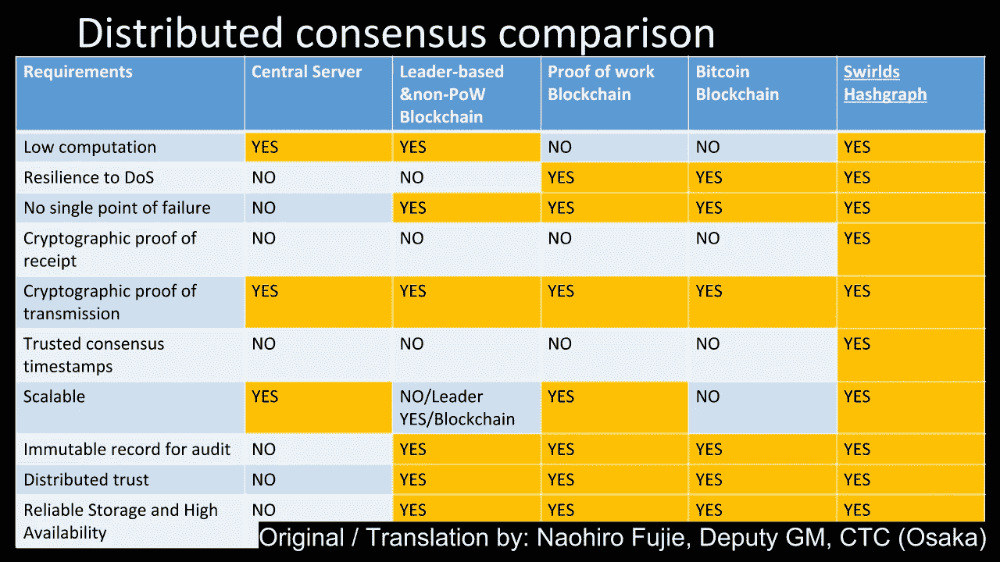**

**然而，除非他们[将他们私人的、许可的哈希图 DLT 公之于众](https://www.reddit.com/r/hashgraph/comments/7d76ie/new_to_rhashgraph_please_read_this_post_first_faq/)(除了李蒙博士没人知道这是否可能)，否则我们不得不考虑其他替代方案。**

## **F3。 [IOTA](https://iota.org/)**

**IOTA 是另一个新兴的 DLT 创新者，声称其公共解决方案是**量子免疫**。一如既往，最受欢迎的解决方案会带来战利品。**

## **F4。[齐力卡](http://zilliqa.com/)**

**Zilliqa 来自 Prateek 博士领导的新加坡国立大学团队，最近宣布他们的区块链平台在可伸缩性和速度方面可以超过以太坊 1000 倍。**

** [## 扩大办公室恋情

### “运动中的物体会抵制方向的改变。所以世界反对一个新的想法。”—尼古拉·特斯拉

hackernoon.com](https://hackernoon.com/scaling-the-office-romance-6c739cd562b1) 

# G.值得开采/投资的区块链/DLTs

*   [**Zilliqa**](https://www.zilliqa.com/) 一个公共的、快速的、安全的、可扩展的区块链解决方案(如果 [Zilliqa](https://docs.zilliqa.com/whitepaper.pdf) 拥有和以太坊一样多的矿工——大约 30，000 人——[它将处理大约一千倍于以太坊](https://docs.zilliqa.com/whitepaper.pdf)的交易速率)。
*   [**IOTA**](https://iota.org/)**出于与 Zilliqa plus 相同的原因，“IOTA 使用了一种创新的[量子证明](http://fintechnews.sg/10398/blockchain/iota-quantum-resistant-ledger-two-innovative-dltblockchain-projects/)协议，称为 Tangle。”**
*   **[**Hashgraph**](http://www.swirlds.com/) 用于私有、快速、安全和可扩展的 DLT 解决方案(银行、[信用合作社](http://www.businesswire.com/news/home/20171027005457/en/Swirlds-CULedger-Collaborate-Deliver-High-Performance-Secure))。**万亿美元的问题** —它能成为公共账本吗？**
*   **[**block stream**](https://blockstream.com/)**[**block stack**](https://blockstack.com/)**[**SOV rin**](https://sovrin.org/)为自主权身份问题。******** 

# ****H.Hashgraph 成为公共 DLT？****

****“在不久的将来，我们将讨论一种带有代币或加密货币的公共账本。”([李蒙博士，哈希表](https://www.hiddenforcespod.com/leemon-baird-hashgraph-distributed-ledger-technology-blockchain/))****

****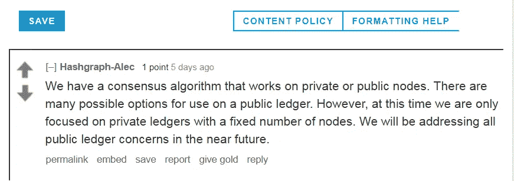****

*****Source: Is a public hashgraph really an alternative to PoW and PoS? Reddit*****

# ****一、成为价值互联网专家(视频)****

****这篇文章的灵感来自于[这篇文章](https://www.linkedin.com/feed/update/urn:li:activity:6333792988564635648?commentUrn=urn%3Ali%3Acomment%3A%28activity%3A6333792988564635648%2C6334049608376807424%29)之后与 Zilliqa 的一位核心开发人员的对话。****

****这些视频会让你跟上进度。****

# ****PS —不要睡在 Ripple 上。****

****[Internet of Value 101](https://www.youtube.com/watch?v=Pl8OlkkwRpc): HMW transition to Internet of Value? Don Tapscott****

****[Internet of Value 201](https://www.youtube.com/watch?v=Hty8JRhUz_0): Self-Sovereign Identity — Ryan Shea, Blockstack****

****[Internet of Value 202](https://www.youtube.com/watch?v=LVqpBXXzTeE): Self-Sovereign Identity — Christopher Allen, Blockstream****

****[Internet of Value 301](https://www.youtube.com/watch?v=0tt1Aj7e9fE): Scalability — Christel Quek, Zilliqa****

****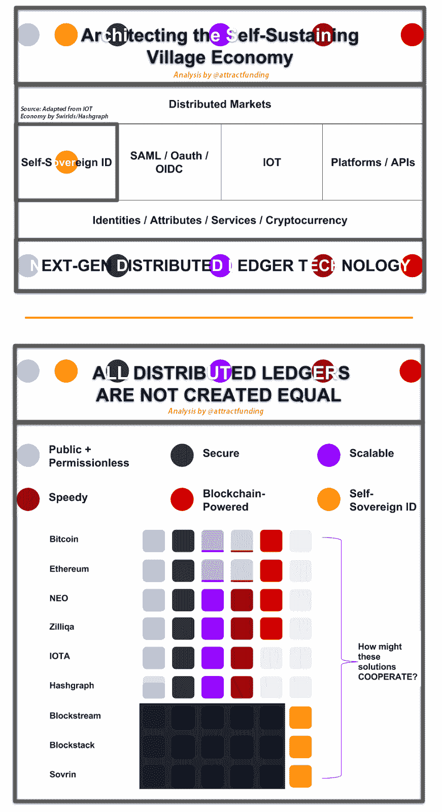****

****[Michael Jagdeo](https://www.linkedin.com/in/jagdeoholdings/) / [attractfunding](https://twitter.com/attractfunding) on Twitter****

# ****奖金！****

****Hashgraph 的发明者 Leemon Baird 博士以创纪录的时间获得了卡内基梅隆大学的博士学位。创造第四代 DLT 需要这样的头脑。****

****让我开始思考。谁说明天就不会有更高效的算法了？第二天呢？随着每一个新的增量改进，一个新的 ICO 投资？****

> ****Q3)与全球数学竞赛相比，越来越好的共识算法/DLT 会继续出现吗？如果是这样，投资者、矿商和 DApp 开发商如何适应/生存？****
> 
> ****对于问题 3，我认为这是一个困难的问题，所以到目前为止还没有明确的答案。我认为这不是一个共识算法的问题，而是一个如何成为事实的问题，对于当前的区块链来说，主要服务的存在和比特币一样是最重要的事情。杰夫先生****

# ****突然，一个新的竞争者出现了。****