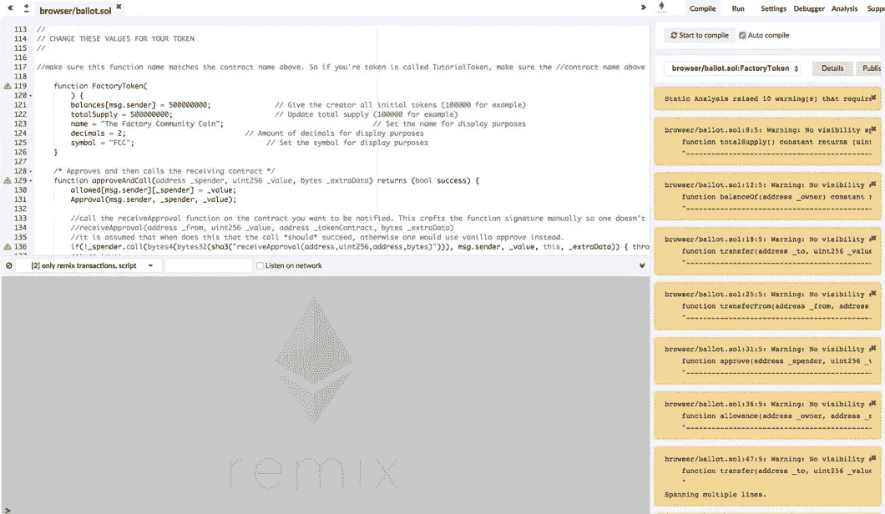
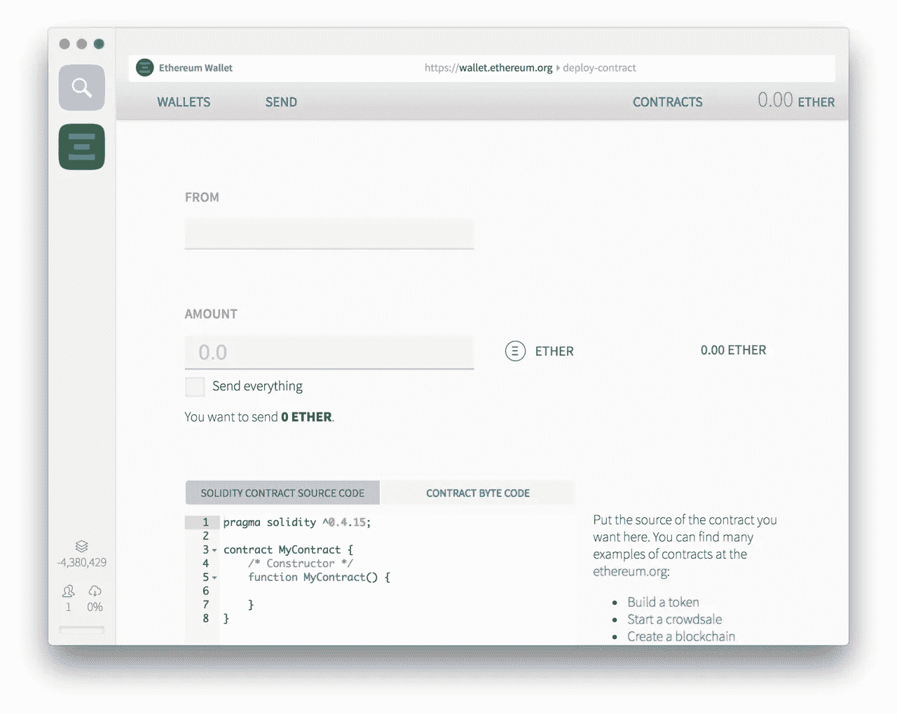
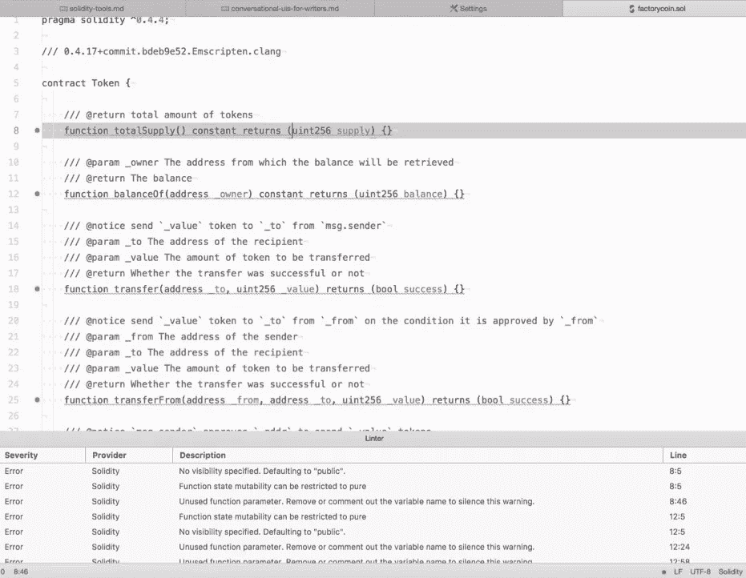

# Blockwatch:使用 Solidity 的工具

> 原文：<https://medium.com/hackernoon/blockwatch-tools-for-working-with-solidity-fc2620de559f>

最近，我偶尔工作的合作空间中的一群区块链爱好者决定，我们是时候停止谈论区块链，并实际学习如何基于它创建一些东西了。

我们希望创造一种硬币或代币供社区内部使用，虽然该项目目前已经搁置，但我开始更深入地研究以太坊，以及它用于创建智能合同的语言。以后我会更详细的讲述语言本身(等我自己更懂的时候！)，但是在这篇文章中，我将介绍一些使用这种语言的工具。

# 你选择的语言

你的起点是[官方以太坊客户端](https://www.ethereum.org/cli)，可用于所有操作系统以及在 [Go](https://github.com/ethereum/go-ethereum) 、 [C++](https://github.com/ethereum/cpp-ethereum) 、 [Rust](https://github.com/paritytech/parity) ，以及 [Python](https://github.com/ethereum/pyethereum) 。所有这些工具都支持完整的类和方法，这里列出的许多其他工具都需要它们作为依赖项。

有一个 [JavaScript](https://github.com/ethereumjs/ethereumjs-lib) 的非官方客户端。我链接的库已经过时了，但是它包含了一个有用的参考，可以帮助你找到你需要的库。

# 再搅拌

Mix 承诺成为成熟的 Solidity IDE，但它从未实现，而 Remix 是它基于网络的替代品。您可以基于不同版本的以太坊编译器 lint、编译、调试、运行和分析您的 Solidity 代码。你也可以在浏览器中运行你自己的 Remix 的[本地副本，或者作为浏览器的扩展。](https://github.com/ethereum/browser-solidity)

# 钱包

官方的以太坊[钱包和 mist](https://github.com/ethereum/mist) 应用程序允许你将合同部署到网络上，但没有太多其他功能，所以你应该在使用它们之前确保你的代码已经完成。

# JetBrains IDEs

如果你使用任何基于 IntelliJ 平台的 ide，那么[有一个支持格式化、代码片段和代码完成的插件](https://plugins.jetbrains.com/plugin/9475-intellij-solidity)。

# Eclipse IDE

Papyrus 是 Eclipse IDE(和 Oxygen XML 编辑器)的 uml 建模环境， [uml2solidity](https://github.com/UrsZeidler/uml2solidity) 是 Papyrus 的一个插件，可以让你将 UML 模型转换成 solidity。对于不熟悉智能合约的有经验的程序员来说，这是用你熟悉的语言建模你的想法的好方法。

# 原子

我是 Atom 的忠实粉丝，所以我很高兴能找到一系列支持 Solidity 的软件包。

有基于来自 [solc npm 包](https://www.npmjs.com/package/solc)的编码标准的[Solidity linter](https://atom.io/packages/linter-solidity)，以及基于[solium 项目](https://github.com/duaraghav8/Solium)的[solium linter](https://atom.io/packages/linter-solium)。他们采用不同的配置方法，`linter-solidity`有更多的用户，而我甚至不能让`linter-solium`工作，所以在这两者之间做出选择很容易。最后，还有用于 Solidity 的[自动完成](https://atom.io/packages/autocomplete-solidity)和[语言——以太坊](https://atom.io/packages/language-ethereum)增加了对 Solidity 的支持，还有 [Serpent](https://github.com/ethereum/wiki/wiki/Serpent) ，另一种可以用来创建智能合同的语言。

以太原子包让你从编辑器中编译和部署 Solidity 代码，但是它的设置很复杂，你必须知道你在做什么，因为它需要几个以太坊相关的工具已经安装在你的机器上，并且正在工作。

# 部署框架

当开发社区开始为一种语言创建框架时，你就知道它是什么时候开始接受这种语言的。不出所料，以太坊有几个选择。

松露声称是最受欢迎的选择，支持编译、测试、部署和依赖管理。

Embark 与此类似，也为基于存储的解决方案提供与 T2 IPFS T3 的集成，为基于通信的应用提供与 T4 whisper T5 或 T6 orbit T7 的集成。

Dapp 是一个更简单的 CLI 工具，用于包管理、测试和部署智能合约。

对于更多类似企业的项目， [BlockApps](http://blockapps.net/) 提供了一个全栈平台，用于创建私有区块链应用，这些应用有望融入您现有的任何工具链。

# 不断变化的生态系统

区块链空间是不断变化的，因此在可预见的将来，工具列表不会是全面的。如果这个列表中有什么遗漏，请在下面的评论中添加。

*原载于*[*dzone.com*](https://dzone.com/articles/blockwatch-tools-for-working-with-solidity)*。*