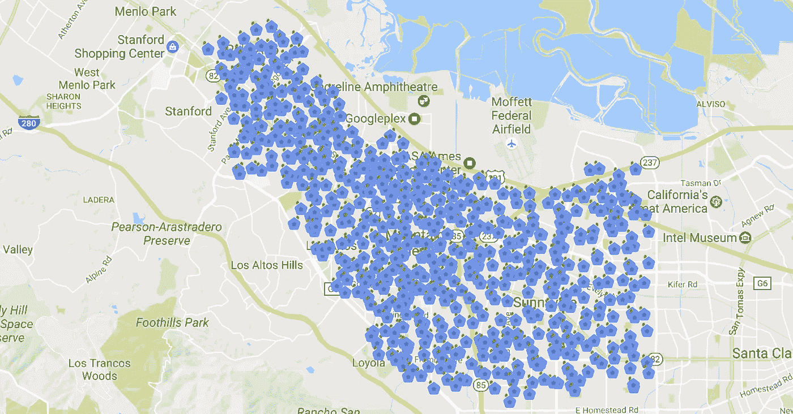
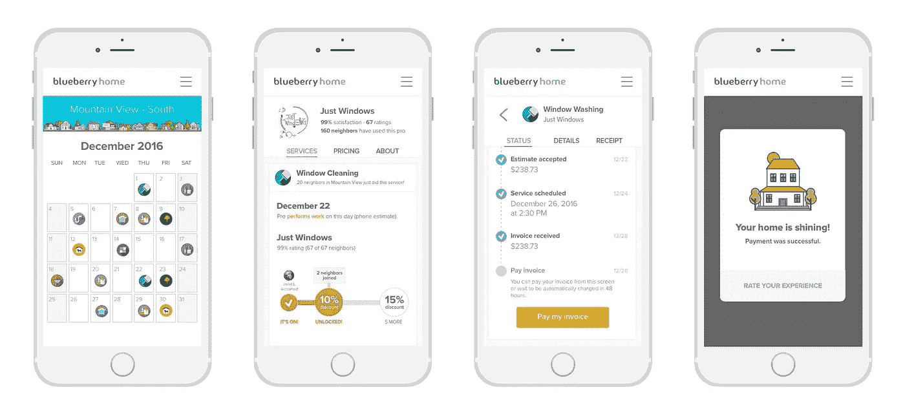

# 蓝莓之家新年火了

> 原文：<https://medium.com/hackernoon/blueberry-home-catching-fire-in-the-new-year-1c76e127159d>

对于我们的公司、邻居和服务提供商来说，过去的一年是巨大的成功。

今年年底标志着我们第一次全年运营我们的家庭服务市场，数百名邻居和数十名专业人士受益于我们打造世界上最令人愉快的家庭服务体验的愿望。

> 在 Blueberry，我们不仅改善了我们对家园的护理，还改变了我们共同生活和工作的方式。

Each pin represents a neighbor in South Bay Blueberry

一个邻居，然后两个，每个邀请另一个。邻居们开始在脸书和隔壁讨论蓝莓。在我们知道我们的邻居众包运动像野火一样蔓延到整个南湾区之前。

当地报纸开始报道我们发生的事情( [Los Altos Town Crier](http://www.losaltosonline.com/news/sections/business/183-business-features/52968-online-network-reimagines-village-marketplace) 、[硅谷商业杂志](http://www.bizjournals.com/prnewswire/press_releases/2016/06/21/NY29722)以及其他一些[报纸](http://blueberryhome.com/press/))。到目前为止，成千上万的邻居都在遵循他们的邻居日历。

蓝莓社区的热情让我们惊叹不已——孩子们骑着调校好的自行车在街上奔跑，妈妈们用完美的派对展示他们的家，爸爸们再次被涂油的“烧烤大师”迷上了他们干净的烧烤架，奶奶们有人打电话来修理窗帘或水龙头，宠物们，嗯，宠物们欣喜若狂！

*One of our many delighted Blueberry pups. Pet grooming was our most popular service in 2016\. Pets love the low-stress grooming environment and pet owners enjoy the convenience of not having to leave the house with a car full of animals.*

今天，我们是一个专注的小团队，每天都在为服务提供商和邻居带来新工具，为每个人创造一个公平公正的市场。

> 将服务组合在一起可以消除低效，帮助所有利益相关者节省时间、金钱和保护地球。

传统的竞争对手创造了不可持续的商业模式，这种模式增加了成本，挤压了供应方供应商，未能支持当地和/或解决更大的环境问题。

我们相信，我们正处于本地服务下一个重要阶段的门槛——借鉴过去的尝试，智能手机的出现，劳动力格局的转变，以及本地付费广告渠道的民主化，所有这些都在建立像我们这样的服务的最佳时机达到了高潮。

> 作为一个使命驱动的创新管家，蓝莓代表着将当地转变为改变世界的运动的潜力。

我们相信本地*就是*经济。通过将村庄带回社区，蓝莓使邻居和专业人士能够摆脱工作和家庭维护的低迷。

> 未来的现实是，你可以让任何东西送货上门，每一步都有建立信任的透明度。

随着日历年的到来，我们很高兴地宣布，从 1 月份开始，所有支付都将通过我们的平台完成。

邻居和专业人士将不再需要追查支票或翻遍纸质档案来查找过去的收据。

通过在线支付，我们成为世界上最透明的端到端家庭服务体验之一。

在 2017 年，您可以期待我们在服务体验方面提供更多增强。

我们将在春季推出原生 iOS/Android 应用，包括邻居和服务提供商直接相互发送消息的能力。

今年，我们将继续稳步推出新的服务类别。我们所做的一切都以人为中心，这意味着我们关注体验接触点。我们在标准化护理方面考虑周到，只选择最好、最受推荐的本地服务提供商。

我们两年前开始了这段旅程，虽然不是没有不眠之夜，但我们对未来感到无比兴奋。

我们要感谢你们所有人，感谢你们支持我们，让我们拥有一个更美好、更可持续的*家园*。

达米安

【bluberryhome.com】了解更多

******

> *[黑客中午](http://bit.ly/Hackernoon)是黑客如何开始他们的下午。我们是阿妹家庭的一员。我们现在[接受投稿](http://bit.ly/hackernoonsubmission)并乐意[讨论广告&赞助](mailto:partners@amipublications.com)机会。*
> 
> *如果你喜欢这个故事，我们推荐你阅读我们的[最新科技故事](http://bit.ly/hackernoonlatestt)和[趋势科技故事](https://hackernoon.com/trending)。直到下一次，不要把世界的现实想当然！*

**