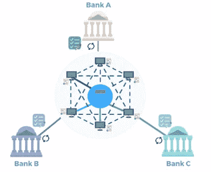

# bluzelle——银行与区块链初创企业的合作如何让双方受益

> 原文：<https://medium.com/hackernoon/bluzelle-how-bank-collaborations-with-blockchain-startups-serve-both-well-3392d4203bd0>

## 任何在金融机构和金融科技初创公司工作过的人都知道这些公司有多么不同。

除了后者比前者运行得快得多这一明显的观察之外，最显著的差异之一是他们对技术的态度。虽然老牌机构经常谈论他们对创新技术的兴趣，但现实是他们的方法通常非常规避风险。他们觉得有必要保持大型的整体系统在线，修补漏洞并保持正常运行，而不是寻找创新和有效的方法来构建新的解决方案。

当然，我们不应该责怪相关人员，他们经常被引导和激励走上这条道路。在这种情况下，他们的优先事项和采取的行动肯定会与那些寻求用最现代的技术栈建立以客户为中心的服务的金融科技初创公司完全不同。

然而，当这些不同类型的组织能够找到他们的目标之间的一致性时，伟大的工作就能完成。这种中间立场可以在对大型银行和金融科技初创公司都有影响的领域找到，比如监管。任何从事金融服务的公司，无论规模大小，都需要遵守一套监管准则。然而，每个参与其中的人都知道合规性是多么耗时耗力。

# 每个人都需要(更好的)KYC

以《了解你的客户(KYC)条例》为例。这是一项重要的法规，通过确保所有金融机构在开始处理其资金之前了解其客户是谁，减少了洗钱和犯罪活动。但实际上，这是一个缓慢而繁琐的过程，充满了重复、手动流程和潜在的人为错误。它涉及个人与金融机构共享身份证件(如护照),然后金融机构必须验证这些身份证件，并将这些个人信息存储在中央数据库中以备将来参考。

尽管流程几乎完全相同，但每个机构都需要单独完成这项工作，并且可能需要数周时间才能完成，因为人们需要手动对纸质文档进行分类和验证。这不仅对客户来说是令人沮丧的缓慢服务，对银行来说也是一个低效和昂贵的过程。

在这种情况下，与更灵活的金融科技初创公司合作是完全有意义的，这些公司更清楚地了解技术解决方案如何改善流程。这就是为什么包括[汇丰银行、三菱 ufj 金融集团和 OCBC 在内的主要金融机构组成的财团最近与区块链解决方案的分散数据库 Bluzelle](https://www.coindesk.com/asian-consortium-successfully-tests-proof-of-concept-blockchain-kyc-platform/) 合作，以解决 KYC 合规问题。

# **利用区块链改善 KYC**

[Bluzelle 开发的共享分类账应用](https://www.coindesk.com/asian-consortium-successfully-tests-proof-of-concept-blockchain-kyc-platform/)利用区块链以太网提供简化的 KYC 流程，使银行能够减少客户入职的时间和成本，以安全的方式共享客户数据，并简化客户数据管理。

一旦加入，个人的客户资料将被加密并存储在区块链上，这样银行就可以“拥有”它。但是，由于使用了专有的多方密钥加密协议，如果客户愿意，数据也可以与其他银行共享。结果，该解决方案不仅消除了因每家银行拥有自己的 KYC 流程而产生的重复工作，还减少了所有这些流程中固有的人为错误。

有了正确的密钥权限，银行可以快速、轻松地检查任何客户的凭证，同时客户可以控制与谁安全地共享这些凭证。不仅如此，参与该网络的监管机构还可以通过访问共享账本来简化对公司 KYC 政策的审计。

银行知道监管者希望他们在打击金融犯罪中使用技术，这一应用的成功使得汇丰银行创新主管 Jennifer Doherty 说**这一倡议是所有这些目标的积累:合作、创新和犯罪预防。**

这只是表明，当银行和金融科技初创公司的组织目标一致时，它们不仅可以产生互利的解决方案，还可以提供市场可能如何转变的未来愿景。