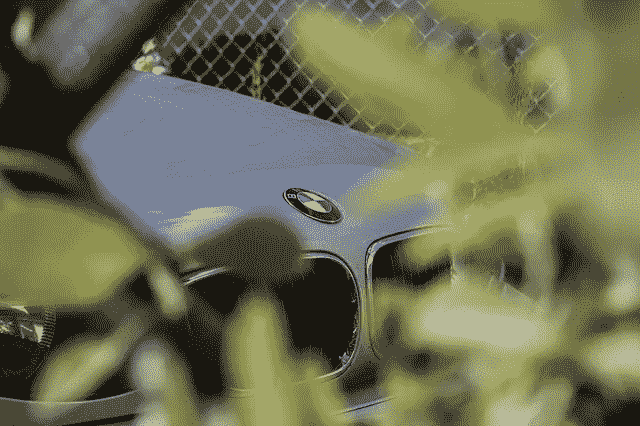

# 宝马混合动力车在最新召回中命名

> 原文：<https://medium.com/hackernoon/bmw-hybrid-named-in-latest-recall-97ada683c416>

多家主要汽车制造商最近宣布了召回行动。

随着有关高田安全气囊召回范围扩大的报道，许多车主在他们的车辆得到完全修复之前，可能要等待很长时间。但在他们等待的时候，其他与可能导致撞车或受伤的问题相关的召回也开始了。

影响一个受欢迎品牌的最新召回是由宝马发起的。

据德国汽车制造商称，宝马 18 混合动力车在公司了解到与动态稳定控制液压单元相关的问题后被召回。在负责生产 DSC 液压零件的零件供应商联系宝马，报告这些零件可能出现了制造错误后，该公司发起了召回，以解决该问题。

报告显示，存在制造误差的零件可能会导致 DSC 功能受损。如果是这种情况，驾驶员可能会遇到制动和操纵问题。这些问题可能会导致崩溃。

为了避免事故，保持安全，并帮助他人保持安全，请立即对您召回的车辆进行检查和维修。据该公司称，如有必要，服务技术人员将检查并更换 DSC 液压装置。

如果您想了解更多关于此次召回以及如何及时免费修理您的车辆的信息，请点击[此链接](http://www.leftlanenews.com/bmw-recalls-i8-hybrid-to-fix-stability-control-system-90725.html)。

永远不要等到你受伤了才采取行动，在与召回运动联系起来之后才修理你的汽车。许多问题可能导致致命事故或伤害。忽视影响车辆设备的召回活动可能会导致可怕的后果。

> [黑客中午](http://bit.ly/Hackernoon)是黑客如何开始他们的下午。我们是 [@AMI](http://bit.ly/atAMIatAMI) 家庭的一员。我们现在[接受投稿](http://bit.ly/hackernoonsubmission)并乐意[讨论广告&赞助](mailto:partners@amipublications.com)机会。
> 
> 如果你喜欢这个故事，我们推荐你阅读我们的[最新科技故事](http://bit.ly/hackernoonlatestt)和[趋势科技故事](https://hackernoon.com/trending)。直到下一次，不要把世界的现实想当然！

