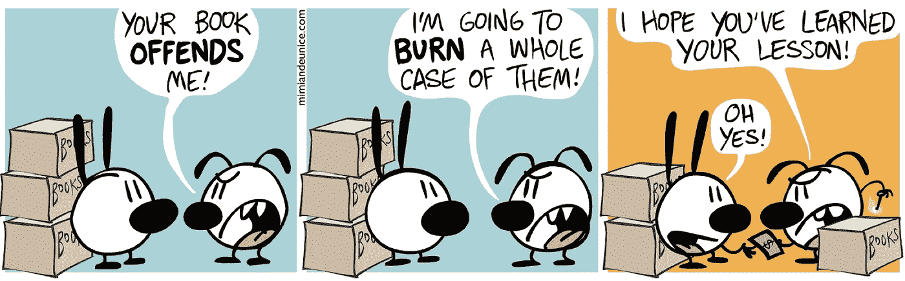
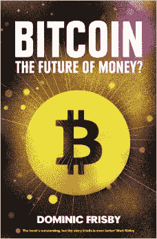
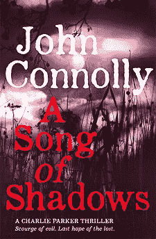
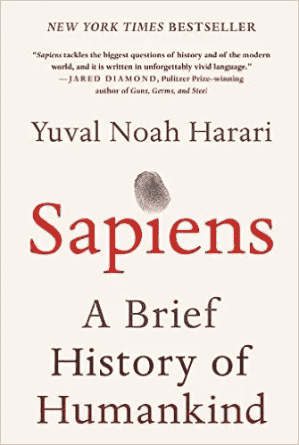

# 你应该读的书(我在 2015 年读的)

> 原文：<https://medium.com/hackernoon/books-you-should-read-that-i-read-in-2015-c8ceeb3368>

[http://mimiandeunice.com/2011/07/13/book-burning/](http://mimiandeunice.com/2011/07/13/book-burning/)

我喜欢看书，尤其是好看的快节奏犯罪小说。今年，我发现了许多新的精彩惊悚片，并为一些长期播放的系列片充值。然而，当我审视我读过的书时，我发现非小说类的书比我预想的要多。从通俗易懂的非小说中学习潜意识万岁。

我不想给你一个清单。你也不关心我读它们的顺序。你真正真正想知道的是，“这本书值得一读吗？”

顺便说一句，我很少坚持读枯燥或难读的书。自从离开学校后，我从未被迫从头到尾读完我不感兴趣的书。所以你可以认为这里所有的书我都认为很有趣，值得一读，除了那些未完成的。

## 我从书中学到了一些东西

*   由 Humble、Molesky 和 O'Reilly 以简单的写作风格教会了我关于创新的知识。
*   [*未来*是*可预测的*](https://www.goodreads.com/book/show/25727226-future-is-predictable?from_search=true&search_version=service) by @swardley 给我讲了沃德利图和价值链图。内容也在他优秀的[博客](http://blog.gardeviance.org/)上。
*   阿什利·万斯(Ashlee Vance)的埃隆·马斯克(Elon Musk)向我介绍了未来的纯电动汽车(现在是一个信徒)、太空探索和令人难以置信的创业态度。也许是一本党派传记，但仍然鼓舞人心。
*   Schlender 和 Tetzeli 所著的《成为史蒂夫·乔布斯》比官方传记更容易阅读，也更具分析性。
*   达米恩·刘易斯拍摄的《纳粹猎人》，真实的故事，讲述了特种空勤团在二战中和二战后对抗明显不可逾越的障碍的故事。
*   [比特币货币的未来？](https://www.goodreads.com/book/show/23385930-bitcoin?from_search=true&search_version=service)Dominic Frisby 帮助我理解了为什么 Satoshi Yakamoto 创造了第一种加密货币，它一直延续到现在，并引入了区块链(区块链是软件领域的一项范式转变发明)。现在我想知道更多。

## 令人爱不释手的新书

暂停你当前的书，去读读这些。他们真的很棒。

*   迈克尔·莫利的 5 本系列丛书。
*   莎拉·平伯勒的《T2:狗脸神》三部曲是一部黑暗的另类历史和未来。我喜欢它。
*   [第二次激活](https://www.goodreads.com/book/show/23545106-second-activation?from_search=true&search_version=service)Darren 和 Marcus Wearmouth 为后奥运时代的未来创作的系列 1-2。
*   詹姆斯·卡罗尔的杰斐逊·温特系列 1-3。
*   彼得·斯旺森的《值得杀死的那种》情节曲折。
*   如果你还没看过这部电影(自从有了这本书我就没看过了)，安迪·威尔的《火星人》很棒，如果你能理解早期科学的话。感谢@djmcglade 的前期推荐。
*   理查德·波特的《惊世骇俗》让我开怀大笑，也是所有 Top Gear 粉丝的必备之作。
*   CJ·萨姆森的《鲨鱼湖》系列是一部可爱的历史犯罪剧。今年我读了 1-4 本，都充满了关于托马斯·克伦威尔和亨利八世的阴谋和伟大的历史细节。

## 我不能错过的最新系列书籍

*   来自李·查德的最新 [Reacher 小说](https://www.goodreads.com/book/show/23664710-make-me?from_search=true&search_version=service)是 20 号。这些故事在很大程度上已经失去了活力，但仍然是一个快节奏但公式化的故事。
*   我最喜欢的犯罪系列(约翰·康奈利的《查理·派特》)在《阴影之歌》中没有让人失望，它带有半超自然半宗教的意味，让故事变得更加悬疑。
*   斯科特·马里亚尼的另外两部本·霍普惊悚片《T2》第 10 部《T3》和《T4》第 11 部《T5》是一部易于阅读的轻松惊悚片。

## 厕所阅读

这些都是超级易读的犯罪惊悚小说，

*   丹·谢泼德继续出演另一部来自史蒂芬·莱泽的通俗易懂的惊悚片。
*   肖恩·狄龙 [1](https://www.goodreads.com/book/show/337623.Eye_of_the_Storm?from_search=true&search_version=service) 和 [2](https://www.goodreads.com/book/show/790332.Thunder_Point?from_search=true&search_version=service) 。
*   遗憾的是，这些在几年前对我来说一定只有很浅的印象，因为我花了将近一半的书才想起我已经读过汤姆·亨特的《刺客维克多》系列 [1](https://www.goodreads.com/book/show/10287666-the-hunter?from_search=true&search_version=service) 和 [2](https://www.goodreads.com/book/show/15810916-the-enemy?from_search=true&search_version=service) 。

## 我开始读但没有读完的书(因为我被更好的东西分散了注意力)

*   重塑组织，弗雷德里克·拉鲁。打算回本。
*   达米安·博伊德的《直线前进》。厌倦了这个。
*   泰勒的《谎言》。厌倦了这个。
*   [乖女孩](https://www.goodreads.com/book/show/18812405-the-good-girl?from_search=true&search_version=service)。厌倦了这个。
*   [Bloomsday 死了](https://www.goodreads.com/book/show/21287.The_Bloomsday_Dead?from_search=true&search_version=service)。可能会回到这一点，因为我有另外两本书在等着。
*   [拜拜银行](https://www.goodreads.com/book/show/25999958-bye-bye-banks?from_search=true&search_version=service)。不要买这个，只是 fintech 创业公司列表。

鉴于我不列清单，如果没有 kindle，这种回顾性的漫步浏览我 2015 年的书是不可能的，所以感谢亚马逊。

# 我接下来要读的书

我从 2016 年开始写四本非小说类的书。这不能持续。

*   *状态后的生活*因为多米尼克的比特币之书太好了。
*   《智人:人类简史》，这显然是一部史诗。
*   *掌握比特币*，关于比特币和区块链的技术细节。
*   *小米粒*，和 Xaoimi 一起开始了解一点中国。

> [黑客中午](http://bit.ly/Hackernoon)是黑客如何开始他们的下午。我们是阿妹家庭的一员。我们现在[接受投稿](http://bit.ly/hackernoonsubmission)并乐意[讨论广告&赞助](mailto:partners@amipublications.com)的机会。
> 
> 如果你喜欢这个故事，我们推荐你阅读我们的[最新科技故事](http://bit.ly/hackernoonlatestt)和[趋势科技故事](https://hackernoon.com/trending)。直到下一次，不要把世界的现实想当然！

