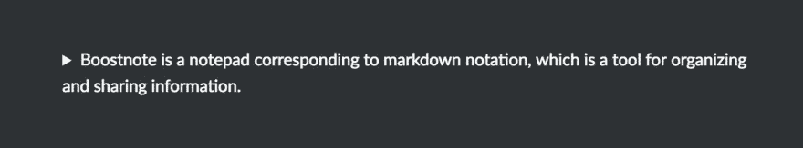
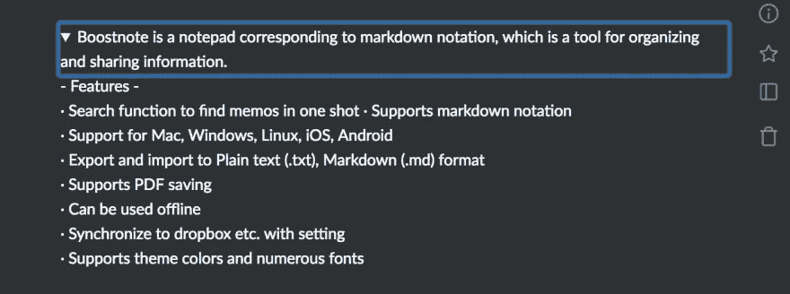
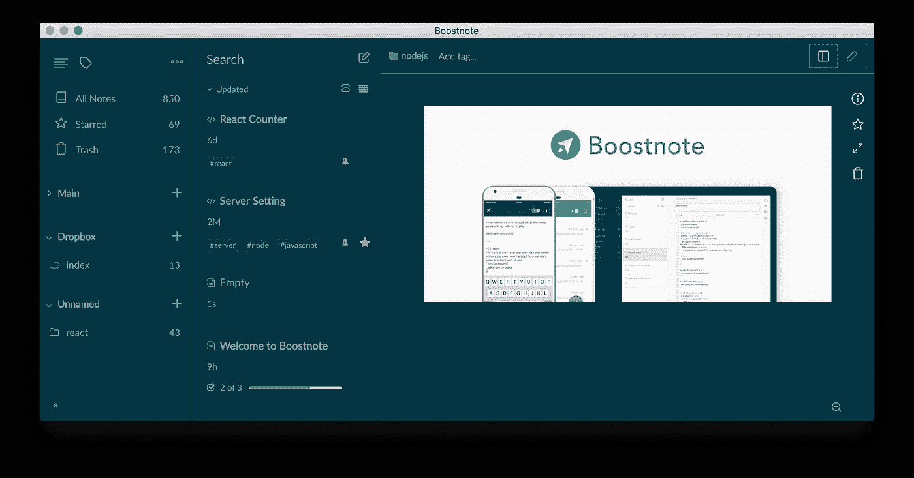
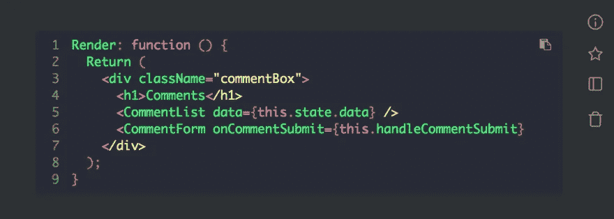
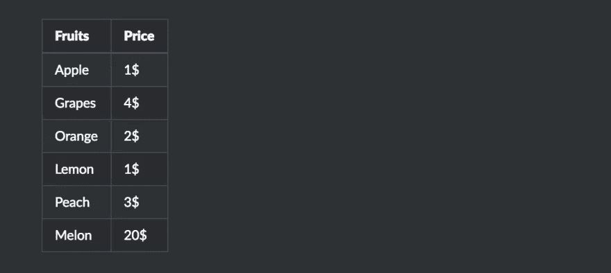
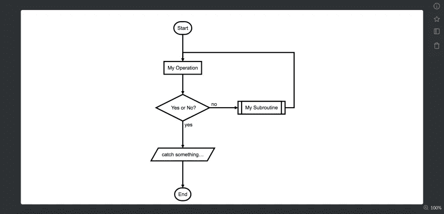

# 使用降价来提高您的生产力。

> 原文：<https://medium.com/hackernoon/boost-your-productivity-using-markdown-b8a84fc2a089>

# 什么是降价？

> Markdown 是一种具有纯文本格式语法的轻量级标记语言。它被设计成可以使用同名工具转换成 HTML 和许多其他格式。
> 出自 [*百科*](https://en.wikipedia.org/wiki/Markdown)

介绍降价格式⛷

# 1.标题

```
# h1
## h2
### h3
standard
```


# 2.强调

```
*Italic type*
**Bold**
~~Negative~~
```


# 3.折叠

折叠长句。

```
<details><summary>Boostnote is a notepad corresponding to markdown notation, which is a tool for organizing and sharing information.</summary>
- Features - <br>
· Search function to find memos in one shot
· Supports markdown notation <br>
· Support for Mac, Windows, Linux, iOS, Android <br>
· Export and import to Plain text (.txt), Markdown (.md) format <br>
· Supports PDF saving <br>
· Can be used offline <br>
· Synchronize to dropbox etc. with setting <br>
· Supports theme colors and numerous fonts <br>
</details>
```



# 4.目录

```
- List 1
- List 2
* List 3
* List 4
```


# 5.环

在左边放一个文本，在右边放一个 url。

```
[Boostnote](https://boostnote.io)
```


# 6.复选框

```
- [x] Task 1
- [ ] Task 2
```


# 7.行情

```
> Quotation
> Quotation Quotation
```


# 8.水平线

```
* * *
***
--------
```


# 9.图像

```

```



# 10.源代码

```
Render: function () {
  Return (
    <div className="commentBox">
      <h1> Comments </h1>
      <CommentList data={this.state.data} />
      <CommentForm onCommentSubmit={this.handleCommentSubmit} />
    </div>
  );
}
```



# 11.桌子

```
|Fruits|Price|
|:--|:--|
|Apple|1$|
|Grapes|4$|
|Orange|2$|
|Lemon|1$|
|Peach|3$|
|Melon|20$|
```



这些是基本的降价格式。
除此之外，你还可以在 [Boostnote](https://boostnote.io/) 中设置如下复杂格式。

# 乳液

数学格式化。

```
$$$
\mathrm{e}^{\mathrm{i}\theta} = \cos(\theta) + \mathrm{i}\sin(\theta)
$$$
```


# 流程图

```
st=>start: Start:>http://www.google.com[blank]
e=>end:>http://www.google.com
op1=>operation: My Operation
sub1=>subroutine: My Subroutine
cond=>condition: Yes or No?:>http://www.google.com
io=>inputoutput: catch something…
st->op1->cond
cond(yes)->io->e
cond(no)->sub1(right)->op1
```



# 顺序

```
Title: Here is a title
A-> B: Normal line
B -> C: Dashed line
C -> D: Open arrow
D -> A: Dashed open arrow
```


仅此而已。享受降价；)

## 由 [Boostnote](https://boostnote.io/) 策划

*   [GitHub](https://github.com/BoostIO/Boostnote)
*   [推特](https://twitter.com/boostnoteapp)
*   [脸书集团](https://www.facebook.com/groups/boostnote/)