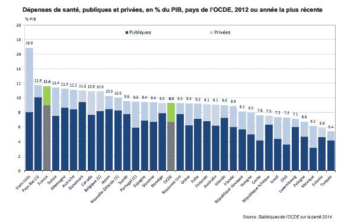
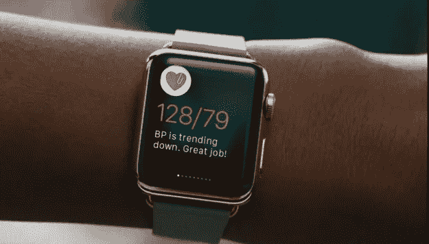
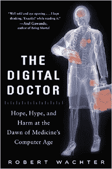
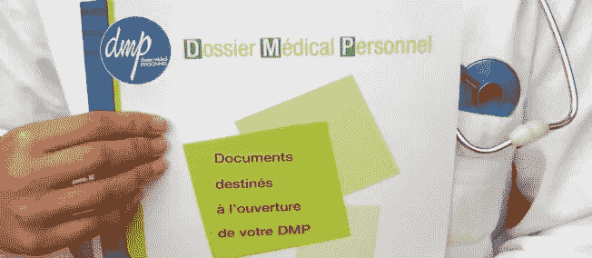
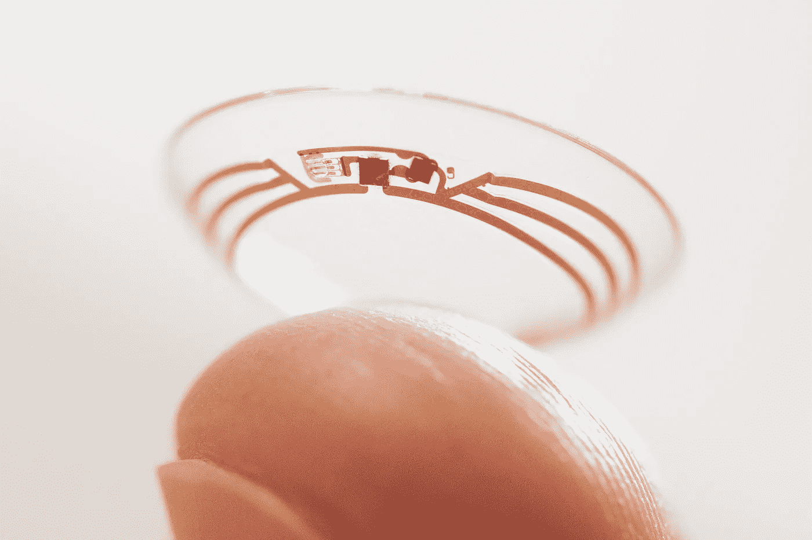
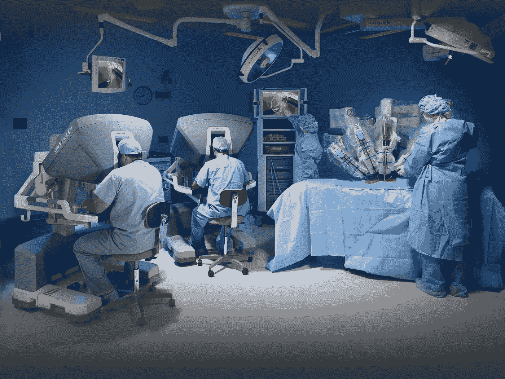
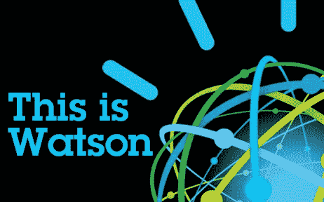
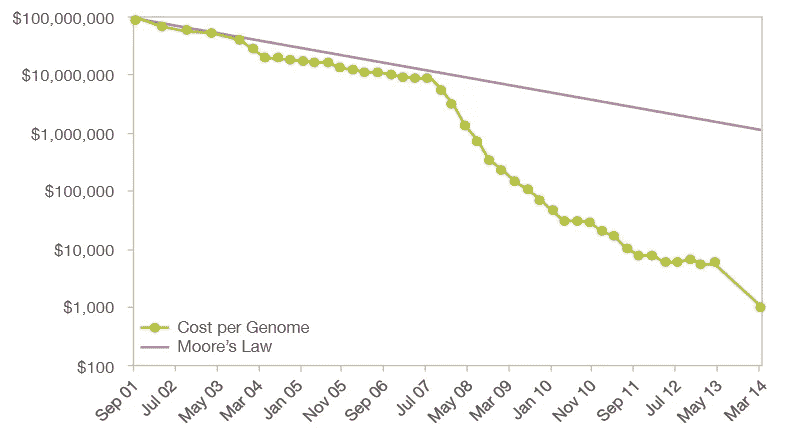
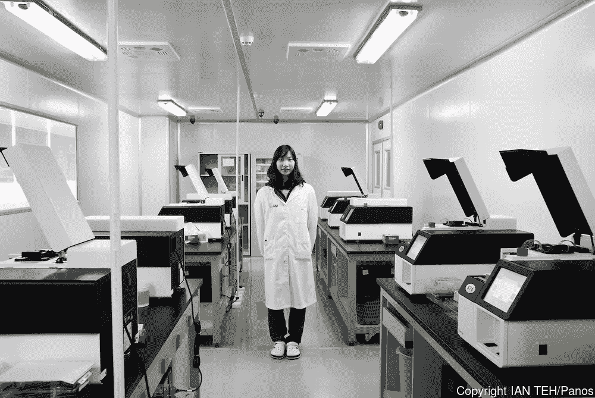
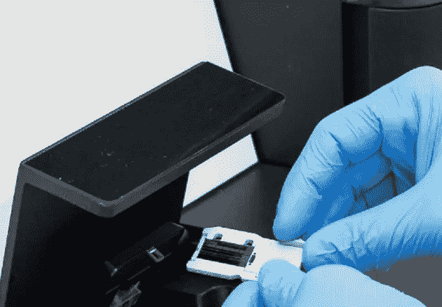

# 促进法国医疗保健

> 原文：<https://medium.com/hackernoon/boosting-french-healthcare-7370cfb94ca4>

很长一段时间，我们认为我们的法国医疗保健系统是世界上最好的。的确如此。但是，多年来，我们已经观察到我们的医疗保健系统的成本增加，而个人的用户体验并没有真正改变或改善([彭博在全球排名第 8](http://www.bloomberg.com/visual-data/best-and-worst//most-efficient-health-care-2014-countries) ，[欧洲健康消费者指数](http://www.healthpowerhouse.com/files/EHCI_2014/EHCI_2014_report.pdf)在欧洲排名第 11)。

OECD healthcare cost in % of GDP

数字令人震惊:在法国，我们 GDP 的 11.6%用于医疗保健(然而，这低于美国 18%的水平)，€每年 2500 亿，并且在过去 50 年里一直在不断增加。这种增长伴随着我们所热爱的社会保障的更大的预算赤字。

随着成本的增加，包括医生、医院、病人在内的每一个利益相关者对系统的满意度都在下降

这从何而来，我们能做些什么？

# **用户和患者之间的差异**

首先，我们，人民，不再被视为病人。我们是我们[医疗保健](https://goo.gl/8FsjGa)的用户。当我们是病人时的用户，当我们评估我们的风险时的用户，但当我们健康时也是用户。

语义上，病人被认为是医生识别需要治疗的症状的对象。另一方面，用户是医疗保健的积极参与者:他越来越成为关注的焦点。指针将从医生不时地监测健康指标转移到我们自己收集这些指标，以便与专家分享适当的摘要。事实上，今天我们只在出现问题时受到监控，比较医学应该分析“健康与不健康”以及两者之间的连续性。

Apple Watch Health (source: Hello Heart)

对于这种用户“赋权”，我们生活在一个关键时刻: [Apple Watch](http://www.ubergizmo.com/2016/01/apple-hires-health-experts-apple-watch-2/) (苹果正在聘请大量健康专家)[、谷歌的血液监测](http://www.sciencealert.com/google-s-filed-a-patent-for-a-watch-that-takes-your-blood-without-needles)、[体重分析](http://www.withings.com/eu/en/products/smart-body-analyzer)……我们将能够跟踪我们的生物特征和我们的健康演变。与此同时，围绕他们的疾病创建了患者社区( [SmartPatients](https://www.smartpatients.com/) 、 [PatientsLikeMe](https://www.patientslikeme.com/) )。p̷a̷t̷i̷e̷n̷t̷用户，是他的健康的新演员。

# **医学数字化**

The excellent book from Robert Wachter: The Digital Doctor

这位新的医疗保健用户需要工具来与他的医生、医院、私人诊所、保险生态系统合作……医疗数字化来了，这是过去几年中一个缓慢而痛苦的趋势。

随着电子健康记录(EHR)的引入，这一数字化阶段最近尤其发生在美国和英国。关于病人的所有信息都应该集中在一个点上。如果今天[超过 70%的美国医院有 EHR](https://www.healthit.gov/sites/default/files/data-brief/2014HospitalAdoptionDataBrief.pdf) ，医院之间仍然不沟通，[医生仍然不同意他们应该与患者分享什么级别的信息](http://www.forbes.com/sites/danmunro/2015/06/08/two%E2%80%92thirds-of-doctors-are-reluctant-to-share-health-data-with-patients/#2715e4857a0bbc2fd1c185cd)，用户界面仍然很差。很少有医生认为这种转变是成功的。主要是因为它们是为付费者设计的:那些希望优化他们的账单的医院，那些被政府大力鼓励投资电子健康记录的医院。

Dossier Médical Personnel

在法国，相当于 EHR 的“医疗人员档案”由法国政府投资 5 亿多€推广，只有不到 40 万人订阅。这已经变成了一场惨败。我们还没有看到任何适当的私人倡议。

我们应该在 EHR 看到什么？在基于用户的方法上，我认为应该是我们与医疗保健系统的医疗互动(你看过的医生和时间，开了哪些药，诊断结果是什么，实验室结果等)与可穿戴设备和监测我们健康的传感器的标准信息相结合。

Google ontact lens to measure glucose in tears. (Credit: New York Times, Google, via Agence France-Presse — Getty Images)

互联设备(可穿戴设备、量化自我应用、传感器……)是健康数据和信息的巨大收集者。谷歌现在正在开发几个传感器来监测脉搏、[血糖水平](http://www.nytimes.com/2014/07/16/business/international/novartis-joins-with-google-to-develop-contact-lens-to-monitor-blood-sugar.html?_r=0)，以及它的新品牌 [Verily](https://verily.com/) (以前的谷歌生命科学)……许多初创公司，如 [Vital Connect](http://www.vitalconnect.com/) 及其 HealthPatch、[quant us](http://quanttus.com/)用于临床试验[的连续血压监测](http://mobihealthnews.com/42156/quanttus-why-continuous-blood-pressure-monitoring-is-a-game-changer)，以及[其他一些](http://hitconsultant.net/2015/04/22/11-startups-building-the-next-generation-of-medical-sensors/)非常活跃。然而，如果我们不编辑正确的数据管理来分析信息，这些数据对最终用户来说几乎毫无价值。**量化的自我并不意味着合格的自我**，下一个大的步骤是从显示数据切换到从数据中产生有价值的洞察力。

Alphabet introducing Verily their new branding for Google Life Sciences

我们必须逐步推进一个完整的 EHR 体系。它不必从头开始就完全完整和通用。这是一个日常执行的问题。

# **医生的任务将被替代或完成**

随着来自各个地方的大量信息，新技术的发展，医生的工作也随着与用户的互动而发展。我们希望有最好的结果。我真的相信，在很长一段时间内，医生仍将是我们医疗体系的中心。改变的是它们的范围和它们将得到的援助方式。

Da Vinci robotic surgery in action

机器人已经开始进入医疗保健领域，主要是由直觉外科公司开发的达芬奇机器人系统，该系统已经在全球范围内进行了 300 多万例手术。作为一项投资，它仍然很昂贵，每个手术都需要购买另一个特定的包，但有越来越多的机器人化和工具来辅助手术的趋势。在法国，我们有来自医疗技术公司的[机器人罗莎，它还没有达到同样的市场渗透率。
新一代手术机器人正在开发中，目标是实现自主，在更短的时间内进行常规手术，减少人为错误，最终比标准机器人更便宜。手术会成为每个人都能接受的商品吗？这个问题仍然是开放的，需要大量的发展。](http://medtech.fr/en/rosa1)

如果我们能帮助手，我们也能帮助大脑。我在[之前的一篇文章](/france/intelligence-artificielle-où-en-sommes-nous-d4ec1d6381f4#.cclqq3f7d)中谈到了人工智能(以及定义它的难度)，但我们看到了机器学习/人工智能帮助医生做出更好决策的趋势。 [IBM Watson](http://www.technologyreview.com/news/536751/meet­the­health­care­company­ibm­needed­to­make­watson­more­insightful/) 正试图用 Watson 工具引领潮流。目的是将它们分发到每一家医院。他们已经与[波士顿儿童医院](http://www-03.ibm.com/press/us/en/pressrelease/48031.wss)(研究罕见儿科疾病) [CVS Health](http://www.forbes.com/sites/brucejapsen/2015/07/30/cvs-and-ibms-watson-partner-to-predict-patient-health-needs/#2715e4857a0b21b6dbc368ac) (预测健康恶化)、美敦力(Medtronic)或 [Johnson & Johnson](http://blogs.wsj.com/cio/2015/09/25/johnson-johnson-looks-to-ibms-watson-to-predict-patient-outcomes/) (理解科学论文并创建健康教练) [Apple](http://www.techtimes.com/articles/100368/20151028/ibm-and-apple-deepen-partnership-with-watson-based-apple-watch-app-free-or-discounted-apple-watches-for-ibm-employees.htm) (提供从应用程序获取数据)签署了协议，以支持医生在诊断和治疗方面的决策。深度学习也被证明在图像识别方面非常有用，像 [Enlitic](http://www.enlitic.com/) 这样的公司又筹集了[1000 万美元用于放射学图像识别](http://venturebeat.com/2015/10/27/deep-learning-startup-enlitic-raises-10m-from-radiology-company-capitol-health/)。

我相信，人工智能将实现更好的诊断和个性化的医疗建议，有助于扩展信息并进行分发。它将成为新医生访问、管理和处理数据的支持工具。这与消费者知识从记忆转向谷歌的趋势相同。

# **个性化药物&预防**

这种演变和我们能够分析的大量数据将由新的数据流完成，并更加关注预防和医疗保健个性化。其中，DNA 测序和分析是一个迷人的话题。

基因组测序的历史是奇妙的，从 2001 年第一个完整的人类基因组测序的公共和私人倡议(又名 T2)之间的竞赛开始。而且从那以后，成本和速度的提高速度是摩尔定律的三倍。从 2001 年的 1 亿美元到今天的 1000 美元。还不错。

Evolution of DNA sequencing costs from $100m to less than $1,000 in 15 years (source: National Human Genome Research Institute)

为了更好地了解我们的基因组，有几个计划正在进行中。当然不是在法国。国家倡议:英国[在 NHS 支持下的 10 万基因组](http://www.genomicsengland.co.uk/)项目，冰岛[的全国测序](http://www.medicalnewstoday.com/articles/291525.php)，美国和奥巴马推动一个[价值 2 . 15 亿美元的测序项目](http://www.forbes.com/sites/matthewherper/2015/01/30/obamas-precision-medicine-initiative-is-a-great-idea/#2715e4857a0b6ae9e1cc1bf6)与“精准医疗倡议”，[中国宣布甚至更多的数字](http://www.nature.com/news/china-embraces-precision-medicine-on-a-massive-scale-1.19108)。但也有私人倡议，如[人类长寿公司](http://www.humanlongevity.com/)(又是克雷格·文特尔)，其任务是积累有史以来最大的基因组数据集，包括 100 万个完整的人类基因组、微生物组……

Ling Min Jian; lab technician at the Beijing Genomics Institute (BGI), the world’s largest genome sequencing center.

收集大量的数据是一个巨大的挑战，我们现在正在全球范围内解决这个问题。但是理解或从中获得洞察力更加困难。这就像试图通过查看 0 和 1 来发现程序中的错误一样。你必须有非常好的视力和计算机能力。这也是为什么它是 GAFA 感兴趣的话题之一。健康网站 Doctissimo 和 DNA 测序 DNAVision 的创始人 Laurent Alexandre 的优秀文章[是关于这个主题的很好的读物。](http://www.wedemain.fr/Les-revolutionnaires-de-la-Silicon-Valley-vont-balayer-le-corps-medical_a1576.html)

Illumina’s gene sequencer (Credit: Illumina)

然而，测序正在改变个性化药物的特定部分。我想关注的是癌症测序。通过对血液样本进行测序，我们可以更早地发现癌症，我们可以根据您的癌症基因选择和测试治疗方法，从而大幅降低成本和风险。两家公司最近在该领域各筹集了 1 亿美元:通过比尔·盖茨、杰夫·贝索斯和 T4 的 Guardant Health 和 T2 的 GRAIL initiative。当然，我们仍处于起步阶段，工业规模化会带来新的问题，但问题已经存在。

一旦我们可以分析你的基因组、微生物组、环境相互作用，我们就可以有针对性地进行治疗，预测疾病……我们已经看到，人口统计学和表观遗传学数据(广义上)的机器学习分析为我们提供了对个体风险的巨大评估，以便在医疗保健系统中得到指导。

我认为这一过程有两个步骤:首先，基于对我们是谁的整体认识，更好地理解我们患病的风险，这将引导我们在正确的时间遇到正确的医生。我希望很快这些医生将拥有最好的工具来个性化他们帮助我们健康的方式。

# **所有这些技术，为了什么？走向新玩家服务用户**

如我之前所说，我们现在被认为是用户。作为用户，我们对应该买什么做出明智的决定。医疗保健系统中的一个核心角色是健康保险，不幸的是，健康保险是最后一个没有做任何事情来实现无障碍的行业之一:我们不知道我们支付什么，服务水平如何，如果有任何服务的话...

在美国，统计数据显示，只有七分之一的美国人了解健康保险计划的基本组成部分(健康经济学杂志)。美国的市场地位在这个[伟大的系列文章](http://www.newyorker.com/business/currency/the-health-care-industrys-relationship-problems)中有很好的记录。在法国，度量标准似乎是相似的，尽管记录较少。

这种复杂性源于几个因素:一个多方利益相关者的市场(我不是选择如何治疗我的症状的人，而是做出选择的医生)，一个复杂的计费流程(由医生、社会保险公司、健康保险公司、reste à charge、票务公司……共享)，没有以用户为中心的重点。事实上，即使你想和你的健康保险有更多的互动，用户体验在今天也会很差。我们不理解好处，网站远离我们在其他领域看到的东西，看起来像是保险公司的目标，使他的客户服务难以达到。

这显然造成了奇怪的动态和利益错位。与你的保险的互动只是关于交易，对抗*“我怎样才能尽快得到回报？”*。

尽管如此，我相信我们今天正处于一个新开端的边缘，产品设计和技术可以帮助我们创建一个以用户为中心的保险，一切都是为了提供最佳体验。在美国，一些采用非常有趣的指标的初创公司已经铺平了道路:纽约州的[奥斯卡](https://www.hioscar.com/)，T4 的【集体健康】或[三叶草健康](https://www.cloverhealth.com/)。

在法国，我们可以更好地了解我们支付的费用，以及我们如何在这个复杂且有时不友好的医疗系统中导航。这意味着在参与者(病人、医生、保险公司)之间建立信任，并走向更加积极和个性化的预防。一份好的健康保险应该能帮助我们做到这一点。它应该是一个平台，可以接触到我们在本文中开始分析的所有技术和服务，始终考虑什么对用户最好。

这是一个巨大的转变，但是通过正确的关注和技术是可以实现的。

> [黑客中午](http://bit.ly/Hackernoon)是黑客如何开始他们的下午。我们是 [@AMI](http://bit.ly/atAMIatAMI) 家庭的一员。我们现在[接受投稿](http://bit.ly/hackernoonsubmission)并乐意[讨论广告&赞助](mailto:partners@amipublications.com)机会。
> 
> 如果你喜欢这个故事，我们推荐你阅读我们的[最新科技故事](http://bit.ly/hackernoonlatestt)和[趋势科技故事](https://hackernoon.com/trending)。直到下一次，不要把世界的现实想当然！

