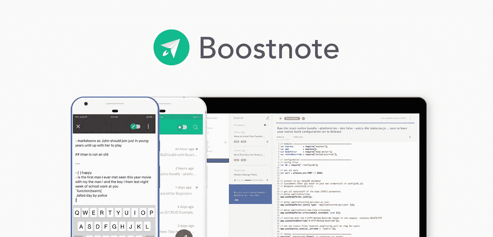
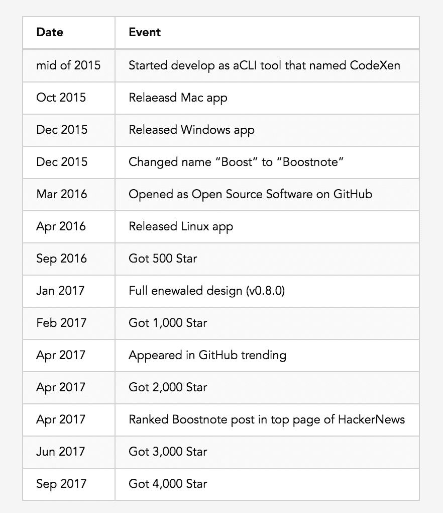
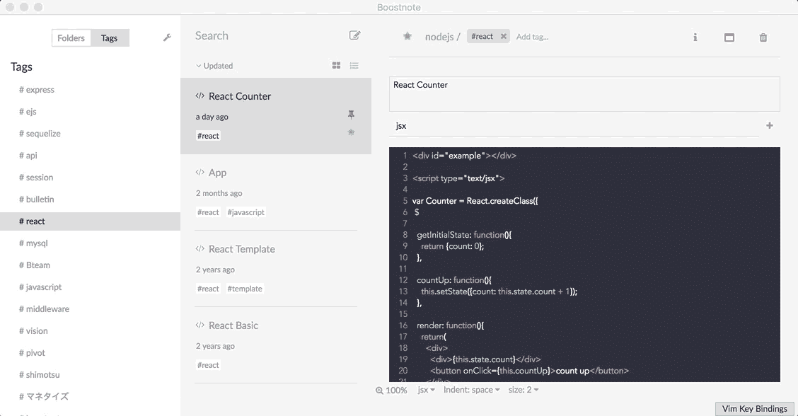
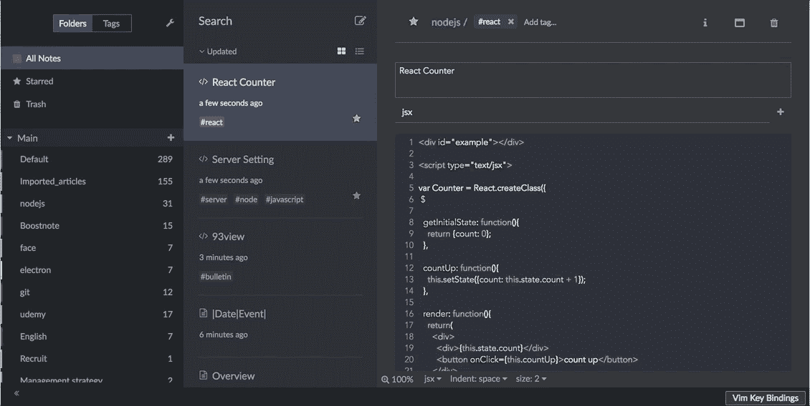
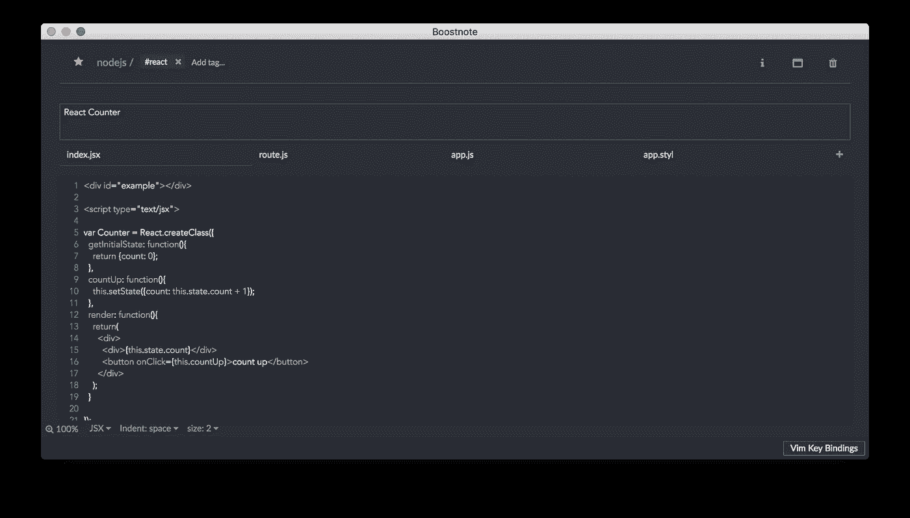
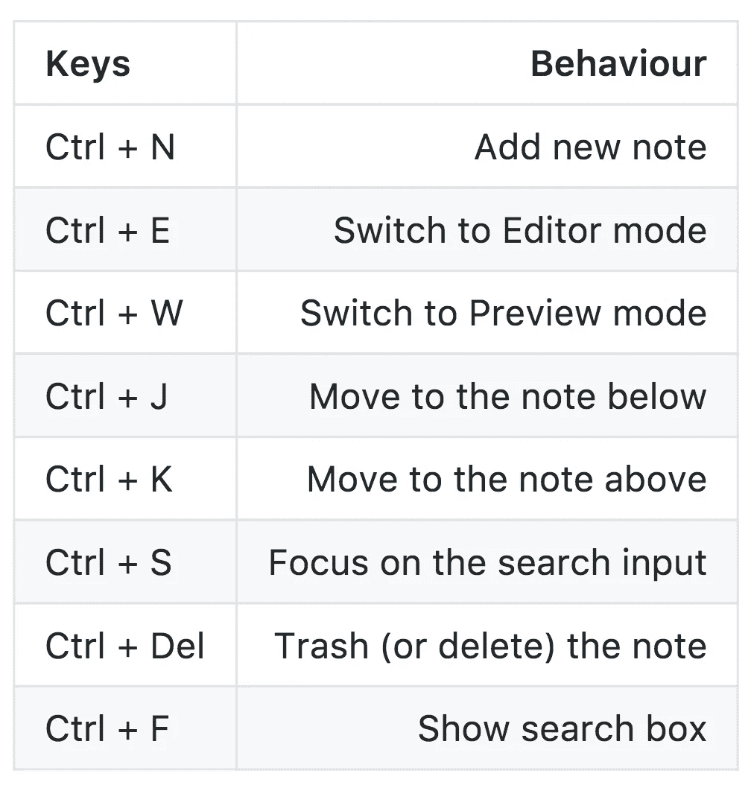
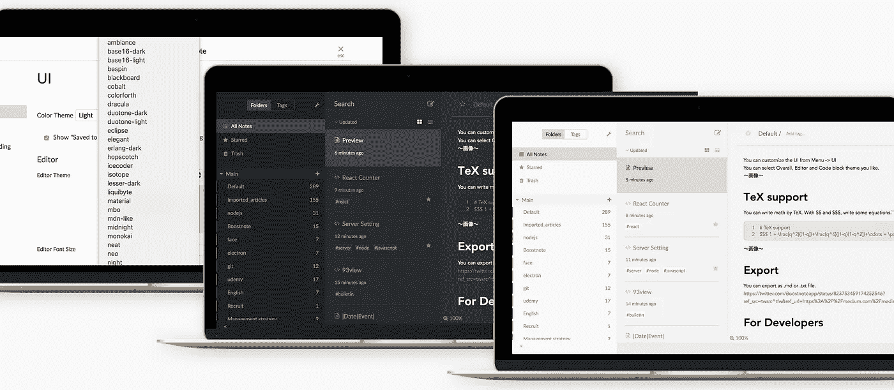
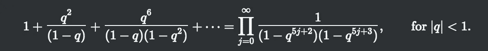
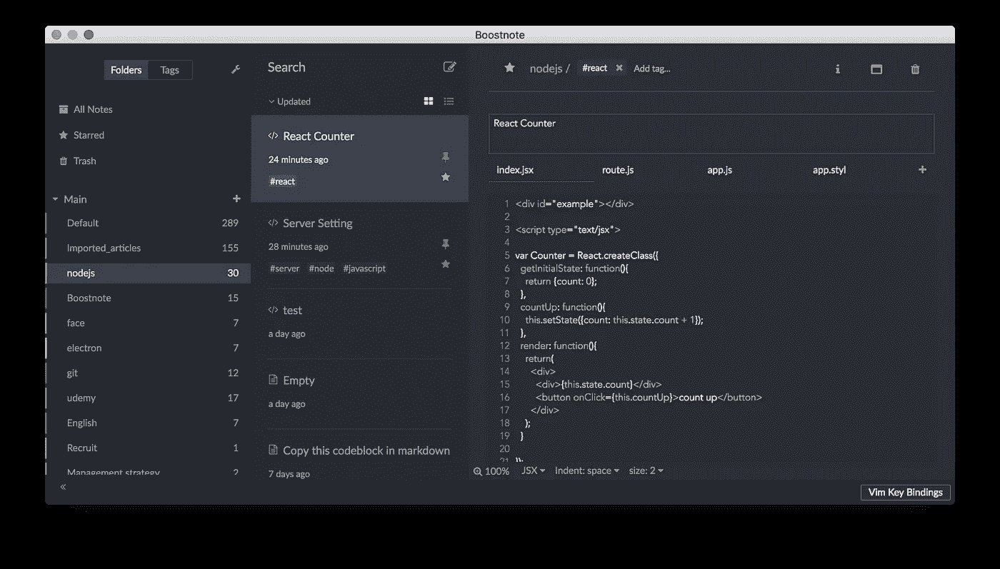

# 提升你的快乐、生产力和创造力。

> 原文：<https://medium.com/hackernoon/boostnote-boost-your-happiness-productivity-and-creativity-315034efeebe>

# 概观

Boostnote 是一款面向程序员的开源笔记 app。

来自 200 多个国家和地区，在 [GitHub](https://github.com/BoostIO/Boostnote) 获得 4800 多颗星🌟



[https://boostnote.io](https://boostnote.io)

# 入门指南

为了使用 Boostnote，您需要从这里下载应用程序。

Boostnote 应用程序适用于 Mac、Linux、Windows、Android 和 iOS。

[](https://boostnote.io) [## Boostnote 注意

### Boostnote 是一款为程序员设计的开源笔记应用。

boostnote.io](https://boostnote.io) 

# 历史

Boostnote 是作为一个 CLI 工具启动的，在第一阶段(2015 年年中)命名为 CodeXen。

这是按时间顺序排列的 Boostnote 的历史。



# 快速启动

按下 Cmd + N 键，然后选择降价通知。然后你就可以开始用 markdown 写任何你想写的东西了。

# 特征

有很多程序员觉得有用的特性。
标记
明星

钉住笔记
与多设备同步
查找器
语法高亮
Markdown
片段
离线应用
快捷键
Vim 键绑定
可定制 UI
TeX 支持
导出
快速预览
回收站
搜索

# 标签

您可以使用标签添加和过滤。



Tag

# 星星

您可以给便笺加星号，并在加星号的文件夹中查看它们。



Star

# 降价

这是最重要的功能，你可以在 Boostnote 中使用 markdown。

# 小片

您可以在一个便笺中组织多个片段。



Snippet

# 快速预览

你只需点击切换模式。


Edit and Preview

# 离线应用程序

Boostnote 完全是离线应用。这意味着没有注册和同步。

当你想同步笔记时，你需要使用 Dropbox 或 GoogleDrive 等其他服务。

# 与多台设备同步

你用的是 Mac，Windows，Linux，Android 还是 iOS？您可以在多台设备上同步 Boostnote 数据。

[](/boostnote/boostnote-mobile-how-to-synchronize-with-dropbox-95d845581eea) [## 如何在多个设备间同步数据

### 你们可以在多种设备上安装 boost note——Mac、Windows、Linux、Android 和 iOS——并使用…

medium.com](/boostnote/boostnote-mobile-how-to-synchronize-with-dropbox-95d845581eea) 

# 快捷指令

有很多有用的快捷方式。



厉害！您也可以使用 Vim 或 Emacs 键绑定。

从首选项-> UI 设置您的键绑定。**之后别忘了重新加载 app！**

# 可定制的用户界面

你可以从 Preferences -> UI
自定义 UI 你可以选择你喜欢的整体、编辑器和代码块主题。



Multi themes

# TeX 支架

你可以用 TeX 写数学。用$$和$$$写一些方程。

```
# TeX support$$$ 1 + \frac{q^2}{(1-q)}+\frac{q^6}{(1-q)(1-q^2)}+\cdots = \prod_{j=0}^{\infty}\frac{1}{(1-q^{5j+2})(1-q^{5j+3})}, \quad\quad \text{for }\lvert q\rvert<1\. $$$
```



# 出口

您可以导出为。md 或者。txt 文件。

# 固定到笔记

固定的便笺显示在便笺列表的顶部。



Pin

# 对于开发人员

这部分是给开发者看的。

出问题了！可以更好！
没事的。 **Boostnote 就是 OSS** 。让我们一起改进 Boostnote🤘

[](https://github.com/BoostIO/Boostnote) [## BoostIO/Boostnote

### 🚀Boostnote 是一个开源的笔记应用程序，专为像你一样的程序员设计。

github.com](https://github.com/BoostIO/Boostnote) 

# 技术

Boostnote 是用 React + Electron + CSSModules 构建的。CodeMirror 用于编辑器。

Boostnote Mobile 是用 ReactNative 制造的。

# 发展

当你开始开发 Boostnote 的时候，请看看这个。

简而言之，在本地运行 Boostnote 有 3 个步骤。

> 1、拉库$ git 拉[https://github.com/BoostIO/Boostnote.git](https://github.com/BoostIO/Boostnote.git)
> 2、运行$ yarn
> 3、运行$ yarn 运行 dev-start

确认启动 app 后，就可以开始开发 Boostnote 了。

参考文献:[https://github . com/BoostIO/boost note/blob/master/docs/build . MD](https://github.com/BoostIO/Boostnote/blob/master/docs/build.md)

# 社区

Boostnote 是作为自由软件发布的，所以没有支持。但是有一个社区。

欢迎加入我们的 [Slack 团队](https://github.com/BoostIO/Boostnote#slack-group)打个招呼！
或者，问什么关于[的问题](https://github.com/BoostIO/Boostnote/issues)！

感谢您的宝贵时间！享受 Boostnote😆🌟

# * Boostnote 相关信息

*   [储存库](https://github.com/BoostIO/Boostnote):欢迎来到我们的社区！🚀
*   [10hz](https://boostnote.io/team/) :创意黑客团队的 Boostnote。**我们发布了测试版**🏃💨
*   [推特](https://twitter.com/boostnoteapp)
*   [Reddit](https://www.reddit.com/r/Boostnote/)
*   [Boostnote 商店](https://boostnote.paintory.com/):享受我们可爱的物品吧！产品被运往世界各地🌏
*   [通过 Bountysource 支持我们](https://salt.bountysource.com/teams/boostnote):感谢您的支持🎉