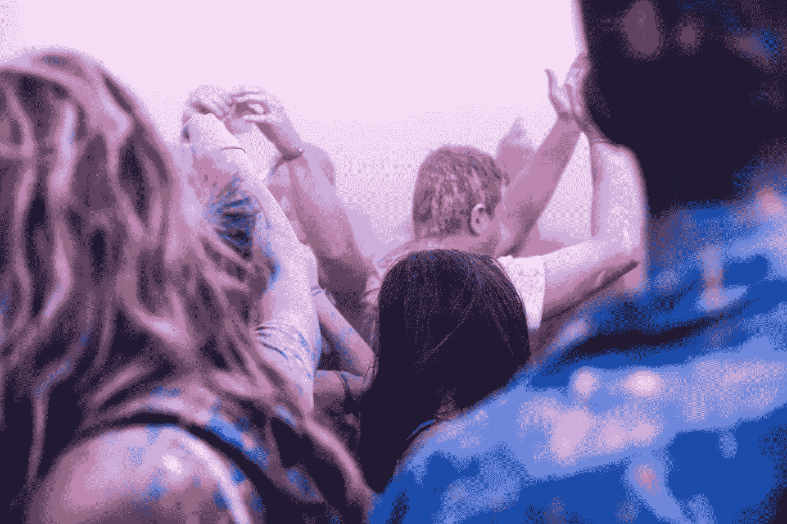
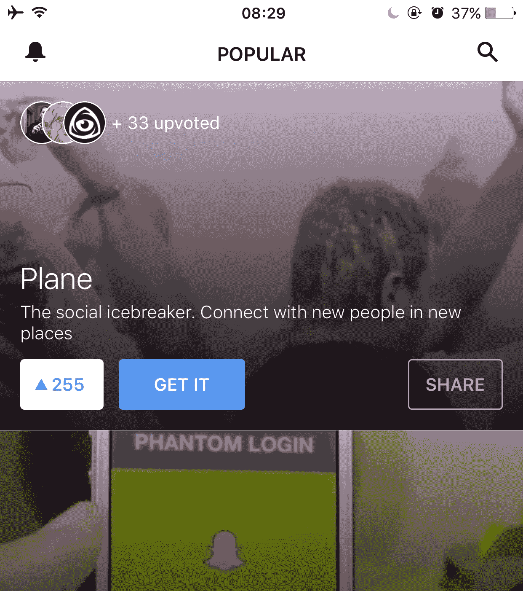
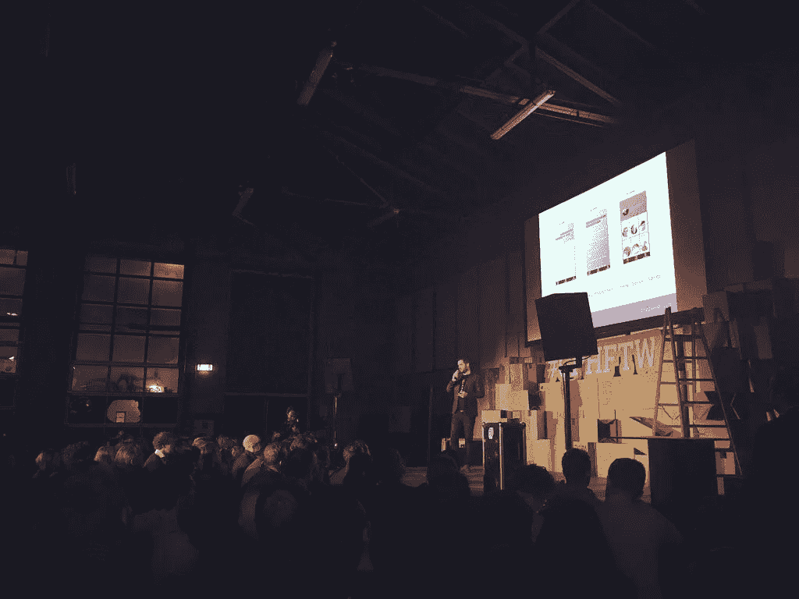
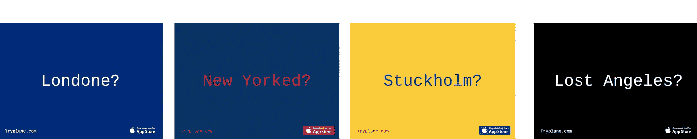
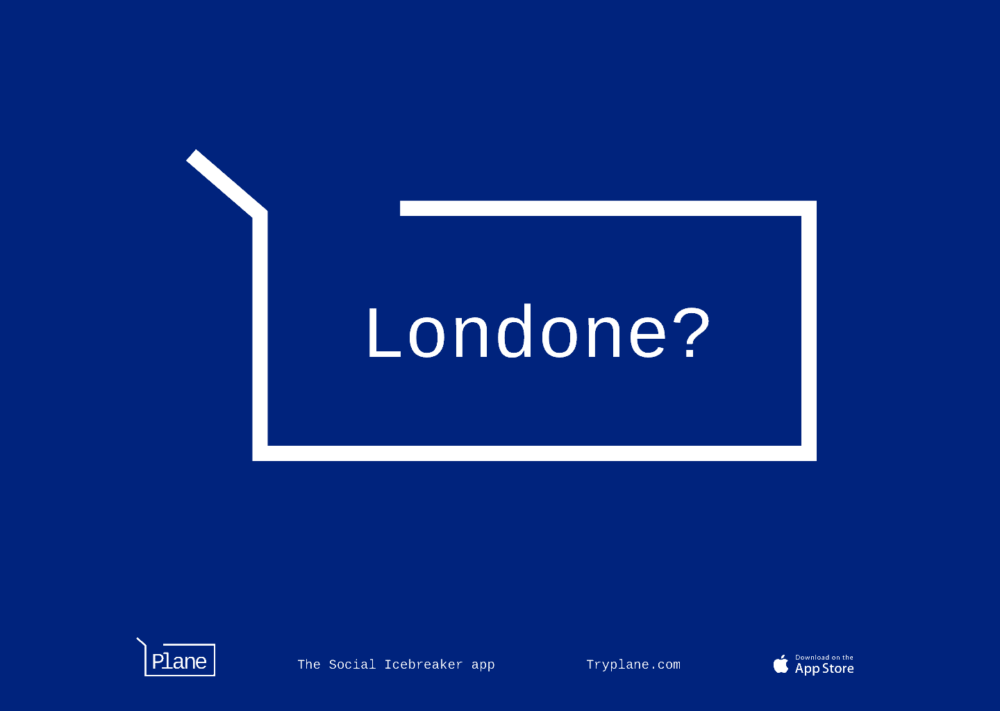
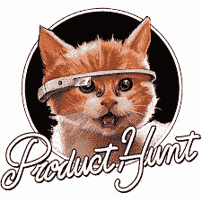

# 自举营销应用程序发布。

> 原文：<https://medium.com/hackernoon/bootstrap-marketing-an-app-launch-697eeb29f04e>

## 如果你是一家小公司，你就是你的广告代理。你负责定位品牌、设定基调和引导创意方向。思考你的广告是最重要的，这并不意味着你是一个策划全球广告活动的疯子。

在 Plane 发布之前，我们一直在创造内容和集思广益的营销理念。当然，有些比其他的更实用，而且几乎所有的都是用很少的预算完成的。在这篇文章中，我将与你分享我们所做的一些基础工作，以及关于我们如何看待广告对我们的意义的建议。

分解一下:

1.  灵感来自纽约
2.  碰运气
3.  现在具体点
4.  小心镜头闪光
5.  离开办公室
6.  （被突出宣传的）明星或大人物
7.  媒介就是媒介
8.  它看起来像什么

## 1.灵感来自纽约。

去年在纽约拍的这张照片激发了这篇文章。我们都知道科技已经成为主流，当你在时代广场看到一个巨大的 Snapchat 标志与这个星球上最大的品牌擦肩而过时，它就说明了一切。

我们都以规模和成功为目标，当然我们不能像 Snapchat 那样花钱买同样的位置。但是我们可以考虑如何在街上向消费者传达我们的产品。

你在时代广场的活动会是什么样的？

Snapchat in Times Square.

## 2.试一试。

我们生活在一个视觉世界。人们对图像有一种情感上的联系，正如一句古老的谚语所说，“一幅画胜过千言万语”。

在过去，产品会付钱给代理机构，让他们付钱给摄影师，让他们付给模特大量的钱来拍摄“英雄形象”。如今，你可以跳过这一步，直接用图片来展示你的品牌。我们用了[Splitshare](http://www.splitshire.com/holi-festival/) 选了这个。

**当你想到你的生意时，你会想到什么？**

Featured on [飞机。这不仅有助于你练习现场推销技巧，还能创造出你可以在营销中重复使用的媒体。活动结束后的第二天，摄影师联系了我们，询问我们是否想要她拍摄的照片。这些照片现在是我们媒体包的一部分。

**你下次什么时候可以起来谈论你的创业？**

Presenting Plane at #CPHFTW Oct 2015

## 介质就是介质。

Medium 非常适合讲故事，并与积极参与的观众分享您的进步。如果你已经做了上面的一些，帖子应该会自己写出来。试着找到一个有趣的角度，真诚地写出令人愉快、诚实和有帮助的文章。

Expect Medium to become the publishing tool for most in 2016.

## 它看起来像什么。

当执行广告活动的时候，考虑一下你想要创造的语气和广告的个性。我们的观点是一个简单的文字游戏，包括一个 CTA。

飞机是社交破冰船。在新的地方与新的人联系。寻找志同道合的人，或者简单地了解你周围发生的事情。](https://medium.com/u/b8b4445269d0#CPHFTW </strong> </a>活动中向 600 人展示<strong class=) 

[我们真的很兴奋飞机现在可供您使用。IOS 版可以免费下载。](http://bit.ly/planeapp) (Android 即将推出)我们有很多计划，希望听到您的反馈和问题。

Meow.

我们将在下周写一篇后续文章，介绍自发布以来发生的所有事情。包括我们如何在今年的 [SXSW](https://medium.com/u/4140f02336cb?source=post_page-----697eeb29f04e--------------------------------) [上被](https://www.producthunt.com/e/sxsw-2016-apps-to-watch)[产品搜索](https://medium.com/u/b8b4445269d0?source=post_page-----697eeb29f04e--------------------------------)选中并被选为“值得关注的应用”。

玩得开心，度过愉快的一天。

> [黑客中午](http://bit.ly/Hackernoon)是黑客如何开始他们的下午。我们是 [@AMI](http://bit.ly/atAMIatAMI) 家庭的一员。我们现在[接受投稿](http://bit.ly/hackernoonsubmission)并乐意[讨论广告&赞助](mailto:partners@amipublications.com)机会。
> 
> 如果你喜欢这个故事，我们推荐你阅读我们的[最新科技故事](http://bit.ly/hackernoonlatestt)和[趋势科技故事](https://hackernoon.com/trending)。直到下一次，不要把世界的现实想当然！

