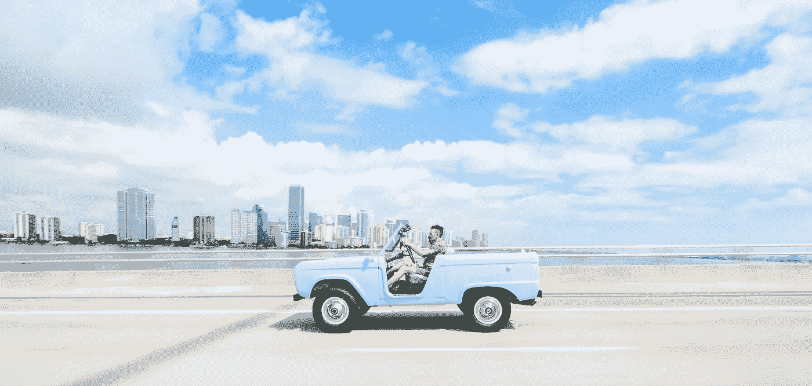
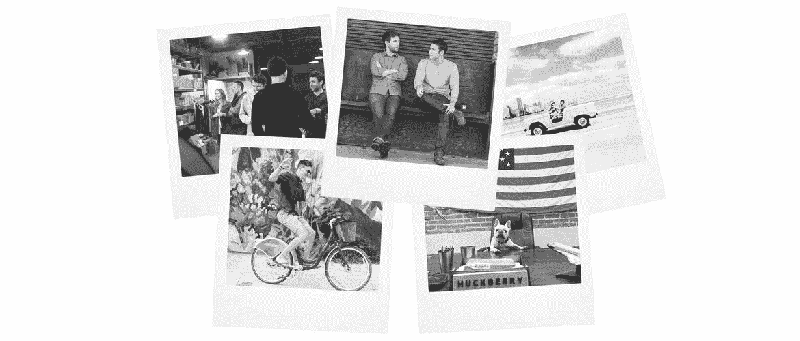
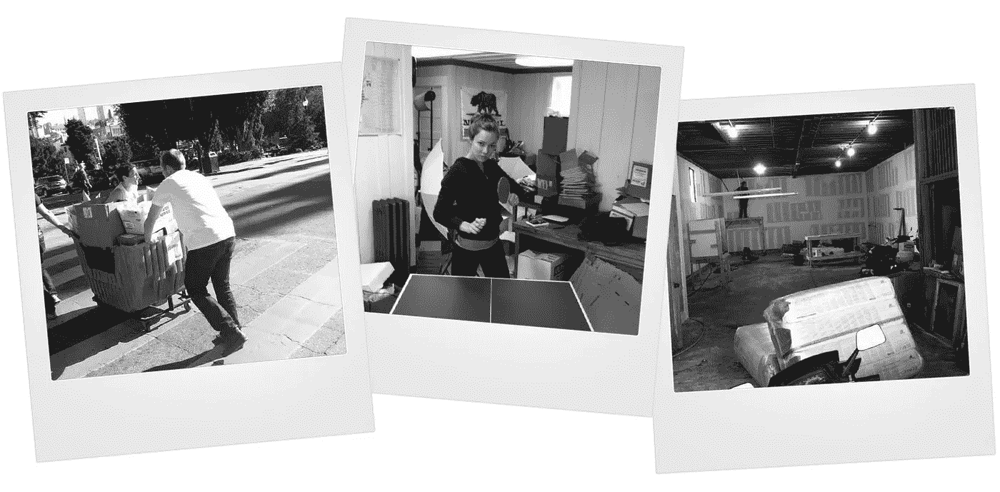

# 自力更生，有利可图，骄傲:哈克贝里起源的故事

> 原文：<https://medium.com/hackernoon/bootstrapped-profitable-and-proud-5f89ead20ea>

Behind the scenes of [our first Huckberry Field Guide](https://huckberry.com/special-projects/lookbooks/miami), where we learned there’s quitting-your-job risky, then there’s driving-a-doorless-and-seatbeltless-vintage-bronco risky

五年前，我和里奇在斯阔谷后面摇摇晃晃的缆车上冻得要死，当时我们决定*去尝试一下*。

回过头来看，我们太天真了，不知道它到底是什么*,但我们肯定知道它*不是什么*——在我们的余生中，每周制作 90 个小时的电子表格。然而，鼓起勇气离开我们安全、有利可图的工作并不容易。正如杰瑞·宋飞可能会说的那样，这就像翻倒一台自动售货机——你不能只是把它推倒，你必须来回摇晃几次。*

下班后，我们在无数的主播节目中讨论过我们的想法，我们从骨子里知道哈克贝里需要存在。当然有男装店。探险杂志也是。然而，外面没有任何东西直接与我们对话——25 岁的小伙子住在城市里，但*生活在户外——我们设想了一个品牌，它是商店、杂志和灵感的同等部分，帮助人们吸取生活的精华。*

因此，在 2010 年夏天，我们辞掉了工作，每人拿出自己的积蓄投资 1 万美元，成立了 Huckberry LLC 公司，开始为自己搔痒。

> 对我们来说，行动是，而且永远是，果汁。

我们选择哈克贝里这个名字是因为我们都喜欢马克·吐温的《哈克贝利·费恩历险记》,并且认为哈克贝里是我们希望我们的品牌所体现的冒险精神的完美图腾。更实际的说，[Huckberry.com](http://www.huckberry.com)在 GoDaddy 上售价 9.98 美元，而 Huckleberry.com 没有。

我们去了贸易展览，在我们的视觉上销售我们最喜欢的品牌。大多数人看着我们自己设计的名片，开心地笑了笑，说不。尽管有足够多的人说是，但可能不是因为我们在哪里，而是因为我们要去哪里，所以要在我们身上冒险。

# *你总是扔掉你的第一个煎饼……*

受到 37 Signals '(现为 [Basecamp](https://basecamp.com/) ) *自举、盈利、骄傲的*博客系列文章的启发，我们决定不再追求风险投资。我们想按照自己的方式发展业务。走向巴塔哥尼亚和它的有机*让我的人去冲浪*品牌，远离追逐它的风险投资推动的繁荣或萧条品牌。

所以我们抓紧了。我们在公寓外工作，从头到尾阅读 Photoshop for Dummies，并设计了 Huckberry 1.0。我们朋友的弟弟吉米在加州大学伯克利分校读大三的时候，在课间帮忙编写代码。我们的第一个网站并不漂亮，但它很有效，正如一位导师曾经告诉我们的那样，*你总是会扔掉你的第一个煎饼*。

2011 年 4 月，我们打开了开关，Huckberry.com 的[上线了。](http://www.huckberry.com)

我们的[社区](http://www.twitter.com/huckberry)开始成长……慢慢地。我们没钱做广告，所以我们发挥创意，与男子气概艺术合作(再次感谢布雷特)👊)和 [*外*](http://www.outsideonline.com/) 杂志。品牌开始询问如何在 Huckberry 上展示他们的产品。当我们的公寓开始堆满存货和纸箱时，我们的室友和当地的咖啡师建议我们买一间办公室。所以我们在旧金山的北海滩附近租了一套房子，每月 600 美元。我们感觉像国王；没关系，我们的城堡只有 296 平方英尺(嗯，如果你包括浴室的话，大约 350 平方英尺)。

我们建立了自己的团队。阿里加入了。杰夫。亚历克斯。甚至伊莱，我们当地的咖啡师。那个团体里没有自负的人。每天下午 4 点，铅笔被放下，盒子、啤酒和胶带被打包。下午 5 点 25 分，我们会把每个箱子搬到街上，抓住一辆邮车，在暴风雪中推着它上山去邮局。如果你曾经在旧金山生活过，你就会知道“双向上坡”这句话是对的。

当我们的存货开始涌入浴室时，我们开始寻找仓库。当我们不得不在屋顶上过夜储存存货时，我们真的开始寻找仓库。2012 年春天，我们在旧金山的索玛社区找到了一个，搬进去后不久，阿里决定它可以使用 12 英尺的岩壁。

在 2016 年 1 月写下这一切的时候，很难相信，自从阿里、巴迪和 Sy 在我们的旧仓库里建造那堵岩墙以来，已经过去了三年多。感觉*如此之近，却又如此之远*(如果你意识到我们刚刚丢了一些霍尔&奥茨，那你真行)。

变化太大了。以前我们一天发几十个包裹，现在成千上万了。我们的团队已经从在 48 度的仓库里穿着滑雪夹克的六个冷酷的灵魂发展到在设计区的(加热的)办公室里工作的 50 多人。仅在过去的一年里，我们就推出了我们的 [*大使计划*](https://huckberry.com/special-projects/ambassadors/) ，介绍了我们的 [*艺术家 Spotligh*](https://huckberry.com/special-projects/artists/five-minutes-with-ty-williams) *t* 和 [*野外指南*](https://huckberry.com/special-projects/field-guides/the-north) 系列，运送了[我们的第一份印刷目录](https://www.instagram.com/p/-zHJ1bOCAH/)，并与我们的朋友克里斯·伯克德(Chris Burkard)合作了我们的下一期*探险者资助*。

然而，重要的事情还是一样的。正如苹果公司创始人史蒂夫·沃兹尼亚克曾经说过的那样，*我在苹果公司做的最好的事情都来自于 a)没有钱，b)从来没有做过。我们做出来的每一件东西都非常棒，我这辈子从来没有做过这样的事情。当我们接近五周年纪念日的时候，沃兹会很高兴地知道，我们仍然 a) 100%地自力更生，b)努力打造电子商务领域最鼓舞人心、最有创造力、最赚钱的公司。*

我们一直相信绝地武士从原力中汲取力量。我们的顾客是 T21 的乡巴佬，我们只是服务员。作为一家 100%由客户出资的公司，这再正确不过了。他们从第一天起就在我们的角落里，陪我们度过成长的痛苦，错误的开始，还有那次我在拉斯维加斯和妻子跳舞时不小心上传了六张我口袋里面的照片(*归咎于酒精*)。

我想里奇和我现在意识到，当我们那天在斯阔决定尝试 it 时，那是一次冒险。对我们来说，行动是，而且永远是，果汁。

前方的路还没有铺好，但是很开阔，我们迫不及待地想和你分享这段旅程。

外面见。【[H](http://www.huckberry.com)

安迪·福尔奇

## 游览[huckberry.com](http://www.huckberry.com)并跟随我们一起前往[这里](http://www.twitter.com/huckberry)或[这里](http://www.instagram.com/huckberry)或[这里](http://www.facebook.com/Huckberry)

PS —想加入我们的团队吗？我们努力在电子商务领域建立最鼓舞人心、最有创造力、最赚钱的公司，并一直在寻找聪明的创意人才加入我们。如果你有兴趣，你可以在这里申请。

> [黑客中午](http://bit.ly/Hackernoon)是黑客如何开始他们的下午。我们是阿妹家庭的一员。我们现在[接受投稿](http://bit.ly/hackernoonsubmission)并乐意[讨论广告&赞助](mailto:partners@amipublications.com)机会。
> 
> 如果你喜欢这个故事，我们推荐你阅读我们的[最新科技故事](http://bit.ly/hackernoonlatestt)和[趋势科技故事](https://hackernoon.com/trending)。直到下一次，不要把世界的现实想当然！

