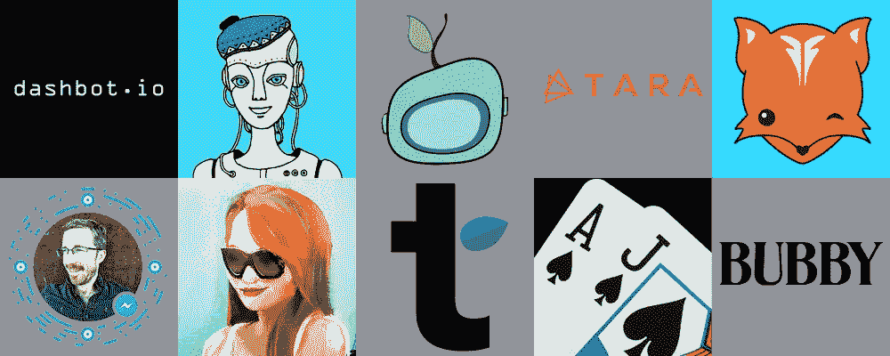
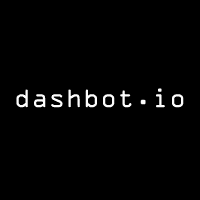
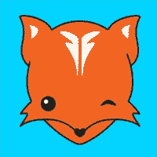
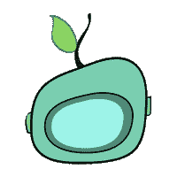
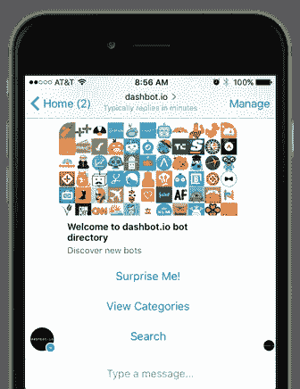

# 机器人演示之夜

> 原文：<https://medium.com/hackernoon/bot-demo-night-937a6b642dad>

昨晚我们在三藩市的 T4 WSGR T5 举办了一场 T2 机器人演示。

这是一个很好的机会来看看人们在不同平台上用机器人做什么。

这个夜晚展示了用于旅行、寻找食物、团队建设、娱乐的机器人，甚至还有用于寻找约会或寻找承包商的机器人…不是同一个机器人！:)

## 仪表板机器人

我们的联合创始人丹尼斯以对 [Dashbot 的](https://www.amerritt.com/dashbot/)分析平台的概述拉开了晚会的序幕。

如果你正在制作一个机器人，请登录 www。这是一个更好地了解你的机器人并提高用户参与度和忠诚度的好方法。我们最近增加了关于保留和消息统计的额外指标。我们还推出了真人注入功能，使您能够将消息插入会话流，就像您是机器人一样。我们不断增加新功能，请随时提供反馈和建议。

## 民众

机器人演示系列包括:

[**altera . ai**](http://alterra.ai)

来自 Alterra 的 Denis 演示了用户如何通过自然对话发现新的旅游目的地以及预订酒店。“我想去一个暖和点的地方，谢谢…”

[**二十一点**](http://www.facebook.com/Blackjack-Bot-1040239006064521) **/聊天城市**

瑞特，最近开发了一个 21 点游戏里面的信使。它建立在他的平台 ChatbotCity 之上。

游戏是机器人的一个有趣领域。看看开发商和发行商在对话游戏方面有什么进展将会很有趣。就像移动应用程序一样，开发人员如何利用手势甚至麦克风来制作有趣的游戏，在对话中可能会有一些很酷的想法。我们也可以继续玩佐克游戏。

[**布比**](http://bubby.love)

Bubby 的 Stephanie 演示了他们的配对短信机器人。约会和关系似乎是机器人感兴趣的领域。

[**克里斯·梅西纳**](http://m.me/messinabot) **Bot**

Ethan、Esther 和 Chris 演示了 Messina 机器人——该机器人使人们能够安排与 Chris 的约会，寻求产品搜索帮助，并从 Chris 那里获得更多新闻。

对于机器人来说，这是一个有趣的领域——个人机器人可以卸载一些常见的请求和任务。我们见过其他人拥有艾斯特自己的机器人和 T2 莎拉机器人，甚至还有 T4 猫机器人。

[**Foxsy**](http://m.me/foxsybot)

Yoyo 展示了 Foxsy 机器人——一个类似约会机器人的易燃物。

[**Growbot**](http://www.growbot.io)

贾斯汀演示了 grow bot——一个团队反馈机器人。这不仅是一种为队友提供快速表扬的方式，而且你可以通过机器人的使用开始更多地了解公司的文化。有趣的是，他们最初有不太积极的反馈功能，但正如贾斯汀所描述的，工作场所还没有做好准备…

[**杰西·胡曼尼/拉线**](http://www.pullstring.com)

Pullstring 的 Scott 演示了 Jessie Humani——这是娱乐机器人的一个很好的例子。用户可以与杰西互动，杰西是一位需要做很多决定的年轻女士。尝试过之后，其中一个好处是，即使你的回答可能不完全符合对话，互动也能相当顺畅地进行。你不会得到杰西那种“我不知道”的回答。

Pullstring 也是使命召唤机器人的创造者，该机器人在 24 小时内有超过 600 万条消息。

[**Tara.ai**](http://tara.ai)

Syed 演示了 Tara.ai 用于外包项目的机器人，如构建移动应用程序。机器人以对话的方式询问项目的细节，然后或者提供项目的报价，如果人工智能识别出规格与过去的类似项目相匹配，或者指引你到项目经理那里完成这个过程。

[**风流**](http://tastefulapp.com)

Ravi 演示了 Tasteful，这是一个用于查找当地餐馆的多平台机器人。

## Bot 目录

我们的网站列出了许多可用的脸书和 Slack 机器人，我们有一个脸书机器人目录，使您能够发现，搜索和评价信使机器人——它在 http://m.me/dashbot.io 可用

## 直到下一次…

“机器人空间”周围有一个充满活力的社区。我们有一个满屋子的与会者，许多人在官方结束后继续谈论机器人。

请继续关注我们的下一个事件！

> [黑客中午](http://bit.ly/Hackernoon)是黑客如何开始他们的下午。我们是 [@AMI](http://bit.ly/atAMIatAMI) 家庭的一员。我们现在[接受投稿](http://bit.ly/hackernoonsubmission)，并乐意[讨论广告&赞助](mailto:partners@amipublications.com)机会。
> 
> 如果你喜欢这个故事，我们推荐你阅读我们的[最新科技故事](http://bit.ly/hackernoonlatestt)和[趋势科技故事](https://hackernoon.com/trending)。直到下一次，不要把世界的现实想当然！

