# 带有 DialogFlow 和 Golang 的信使机器人

> 原文：<https://medium.com/hackernoon/bot-in-messenger-with-dialogflow-golang-fcbe6bee1341>

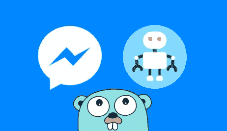

这篇文章是“ **ChatOps** ”系列文章的一部分。在这一部分，我将向你展示如何用 **DialogFlow** (以前的 **API)在 **Golang** 中创建一个**信使机器人**。AI** )来显示今天在电影院播放的电影列表。

注意:本演示中使用的所有代码都可以在我的 [Github](https://github.com/mlabouardy/dialogflow-watchnow-messenger) 上找到。

从公开 2 个端点的 **HTTP** 服务器开始:

**1 — GET /webhook**

处理**脸书**挑战验证。它只是寻找**验证令牌**，并以验证请求中发送的**挑战**进行响应。

**2 — POST /webhook**

处理来自**信使**的消息:

它调用 *ProcessMessage* 方法，该方法使用**脸书图形 API** 向用户发送一张 **GIF** 图像；

注:更多细节请查看我的教程 [**用 Go 和 Messenger API**](http://www.blog.labouardy.com/create-facebook-messanger-bot-with-go-and-messenger-api/) 构建一个 Facebook Messenger bot

创建一个[脸书页面。](https://www.facebook.com/pages/create)这将是你的机器人的**身份**:

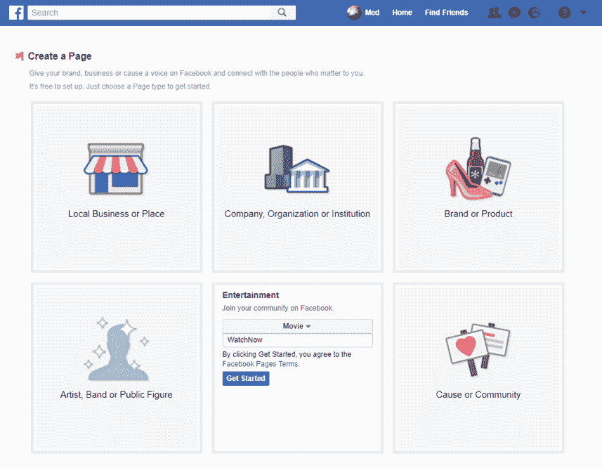

然后创建一个[脸书应用](https://developers.facebook.com/quickstarts/?platform=web)。它将是连接服务器和你的公共页面的中间件。

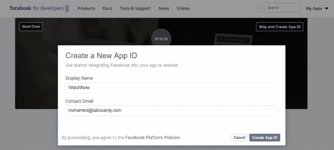

点击左侧菜单中的**添加产品**，然后选择**信使:**

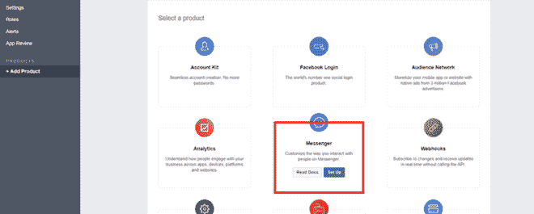

在**令牌生成**中，从下拉菜单中选择您刚刚创建的页面，它将生成一个令牌:

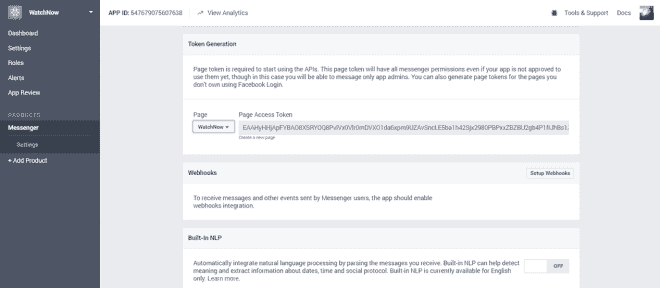

一旦你得到了你的**页面 _ 访问 _ 令牌**和**验证 _ 令牌**，确保你添加这两个作为服务器的环境变量:

> 导出页面访问令牌= "您的页面访问令牌"
> 导出验证令牌= "您的秘密"

在新的终端会话中，发出以下命令来启动 **HTTP** 服务器:

> 去跑步吧*。去

为了让公众可以访问我们的服务器，我将使用一个叫做 **ngrok** 的工具。它基本上在您的本地机器上创建了一个安全的隧道，以及一个您可以用来浏览您的本地服务器的公共 URL。

注意:请记住，要在生产中使用您的 bot，您需要使用:

*   **IaaS** 像 **AWS** 、 **GCP、Azure……**
*   **PaaS** like **Heroku，颖云……**

> ngrok http 5000

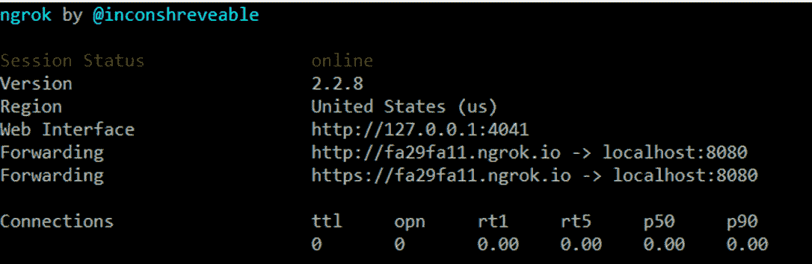

然后，在 **Webhooks 部分**点击**设置 Webhooks** 按钮:

配置好 **Webhook** 后，您需要订阅之前创建的页面:

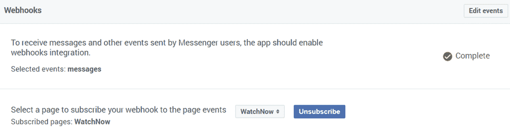

转到您创建的**脸书页面**，点击页面顶部附近的“**喜欢**按钮旁边的“**消息**按钮。开始发送你的页面消息，机器人应该回复一个 GIF**！**

**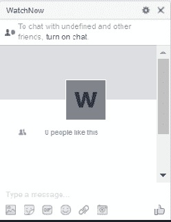**

**默认情况下，机器人应该用一张 GIF 图片来回应一切。**

**现在让我们让它变得更智能，为此我们将使用一个 **NLP** ( **自然语言处理**)后端，如 **DialogFlow** (以前的 **API。艾**):**

**所以在注册了 [Dialogflow](https://dialogflow.com/) 之后，创建一个新的代理:**

**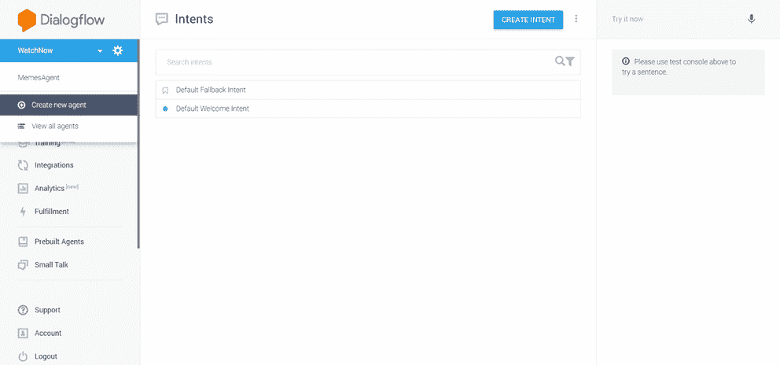**

**为其命名并填写必填字段:**

**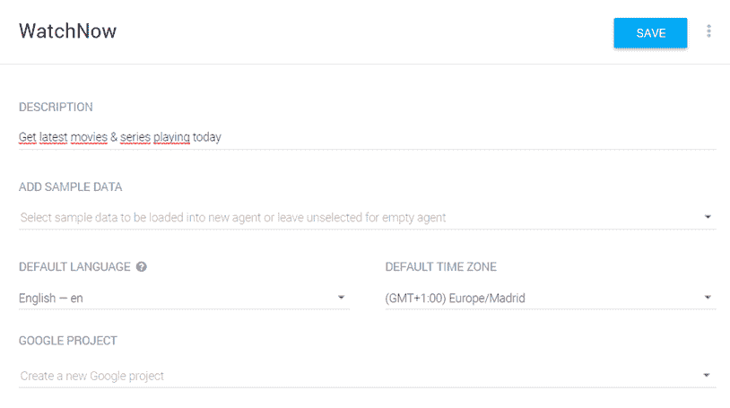**

**创建完成后，让我们使用 **DialogFlow** 的**闲聊**功能，赋予我们的机器人进行简单对话的能力:**

**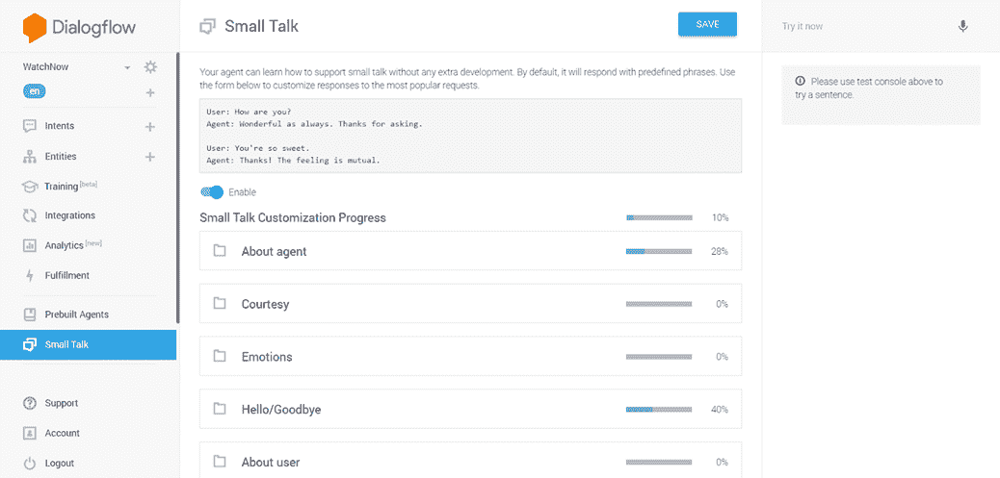**

**启用**闲聊**复选框。启用此功能后，我们导入了许多针对简单问题和短语的预定义答案。如果您不喜欢这些问题的回答，您可以轻松地更改:**

**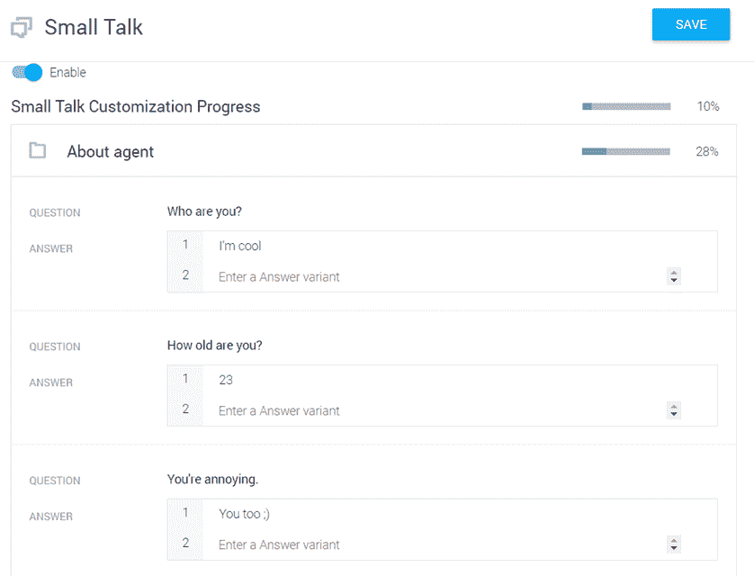**

**为了测试它，你可以使用右手边的**控制台**:**

**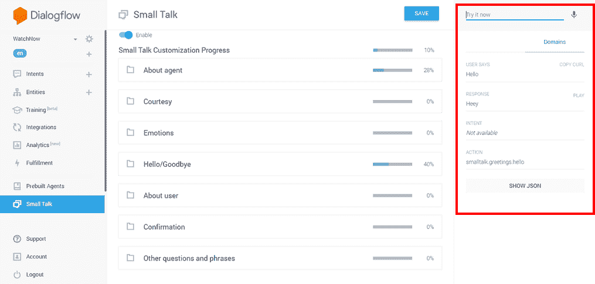**

**现在让我们在我们的机器人中使用这个特性。 **DialogFlow** 以不同的编程语言提供了许多[SDK](https://dialogflow.com/docs/sdks):**

****

**但不幸的是， **Golang** 没有 **SDK****

****

**但是不要难过，我做了一个 [SDK](https://github.com/mlabouardy/dialogflow-go-client) 来集成 **DialogFlow** 和 **Golang** :**

****

**所以，安装**dialog flow****Golang**库:**

> **去找 github.com/mlabouardy/dialogflow-go-client**

**返回 **DialogFlow** 仪表盘，复制**客户端访问令牌**:**

**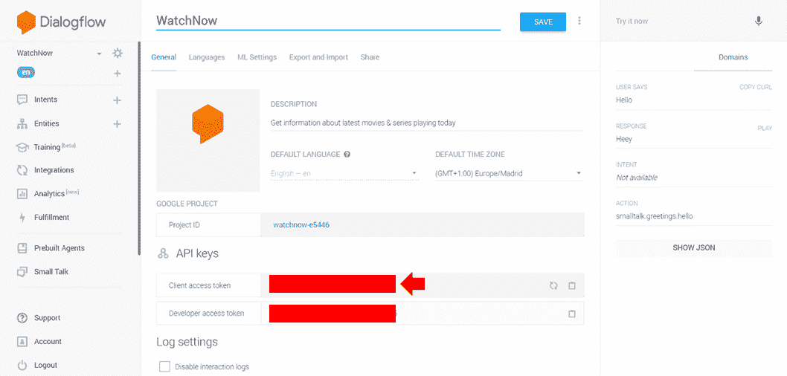**

**将其设置为环境变量:**

> **导出 DIALOG_FLOW_TOKEN= "您的令牌"**

**创建一个新函数，该函数将用户通过 **Messenger** 发送的消息作为参数，并将其传递给 **DialogFlow 客户端**以获得适当的响应:**

**进入**脸书页面**，点击**消息**开始聊天:**

****

**但这还不够，让我们更进一步，让我们的机器人告诉我们今天在电影院播放的电影，以及今天在电视上播放的连续剧。**

**创建一个[实体](https://dialogflow.com/docs/entities)，存储用户询问的节目类型(**电影**或**系列**):**

**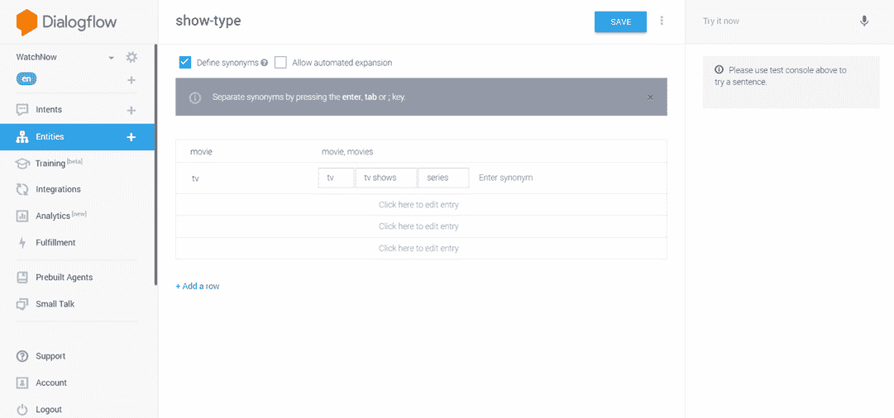**

**然后，创建一个新的[意图](https://dialogflow.com/docs/intents)，它表示用户所说的话和应该采取的行动之间的映射:**

**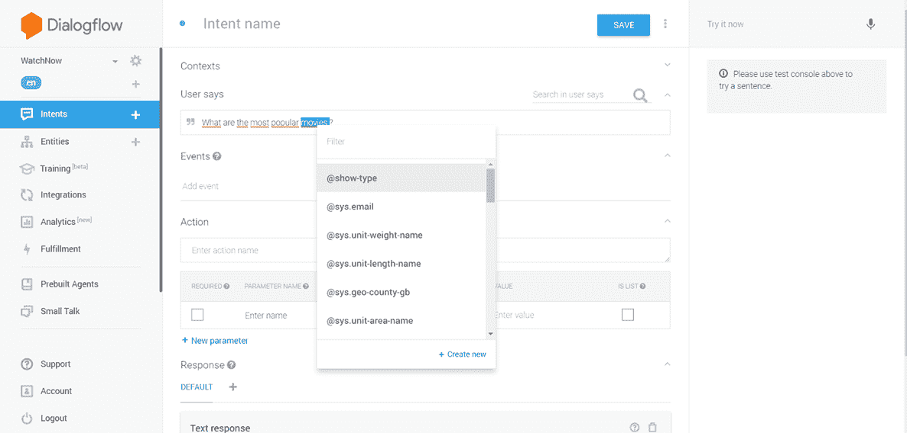**

**创造更多的问题:**

**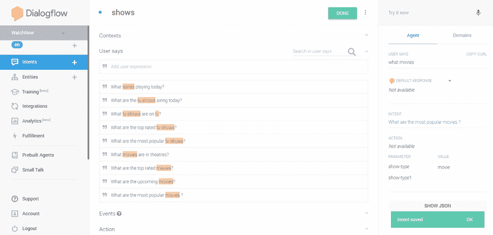**

**最后，更新 *ProcessMessage* 方法，如果意图名称为 *shows* ，则响应一个显示列表。该方法使用 [moviedb](https://github.com/mlabouardy/moviedb) 库来获取节目列表。**

**让我们测试来自**信使**的机器人:**

**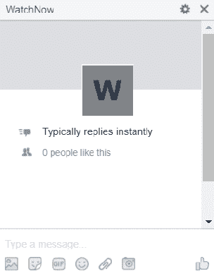**

**哇！！你已经在 **Golang** 中用 **DialogFlow** 创建了你的第一个**聊天机器人**！很简单，不是吗？**

**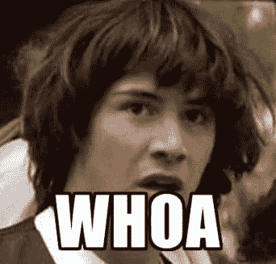**

**在接下来的教程中，我将向你展示如何用 **Lambda** & **API 网关**创建一个**无服务器 Messenger** **Bot** 。**