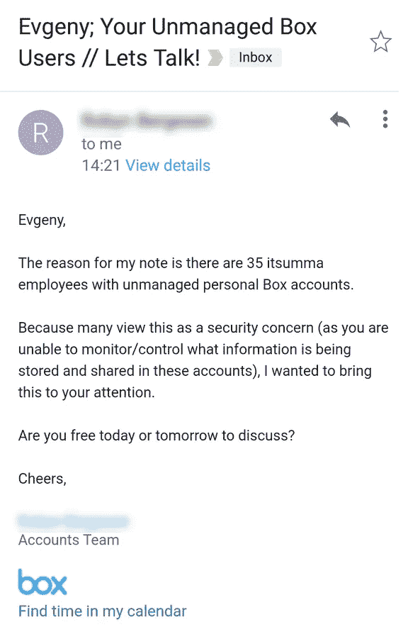

# Box.com 恐怖战术销售模式。有替代方案吗？

> 原文：<https://medium.com/hackernoon/box-com-terror-tactics-sales-model-is-there-an-alternative-4856f34ff02c>

image from [http://wallpapercave.com/scary-happy-halloween-wallpaper](http://wallpapercave.com/scary-happy-halloween-wallpaper)

我以前听说过这件事。B2C2B 附带一点吓人的销售营销。我不是真的批评它，我只是不确定它是否真的有效，是否合乎道德。现在我知道它确实有效，现在我确信它是不道德的。我今天收到了 Box 的一条消息，它声称我们的 35 名员工正在使用 Box，而我作为雇主无法控制他们使用这些服务。

Let’s talk?

即使我怀疑有一天会发生这种情况，但我真的很惊讶，我们这么多员工已经在 Box 上注册了。拥有一个员工友好的工作环境，并且知道我们还使用其他一些服务来存储文档，我不禁想知道，考虑到我们严格的信息存储政策，是否有一些文件不应该放在 Box.com 上？

那么这里的期望是什么呢？这封“营销”邮件让我想到了什么？作为雇主，我是否应该通过注册公司访问权限来接管私人员工账户？我是否应该与我的员工确认我们是否仍然遵守我们的信息存储政策？

我确实相信这样的“营销”是有效的，但是对员工来说并不“有效”。想象一下，会有一个药物滥用康复服务，向每个注册的人提供免费药物，然后向他们的朋友和家人发送电子邮件，告发他们？

更好地展示案例存在于我们的“技术”世界。有 Twilio 和 DigitalOcean，开发者开始使用这些服务，发现它们很有帮助，非常喜欢，以至于他们要求并鼓励他们工作的公司也使用它们。但有一个问题——它需要一个伟大的、几乎不可替代的产品。这让我们陷入了最大的困境——如果我们有一个“恐吓销售营销”选项，它值得使用吗？我们应该被允许吗？它将如何影响我们用户的生活？收到这类邮件的大型老派公司很可能会开始调查，并试图约束他们的员工，这一切都是因为用户喜欢你的服务。

应该有更好的办法。不如我们去找一些公司，告诉他们应该注册一个公司账户，因为我们的产品正是他们所需要的，而且他们的许多员工已经在使用了。他们需要做的就是去问他们自己的员工，找出为什么它对他们的生产力来说是必不可少的。

是的，这会影响你的转化率，但是等等，恐吓用户的策略会更影响转化率。你的用户群可能会停止使用你的服务，并开始告诉其他人不要使用，因为你向他们的老板报告了他们，这让你的老板很不高兴。

从长远来看，消极的动机对人没有帮助。让我们想想未来，你公司的未来，更重要的是，你的员工的未来。