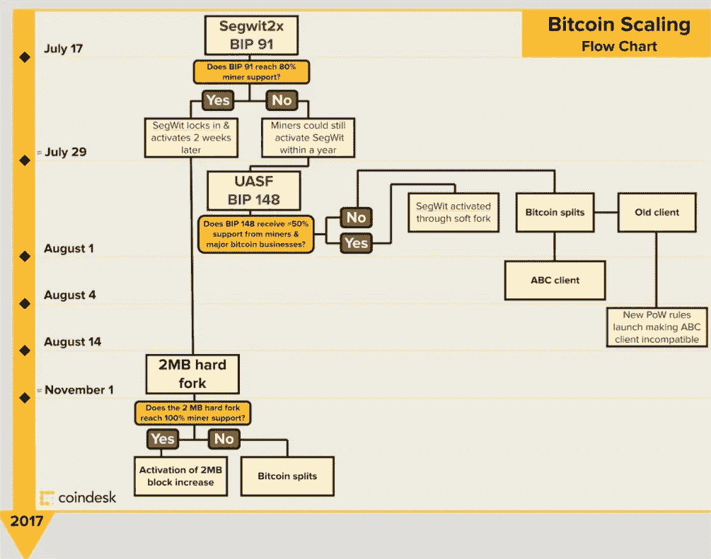

# 稳住自己，硬叉子来了

> 原文：<https://medium.com/hackernoon/brace-yourself-hard-fork-is-coming-cc5179e706b6>

*为了澄清任何疑问，我不代表任何加密平台或初创公司，我是一名个人投资者，并且非常相信* [*区块链*](https://hackernoon.com/tagged/blockchain) *和加密货币的未来。*

# 我们开始吧。

投资者不喜欢不确定性，无论是房地产、外汇、大宗商品还是加密货币，他们不知道如何管理自己对金钱的恐惧，但电脑知道:-)不确定性

大多数持有[比特币](https://hackernoon.com/tagged/bitcoin) (BTC)的人知道或应该知道，在接下来的几周内，将会有巨大的不确定性，因为目前的比特币可扩展性问题，有多个计划(BIPS)来解决它，但因为分布式的架构/人员，很难控制和同意这样的重大里程碑。

在软件开发世界中，你可以选择非常努力地工作并支持遗留代码，或者在没有遗留支持的情况下更快更便宜地工作并只使用新代码，硬分叉还是软分叉。

# 投资者视角

这些天，当普通投资者试图消化新闻时，他会感到非常困惑，我们有——bip 141、BIP148、BIP91、UASF、SEGWIT、SEGWIT2X、SOFT-FORK、HARD-FORK、OMGGGG :-(

## **他通常分析情况要简单得多:**

—最佳情况—新软件、更大的块大小 2MB、相同的硬币。

-最坏的情况—多个软件版本、多个块、硬币分割。

## **接下来，他会问自己这些问题:**

1.最好和最坏的可能性有多大？

2.我有别的选择吗？即以太坊

3.如果我愿意冒这个险，投资回报值得吗？

因此，因为这里没有科学预测，有这么多未知的利益，这取决于你愿意冒多大的风险。

# 我的预测

这些类型的事件让你思考密码的未来，以及是否有可能控制这个分布式的“怪物”。

看起来现在没有那么多的途径来实现 segwit 的软件支持和 2MB/8MB 硬分叉，而不是我们没有达成共识的许多其他途径，然后比特币分裂。

在这种特殊的情况下，我想每个人都害怕硬币分离，因此这种分离最终会被采用。