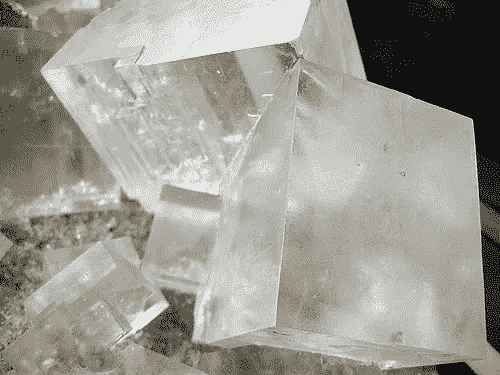
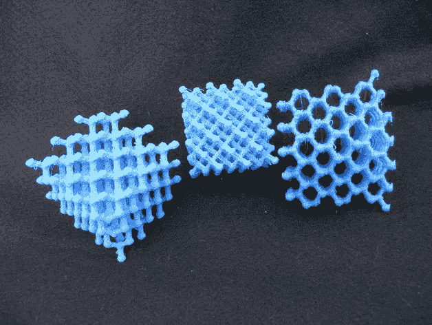
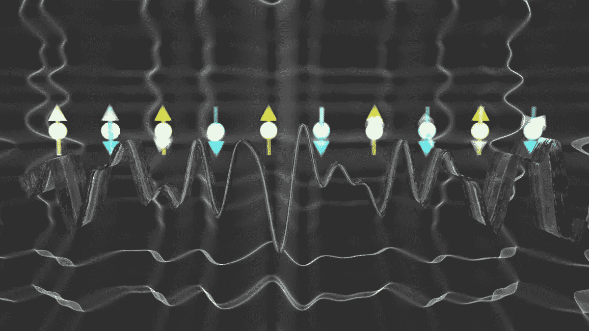
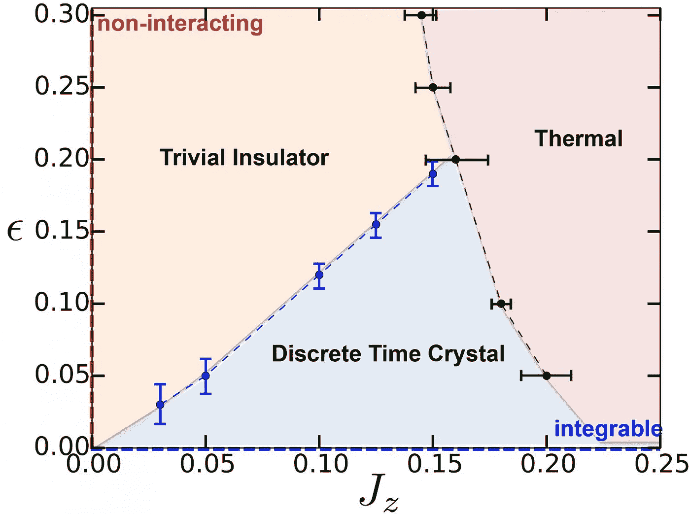
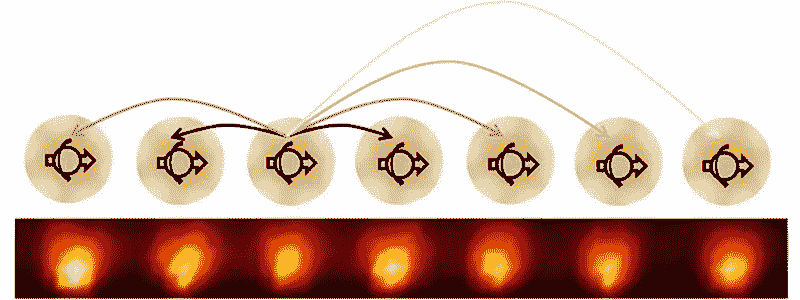
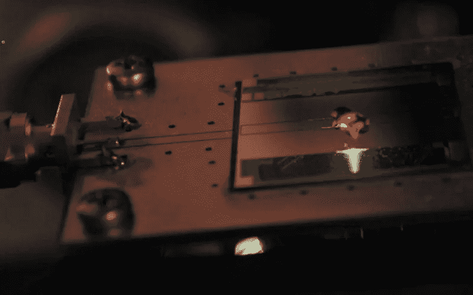

# 为了更好的计算能力而违反法律

> 原文：<https://medium.com/hackernoon/breaking-laws-for-better-computing-power-9fb39830e1c>

## 由于摩尔定律已经奄奄一息，科学家们想知道时间晶体能否解决量子计算的最大问题之一。

摩尔定律是经济学定律，而不是物理学定律。如果你想知道其中的区别，去问约翰·塞尔(这很有趣)。

同时，物理定律应该适用于任何地方和任何时间。例如，一个球以一定的速度朝一定的方向扔出去，无论它被扔向哪里，都不可避免地会走相同的距离(假设条件相同)。

但是，有些东西不尊重空间对称。例如，晶体中的一些原子(糖、盐和钻石)具有偏好的位置，这使得它们根据观察者的位置而看起来不同。

This is salt.

然而时间对称据说是牢不可破的。诺贝尔奖获得者弗兰克·维尔泽克越是思考这个问题，他的疑问就越多。时间和空间在许多方面是相似的，为什么我们不能打破第四维的对称性？

他的“时间晶体”的想法最早是在 2012 年提出的，尽管这个术语以前在生物学中被用来指一个定期重复的系统。Wilczek 和他在麻省理工学院的同事用这个类比来描述一种可能打破动量守恒的物质。

在其介绍中，威尔切克的论文*“量子时间晶体”*考虑了问题*“在一个封闭的量子力学系统中，时间平移对称性是否可能被自发打破”。翻译:我们能创造出打破另一个物理定律的物质吗？相当令人兴奋的东西，对不对？*

# 打破时间对称性

好吧，但那是很多大词。时间平移对称性到底是什么？物理学中的对称性有其特定的含义。它描述了各种各样的物理现象，其中你可以改变变量(当扔球时你在哪里)而不改变动力学(它最终在哪里)。

这是经典和量子力学的主干。如果你发现某样东西在任何时候任何地方都是一样的，你就发现了对称。那么，在一个封闭的系统中，有没有什么东西可以打破这个规则，在任何时候都不一样呢？

# 热平衡

处于热平衡的正常稳定的物质只有随机的内部运动。在固体物质中，那将是其组成原子的振动。随着时间的推移，这种嗡嗡声仍然是随机的。

提醒:时间是一种依赖于因果的构造。一件事先于另一件事，总是试图达到一种平衡的状态，或者说“零点能量”(或者说我们是这样认为的)。

在这样的“封闭系统”中，没有物质交换或外力(没有能量进出)，总动量应该是恒定的。

如果你能想象出一种特殊类型的物质可以在不使用任何能量的情况下移动，你可能会让一些物理学家感到紧张，因为这将打破时间平移对称性。这就是威尔切克的团队试图做的事情。

他们的论文描述了一个“简单”的模型，其中超导环中的带电粒子通过创建一个从一个时刻到下一个时刻在全球层面上不同的系统来打破连续时间平移对称性。

# 第一理论

威尔切克提出了一种物质，它在平衡状态下会永远运动*。*振荡是最基本的最低能量(或基态)状态。

这个假想的系统会打破对称性，因为物质的状态会有整体的差异；随时间变化的非随机模式*。*不以流体或连续的方式，*以周期性的方式。*

只有一个问题:没有初始能量输入，我们如何摇动果冻？

Wilczek‘s theory lacked a dinosaur to make his Jell-O jiggle.

2015 年，[另一篇论文，作者是 Haruki Watanabe(东京大学)和 Masaki Oshikawa(加州大学伯克利分校)，](https://arxiv.org/abs/1410.2143)通过理论论证表明，时间平移对称性不能被平衡态的量子系统打破。不错的尝试，弗兰克。

答案？普林斯顿大学和微软 q 站的理论物理学家建议抛弃平衡元素

# 想出一个食谱

常规晶体在空间中具有周期性循环，这意味着它们的原子以这样一种方式结合，即它们以某种模式无限重复。

A Diamond Lattice Model, by [pmoews,](https://www.thingiverse.com/pmoews) found on Thingiverse.

与此同时，时间晶体描述了一种物质，它显示出相同的属性，但其原子结构也随着时间的不断分离而重复*。*

最终，加州大学伯克利分校的 Norman Yao 的团队在他们名为“ [*离散时间晶体:刚性、临界性和实现*](http://journals.aps.org/prl/abstract/10.1103/PhysRevLett.118.030401) 的论文中弥合了这一想法和实验之间的差距。“事实证明，通过使用外部能量输入来迫使振荡状态，时间晶体可以被创造出来。

想象一下晶体中的离子链(带电原子，通过移除或添加电子产生)。这些离子具有来自其电子的自旋值(行话:[量子力学内禀角动量](http://jqi.umd.edu/glossary/quantum-superposition))。

由于相互作用的磁场，附近离子中的自旋相互排成一行。无论是直接对准还是相反对准，都比随机对准需要更少的能量。这与产生磁性材料的效果相同。

This is what a chain of ions and a laser look like. I guess.

如果使用激光迫使自旋来回翻转，自旋翻转振荡将由激光的频率决定(如你所知，这只是一种具有已知频率的有序电磁波)。这就是让系统失去平衡的原因，因为你基本上是在注入能量。

正常情况下，能量会从一个原子传递到下一个原子，直到链回到平衡，或者说是零点能。

姚的论文提出，如果你在系统脱离平衡(去除原因)后放开电子，它将永远无法回到平衡，因为离子通过重复模式的[量子纠缠](https://en.wikipedia.org/wiki/Quantum_entanglement)连接，从而使链上的离子在原因之前感受到影响。

Yao’s predictions. Image credit: Norman Y. Yao, Andrew C. Potter, Ionut-Dragos Potirniche, Ashvin Vishwanath.

自旋振荡(*运动*)因此永远继续，*而没有进一步的能量输入*。这挑战了物理学家的“常识”，即所有系统最终都会稳定下来。这就是了:一种新的物质形式，永远在运动！

尽管 2015 年的论文是理论性的，但它基本上为其他人尝试和构建时间晶体提供了一种实用的方法。当然，他们做到了。

Ten yttrium atoms with entangled electron spins. Image credit: Chris Monroe, University of Maryland.

# 一种新的物质

两个不同的科学家小组通过在他们的实验室使用两个完全不同的系统合成时间晶体来证明姚的理论。

马里兰大学的克里斯·门罗的团队遵循姚的蓝图，用镱建立了一个离子链，而哈佛的团队尝试了完全不同的东西(相当优雅):空间晶体中的时间晶体。

由米哈伊尔·卢金(Mikhail Lukin)领导的第二个团队使用微波在钻石内部的氮杂质自旋中产生振荡。他们的成果最近发表在《自然》杂志上。

The Harvard Diamond. Image credit: Georg Kucsko.

嘭！同行评议说，时间晶体可以存在。当然，科学界仍有一些怀疑，一些人认为这种影响可能不会永远持续下去，但看到两种不同的方法已经证实了预测的结果，这是非常有希望的。

印第安纳大学的 Phil Richerme 在[物理评论快报](https://journals.aps.org/prl/)中写道“时间晶体是物质的一个广泛的新阶段，而不仅仅是局限于小的或狭窄的特定系统的好奇心。

*“对离散时间晶体的观察……证实了对称性破缺可以发生在几乎所有的自然领域，并且为一些新的研究领域扫清了道路。”他补充道。*

# 用时间晶体维持量子态

尽管实际应用似乎还很遥远，但非平衡物质可以让我们更接近量子计算成为现实。

构建量子存储元件最流行的方法是使用电子自旋，而不是 0 和 1。

最大的挑战之一是这些量子态很难维持。热量的随机运动太多，你会完全打乱你的计算。因此，今天的大多数原型都需要严格屏蔽来自外界的最小干扰。

由于时间晶体具有弹性自旋翻转周期，它们可以帮助建立稳定的量子存储器，克服广泛使用比我们今天快数百万倍的技术的最大障碍之一。

奥黛丽·拉比是一位战略家、说书人、演说家和母亲。她也是蒙特利尔创新咨询公司 Nash 的首席运营官。

> [黑客中午](http://bit.ly/Hackernoon)是黑客如何开始他们的下午。我们是阿妹家庭的一员。我们现在[接受投稿](http://bit.ly/hackernoonsubmission)并乐意[讨论广告&赞助](mailto:partners@amipublications.com)机会。
> 
> 如果你喜欢这个故事，我们推荐你阅读我们的[最新科技故事](http://bit.ly/hackernoonlatestt)和[趋势科技故事](https://hackernoon.com/trending)。直到下一次，不要把世界的现实想当然！

