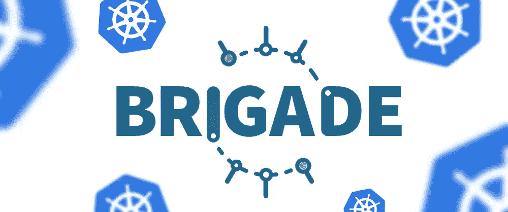
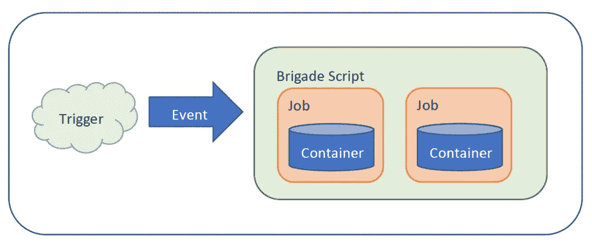

# 微软推出旅:新的库本内斯管理工具

> 原文：<https://medium.com/hackernoon/brigade-the-new-kubernetes-management-tool-from-microsoft-66b3315f14c8>

2017 年 10 月，[微软发布了](https://open.microsoft.com/2017/10/23/announcing-brigade-event-driven-scripting-kubernetes/)旅——一个事件驱动的 Kubernetes 管理框架。该脚本工具旨在处理由可配置警报触发的不同任务的队列。

该工具是由[戴斯](https://blogs.microsoft.com/blog/2017/04/10/microsoft-acquire-deis-help-companies-innovate-containers/)开发的，以前是[草稿](https://github.com/azure/draft)和[赫尔姆](https://github.com/kubernetes/helm)等工具的骄傲开发者，现在是微软今年早些时候收购的一个部门。新的解决方案旨在通过事件驱动的脚本来管理 Kubernetes，通过在 Kubernetes 下运行的 [Docker 容器，](https://itsvit.com/blog/docker-kubernetes-till-death-us-part/)[旅](http://brigade.sh/)可以执行多种类型的任务。

旅本质上是一个沉默的倾听者，等待触发事件的发生。当触发发生时，Javascript 开始工作，启动 Docker 容器并在其中执行多个操作。从字面上来说，任何一系列的动作都可以照本宣科，只有天空是极限。

# 旅级工具的功能和特点

旅的初始版本有这样的特点:

*   Kubernetes 的内置支持，确保只需一个命令即可安装
*   事件队列和动作序列的完全定制
*   由于使用了 Javascript，大队管道作为一个独立的应用程序工作
*   工作流可以并行或同步运行，允许创建非常复杂的管道
*   可以在容器内执行各种功能
*   像 [RBAC](https://en.wikipedia.org/wiki/Role-based_access_control) 这样的功能，库本内特豆荚，秘密和卷是完全支持的

随着时间的推移，功能的范围肯定会增加，但即便如此，旅是一个自己的无服务器解决方案，用于简单的自动化几乎任何一个 DevOps 工程师可能想到的任务。他们需要的只是在一个小立方体或他们的 Kubernetes 集群上运行 Javascript。

# 如何使用大队

作为一个执行 Javascript 作业的全功能框架，旅可以作为一个自动化工具，用于给定基础设施中的任何任务。更确切地说，一个作业的输出可能会触发另一个作业。这允许构建用于自动化任务的链式管道，例如:

*   Cron jobs，利用 Kubernetes CronJob 根据时间表启动多种类型的事件。
*   简单和精简的持续集成和自动化测试，通过对 Git 存储库的开箱即用支持来实现。这意味着拉和推请求都可以作为大量作业的触发器。
*   得益于链式和并行执行，大数据处理工作流可处理多个 ETL 工作负载。
*   批处理，包括自动化容器内备份和预定数据分析。
*   如果你可以想象一些事件链，你可以用 Brigade 来实现，比如监控问题队列，对收到的电子邮件进行分类，并根据特定的过滤器用模板来回复它们——这和更多的事件网关都是 javascript 代码。

请记住， **Brigade 不是为了创建 Javascript 作业而翻遍所有的库，而是简单地将 Docker 容器连接到 Kubernetes 脚本**中。

# 关于 Kubernetes 新管理工具“旅”的最终想法

Brigade 赋予 Kubernetes 平台更大的能力，允许 DevOps 团队链接容器，以便执行几乎任何需要的任务。微软将在未来添加新功能，我们认为 Brigade 将成为任何 DevOps 工具包的一个有价值的补充，无论你更喜欢 [AWS 还是 Azure](https://itsvit.com/blog/aws-vs-ms-azure-cloud-provider-choose/) 。对此你怎么看？我们很高兴在下面的评论中了解您对该工具的看法，如果您认为这篇文章值得分享，请广而告之！

本文原载[此处](https://itsvit.com/blog/news/brigade-new-kubernetes-management-tool-microsoft)。

请随意浏览来自 [IT Svit](https://itsvit.com/blog/) 的关于 DevOps、大数据、机器学习和区块链的最新见解和提示！