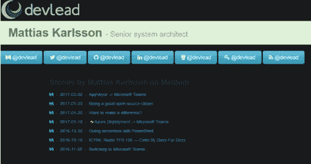

# 使用 serverless⚡赋予静电以生命

> 原文：<https://medium.com/hackernoon/bring-static-to-life-using-serverless-e722be5eaf84>

## 使用 Azure 函数给你的静态网站注入活力

静态网站确实是最新的时尚，它们真的很棒，有很多好处。但是有时候需要提供一些动态内容，存储表单数据等。将小的动态部件/生命岛带到静态网站。
在我看来，Azure Functions 是一个完美的选择，您可以使用各种语言，如 C#、F#、PowerShell、JavaScript 等，快速创建定制的、易于使用的按使用付费功能。

在这篇文章中，我们将举例说明如何在网站上添加最后十篇中型博客文章，这些文章也必须有指定的标签。

我们将使用在`https://medium.com/feed/@user`找到的用户媒体 RSS 提要提供的数据。

在这篇文章中，我假设你已经对 Azure 函数有了一些了解，如果你想了解更多关于函数入门的知识，我在这篇文章的末尾放了我以前的 Azure 函数的链接。

# 服务器(少)端

我们的 Azure 函数将下载 RSS XML 数据，只选择需要的内容(标题、链接和日期)显示在网站上，并从 JavaScript 可消费的 JSON 格式轻松返回，副作用是这也导致只下载一小部分数据，完全控制哪些项目和哪些数据被暴露。

First line medium unfiltered RSS feed, second line Azure Function data

这也使得它非常适合使用第三方 API 的移动应用程序，这样你可以节省字节，因为你不会吃掉他们的蜂窝数据计划，所以应用程序响应更快，用户更开心。

## 该功能

这个函数基本上将调用一个 RSS feed helper 方法，该方法将映射的数据作为 JSON 返回，然后该函数将其作为动态 JavaScript 文件返回，从而公开一个 feed 变量。

helper 方法放在一个外部文件中，这使得它很容易被其他函数重用。

根据设计，浏览器不允许缓存函数，这在大多数情况下非常合理。但是通过设置响应对象头的 CacheControl 属性，我们可以覆盖默认行为，让函数结果缓存 10 分钟。
这意味着当用户浏览你的网站时，他们只会每十分钟点击一次那个功能，其余的时间从本地缓存获取，这将导致你省钱，用户获得更快的页面加载。

## 助手方法

因为函数给了你。NET 和 C#你可以用很少的代码行，获取，解析和映射你想要的数据。下面我使用 XML/objects 的 LINQ 来解析至少指定了一个类别的条目的标题、链接和发布日期(按照我的要求格式化)，然后使用 JSON.Net 将结果序列化为 JSON。

# 客户端

由于该函数是在 JavaScript 中公开的，因此不存在跨站点问题，您只需使用 Script 标记，就像从 CDN 中获取数据时一样。

## 模板

在这篇文章中，我选择了一个名为 [mustache.js](https://github.com/janl/mustache.js/) 的非常基本的视图模板引擎，它是 [mustache](http://mustache.github.io/) 模板语言的 JavaScript 实现。它支持提供对象作为模型，迭代和应用模板到数组中的每一项。

只要绑定一个 JavaScript 对象作为变量，就可以很容易地使用任何你想要的模板引擎，无论是 React，Angular，Aurelia 等等。
Azure functions 确实支持 [CORS](https://en.wikipedia.org/wiki/Cross-origin_resource_sharing) ，当然也只是返回 JSON consumable 作为任何 rest API。

## 结果

模板的最终结果看起来像下面这样

# 结论

我认为云和天空才是真正的极限，天蓝色的功能确实比第一眼看到的更多样。

## 代码

这个函数的完整代码示例可以在 GitHub 上找到

 [## azurevoodoo/breathlifintostaticsite with azurefunctions

### 用 Azure 功能给静态网站注入活力

github.com](https://github.com/azurevoodoo/BreathLifeIntoStaticSiteWithAzureFunctions) 

## 之前关于 Azure 函数的帖子

 [## ⚡Azure 部署->微软团队

### 使用 Azure 函数将 Azure 应用服务部署通知连接到微软团队通道

medium.com](/@devlead/azure-deployment-microsoft-teams-ed1c15df4a08)  [## 使用 PowerShell 实现无服务器化

### 为什么 JavaScript 开发者应该享受所有的乐趣？

medium.com](/@devlead/going-serverless-with-powershell-705677a9ae86) 

> [黑客中午](http://bit.ly/Hackernoon)是黑客如何开始他们的下午。我们是 [@AMI](http://bit.ly/atAMIatAMI) 家庭的一员。我们现在[接受投稿](http://bit.ly/hackernoonsubmission)并乐意[讨论广告&赞助](mailto:partners@amipublications.com)机会。
> 
> 如果你喜欢这个故事，我们推荐你阅读我们的[最新科技故事](http://bit.ly/hackernoonlatestt)和[趋势科技故事](https://hackernoon.com/trending)。直到下一次，不要把世界的现实想当然！

