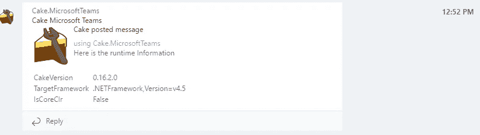
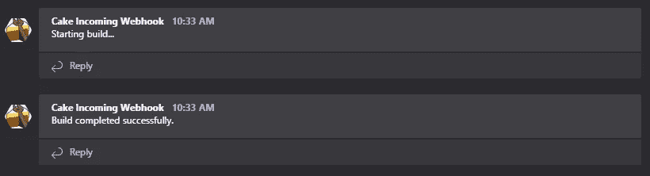
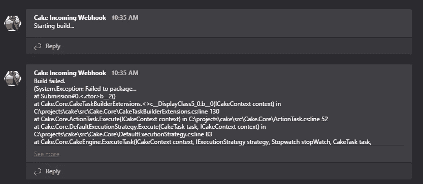
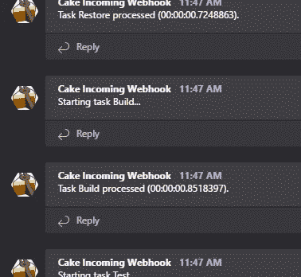
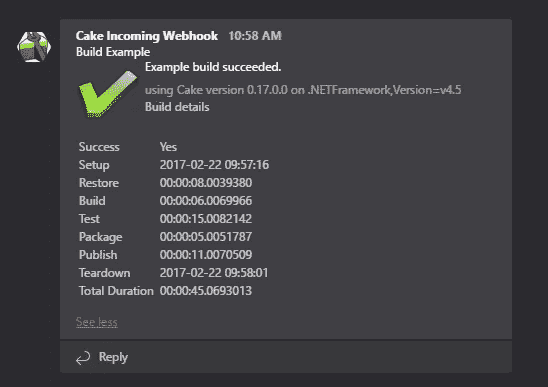
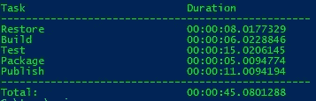
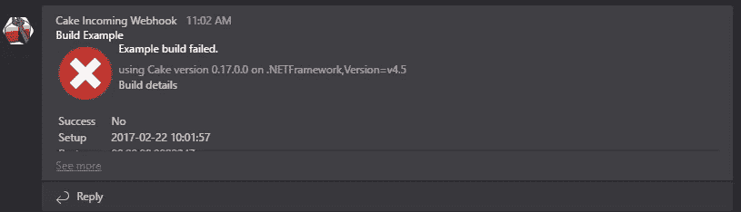
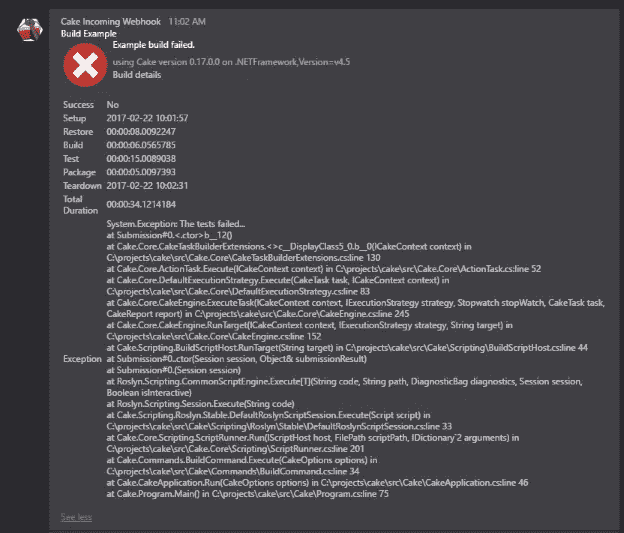

# 🍰给微软团队带来蛋糕📣

> 原文：<https://medium.com/hackernoon/bringing-cake-to-microsoft-teams-b49848981d5d>

## 从蛋糕构建脚本向微软团队发送通知

尽管微软的团队会感谢你带给他们这不是这篇文章的内容，而是微软团队协作/团队聊天产品的通知。

蛋糕呢？ [Cake](http://cakebuild.net/) 是一个开源的构建系统，它让你以一种非侵入性的方式使用 C# DSL 跨平台和跨环境地编排围绕你的构建过程的一切——如果你是. NET 开发人员，所有这些都使用现有的技能。
( *看多了***)**

**就这么定了，如果你能从你的蛋糕脚本发送通知到微软团队频道不是很好吗？猜猜看——有！**

## **插件**

**蛋糕可以通过插件扩展，蛋糕插件可以是任何。NET 程序集作为 NuGet 包在任何 nuget feed 上可用，其中[nuget.org](https://www.nuget.org/)是最广为人知的包源。然而，您可以通过使用几个属性(*即*[*CakeMethodAliasAttribute*](http://cakebuild.net/api/Cake.Core.Annotations/CakeAliasAttribute/)*和*[*cakenamespace importattribute*](http://cakebuild.net/api/Cake.Core.Annotations/CakeNamespaceImportAttribute/))成为一个更“原生”的 Cake addin，因为它们允许您使用 [#addin](http://cakebuild.net/docs/fundamentals/preprocessor-directives) 预处理器指令来扩展 DSL 和导入名称空间。**

**我已经创建了这样一个插件，它可以让你轻松地与微软团队频道交流**

**`#addin`指令从 nuget 获取程序集，引用它，找到任何 Cake 扩展方法并导入名称空间——使它们在您的 Cake 脚本中方便地全局可用。**

## **安装/拆卸**

**通过在 Cake 脚本主机上的 [Setup](http://cakebuild.net/api/Cake.Core.Scripting/IScriptHost/9CF7C412) 和 [Teardown](http://cakebuild.net/api/Cake.Core.Scripting/IScriptHost/E94DA692) 方法上注册动作，可以实现脚本何时启动以及脚本何时成功/失败的报告，设置在 Cake 任务执行之前执行，而拆除总是在任务执行之后执行。**

**正如您所看到的，拆卸[上下文](http://cakebuild.net/api/Cake.Core/ITeardownContext/)具有指示构建成功/失败的[成功](http://cakebuild.net/api/Cake.Core/ITeardownContext/64379305)属性和包含失败异常的[抛出异常](http://cakebuild.net/api/Cake.Core/ITeardownContext/246CAB42)属性。一个成功的构建应该是这样的:**

****

**失败的构建将包含如下异常/堆栈跟踪:**

****

## **任务设置/拆除**

**如果您想跟踪单个任务的进度，可以使用[任务设置](http://cakebuild.net/api/Cake.Core.Scripting/IScriptHost/BAFADA5D)和[任务拆卸](http://cakebuild.net/api/Cake.Core.Scripting/IScriptHost/3BE7A7EB)来注册任务执行前后执行的动作。**

****

**[设置](http://cakebuild.net/api/Cake.Core/ITaskSetupContext/)和[拆卸](http://cakebuild.net/api/Cake.Core/ITaskTeardownContext/)上下文都提供了[任务](http://cakebuild.net/api/Cake.Core/ITaskTeardownContext/EDEBEFE1)属性，该属性为您提供了关于任务的元数据，[拆卸](http://cakebuild.net/api/Cake.Core/ITaskTeardownContext/)上下文还提供了[持续时间](http://cakebuild.net/api/Cake.Core/ITaskTeardownContext/D4FAFF2B)和[跳过的](http://cakebuild.net/api/Cake.Core/ITaskTeardownContext/685F941C)属性，指示任务是否被执行以及执行该任务需要多长时间。**

## **高级格式**

**因此，除了添加只接受字符串作为消息的方法[之外，还有一个](http://cakebuild.net/api/Cake.MicrosoftTeams/MicrosoftTeamsAliases/F57266C4)[microsoftteamsopstmessage](http://cakebuild.net/api/Cake.MicrosoftTeams/MicrosoftTeamsAliases/F75AA2A9)重载，它接受一个[MicrosoftTeamsMessageCard](http://cakebuild.net/api/Cake.MicrosoftTeams/MicrosoftTeamsMessageCard)，这让您可以更好地控制消息布局。**

**为构建的每一步发布一条消息可能会变得非常冗长，剪裁这条消息，而不是像下面这样在一条消息中简洁地总结构建，从长远来看可能更具可持续性。**

****

**这与 Cake 输出到控制台的内容非常相似**

****

**失败时，你会得到一个图标，清楚地表明失败和成功时执行的步骤。**

****

**但是在扩展消息时，您也可以从任何错误中获得完整的堆栈跟踪**

****

**那么这个代码会是什么样子呢？你可以在下面测试一个完整的例子**

**上面的代码基本上是将[设置](http://cakebuild.net/api/Cake.Core.Scripting/IScriptHost/9CF7C412)、[拆卸](http://cakebuild.net/api/Cake.Core.Scripting/IScriptHost/E94DA692)和[任务拆卸](http://cakebuild.net/api/Cake.Core.Scripting/IScriptHost/3BE7A7EB)的动作挂钩。仅在最终调用[拆卸](http://cakebuild.net/api/Cake.Core.Scripting/IScriptHost/E94DA692)之前收集数据。这只是 C#所以你可以去疯狂，因为你想要的，但以上是一个很好的起点。**

## **结论**

**希望这篇文章已经向你展示了如何从你的 cake 脚本发送通知，以及 Cake 为此提供了什么扩展点。这显然可以在其他消息平台上重复使用，如果你查看 Cake 网站上的[插件](http://cakebuild.net/addins/)部分，你会发现 Slack、HipChat、Gitter、Twitter 等插件。**

************

> **[黑客中午](http://bit.ly/Hackernoon)是黑客如何开始他们的下午。我们是阿妹家庭的一员。我们现在[接受投稿](http://bit.ly/hackernoonsubmission)并乐意[讨论广告&赞助](mailto:partners@amipublications.com)机会。**
> 
> **如果你喜欢这个故事，我们推荐你阅读我们的[最新科技故事](http://bit.ly/hackernoonlatestt)和[趋势科技故事](https://hackernoon.com/trending)。直到下一次，不要把世界的现实想当然！**

****