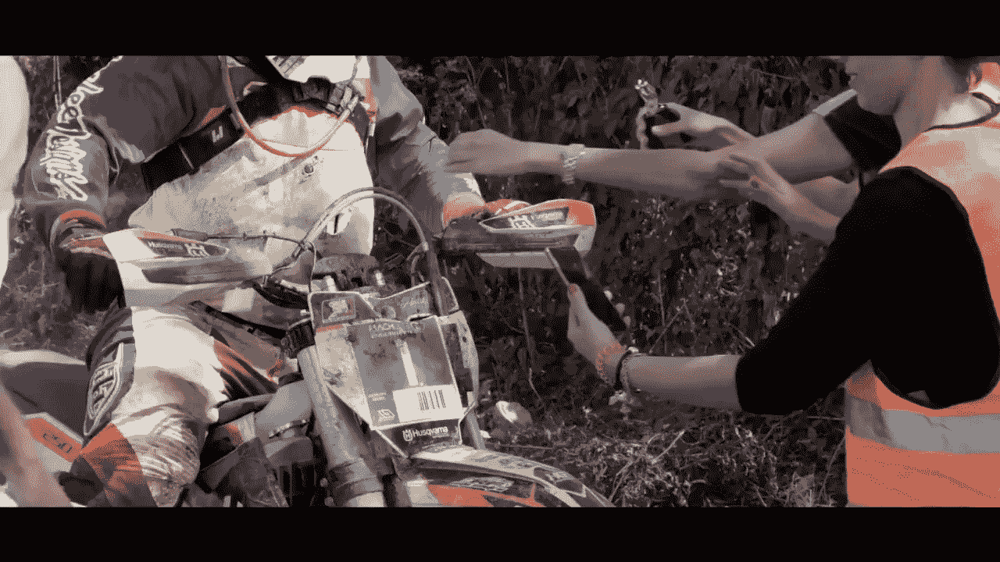
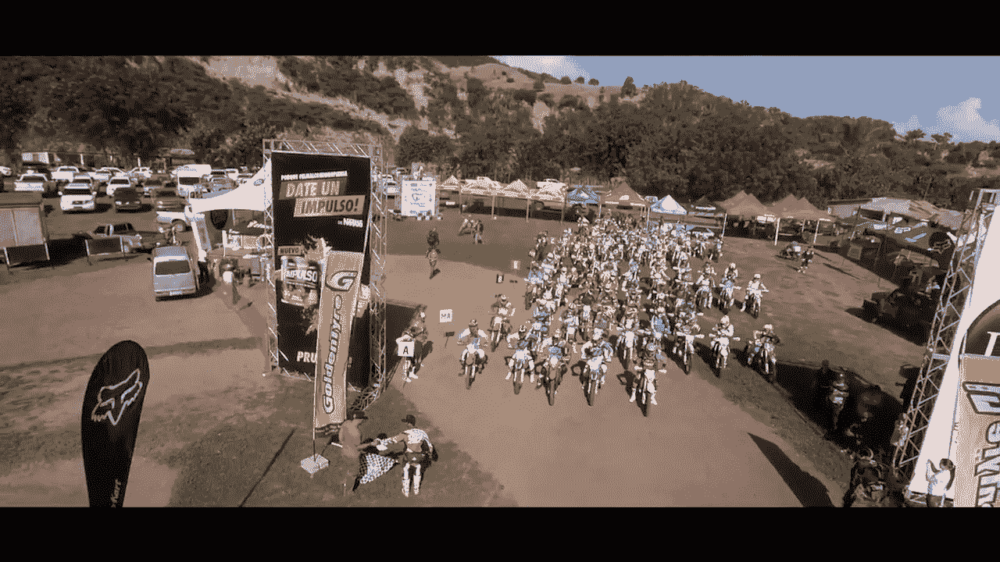
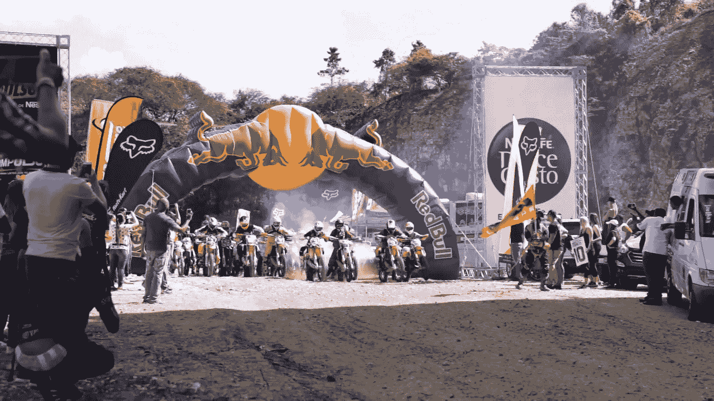
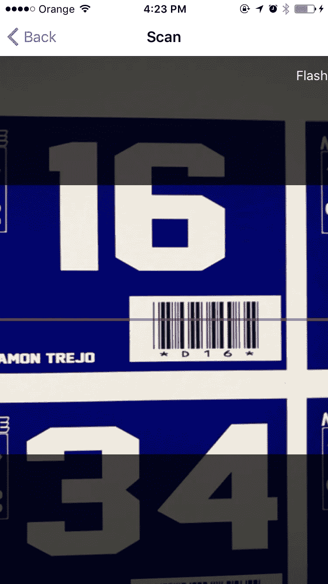
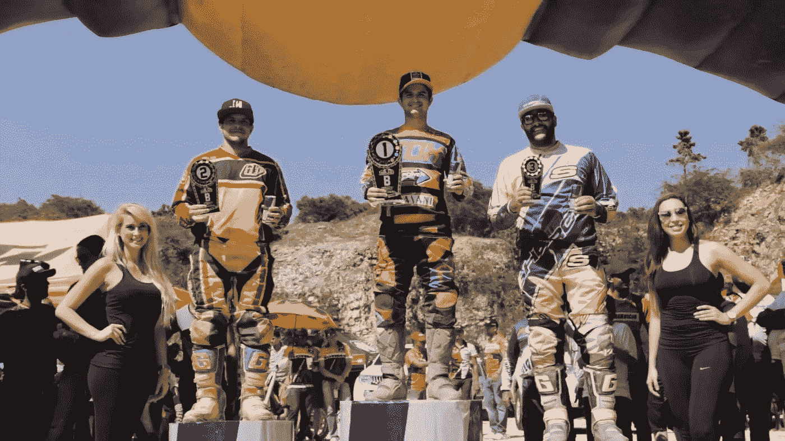

# 将 Xamarin 带入耐力赛

> 原文：<https://medium.com/hackernoon/bringing-xamarin-into-the-enduro-scene-f2f87ce508fc>

# 我是怎么卷进来的？

几个月前，我接到一个电话，问我是否有兴趣在耐力赛中为车手自动计时。起初我不知道这是什么意思，这对我来说是一件全新的事情，我从来没有骑过这样的自行车，也不知道这项运动是如何设置的，也不知道任何相关的规则。但是我从未放弃我接受的挑战。

# **基础知识**

在我提出任何解决方案之前，我必须理清思路，我需要知道这是怎么回事，规则是什么，基本上是在[耐力赛](https://en.wikipedia.org/wiki/World_Enduro_Championship)的世界里的速成班。

在最简单的版本中，这是一场计时比赛，参赛者分组/成行(根据类别)出发。然后，他们继续通过一个预先定义的路线，并通过几个检查站，然后回到起点完成一圈，并继续这个过程，直到时间用完(大约 3 小时！)或者他们完成预定圈数。

听起来很简单，对吧？没门儿！

# 挑战

第一个挑战是**时间**，离第一场比赛还有不到 3 周的时间，我需要一个从想法到现实的快速转变。

第二个是**硬件**，想到了一些关于使用什么的想法:蓝牙、nfc、信标，但由于时间和预算的限制，它们都被放弃了。

第三个挑战是最难的， **0%错误率:)**。我们工程师倾向于谈论可接受的或低的错误率，我们知道在给定所有变量的情况下会有多少事情出错。但在这种情况下，我们需要确保每个骑手每次通过检查站时都被准确地抓获，没有任何借口。

# **现在好戏开始了**

我们的第一个决定是用 [Xamarin](https://hackernoon.com/tagged/xamarin) 创建一个[移动应用](https://hackernoon.com/tagged/mobile-app)，这解决了我们最初的一些挑战:

*   从一开始就独立于平台(Android、iOS)
*   通过使用几个组件和 nuget 包，我们可以很快得到一个工作原型
*   有了[Zxing.net Xamarin 组件](https://components.xamarin.com/gettingstarted/zxing.net.mobile.forms)，我们可以拥有一个经过测试的条形码阅读器，而不是从头开始创建自己的条形码阅读器(降低错误率)

我们仍然不知道最终的应用程序会是什么样子，但我们需要及时订购硬件进行测试，以确保它能够承受将要受到的虐待。例如:

*   电池需要在全亮度下支持屏幕 3 个多小时
*   此外，相机大部分时间都是开着的(扫描条形码)，这又是一次电池消耗
*   我提到灰尘、岩石和泥土了吗？

嗯，我们选定了一些入门级的 LG Android 手机，关闭了所有不必要的服务，进行了一些测试，使用了大约 4 个小时，还不错！

# 体系结构

这是我们在移动应用上使用的:

*   [Xamarin Forms](https://www.xamarin.com/forms) —可重用的 UI 和后台代码
*   [PRISM](https://github.com/PrismLibrary)—Xamarin 表单的最佳 MVVM 框架
*   [Sqlite](https://www.sqlite.org/) —存储数据的轻量级数据库
*   [Zxing.net 条形码扫描仪](https://components.xamarin.com/gettingstarted/zxing.net.mobile.forms) —读取条形码

我们最后在每个骑手身上贴上条形码，一个在自行车的前面，一个在头盔的两边(以防万一)。

These are the barcodes that are mounted on the bikes that we scan

该应用程序能够扫描条形码并记录时间。最初我的想法是将它实时传递给网络服务，这样我们就可以得到实时结果。但是比赛在没有互联网接入的偏远地区举行。因此，我们将所有信息存储在本地 SQLite 数据库中，然后当比赛结束时，我们使用 ad-hoc wifi 网络将所有数据传递到本地服务器，并处理结果。

# 比赛时间！

我们表现如何？

*   我们第一次能够为所有车手提供每个检查站之间的准确结果
*   我们设置的所有设备都运行良好，它们能够准确地扫描条形码
*   所有类别的结果立即计算出来
*   所有的结果都在网上公布，供所有人查看！

最后，我们只能说每个人都满脸笑容！

> [黑客中午](http://bit.ly/Hackernoon)是黑客如何开始他们的下午。我们是阿妹家庭的一员。我们现在[接受投稿](http://bit.ly/hackernoonsubmission)并乐意[讨论广告&赞助](mailto:partners@amipublications.com)机会。
> 
> 如果你喜欢这个故事，我们推荐你阅读我们的[最新科技故事](http://bit.ly/hackernoonlatestt)和[趋势科技故事](https://hackernoon.com/trending)。直到下一次，不要把世界的现实想当然！

