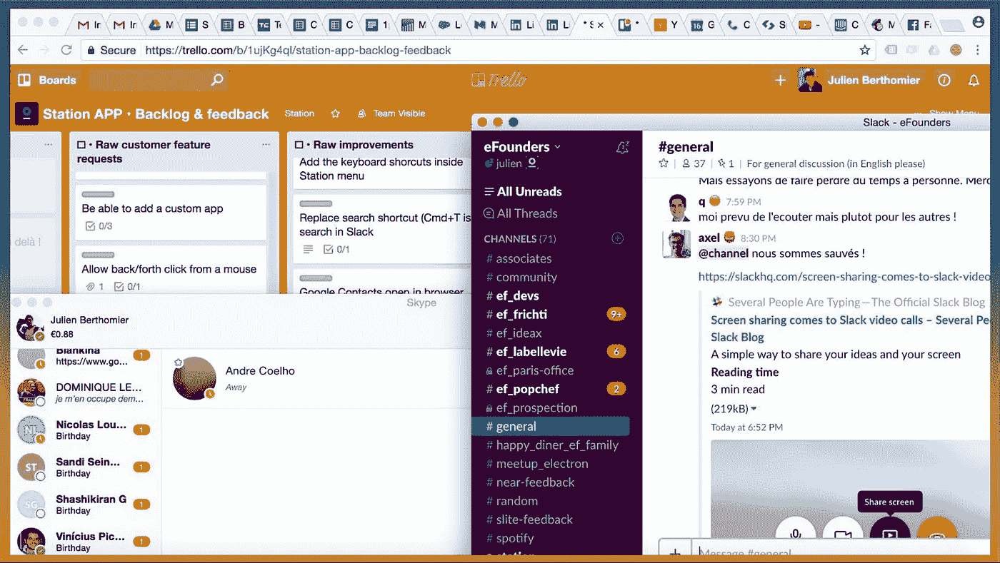
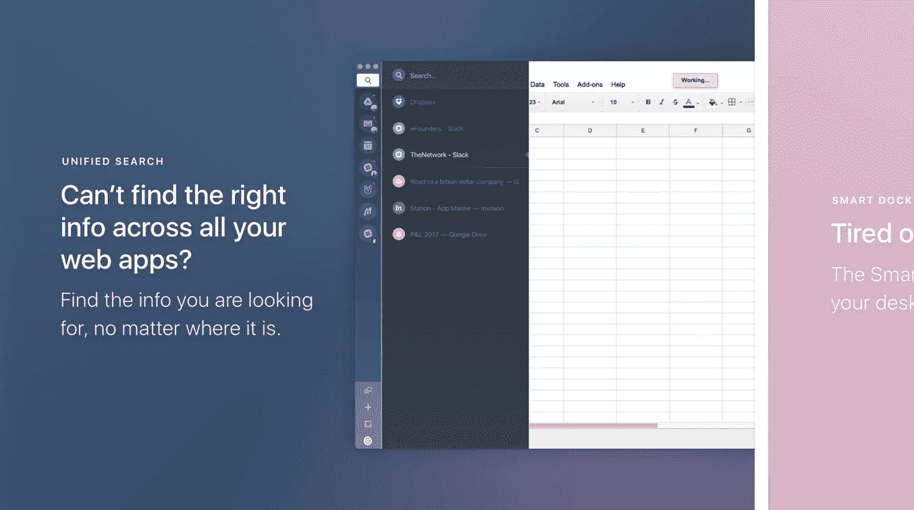

# 浏览器不是用来处理你的工作生活的！

> 原文：<https://medium.com/hackernoon/browser-werent-build-to-handle-your-work-life-b26873a3e4de>

Tired switching between tons of tabs? You’re not alone!

你可能和我一样注意到了，今天你日常工作生活的大部分碰巧都在你的网络浏览器(又名 SaaS)中，对吗？

可悲的是，浏览器几十年来并没有真正改变，然而我们仍然把它们用在了它们原本没有的用途上。

例如，我和我的朋友**正在为一些简单的事情**而努力，比如在大量的标签页之间切换&处理提示通知，在一天结束的时候，努力提高工作效率。

一年前，我们认为这已经足够了，并决定找到一个解决方案。在意识到我们真的很喜欢手机上的体验(集中搜索、通知中心等。)、**我们决定打造** [**站 App**](https://www.producthunt.com/posts/station-3) **:**

> 一个应用程序就能统治一切！

经过许多个漫长的夜晚，**我们很高兴今天能够公开发布** [**站**](https://www.producthunt.com/posts/station-3) **！**现在，我们希望得到您的反馈，以帮助推进这一全新体验。

Meet Station, one App to rule them all!

确保现在就去看看:【https://www.producthunt.com/posts/station-3】

谢谢大家！