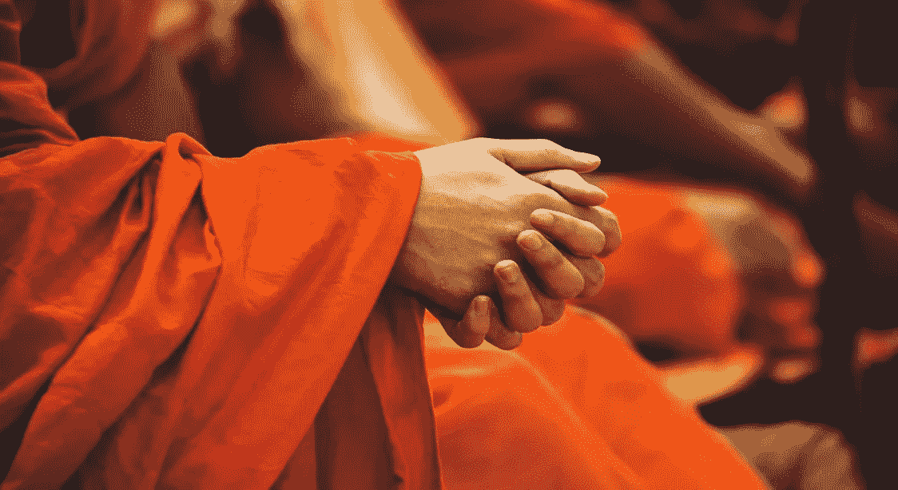
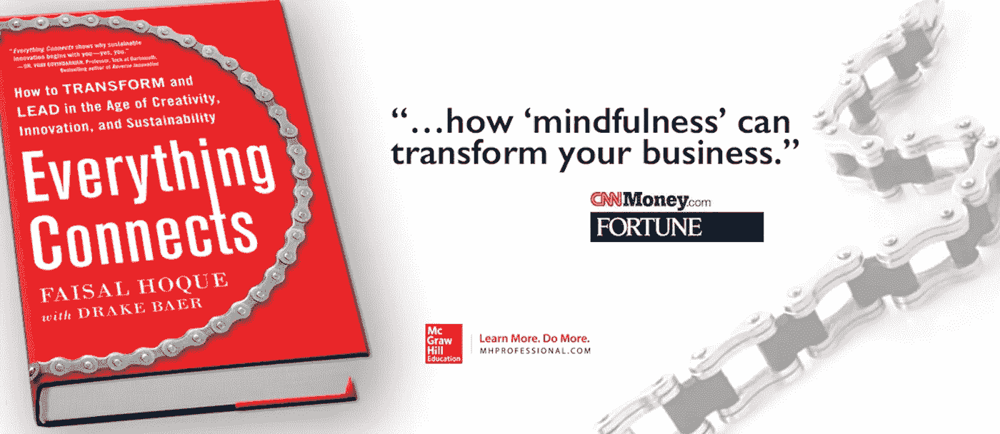

# 佛陀说得对:放松思想，生产力就会随之而来

> 原文：<https://medium.com/hackernoon/buddha-had-it-right-relax-the-mind-and-productivity-will-follow-f2e21b1ef928>

[Photo: [Peter Hershey](https://unsplash.com/@peterhershey)]

## 东方思想和冥想越来越接近主流。今天，许多古老的教导与现代关于提高思维敏捷度的研究完全吻合。

> 对于心理学家和哲学家来说，最大的谜团是心灵。“——Bhante wi mala

几十年前，术语“正念”用来暗示东方神秘主义，与一个人的精神旅程有关，起源于乔达摩佛。佛教徒相信“健康、快乐、和平”来自于练习“正念”生活。

今天，从自助大师到商业领袖，从科学家到政治家，许多人都在谈论正念。根据各种著名的心理学定义:

*   正念被描述为“将一个人的全部注意力时刻集中到当前的体验上”(Marlatt & Kristeller，1999)
*   以及“以一种特殊的方式集中注意力:有目的的，在当下的，非判断性的”(卡巴特-津恩，1994)。

科学界现在认为，通过练习日常正念，我们可以利用大脑的神经可塑性，从而改善我们的生活状态。威廉·詹姆斯是最早提出神经可塑性概念的心理学家之一，早在他 19 世纪晚期的著作《心理学原理》中。神经可塑性背后的中心思想是，我们的大脑可以根据我们的感知和经验进行自我重组。

像[比尔·乔治](http://www.billgeorge.org/)(哈佛商学院教授，前美敦力首席执行官)这样的管理大师说，变得更有弹性的最好方法是把自己培养成一个冷静、富有同情心、适应性强、有头脑的领导者。鉴于当今全球的不确定性，我们从未如此需要有头脑的领导人。乔治继续说道:

> 根据我的经验，有头脑的人比狂热、好斗的人更适合做领导。他们了解自己对压力和危机的反应，也了解自己对他人的影响。他们更善于激励人们承担更大的责任，并将他们团结在共同的使命和价值观周围。"

与全球数十亿人一样，我也饱受日常生活的折磨，领导他人的挑战，以及应对不断变化的世界。我对有意识生活的热爱并不是基于任何种类的科学研究，而是源于我对东方哲学和不断自我分析的根柢。

有一次，我有机会花几个小时和 Bhante Wimala 一起参加冥想会议。Bhante Wimala 已经当了 36 年的和尚，作为一位富有同情心的精神导师而闻名于世，并且是《莲花课程》的作者。与 Bhante 的这次非常幸运的会面让我再次确认了如何引导我们的思想。

根据我与 Bhante 的会谈，以下是一些有助于引导我们思考的原则:

# 活在当下

在我最近的一篇文章中，我简单地提到了此刻。真正活在当下让我们逃离逆境，保存我们的内在能量。活在当下并不意味着我们不关心未来。这意味着当我们选择做某事时，我们只专注于做这件事，而不是让我们的思想游荡到未来(或过去)。

据说禅宗和尚的两项工作就是坐禅和扫地。清洁是禅宗和尚的日常仪式之一，是他们最重要的日常实践之一。他们清扫或耙，他们试图在那一刻不做任何其他事情。下次你做家务的时候，试着把注意力集中在家务上——灰尘上，动作上，感觉上。做饭和打扫卫生通常被视为无聊的家务，但实际上它们都是练习正念的好方法——我每周至少例行尝试做一两次。听起来很简单——但实际上很难——去试试吧。

**更多关于活在当下@**[*一种非传统的美味方式更有创意*](http://faisalhoque.com/2015/04/08/how-learning-to-cook-can-boost-your-creativity/) 。

# 放手

恐惧是一种保护情绪，它发出危险的信号，帮助我们做好准备，应对危险。恐惧也许是阻碍我们前进、让我们不快乐的关键情绪——害怕失败、害怕失去亲人、害怕成功、害怕未知、害怕前进或做出改变。

除了恐惧，情感上的痛苦是另一个经常阻碍我们前进的关键因素。虽然别人会给我们带来痛苦，但我们的痛苦也可能是由我们自己的行为引起的，包括我们无法实现期望的愿望。

对恐惧和疼痛的生理反应被称为“战斗或逃跑”反应。正念与这种反应正好相反。正念的生活来自于“放手”。放手是停止抵抗恐惧和痛苦的内心行动。它能让我们恢复清晰的视觉。

佛教断言，对负面情绪的依恋是痛苦的主要来源。因此，超脱或“不执着”将是我们摆脱恐惧和痛苦的通行证。

放手来自于对生活和人有一个“不评判”的观点。它允许我们平等地原谅他人和自己的错误和不相容。用更世俗和实际的话来说，我们必须愿意放下恐惧、痛苦、愤怒和人。正是放手的能力推动着不断的变化——正是这种能力让我们变得灵活和适应性强。这很难做到，需要有意识的努力，而且我知道我每天都在为此奋斗。

**更多关于放手@”**[*如何掌握高难度的放手艺术*](https://www.linkedin.com/pulse/how-master-difficult-art-letting-go-faisal-hoque)*。*

# *放慢速度*

> *慢慢地、虔诚地喝茶，就好像它是地球自转的轴心——慢慢地、均匀地、不急着奔向未来。活在当下。“—一行禅师*

*对于像我这样一个快节奏的企业家来说，也许对我来说最矛盾的教训就是需要放慢脚步才能前进。放慢生活节奏是一种深思熟虑的选择，它能让你更加珍惜生活，获得更大程度的幸福，从而让你的努力获得更好的结果。*

*在正念生活的背景下，放慢生活并不意味着每隔一个月去度假。这是我们每天必须做的事情。这意味着花时间去做我们正在做的事情。这意味着单一任务，而不是在众多任务之间切换，并且不专注于其中任何一项。“慢下来”是关于刻意的“留心”行为。美国作家、诗人、哲学家亨利·大卫·梭罗总结得很好，他说:*

> *我早早起床，在池塘里沐浴；这是一次宗教活动，也是我做过的最好的事情之一。他们说，清汤国王的澡盆上刻着这样的文字:“每天更新你自己；再做一次，再做一次，直到永远。”*

***再谈慢下来@**[*一个写作仪式如何通向成功*](http://faisalhoque.com/2015/04/22/an-entrepreneur-explains-how-writing-on-sundays-makes-him-more-successful/) 。*

# *神经可塑性:关于正念的科学研究*

*现在，关于正念的科学，在下面的视频中，理查德·戴维森博士讲述了他对神经可塑性的研究，神经可塑性是大脑根据经验改变其结构和功能的能力:*

****版权所有 2017 费萨尔·霍克。保留所有权利。****

*我是一名[企业家和作家](http://faisalhoque.com/speaking/)。 [SHADOKA](http://shadoka.com/) 等公司创始人。Shadoka 让抱负成为领导、创新和变革的动力。Shadoka 的加速器和解决方案汇集了管理框架、数字平台和思想领导力，以实现创新、转型、创业、增长和社会影响。*

*著有《 [*《万物互联——如何在创意、创新和可持续发展的时代进行变革和领导》》(McGraw Hill)和《*](http://www.amazon.com/Everything-Connects-Creativity-Innovation-Sustainability/dp/0071830758/ref=sr_1_1?ie=UTF8&qid=1376488798&sr=8-1&keywords=everything+connects%2Bfaisal+hoque) *[*生存并茁壮成长:弹性企业家、创新者和领导者的 27 种实践*](http://survivetothrive.pub/) 》(励志出版社)。在推特上关注我。*免费使用* [*万物互联*](http://app.everythingconnectsthebook.com/login.php) *领导力 app 和* [*生存茁壮*](http://app.survivetothrive.pub/login.php) *弹性 app。***

**

*[Photo credit](http://everythingconnectsthebook.com/)*

******

> *[黑客中午](http://bit.ly/Hackernoon)是黑客如何开始他们的下午。我们是 [@AMI](http://bit.ly/atAMIatAMI) 家庭的一员。我们现在[接受投稿](http://bit.ly/hackernoonsubmission)并乐意[讨论广告&赞助](mailto:partners@amipublications.com)机会。*
> 
> *如果你喜欢这个故事，我们推荐你阅读我们的[最新科技故事](http://bit.ly/hackernoonlatestt)和[趋势科技故事](https://hackernoon.com/trending)。直到下一次，不要把世界的现实想当然！*

**