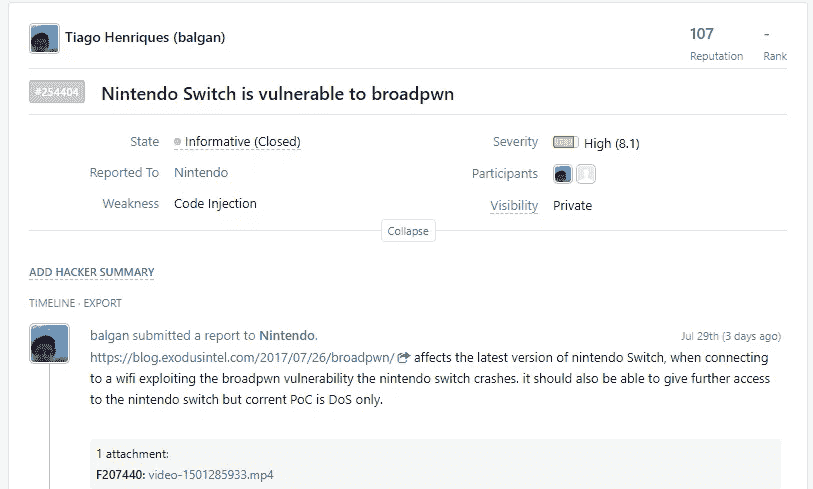
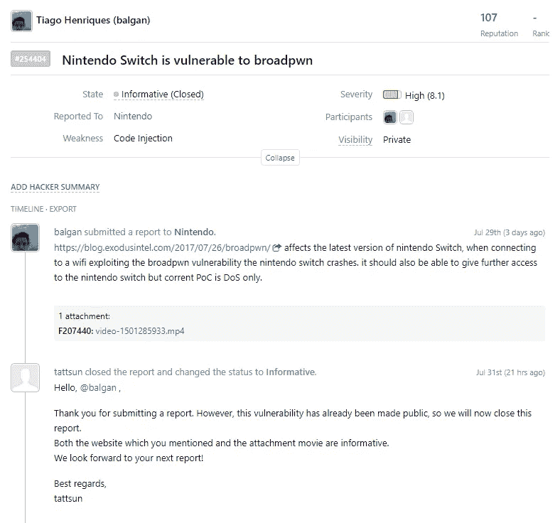
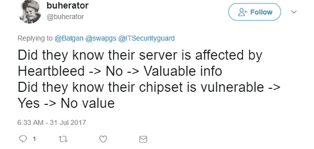
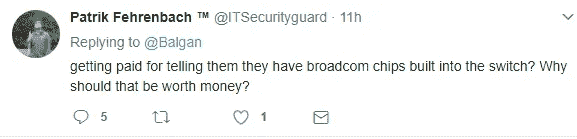
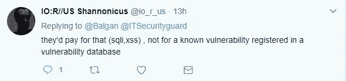

# 漏洞奖金，一个破碎的系统

> 原文：<https://medium.com/hackernoon/bug-bounties-a-broken-system-7781fe0bf7d>

几天前，我和@osxreverser 在 IRC 上聊天，他告诉我他是如何处理新发布的 broadpwn 漏洞的，我很好奇。

我用 kali 设置了一个 VM，将我的 alfa 网卡连接到它，并开始玩一个使用 hostapd 的 [PoC。](http://boosterok.com/blog/broadpwn/)

虽然利用 [iPhone](https://hackernoon.com/tagged/iphone) 并不成功，但我决定将目光转向其他设备，我尝试了我的 echo dot，我的电视，然后我点击了我的任天堂 Switch，这发生了:

然后我检查了一下，发现任天堂实际上在黑客一号上有一个 bug 赏金，因为我有一个账户，所以我决定提交一个。

现在，让我们看看现阶段我们所知道的:

*   关于这个漏洞的细节在 DefCon 当天刚刚发布。
*   我能找到的每篇文章都只提到了 iOS 和 Android。
*   任天堂没有发布任何建议或补丁来解决这个问题。

因此，我提交了我的问题与视频作为证据。

一天过去了，我收到了以下回复

现在，在这一点上我们得到了新的信息:

*   任天堂说这个漏洞已经被公开了(不管这意味着什么，是因为我发了推特还是因为细节或广播已经被公开了？)而且我不会因此得到报酬，因为他们已经知道了这个漏洞。

这让我发出了以下推文:

引发了一些有趣的对话。

现在让我们把事情搞清楚，我可以接受没有报酬的奖金。我不能接受的是双重标准。

如果我们作为研究人员要对一系列通常在 bug 奖金中设定的标准负责:

*   X 天之前不要透露
*   不要公开细节
*   我们决定支付什么
*   你需要提交一份适当的报告

我坚信，应该为运行这些 bug 奖金的供应商和平台指定相同级别的标准和证据。

现在它是这样工作的:

1 .你有支付 bug 赏金平台的供应商来设置他们的 bug 赏金。

2 .Bug bounty 平台设置了一些东西，并邀请了一群黑客来测试这个 bounty。

3 .黑客/研究人员在这方面花费时间，当他们发现一些东西时，在所述平台上写一份报告。

4 .平台现在有书面证据表明参与者发现了一些东西

5.一些平台在它到达供应商之前做一个预览

6.供应商接受或拒绝该报告。

现在阅读本文，让我们看看透明度的水平，以及对各方的好处:

1-供应商-测试他们的产品，本质上是一个黑盒，如果他们不想付钱，他们可以简单地说“我们以前找到过”并关闭 bounty，或者他们可以直接说是的，这里是 100 美元(最后一个，一些平台已经不允许，这是朝着好的方向迈出的一小步)。他们不需要出示证据，他们不需要在任何公共场所或奖金参与者可以接触到的地方登记他们发现的东西，所以在现实中，如果他们想欺骗研究人员，他们可以做到。

2——bug bounty 平台供应商——他们已经得到了建立该项目的报酬，他们的目标是让客户满意，并保持在一定水平(比客户低得多，因为有太多的研究人员需要他们单独关心)。他们与供应商的沟通是一个黑盒，与研究人员的沟通是完全开放的(通过奖金或平台)。

3——研究人员——做了工作，也许会得到报酬。

实际情况应该是这样的:

bug 在范围内吗？是的。

bug 是否在已发现的公开列表中？号码

卖主，付钱。

或者，如果供应商说“我以前发现过这种情况”，他们还必须以正确的日期错误跟踪的形式提供证据，或者提供可靠的、不能伪造的日期证明。

(对于我每天在《区块链》杂志上看到的大量废话连篇的初创公司来说，这实际上可能是那种[技术](https://hackernoon.com/tagged/technology)的一个合法用例和业务，但这需要彻底改革 bug 奖金的工作方式。)

最重要的是，bug bounty 平台应该起到 escrows 的作用，让每个人保持一致，让供应商不要和研究人员乱搞，让研究人员不要违反一些规则。

另一种选择，我知道已经有一个平台在这样做(在测试版 atm 中)，正在转移到“众包”pentest 系统，例如从 bug bounty 系统 5 的人才库中挑选并支付固定金额，然后无论他们找到什么，他们都会获得额外的金额。

现在，结束我今天听到的借口和指控:

1——你生气是因为你没有得到报酬——没有。我很幸运，我经营自己的企业所获得的报酬足以支付我的账单并节省一些钱，我的奖金本来可以投资于葡萄牙(我的祖国)的一些 STEM 学生，我为他们支付大学费用。我很生气，因为我讨厌被骗，看着别人被骗，这就是当前系统发生的事情。

2 —你通知了他们一些他们知道的事情！—真的吗？那绝对没问题。给我看证据。没有发布补丁或建议。

3 —

我把这三个归为一类。我的问题不是关于漏洞或特定类型的漏洞。这实际上是由范围决定的。我的问题是，我可以报告一个 RCE、一个 SQLi、一个 XSS，不管是什么新的安全缩写，他们都可以说“我知道！KKTHANKSBYE "

现在我们依赖于两个政党，他们没有动机对参与者保持透明或诚实。至少不是 100%，他们可以选择支付随机的低水平赏金来让一些人高兴。

这是一个行不通的系统。几年后，你将会遇到一些在信息安全方面毫无经验的人，他们愿意为了几块钱而被榨干，而有经验的人不会提供漏洞奖金。当这种情况发生时，bug bounty 平台和供应商都将遭受损失。

哦，顺便说一句，你不会只是失去质量。黑客和研究人员将继续戳你的东西，唯一的区别是，当他们发现一些有趣的东西时，他们不会去“也许我会得到一些报酬”的情况下，他们会去黑市，并保证至少有最低金额。

#固定奖金