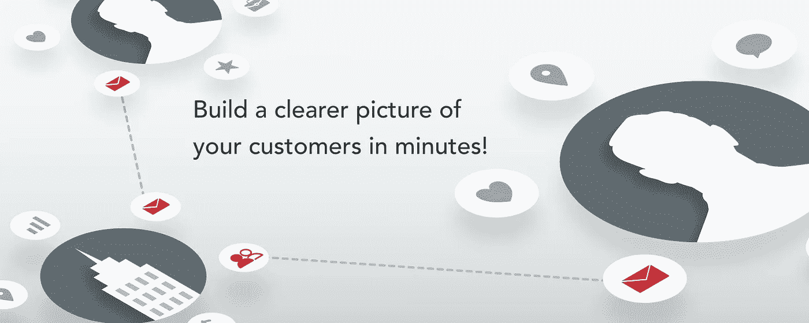
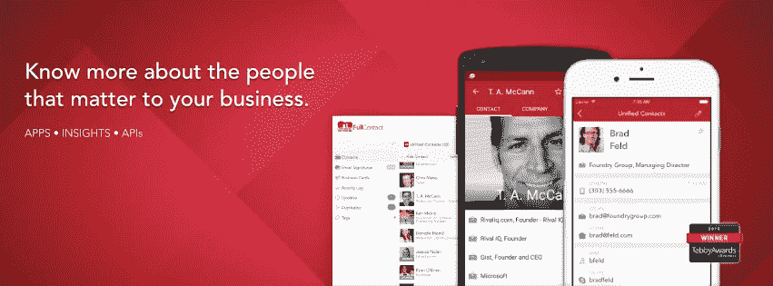
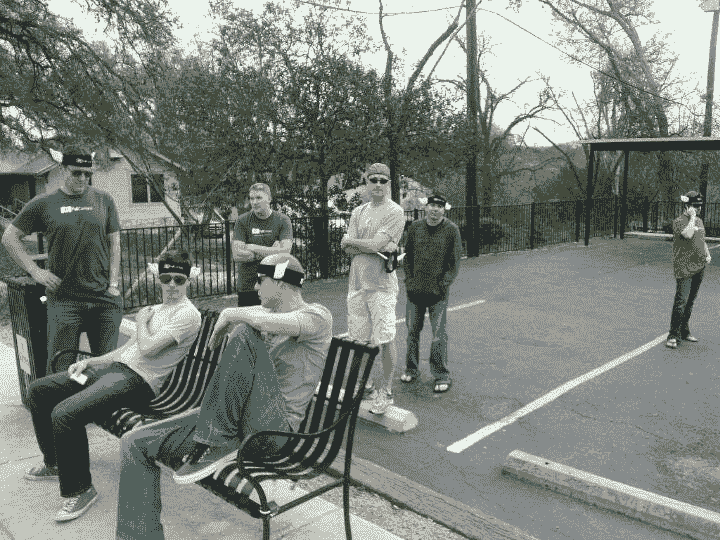

# 在几分钟内建立更清晰的客户形象

> 原文：<https://medium.com/hackernoon/build-a-clearer-picture-of-your-customers-in-minutes-19e3807e1aa7>

[**FullContact**](https://www.fullcontact.com/) 是一个全连接的联系人[管理](https://hackernoon.com/tagged/management)平台，面向需要掌握其联系人的专业人士和企业，提供对他们最重要的人的 360 度洞察。FullContact 的跨平台应用程序和 API 套件增强了联系人的洞察力，同时使他们保持有序、同步、最新和安全。

凯文·威廉·大卫采访了 [**的首席执行官**](https://siftery.com/fullcontact)**[巴特·洛朗](https://medium.com/u/574290f55ada?source=post_page-----19e3807e1aa7--------------------------------)以了解更多信息。**

## 嗨，巴特，给我们讲讲 FullContact 吧？

FullContact 是一个开放的客户 360 洞察平台，提供洞察和信息，使企业能够与对他们最重要的人相处融洽。通过提供最广泛、最准确的数据，并通过一套跨平台的易用应用程序和 API 平稳、安全地集成，FullContact 使公司能够丰富和增强对现有客户的了解，并帮助他们识别、发现和与未来潜在客户建立有意义的联系。

我们目前正在为我们业务的平台和应用程序方面开发一系列新的 API 和集成，这将继续提高我们数据的质量和我们交付的易用性。

## 请多告诉我一些你想解决的问题？

我们认为 B2B 和 B2C 沟通渠道的概念已经消失，**人与人之间的**才是持久的、以关系为中心的客户体验的本质。尽管可用的**客户数据在不断扩大，**这些数据越来越多地分散在多个 SaaS 点解决方案中，因此几乎不可能将所有客户数据整合在一起形成一个真正的客户 360 度视图。FullContact 的专利公开身份图有助于解决这个问题。

## 你正在构建的东西有什么独特之处&为什么你认为公司应该使用 FullContact？

FullContact 与众不同的三个主要方面让我们的客户有信心与我们合作:

*   **数据质量:**我们获得专利的开放式身份图每天更新超过 3000 万次，提供关于个人、公司和关系的最准确和最新的数据。我们的数据来源于通过第一方应用程序进行的独特数据众包、我们广泛的数据合作伙伴网络以及强大的数据科学/人在回路能力。
*   **易于集成:**我们的开放平台允许构建者通过与他们已经使用的服务无缝集成的易于访问的 API 来跨越身份孤岛。
*   **最高安全性**:我们采用世界一流的安全和隐私控制措施，因为信任对我们来说至关重要。我们符合 SOC2、PCI、云安全联盟和美国-欧盟/瑞士隐私保护标准。

## 谁使用 FullContact？你能告诉我们一些关于使用 FullContact 的不同客户群的情况吗？

我们拥有超过 17，000 名客户的生态系统，涵盖许多垂直行业，从自助创业公司到全球企业。我们的重点是为建筑商、创新者以及精通技术的产品和数据团队提供服务。

## 您的客户如何使用 FullContact？你能分享一些不同的使用案例吗？

FullContact 客户以多种不同的方式使用我们的应用和 API。我们的应用程序为团队和专业人士提供了强大的联系人同步和管理工具[使他们能够通过深入了解联系人来建立更深层次的关系。我们的 API 套件提供身份解析、数据丰富和电子邮件验证。](https://hackernoon.com/tagged/tool)

*   我们的身份解决方案将客户的零散信息统一到一个完整的身份中，从而实现无缝沟通。
*   通过丰富数据，我们将联系方式与社会、人口、心理、亲和力和兴趣数据相结合，帮助我们的客户细分和个性化他们的体验。
*   我们的电子邮件验证验证电子邮件地址，以消除硬反弹，减少垃圾邮件投诉，并最大限度地减少欺诈。

由于我们产品的广泛性，客户在各种各样的[用例](https://www.fullcontact.com/developer/customers/)中使用 FullContact。最常见的是，我们被用来清理和附加联系记录，细分和个性化营销信息，提高客户正在构建的应用程序的价值，并为与他们自己的客户的对话提供有意义的背景。

## FullContact 有没有您没有想到或预料到的独特用例？

我们有一家信息技术公司，它使用我们的 API 通过目击者在社交网络上的帖子来识别目击者，并用于防止欺诈。

## 有什么早期的“成长秘诀”或策略促成了你现在的成功吗？

在我们的销售和营销工作中，我们利用我们平台产生的洞察力来创建高度个性化的活动——我们不怕发挥创意来吸引潜在客户的注意力！例如，我们在早期的会议上戴过翼匪(见下图)，我们甚至以模仿达斯·维德的方式给星战迷们留了语音邮件！

此外，我们的员工福利计划，尤其是我们的带薪带薪休假政策，一直为我们提供大量国内和国际报道，有助于吸引优秀人才加入公司。

## 在早期构建产品时，最大的挑战是什么？你是如何解决的？

我们犯了一堆技术架构错误。我们用了 [**MongoDB**](https://siftery.com/mongodb) 。我们用的是 [**Grails**](https://siftery.com/grails) 。我们使用 Git 和 Solr 作为数据存储。我们尝试使用 [**HBase**](https://siftery.com/apache-hbase) 作为事务数据存储。最终，我们不得不回到经过验证的、可靠的技术——比如[**【MySQL】**](https://siftery.com/mysql)[**Cassandra**](https://siftery.com/apache-cassandra)[**elastic search**](https://siftery.com/elasticsearch)。

这令人难以置信地痛苦，我们花了将近一年的时间在后端进行重新调整。

## 你加入的最有趣的整合是什么？有什么对你特别有影响的吗？

*   [**Zendesk**](https://siftery.com/zendesk)
*   扎皮尔
*   **(测试版)**
*   **iOS/Android**
*   **MS Exchange**
*   **Gmail/Google 联系人**

**[**谷歌**](https://siftery.com/company/google) ， [**微软**](https://siftery.com/company/microsoft) ， [**苹果**](https://siftery.com/company/apple) 都是我们所做事情的表赌注。然而，像 Zapier 和 PieSync 这样的系统为我们的用户打开了一个机会的世界，让他们可以在一系列基于云的软件系统之间移动数据。**

## **最后，你运营公司所依赖的顶级产品是什么&你如何使用它们？**

**[**亚马逊网络服务**](https://siftery.com/amazon-cloudfront) —我们的云基础设施，我们业务的支柱**

****——(当然是通过 FullContact Insights 应用)——提供卓越的客户支持****

****[**G 套件**](https://siftery.com/g-suite-formerly-google-apps-for-work) —用于电子邮件，以及文档、表格和幻灯片。****

****建立我们的博客和网站。****

****[SendGrid](https://medium.com/u/d99855079b79?source=post_page-----19e3807e1aa7--------------------------------) —作为我们首选的 ESP。****

****[**Salesforce**](https://siftery.com/salesforce-sales-cloud) —作为我们的主要 CRM。****

*****原载于*[*siftery.com*](https://siftery.com/stories/build-a-clearer-picture-of-your-customers-in-minutes)*。*****