# 用 4 个步骤建立一个创意代理网站

> 原文：<https://medium.com/hackernoon/build-a-creative-agency-website-in-4-steps-7a9090602bcd>

如果你在创意公司工作，你的网站需要有创意。许多机构根据他们需要展示的信息，在同一个整体框架或网站地图中灵活运用创意。这些信息通常是机构咒语或关注领域、历史项目组合工作、执行所述项目组合工作的团队成员、联系人表单提交的区域和办公室位置等。

在这篇博客中，我将向你展示如何利用现有的代码库例子来构建你自己的漂亮的[创意代理网站](https://cosmicjs.com/apps/creative-agency) [。](https://cosmicjs.com/apps/landing-page)这个网站的例子绝对是为前瞻性的创意机构。基于现代 Node.js / Cosmic JS 堆栈构建，功能包括团队管理、投资组合网格、联系人表单等。从你的[宇宙 JS](https://cosmicjs.com/) 桶仪表板安装，部署和编辑这个创意代理网站的每个部分。

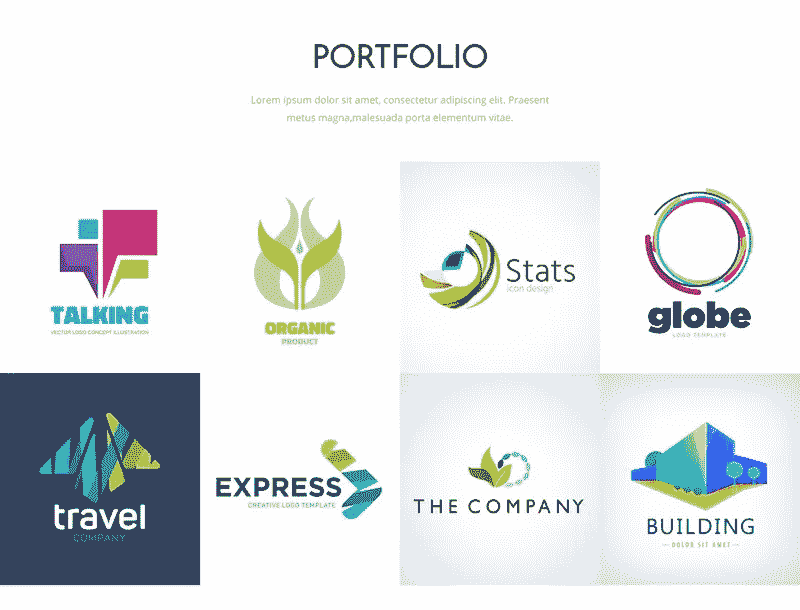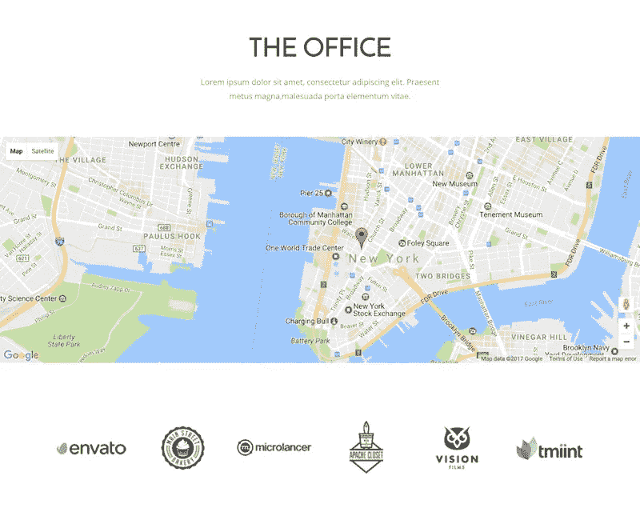

对于这个示例应用程序，我将使用 [Cosmic JS](https://cosmicjs.com/) 。Cosmic JS 是一个 [API 优先的 CMS](https://cosmicjs.com/) ，它使得管理和构建网站和应用程序更加快速和直观。通过将内容从代码中分离出来，Cosmic JS 增强了开发人员的灵活性，同时确保内容编辑人员能够以最适合他们的方式规划和部署内容。我们将使用 Cosmic JS 来安装我们的示例应用程序，部署和更新来自基于云的内容管理平台的内容。

如果你还没有，那就从[报名](https://cosmicjs.com/signup)参加[宇宙 JS](https://cosmicjs.com/) 开始吧。下面提供了有用的资源来简化您的开发操作。

> [创意代理 App 页面](https://cosmicjs.com/apps/creative-agency)
> 
> [创意代理 App 演示](https://cosmicjs.com/apps/creative-agency/demo)
> 
> [GitHub 上的创意代理 App 代码库](https://github.com/cosmicjs/creative-agency)

# 1.创建新的存储桶

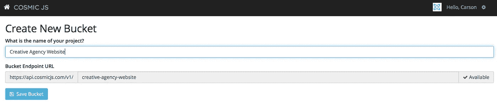

您的 bucket 的名称是您正在构建的网站、项目、客户端或 web 应用程序的名称。为了保持示例博客的简洁，我将我的博客命名为“创意代理网站”。

# 2.安装宇宙 JS 创意代理 App

一旦你注册并命名了你的桶，你将被提示从头开始或者“查看一些应用”。对于这个博客，我简单地点击了右键“查看一些应用程序”，这样我就可以开始安装宇宙 JS 创意代理应用程序。

# 应用程序安装选项

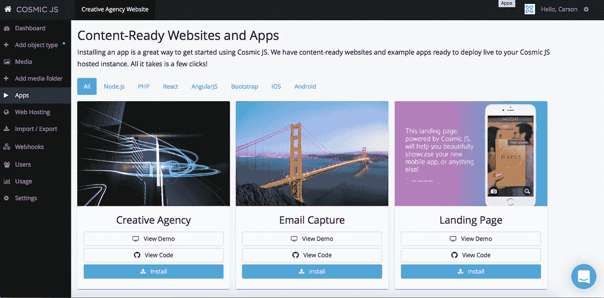

[Cosmic JS](https://cosmicjs.com/) 让你能够在编程语言之间进行过滤，比如 [Node.js](https://cosmicjs.com/apps) 、 [PHP](https://cosmicjs.com/apps) 、 [React](https://cosmicjs.com/apps) 、 [AngularJS](https://cosmicjs.com/apps) 等等。

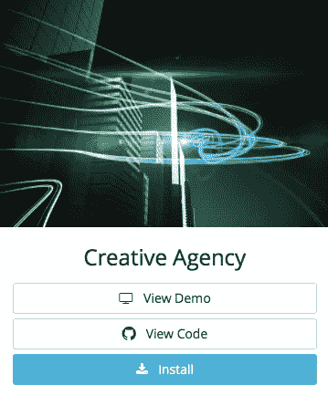

只需点击[创意代理](https://cosmicjs.com/apps/creative-agency)图标下方的“安装”即可开始，或者访问[宇宙 JS 应用页面](https://cosmicjs.com/apps)。

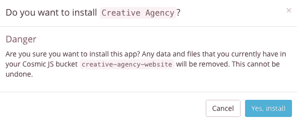

# 3.部署到 Web

我点击了“部署到 Web”。然后，我可以在部署 web 应用程序时编辑对象。您将收到一封电子邮件，确认您的 web 应用程序的部署。如果您在部署过程中遇到任何问题，您可能会被转到 [Cosmic JS 故障排除页面](https://cosmicjs.com/troubleshooting)。

# 确认部署位置和分支

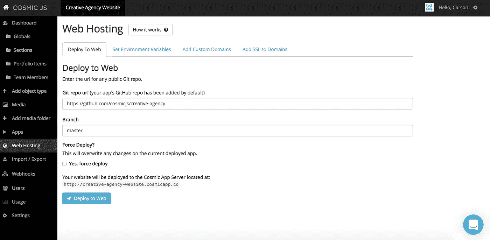

# 部署分支机构确认模式

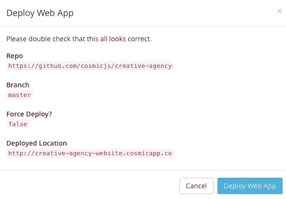

我从一个回购中提取，我的分支被澄清，我有一个与我在步骤 1 中创建的 slug / bucket 名称相匹配的部署位置。

# 展开，展开

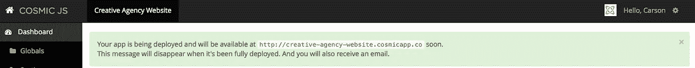

一个小小的保证，让你很快就能在网上活得好好的。:)

# 4.编辑全局对象

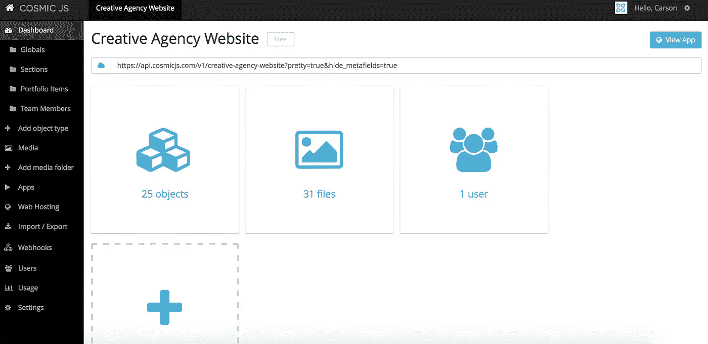

编辑是在宇宙 JS 仪表盘中实现的梦想。要了解更多关于如何在考虑编辑内容的情况下构建 [Cosmic JS](https://cosmicjs.com/) 的信息，请阅读[在考虑内容编辑器的情况下构建](https://cosmicjs.com/blog/building-with-the-content-editor-in-mind)。

# 应用部署确认

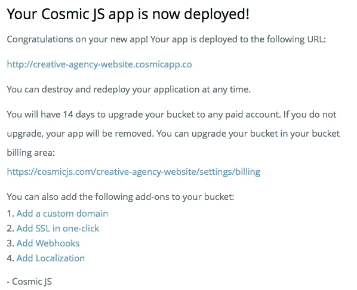

就像注册、创建新的存储桶、安装 web 应用程序、编辑对象和部署一样简单！我收到了访问我的 web 应用程序的确认电子邮件，还看到了我的桶升级选项，如自定义域、一键式 SSL、webhooks 和本地化。

[Cosmic JS](https://cosmicjs.com/) 是 API 第一款基于云的内容管理平台，可轻松管理应用程序和内容。如果你对宇宙 JS API 有任何疑问，请在 [Twitter](https://twitter.com/cosmic_js) 或 [Slack](https://cosmicjs.com/community) 与创始人联系。

[卡森·吉本斯](https://twitter.com/carsoncgibbons)是 [Cosmic JS](https://cosmicjs.com/) 的联合创始人& CMO，这是一个 API 首创的基于云的[内容管理平台](https://cosmicjs.com/)，它将内容与代码分离，允许开发者用他们想要的任何编程语言构建流畅的应用和网站。

> [黑客午间](http://bit.ly/Hackernoon)黑客们就是这样开始下午生活的。我们是 [@AMI](http://bit.ly/atAMIatAMI) 家族的一员。我们现在[接受提交](http://bit.ly/hackernoonsubmission)并乐于[讨论广告&赞助](mailto:partners@amipublications.com)机会。
> 
> 如果你喜欢这个故事，我们建议你读一读我们的最新科技报道和[趋势科技报道](https://hackernoon.com/trending)。直到下一次，不要把现实世界视为理所当然！

