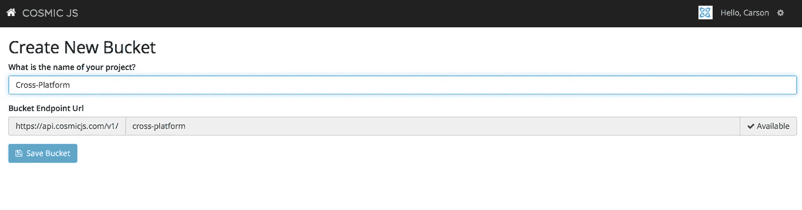
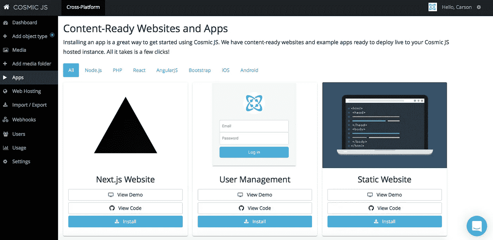
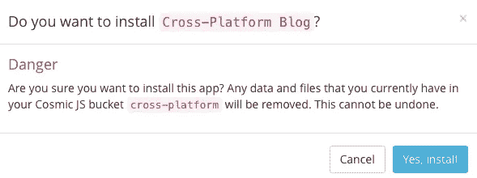
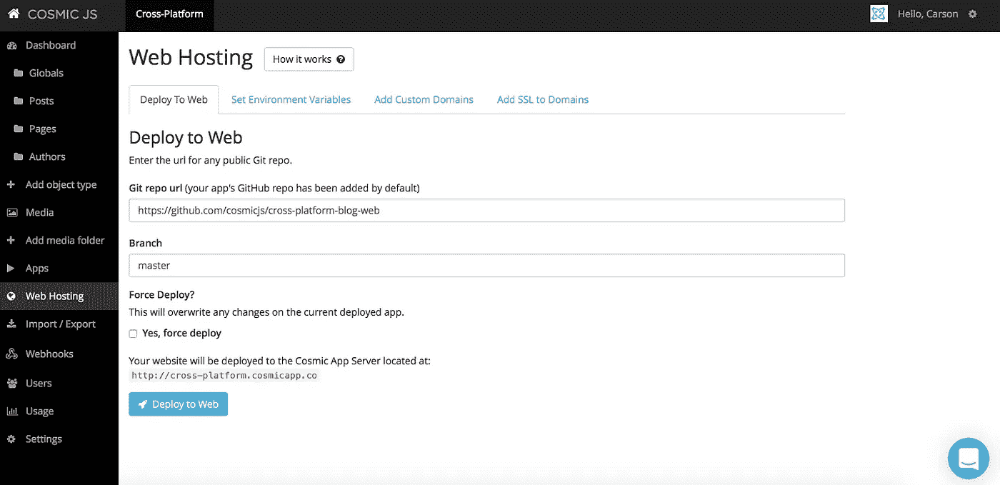
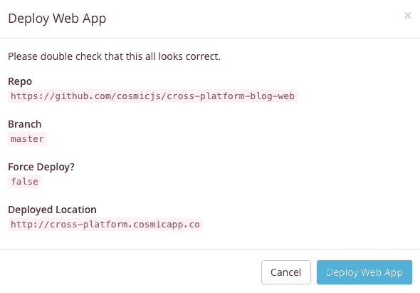
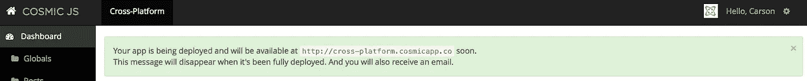
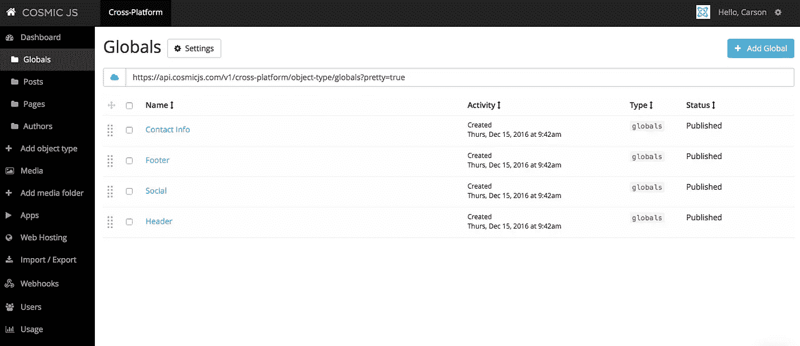
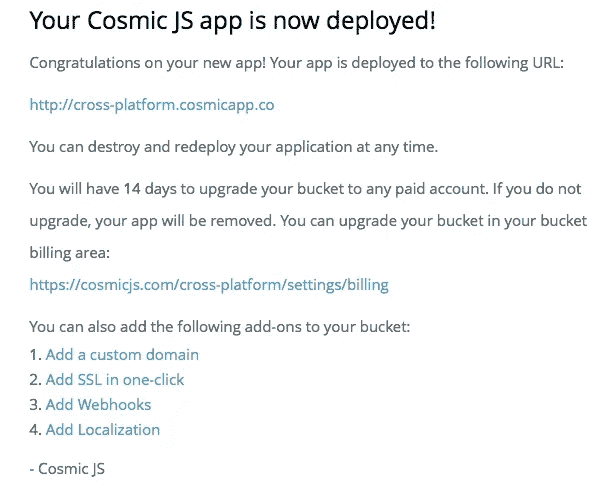

# 用 4 个步骤构建跨平台博客

> 原文：<https://medium.com/hackernoon/build-a-cross-platform-blog-in-4-steps-f648f62a921e>

在这篇博客中，我将向您展示如何选取两个现有的代码库示例，并将其缩减到您自己的、使用 React Native 和 Node.js 构建的漂亮的跨平台博客中。这款应用程序是三合一的:Web、iOS 和 Android 应用程序，所有内容都由 [Cosmic JS](https://cosmicjs.com/) 提供支持。前往 [GitHub repo](https://github.com/cosmicjs/cross-platform-blog) 查看 iOS 和 Android 应用共享相同的 [React 原生代码库](https://github.com/cosmicjs/cross-platform-blog)，这将开发时间缩短了一半。web 版本运行在一个轻量级的 Node.js 服务器上。当两种代码库都用于跨平台博客时，开发人员和内容编辑人员可以轻松地通过一次点击将内容更新到他们的 web 应用程序、iOS 应用程序和 Android 应用程序。

我将使用 [Cosmic JS](https://cosmicjs.com/) (一种 API 优先的 CMS，使管理和构建网站和应用程序更快、更直观)来安装、编辑内容、部署和更新基于 web 的 CMS 。

如果你还没有，那就从[报名](https://cosmicjs.com/signup)参加[宇宙 JS](https://cosmicjs.com/) 开始吧。下面提供了有用的资源来简化您的开发操作。

> [跨平台博客页面](https://cosmicjs.com/apps/cross-platform-blog)
> 
> [跨平台博客演示](https://cosmicjs.com/apps/cross-platform-blog/demo)
> 
> [基于 GitHub 的跨平台博客代码库](https://github.com/cosmicjs/cross-platform-blog)
> 
> [如何使用 React Native 和 Node.js 构建跨平台博客](https://cosmicjs.com/blog/how-to-build-a-cross-platform-blog-using-react-native-and-nodejs)

# 1.创建新的存储桶

您的 bucket 的名称是您正在构建的网站、项目、客户端或 web 应用程序的名称。我将我的命名为“跨平台”,以保持示例博客的简洁。

# 2.安装 Cosmic JS 跨平台博客

一旦你注册并命名了你的桶，你将被提示从头开始或者“查看一些应用”。对于这个博客，我简单地点击了右键“查看一些应用程序”，这样我就可以开始跨平台博客 [的安装过程。](https://cosmicjs.com/apps/astral)

# 应用程序安装选项

[Cosmic JS](https://cosmicjs.com/) 让你能够在编程语言之间进行过滤，比如 [Node.js、PHP、React、AngularJS](https://cosmicjs.com/apps) 等等。只需点击跨平台博客图标下的“安装”即可开始，或者访问[宇宙 JS 应用页面](https://cosmicjs.com/apps)。

# 3.部署到 Web

我点击了“部署到 Web”。然后，在部署 web 应用程序时，我可以开始编辑我的对象。您将收到一封电子邮件，确认您的 web 应用程序的部署。如果您在部署过程中遇到任何问题，您可能会被转到 [Cosmic JS 故障排除页面](https://cosmicjs.com/troubleshooting)。

# 确认部署位置和分支

# 部署分支机构确认模式

我从一个回购中提取，我的分支被澄清，我有一个与我在步骤 1 中创建的 slug / bucket 名称相匹配的部署位置。

# 展开，展开

一个小小的保证，让你很快就能在网上活得好好的。:)

# 4.编辑全局对象、对象类型和对象

编辑是在宇宙 JS 仪表盘中实现的梦想。要了解更多关于如何在编辑内容时构建 Cosmic JS 的信息，请阅读[在编辑内容时构建。](https://cosmicjs.com/blog/building-with-the-content-editor-in-mind)

# 应用部署确认

就像注册、创建新的存储桶、安装 web 应用程序、编辑内容和部署一样简单！我收到了访问我的 web 应用程序的确认电子邮件，还看到了我的桶升级选项，如自定义域、一键式 SSL、webhooks 和本地化。

[Cosmic JS](https://cosmicjs.com/) 是一个 [API 第一的基于云的内容管理平台](https://cosmicjs.com/)，使得管理应用和内容变得容易。如果你对 Cosmic JS API 有任何疑问，请联系 Twitter 或 T21 的创始人。

> 卡森·吉本斯是 [Cosmic JS](https://cosmicjs.com) 的联合创始人和 CMO，这是一个 API 第一的基于云的[内容管理平台](https://cosmicjs.com)，它将内容与代码分离，允许开发人员用他们想要的任何编程语言构建流畅的应用程序和网站。

> [黑客中午](http://bit.ly/Hackernoon)是黑客如何开始他们的下午。我们是 [@AMI](http://bit.ly/atAMIatAMI) 家庭的一员。我们现在[接受投稿](http://bit.ly/hackernoonsubmission)并乐意[讨论广告&赞助](mailto:partners@amipublications.com)机会。
> 
> 如果你喜欢这个故事，我们推荐你阅读我们的[最新科技故事](http://bit.ly/hackernoonlatestt)和[趋势科技故事](https://hackernoon.com/trending)。直到下一次，不要把世界的现实想当然！

