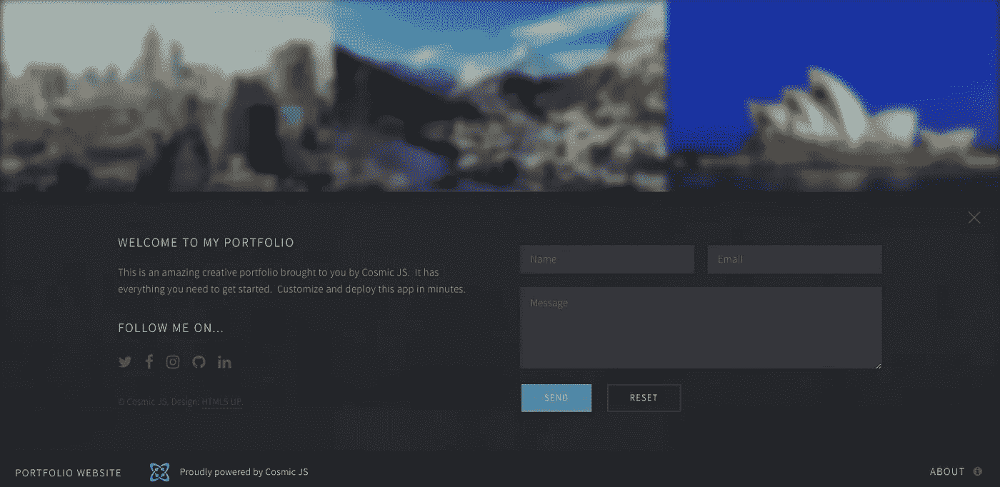
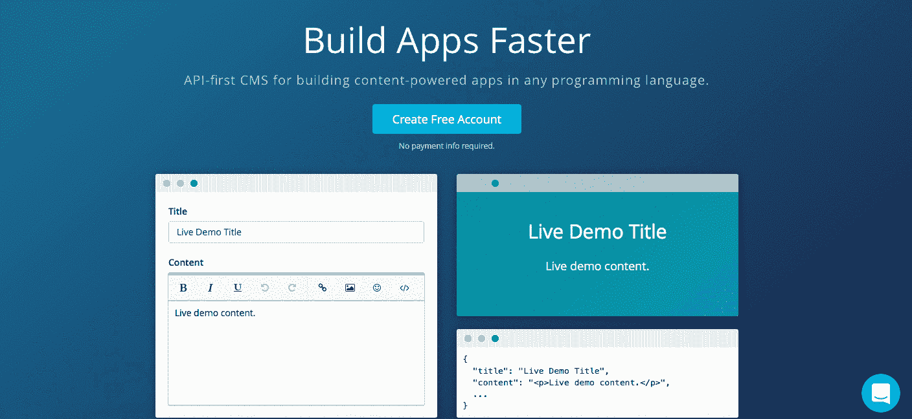
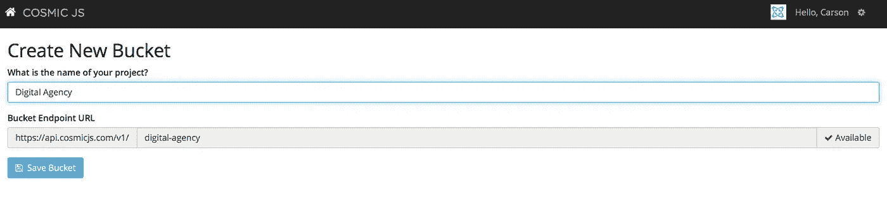
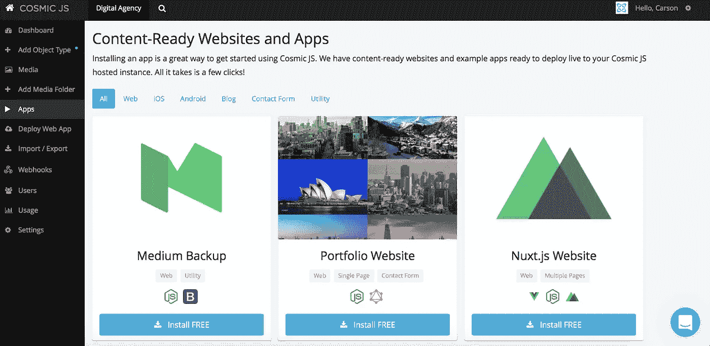
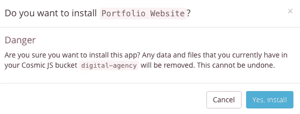
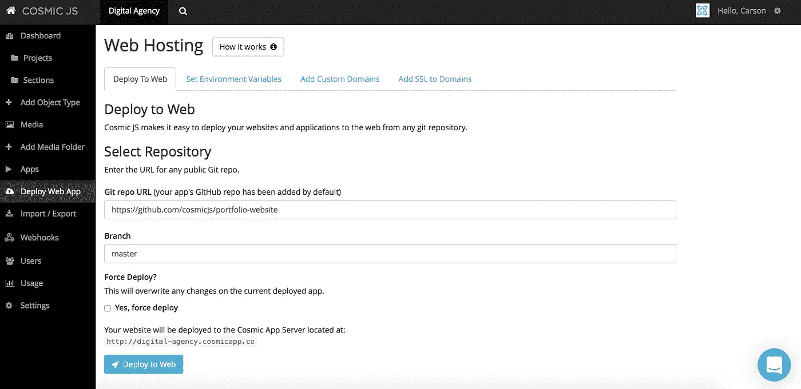
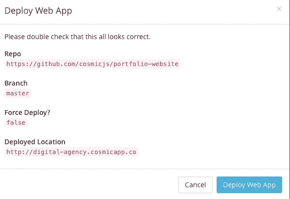
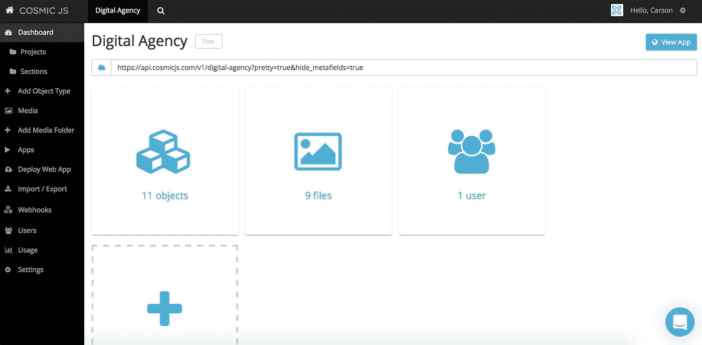
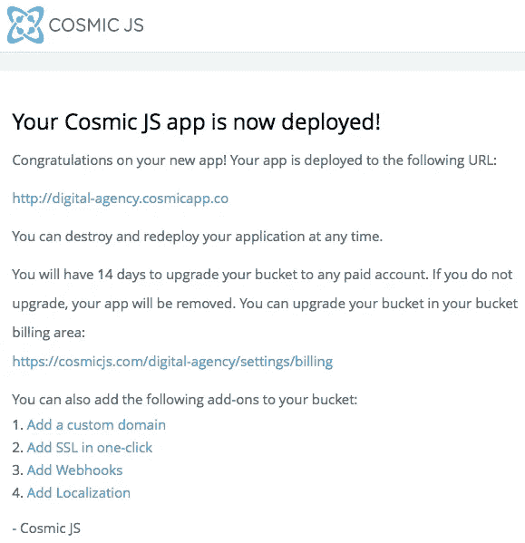

# 用 4 个简单的步骤建立一个数字代理网站

> 原文：<https://medium.com/hackernoon/build-a-digital-agency-website-in-4-easy-steps-730488ca60ec>

数字机构通过展示作品赢得工作。一丝不苟的过程解释和拖累投资组合网站的大量文本“服务”内容容器的日子已经一去不复返了。代理商知道，如果他们有机会赢得 SOW，他们需要用大量的创造性工作来迎接消费者/客户。我们建立了一个[数字代理组合网站](https://cosmicjs.com/apps/portfolio-website)，它使用[宇宙 JS GraphQL API](https://cosmicjs.com/blog/introducing-the-graphql-api) 。该网站是创造性的容器占主导地位的选项，点击进入每个细节视图(如下图)。

在这篇博客中，我将向你展示如何利用现有的代码库例子来构建你自己的漂亮的[数字代理网站](https://cosmicjs.com/apps/portfolio-website) [。](https://cosmicjs.com/apps/landing-page)这个网站示例绝对是为具有前瞻性思维的数字机构设计的。由 [Cosmic JS GraphQL API](https://cosmicjs.com/docs/graphql) 提供支持，这个内容就绪的应用程序包括投资组合管理、联系表格(由 MailGun 提供支持)和由[HTML5UP.net](https://cosmicjs.com/carson-gibbons/edit-object/HTML5UP.net)提供的漂亮前端。从您的[Cosmic JS](https://cosmicjs.com/)Bucket Dashboard 安装、部署和编辑这个数字代理网站的每个部分。

对于这个示例应用程序，我将使用 [Cosmic JS](https://cosmicjs.com/) 。Cosmic JS 是一个 [API 优先的 CMS](https://cosmicjs.com/) ，它使得管理和构建网站和应用程序更加快速和直观。通过将内容从代码中分离出来，Cosmic JS 增强了开发人员的灵活性，同时确保内容编辑人员能够以最适合他们的方式规划和部署内容。我们将使用 Cosmic JS 来安装我们的示例应用程序，部署和更新来自基于云的内容管理平台的内容。

如果你还没有，那就从[报名](https://cosmicjs.com/signup)参加[宇宙 JS](https://cosmicjs.com/) 开始吧。下面提供了有用的资源来简化您的开发操作。

> [数字机构网站页面](https://cosmicjs.com/apps/portfolio-website)
> 
> [数字机构网站演示](https://cosmicjs.com/apps/portfolio-website/demo)
> 
> [基于 GitHub 的数字代理网站代码库](https://github.com/cosmicjs/portfolio-website)

# 1.创建新的存储桶

您的 bucket 的名称是您正在构建的网站、项目、客户端或 web 应用程序的名称。为了保持示例博客的简洁，我将我的博客命名为“数字代理”。一旦你注册并命名了你的桶，你将被提示从头开始(如下所示)或“查看一些应用”。如果您没有收到安装应用程序的提示，您可以随时点击提示的对象创建教程，然后点击左侧导航栏上的“应用程序”来查看应用程序安装选项。对于这个博客，我简单地点击了“应用”标签，这样我就可以开始安装宇宙 JS 数字代理网站。

# 应用程序安装选项

# 2.安装宇宙 JS 数字代理网站

[Cosmic JS](https://cosmicjs.com/) 让你能够在编程语言之间进行过滤，比如 [Node.js](https://cosmicjs.com/carson-gibbons/edit-object/Node.js) 、 [PHP](https://cosmicjs.com/apps) 、 [React](https://cosmicjs.com/apps) 、 [AngularJS](https://cosmicjs.com/apps) 等等。

# 3.部署到 Web

我点击了“部署到 Web”。然后，我可以在部署 web 应用程序时编辑对象。您将收到一封电子邮件，确认您的 web 应用程序的部署。如果您在部署过程中遇到任何问题，您可能会被转到 [Cosmic JS 故障排除页面](https://cosmicjs.com/troubleshooting)。

# 确认部署位置和分支

# 部署分支机构确认模式

我从一个回购中提取，我的分支被澄清，我有一个与我在步骤 1 中创建的 slug / bucket 名称相匹配的部署位置。

# 4.编辑全局对象

编辑是在宇宙 JS 仪表盘中实现的梦想。要了解更多关于如何在考虑编辑内容的情况下构建 [Cosmic JS](https://cosmicjs.com/) 的信息，请阅读[在考虑内容编辑器的情况下构建](https://cosmicjs.com/blog/building-with-the-content-editor-in-mind)。

# 应用部署确认

就像注册、创建新的存储桶、安装 web 应用程序、编辑对象和部署一样简单！我收到了访问我的 web 应用程序的确认电子邮件，还看到了我的桶升级选项，如自定义域、一键式 SSL、webhooks 和本地化。

[Cosmic JS](https://cosmicjs.com/) 是一个 API 首创的基于云的内容管理平台，可以轻松管理应用和内容。如果你对 Cosmic JS API 有任何疑问，请通过 [Twitter](https://twitter.com/cosmic_js) 或 [Slack](https://cosmicjs.com/community) 联系创始人。

[卡森·吉本斯](https://twitter.com/carsoncgibbons)是[宇宙 JS](https://cosmicjs.com/) 的联合创始人& CMO，宇宙 JS 是一个 API 第一的基于云的[内容管理平台](https://cosmicjs.com/)，它将内容与代码分离，允许开发者用他们想要的任何编程语言构建流畅的应用和网站。

> [黑客中午](http://bit.ly/Hackernoon)是黑客如何开始他们的下午。我们是 AMI 家庭的一员。我们现在[接受投稿](http://bit.ly/hackernoonsubmission)并乐意[讨论广告&赞助](mailto:partners@amipublications.com)机会。
> 
> 如果你喜欢这个故事，我们推荐你阅读我们的[最新科技故事](http://bit.ly/hackernoonlatestt)和[趋势科技故事](https://hackernoon.com/trending)。直到下一次，不要把世界的现实想当然！

