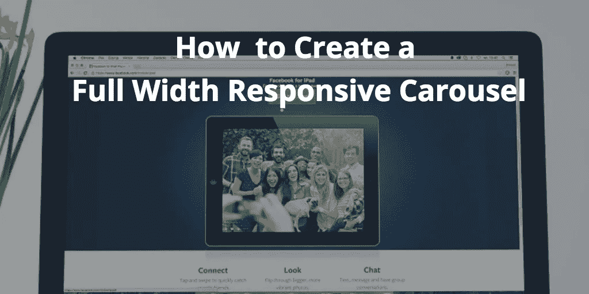
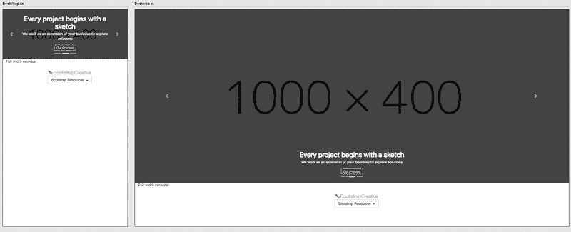
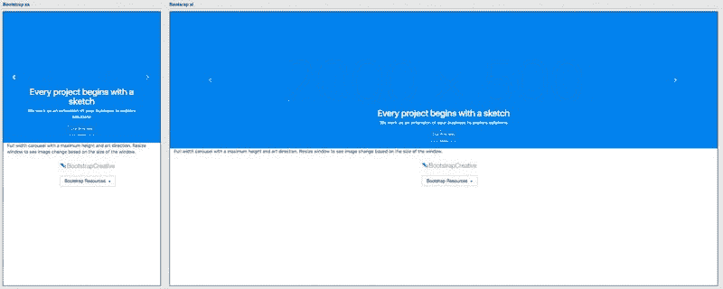

# 如何构建全宽 Bootstrap 4 响应转盘[教程]

> 原文：<https://medium.com/hackernoon/build-a-full-width-bootstrap-4-responsive-carousel-tutorial-f9b603612a91>



# 你想让你的[引导](https://bootstrapcreative.com/glossary/bootstrap-css/)转盘扩展浏览器窗口的整个宽度吗？您的图像是否看起来被截断或左右有多余的填充？

在本教程中，我们将仔细研究 Bootstrap 4 传送带，并确定使其全宽且响应迅速的最佳方法。

# 问题

如果您使用 Bootstrap 4 文档中的 [carousel 代码片段](https://v4-alpha.getbootstrap.com/components/carousel/),您会注意到 carousel 锚链接并没有包装整个图像。在大多数情况下，你可能想要相反的结果。对于这个例子，我将对代码进行调整。

每个图像都有一个`.img-fluid`类，它告诉浏览器只在图像不适合较小的宽度时才缩小图像。但是对于宽窗户，它不能放大。但是，由于你想走全幅，你的图像将出现在真正的大屏幕切断。

```
.img-fluid {max-width: 100%; height: auto;}
```

为了解决这个问题，您需要将下面的 CSS 规则添加到您的样式表中，以强制您的轮播图像始终是全幅的。我首先尝试了`height:auto;`，这样图像高度将保持在正确的比例。但是这并没有起作用，因为父元素`.carousel-item`被设置为`display:flex`。将高度改为 100%修复了这个问题。

```
/* 
Forces carousel image to be 100% width and not max width of 100% 
*/ 
.carousel-item .img-fluid { width:100%; height:100%; }/*
Forces carousel image to be 100% width and not max width of 100%
*/
.carousel-item .img-fluid {
width:100%;
height:100%;
}
```

**这种方法迫使你选择最宽的图像尺寸，然后将其加载到手机上。**这对于移动设备来说并不友好，因为它会显著降低页面加载速度，因为图像文件很大(像素越多=加载时间越长)。

> 网站运行缓慢的最常见原因之一是图像过大，因此我们希望在最终解决方案中纠正这一问题。



*Above, notice how the carousel looks super small on mobile and HUGE on wide desktops? This doesn’t look right.*

**在下一节中，我们将改进以下内容:**

*   通过在正确的断点提供正确大小的图像来提高加载速度
*   修正图像尺寸过小或过大的布局美学问题

[查看本示例的演示](https://codepen.io/JacobLett/full/PjKLgK/)

# 解决办法

HTML5 引入了两种不同的方法来处理响应图像:T2 图片元素和 T4 图片属性。Img srcset 允许您根据窗口大小和屏幕像素密度指定不同的图像分辨率。这解决了页面负载问题，但不能使 xs 和 xl 图像比例看起来更好。我们希望移动图像是方形的，桌面图像是矩形的，所以我们需要更多的“艺术指导”来控制什么时候使用什么图像。

图片标签是为这个场景设计的，所以我们将使用它来代替。记住，你需要使用一个[图片填充脚本](https://scottjehl.github.io/picturefill/)来支持 IE11 和更低版本，因为这些版本不支持图片标签。

下面是指定了不同图像的图片标签的例子。看看每个图像源如何有一个类似于 CSS 媒体查询的媒体查询？遵循 mobile first，image 标签首先加载最小的图像，然后将它换成更大的尺寸(从下到上从最小到最大)。这将显著改善移动设备上的页面加载，因为它以适合其屏幕大小的像素分辨率加载图像。此外，它让您可以更好地控制不同断点处的情况。

```
<picture> 
<source srcset=”https://dummyimage.com/2000x400/007aeb/4196e5" media=”(min-width: 1400px)”> 
<source srcset=”https://dummyimage.com/1400x400/007aeb/4196e5" media=”(min-width: 768px)”> 
<source srcset=”https://dummyimage.com/800x400/007aeb/4196e5" media=”(min-width: 576px)”> 
 
</picture>
```

在设置图像尺寸和媒体尺寸断点时，我参考了[最常见屏幕分辨率](http://gs.statcounter.com/screen-resolution-stats/desktop/worldwide)的列表。第二高的桌面屏幕尺寸是 1920 x 1080，所以我想确保我可以覆盖这个宽度而不使图像模糊。因此，只有当图像大于 1400 像素时，我们才会加载它。根据您的站点分析进行必要的调整，以达到最常见的屏幕分辨率。



*Looking good. The xs breakpoint is square and the xl is a wide rectangle. Maximizing the space and making the carousel more mobile friendly.*

[查看最终解决方案演示](https://codepen.io/JacobLett/full/weqOjq) | [获取代码](https://bootstrapcreative.com/pattern/full-width-carousel-responsive-images/)

# 需要注意的事项

*   因为你想让你的轮播扩展到边缘，所以保持你的轮播在一个`.container`或者`.container-fluid`类的外面，因为这应用了左和右填充。
*   在你的图像中使用图片元素需要在 Adobe Photoshop 或类似软件中进行更多的图像编辑。如果进行了创造性的更改，它将必须应用于多个图像版本。所以这需要更多的时间。
*   在进行任何最终的图像裁剪之前，首先使用占位符图像有助于确定图像大小和断点。

# 摘要

在本教程中，您学习了如何定制 carousel 代码片段，以使用响应图像和全角。这种优化在移动设备上实现了更好的加载时间，并使设计人员能够控制图像在各种断点处的外观。唯一的缺点是，它需要更多的图像编辑时间，并且需要一个 polyfill 来支持 IE11 和更低版本。但在我看来，利远大于弊。

> 本教程中使用的断点预览截图是使用 [Bootstrap 4 快速入门](https://bootstrapcreative.com/shop/bootstrap-quick-start/#resources)中的 Robin 创建的。[开始逐步学习响应式设计基础。](https://bootstrapcreative.com/shop/bootstrap-quick-start/?utm_source=postctabox&utm_content=op2)

## 如果你喜欢这个故事，请点击👏按钮并分享，帮助其他人找到它！欢迎在下面留下任何问题。

*原载于 2017 年 6 月 27 日*[*bootstrapcreative.com*](https://bootstrapcreative.com/create-full-width-bootstrap-4-responsive-carousel/)*。*

[](http://bit.ly/HackernoonFB)[](https://goo.gl/k7XYbx)[](https://goo.gl/4ofytp)

> [黑客中午](http://bit.ly/Hackernoon)是黑客如何开始他们的下午。我们是阿妹家庭的一员。我们现在[接受投稿](http://bit.ly/hackernoonsubmission)并乐意[讨论广告&赞助](mailto:partners@amipublications.com)的机会。
> 
> 如果你喜欢这个故事，我们推荐你阅读我们的[最新科技故事](http://bit.ly/hackernoonlatestt)和[趋势科技故事](https://hackernoon.com/trending)。直到下一次，不要把世界的现实想当然！

