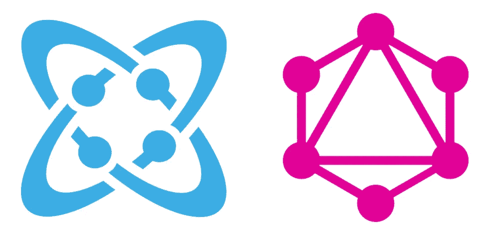
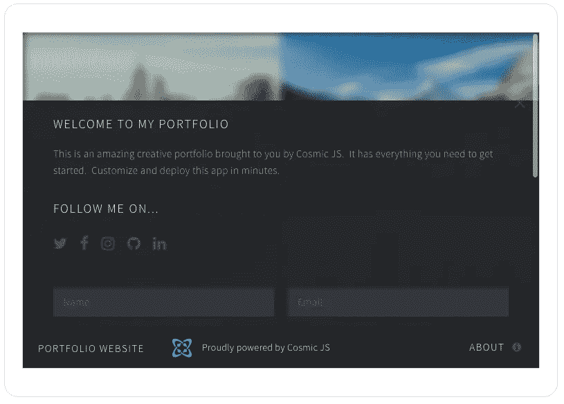
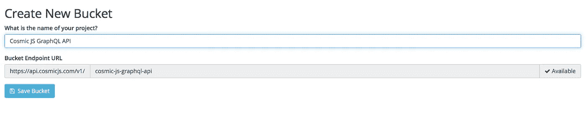
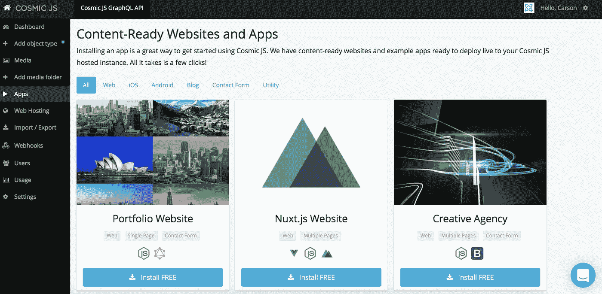
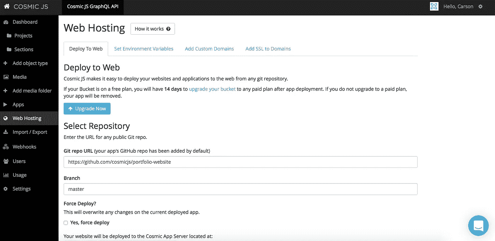
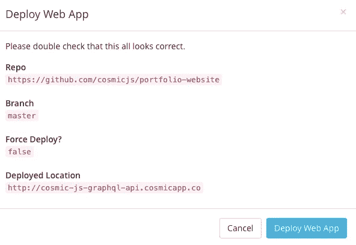
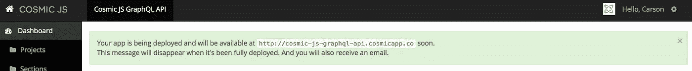
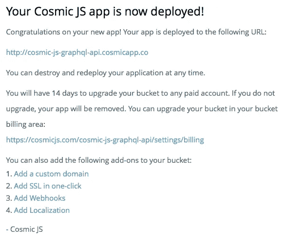

# 构建一个基于 GraphQL API 的投资组合网站

> 原文：<https://medium.com/hackernoon/build-a-graphql-api-powered-portfolio-website-e36eb51cf622>

在这篇博客中，我将向你展示如何利用现有的代码库例子来构建你自己的漂亮的[作品集网站](https://cosmicjs.com/apps/portfolio-website)，由[宇宙 JS GraphQL API](https://cosmicjs.com/docs/graphql) [提供支持。](https://cosmicjs.com/apps/landing-page)投资组合应用包括投资组合管理、联系表格(由 MailGun 提供支持)和一个由[HTML5UP.net](http://html5up.net/)设计的漂亮前端。从您的 [Cosmic JS](https://cosmicjs.com/) Bucket Dashboard 安装、部署和编辑该投资组合网站的每个部分。

GraphQL 为什么特别？GraphQL 允许客户机只查询特定的值，从而限制了返回的数据量，从而使 API 调用更加高效。阅读更多关于 [Cosmic JS GraphQL API](https://cosmicjs.com/blog/introducing-the-graphql-api) 的信息。

对于这个示例应用程序，我将使用 [Cosmic JS](https://cosmicjs.com/) 。Cosmic JS 是一个 [API 优先的 CMS](https://cosmicjs.com/) ，它使得管理和构建网站和应用程序更加快速和直观。通过将内容从代码中分离出来，Cosmic JS 增强了开发人员的灵活性，同时确保内容编辑人员能够以最适合他们的方式规划和部署内容。我们将使用 Cosmic JS 来安装我们的示例应用程序，部署和更新来自基于云的内容管理平台的内容。

如果你还没有，那就从[报名](https://cosmicjs.com/signup)参加[宇宙 JS](https://cosmicjs.com/) 开始吧。下面提供了有用的资源来简化您的开发操作。

> [作品集网站 App 页面](https://cosmicjs.com/apps/portfolio-website)
> 
> [作品集网站 App 演示](https://cosmicjs.com/apps/portfolio-website/demo)
> 
> [GitHub 上的投资组合网站 App 代码库](https://github.com/cosmicjs/portfolio-website)

# 1.创建新的存储桶

您的 bucket 的名称是您正在构建的网站、项目、客户端或 web 应用程序的名称。我将我的命名为“Cosmic JS GraphQL API ”,以保持示例博客的简洁。

# 2.安装宇宙 JS 作品集网站

一旦你注册并命名了你的桶，你将被提示从头开始或者“查看一些应用”。对于这个博客，我简单地点击了右键“查看一些应用程序”，这样我就可以开始安装宇宙 JS 组合网站了。

# 应用程序安装选项

[Cosmic JS](https://cosmicjs.com/) 给你在功能语言之间过滤的能力，比如 Web，iOS，Android，Blog，Contact Form 等等。

只需点击[作品集网站](https://cosmicjs.com/apps/portfolio-website)图标下的“安装”即可开始，或者访问[宇宙 JS 应用页面](https://cosmicjs.com/apps)。

# 3.部署到 Web

我点击了“部署到 Web”。然后，我可以在部署 web 应用程序时编辑对象。您将收到一封电子邮件，确认您的 web 应用程序的部署。如果您在部署期间遇到任何问题，您可能会被转到 [Cosmic JS 故障排除页面](https://cosmicjs.com/troubleshooting)。

# 确认部署位置和分支

# 部署分支机构确认模式

我从一个回购中提取，我的分支被澄清，我有一个与我在步骤 1 中创建的 slug / bucket 名称相匹配的部署位置。

# 展开，展开

一个小小的保证，让你很快就能在网上活得好好的。:)

# 4.编辑全局对象

编辑是在宇宙 JS 仪表盘中实现的梦想。要了解更多关于如何在考虑编辑内容的情况下构建 [Cosmic JS](https://cosmicjs.com/) 的信息，请阅读[在考虑内容编辑器的情况下构建](https://cosmicjs.com/blog/building-with-the-content-editor-in-mind)。

# 应用部署确认

就像注册、创建新的存储桶、安装 web 应用程序、编辑对象和部署一样简单！我收到了访问我的 web 应用程序的确认电子邮件，还看到了我的桶升级选项，如自定义域、一键式 SSL、webhooks 和本地化。

[Cosmic JS](https://cosmicjs.com/) 是一个 API 首创的基于云的内容管理平台，可以轻松管理应用和内容。如果你对 Cosmic JS API 有任何疑问，请通过 [Twitter](https://twitter.com/cosmic_js) 或 [Slack](https://cosmicjs.com/community) 联系创始人。

[卡森·吉本斯](https://twitter.com/carsoncgibbons)是[宇宙 JS](https://cosmicjs.com/) 的联合创始人& CMO，宇宙 JS 是一个 API 第一的基于云的[内容管理平台](https://cosmicjs.com/)，它将内容与代码分离，允许开发者用他们想要的任何编程语言构建流畅的应用和网站。

> [黑客中午](http://bit.ly/Hackernoon)是黑客如何开始他们的下午。我们是 AMI 家庭的一员。我们现在[接受投稿](http://bit.ly/hackernoonsubmission)并乐意[讨论广告&赞助](mailto:partners@amipublications.com)机会。
> 
> 如果你喜欢这个故事，我们推荐你阅读我们的[最新科技故事](http://bit.ly/hackernoonlatestt)和[趋势科技故事](https://hackernoon.com/trending)。直到下一次，不要把世界的现实想当然！

