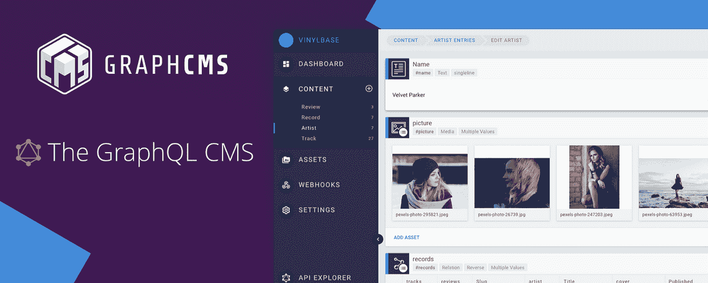
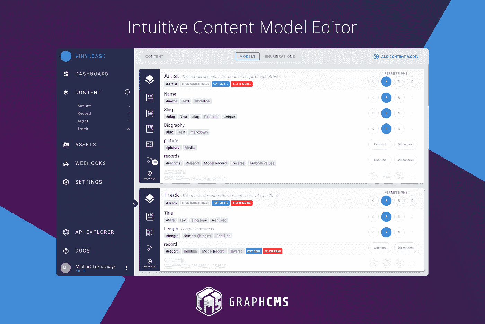
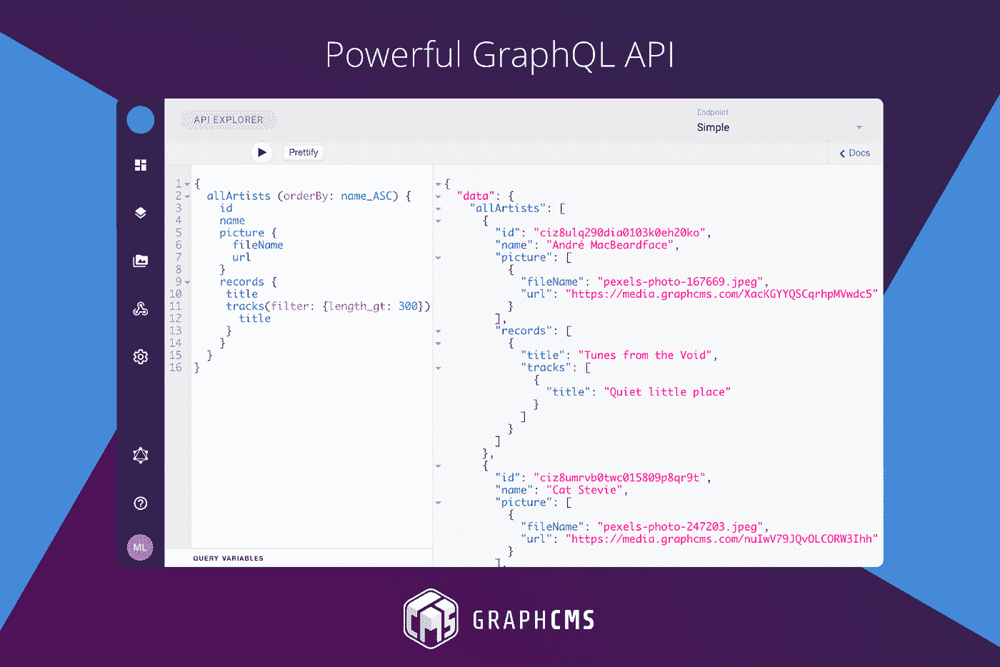

# 在几分钟内为您的应用构建托管的 GraphQL 后端

> 原文：<https://medium.com/hackernoon/build-a-hosted-graphql-backend-for-your-apps-in-minutes-ff5e90444f8c>

[**GraphCMS**](https://graphcms.com/) 是一个基于 GraphQL 的无头内容[管理](https://hackernoon.com/tagged/management)系统。它可以让你为你的应用程序构建一个托管的 GraphQL 后端，并为你提供管理你的内容所需的所有工具。

凯文·威廉·大卫[采访了 GraphCMS](https://medium.com/u/8ea7bd91b1a4?source=post_page-----ff5e90444f8c--------------------------------) 的联合创始人迈克尔·卢卡斯奇克以了解更多信息。

## 嗨，Michael，跟我们谈谈 GraphCMS 吧？

GraphCMS 是第一个完全利用 [**GraphQL**](https://siftery.com/graphql) 力量的内容管理系统。

它使开发人员能够在几分钟内构建强大的内容 API，同时为内容编辑人员提供管理内容所需的所有工具。托管内容 API 随后可由网站、应用或任何其他平台或内容合作伙伴轻松使用。

## 告诉我更多关于你正在试图解决的问题？

作为开发人员，很容易理解传统的内容管理系统无法满足现代多渠道应用程序开发的需求。移动和物联网革命正迫使 CMS 供应商重新思考他们的产品策略，因为内容现在存在于多个平台上。基于 REST、API 优先的内容管理系统，也就是所谓的无头内容管理系统，作为一个合乎逻辑的结果进入了这个领域。虽然 REST 基本上做到了，但是它有一些限制，这使得开发站点和应用程序变得很痛苦。我们的任务是通过使用 GraphQL 的能力来消除这些棘手的问题，并将无头 CMS 的概念提升到一个新的层次。

## 你正在构建的东西有什么独特之处&为什么你认为公司应该使用 GraphCMS？

我们是第一个完全专注于 GraphQL 的内容管理平台。我们的竞争对手，如**[**CosmicJS**](https://siftery.com/cosmic-js)[**Prismic**](https://siftery.com/prismic)以及更多的人仍然坚持我们认为慢慢变得过时和不太受欢迎的良好 ol' REST*。**

**我们的客户喜欢我们的 web 应用程序，并告诉我们他们喜欢简单性。这可能是 CMS 最重要的因素之一:如果 UX 不好，那些通常没有技术背景的人——内容编辑——就很难做了。开发人员特别喜欢生成的 GraphQL 内容 API，因为它优于他们习惯的 REST APIs。**

**公平地说，他们中的一些人确实进行了一些 GraphQL 实验，甚至生产 API，但他们基本上是针对他们的 REST APIs 进行解析的。这不会给你 GraphQL 的所有好处。**

****

***使用直观的内容模型编辑器在几分钟内构建您的 graph QL API***

****

***使用简单的编辑界面添加内容***

****

***GraphCMS 为您的内容提供了强大的 graph QL API***

## **谁使用 GraphCMS？您的客户在他们的公司中担任什么样的角色？**

**尽管 CMS 通常是为内容编辑者设计的，我们还是努力把重点放在开发人员身上，因为我们认为对于成千上万的用例来说，无头 CMS 是一个很好的开发工具。此外，如果您查看内容丰富的应用程序的开发生命周期，首先需要与 CMS 一起工作的是开发人员。**

**我们的客户通常是自由职业者、数字机构和初创公司。我们也在与企业客户洽谈，但如果你还没有建立起强大的品牌，就很难达成企业交易。**

## **您的客户如何使用 GraphCMS？你能分享一些不同的使用案例吗？**

**大多数人只是将它作为一种方便的方式来将内容放入他们的网站和应用程序中，但它们的大小各不相同。有些人把它用于他们的投资组合网站，有些人建立在线杂志，有些人正在为他们的企业建立大型内容网络，为 30 多个目标网站提供内容。它们的共同点是，我们看到对最新前端堆栈的强烈采用，如 [**盖茨比**](https://siftery.com/gatsby) 或 [**NextJS**](https://siftery.com/nextjs) 。让你的内容从一个 API 提供给你真正的前端自由，所以你可以尝试什么最适合你。谁想学习一些史前模板语言呢？**

## **GraphCMS 有没有您没有想到或预料到的独特用例？**

**唷——我敢打赌曾经有过，但是随着用户群的快速增长，我们开始失去所有正在构建的项目的踪迹。例如，一些用户使用 GraphCMS 来填充他们的人工智能算法。**

## **有什么早期的“成长秘诀”或策略促成了你现在的成功吗？**

**我们的时机刚刚好。由于 GraphQL 目前正在大肆宣传，因此很容易搭上这一营销列车。这个社区消费了几乎所有与 GraphQL 相关的东西。这让我们从第一天就有了庞大的用户群。除此之外，我们只是尽可能地提供最好的支持，这样人们就会传播这个消息。**

## **在早期构建产品时，最大的挑战是什么？你是如何解决的？**

**最大的挑战是我们有限的时间资源。丹尼尔，另一个联合创始人，和我不能全职工作在 GraphCMS 上。我们不得不做一些代理工作来赚些钱，因为我们从一开始就没有资金，并且在兼职中建立一个高度可扩展的业务不是一件容易的事情。所以我们决定走一些捷径。**

**我们不再自己实现堆栈的每一部分，而是开始使用越来越多的第三方服务。当你想到你创建的所有依赖关系时，这总是一个艰难的决定，但是最终，我们不想重新发明一千个轮子。在构建了第一个原型之后，我们决定与 Graphcool 合作来加速开发。**

## **你加入的最有趣的整合是什么？有什么对你特别有影响的吗？**

**由于 GraphCMS 在其核心提供了一个 API，任何人都可以很容易地构建集成。除此之外，我们现在开始挑选 GraphCMS 可以从中受益的服务。其中最重要的一个是 [Algolia](https://medium.com/u/a531947eec97?source=post_page-----ff5e90444f8c--------------------------------) ，它在 API 上提供了出色的搜索体验。**

## **在我们结束之前，你运营公司所依赖的顶级产品是什么&你如何使用它们？**

**[Graphcool](https://medium.com/u/122d169c63c0?source=post_page-----ff5e90444f8c--------------------------------) —为我们提供所有 GraphCMS 项目的 API 层。即使在早期，他们跑得很稳。**

**[Filestack](https://medium.com/u/ec2f1bc9e96f?source=post_page-----ff5e90444f8c--------------------------------) —是我们的文件转换和文件 CDN 提供商。我们喜欢它们提供的资产转换，例如动态图像缩放和裁剪。**

**[Auth0](https://medium.com/u/9ef9638b3092?source=post_page-----ff5e90444f8c--------------------------------) —用于我们的 web 应用程序用户验证。简单又安全。**

**[对讲机](https://medium.com/u/7ca8972daf76?source=post_page-----ff5e90444f8c--------------------------------) —用于所有通信:应用内聊天、简讯等。**

**[Slack](https://medium.com/u/26d90a99f605?source=post_page-----ff5e90444f8c--------------------------------) —用于建立社区，与客户和合作伙伴一起组建团队。**

**【siftery.com】最初发表于**。****